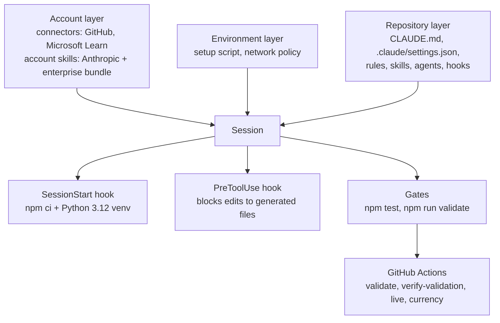
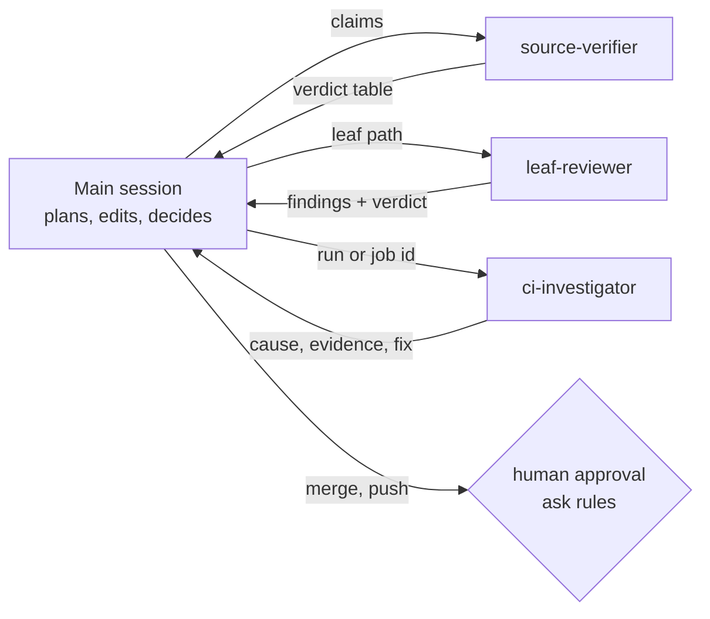

# AI Platform Architecture

How Claude Code is set up for this repository, and why. Facts behind each
decision are in [AI_ENVIRONMENT_AUDIT.md](AI_ENVIRONMENT_AUDIT.md).

## Design goal

The most useful capability for the least standing context, the fewest moving
parts and no new credentials. Every component below either removes a step that
was repeated by hand or prevents a mistake that only CI used to catch.

## Layers

| Layer | Holds | Persists via | Changed by |
| --- | --- | --- | --- |
| Account | Connectors, account skills | claude.ai settings | Owner |
| Environment | Setup script, egress policy | Environment settings | Owner |
| Repository | Everything in `CLAUDE.md` and `.claude/` | Git, reviewed PRs | PR |
| Container | Caches (`node_modules`, `~/.cache/leaf-python`) | Rebuilt by the startup hook | Hook |

Container state is disposable by design: the startup hook rebuilds it, so a
restart costs seconds, not a re-setup.

## Context layering (progressive disclosure)

| Layer | Loads | Size |
| --- | --- | --- |
| `CLAUDE.md` | Every session | 52 lines, ~590 tokens |
| Skill and agent descriptions | Every session (name + description only) | ~450 tokens total |
| `.claude/rules/*.md` | Only when a file matching its `paths` is read | 190-460 tokens each |
| Skill body | Only when the skill is invoked | 400-780 tokens each |
| Agent prompt | Only inside that subagent's own context | 360-510 tokens each |
| `CONTRIBUTING.md`, `.claude/platform/` | Only when explicitly read | reference |

## Components

| Component | Type | Replaces |
| --- | --- | --- |
| `session-start.sh` | SessionStart hook | Manual `npm ci` and the Python 3.12 PATH shim |
| `guard-derived.mjs` | PreToolUse hook | Discovering a hand edit to a generated file only in CI |
| `leaves.md`, `workflows.md`, `validators.md` | Path-scoped rules | Re-reading CONTRIBUTING for every edit |
| `/new-leaf` | Skill | Ad hoc leaf authoring that failed gates repeatedly |
| `/record-live-run` + `check-report.mjs` | Skill + checker | Hand transcription with no slip detection |
| `/drive-pr` | Skill | The PR loop restated in every phase |
| `/update-pin` | Skill | Partial pin bumps that broke lockfiles or registries |
| `leaf-reviewer` | Agent | Unstructured self-review |
| `ci-investigator` | Agent | Log dumps in the main context |
| `source-verifier` | Agent | Inline browsing that floods the main context |
| `healthcheck.mjs` | Script | No way to tell a broken setup from a missing one |

Built-in skills cover the rest and are deliberately not duplicated:
`/code-review`, `/security-review`, `/simplify`, `/init`, `/loop`,
`/fewer-permission-prompts`.

## Orchestration model

The main session keeps every decision and every write. Agents are read-only,
take a narrow input and return a compact, structured answer, so their file and
log reads never enter the main context. Merges, branch deletion, destructive git
and repository creation hit `ask` rules and need a human.

Workflow for substantial work: understand, then ground facts (source-verifier),
plan, implement, run the gates, review (leaf-reviewer or `/code-review`),
`/security-review` for workflow or script changes, then document and ship
(`/drive-pr`).

## What was rejected

See [MCP_CATALOG.md](MCP_CATALOG.md). In short: no filesystem, Git, terminal
or second GitHub MCP server (built-ins and the connector already cover them),
and no cloud MCP servers until the Azure lane is approved.
