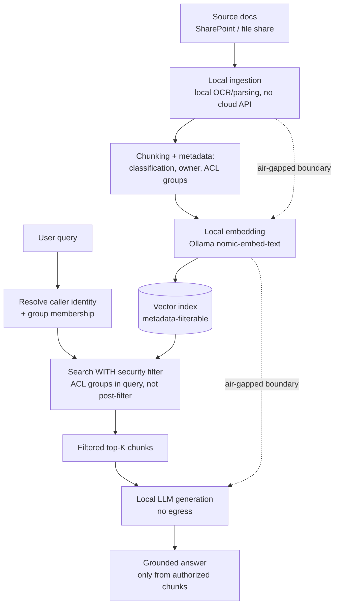

# Grounding Enterprise Data Privately: Offline RAG and Access Control

**Level:** Enterprise
**Tree:** [Applied AI Systems](../README.md)
**Branch:** [RAG & Knowledge Systems](README.md)
**Forest:** [AI & Intelligent Systems](../../../README.md)

## Explanation

A RAG system that answers from private documents is, architecturally, a data exfiltration path if built carelessly: it takes a query, searches a private corpus, and returns text derived from that corpus to whoever asked. Enterprise-grade private RAG requires two things a demo pipeline usually skips - genuinely offline operation, and retrieval-time access control that matches document sensitivity to the requesting user, not just to the RAG application's own service identity.

**Offline and local-first pipelines.** For regulated or classified data, every stage - chunking, embedding, storage, and the LLM call itself - must run inside the boundary. Ollama serving both the embedding model (nomic-embed-text or similar) and the generation model (a quantised instruct model) on infrastructure with no outbound internet path satisfies this. The document ingestion pipeline itself needs the same discipline: no calling a hosted OCR or parsing API on a scanned classified document, use a local library (Tesseract, unstructured.io running locally) instead.

**Document pipelines** must preserve provenance and sensitivity metadata from source through to the final chunk: source system, classification label, owning department, and last-modified date all travel with the chunk into the vector store as filterable metadata, not just as free text that a human might read.

**Access control at retrieval time** is the control most RAG implementations get wrong. It is not enough to check access when the user opens the source document library - the RAG system itself must re-check per-chunk access at query time, because a single vector index commonly spans documents with different sensitivity levels for different users. The two dominant patterns are document-level security trimming, where the vector search query is filtered by the querying user's group membership before results are ever ranked, and index segregation, where separate indexes exist per sensitivity tier and the application selects the index set based on the caller's clearance. Filtering must happen inside the search query, not after retrieval, because post-hoc filtering after fetching top-k can return fewer results than requested or - worse - leak a fact via the ranking signal even when the document itself is later excluded.

## Architecture and flow



## Commands

### Command 1

Run both embedding and generation models locally, bound to loopback only, for an air-gapped RAG stack.

```text
OLLAMA_HOST=127.0.0.1 ollama serve
```

### Command 2

Create an Azure AI Search index whose schema includes filterable ACL/group fields for security trimming.

```text
az search index create --service-name aisearch-prod --name kb-secure --fields @secure-schema.json
```

### Command 3

Confirm the ACL metadata field is marked filterable so it can be used in the retrieval query, not just stored.

```text
az search index update --service-name aisearch-prod --name kb-secure --set fields[?name=='aclGroups'].filterable=true
```

### Command 4

Run OCR fully locally on a scanned document rather than sending it to a hosted document-intelligence API.

```text
tesseract scanned-doc.png output.txt
```

### Command 5

Enumerate group membership used to build the security filter applied at query time.

```text
az ad group member list --group "RAG-Finance-Readers" -o table
```

### Command 6

Confirm generation succeeds with no network egress by running with the adapter disabled.

```text
curl -X POST http://localhost:11434/api/generate -d "{\"model\":\"llama3.1:8b\",\"prompt\":\"...\",\"stream\":false}"
```

## Automation scripts

### Security-trimmed retrieval enforcement check

```python
#!/usr/bin/env python3
"""Verify that retrieval results for a set of test users never contain chunks
above that user's clearance, using an in-memory index with ACL metadata.

Run this as a CI gate on any change to the retrieval query or index schema.
"""
import json
import sys


def load_index(path):
    with open(path, encoding="utf-8") as fh:
        return json.load(fh)


def load_users(path):
    with open(path, encoding="utf-8") as fh:
        return json.load(fh)


def search_with_filter(index, query_terms, user_groups, k=10):
    """Simulates a security-trimmed search: the ACL filter is applied as part
    of candidate selection, matching how the query should be built against a
    real vector store, not as a post-filter after ranking."""
    candidates = [
        row for row in index
        if set(row["aclGroups"]) & set(user_groups)
    ]
    scored = []
    for row in candidates:
        overlap = len(set(query_terms) & set(row["text"].lower().split()))
        if overlap > 0:
            scored.append((overlap, row))
    scored.sort(key=lambda t: t[0], reverse=True)
    return [row for _, row in scored[:k]]


def main():
    if len(sys.argv) < 3:
        print("Usage: acl_check.py <index.json> <users.json>")
        sys.exit(2)

    index = load_index(sys.argv[1])
    users = load_users(sys.argv[2])

    violations = []
    for user in users:
        results = search_with_filter(
            index, user["test_query"].lower().split(), user["groups"])
        for row in results:
            if not set(row["aclGroups"]) & set(user["groups"]):
                violations.append({
                    "user": user["name"],
                    "chunk_source": row["source"],
                    "chunk_acl": row["aclGroups"],
                    "user_groups": user["groups"],
                })
        print("%s (%s): %d authorized results returned" % (
            user["name"], ",".join(user["groups"]), len(results)))

    if violations:
        print("\nACCESS CONTROL VIOLATIONS DETECTED:")
        for v in violations:
            print("  %s could see %s (acl=%s, user has %s)" % (
                v["user"], v["chunk_source"], v["chunk_acl"], v["user_groups"]))
        sys.exit(1)

    print("\nNo access control violations detected across %d test users." % len(users))
    sys.exit(0)


if __name__ == "__main__":
    main()
```

## Lab

**Objective:** Build a fully offline RAG pipeline with per-document ACL metadata, prove no data leaves the machine, and prove that retrieval is correctly security-trimmed per test user.

### Steps

1. Assemble a small mixed-sensitivity document set: some files tagged Finance-only, some Engineering-only, some company-wide, each carrying an aclGroups list.
2. Disable the network adapter and run the full ingestion, embedding and indexing pipeline locally with Ollama, confirming it completes with no connectivity.
3. Store ACL group metadata as a filterable field alongside each chunk's vector, not only as free text.
4. Write a users.json test file with three synthetic users in different groups and one query each that should only return authorized chunks.
5. Run the ACL enforcement script and confirm zero violations, then deliberately misconfigure one chunk's aclGroups and confirm the script now fails and reports the violation.
6. Re-enable networking, run generation against the local LLM, and use packet capture to confirm no request left the loopback interface during the entire query.
7. Document the security trimming approach (filter-in-query vs. index segregation) chosen and why, referencing the enforcement test results.

### Validation

The ACL enforcement script exits 0 with the correctly configured index and exits 1 with the deliberately misconfigured index.,Packet capture during a full query cycle shows zero egress traffic beyond the loopback interface.,Each test user's retrieval results contain only chunks whose aclGroups intersect that user's groups.,Ingestion, embedding and indexing all complete successfully with the network adapter disabled.,Documentation names the specific security trimming pattern used and cites the passing enforcement test as evidence.

## Operational automation

### Automating private RAG governance

**ACL sync, not one-time tagging.** Group membership and document classification change continuously. Run a scheduled job that re-reads source system permissions (SharePoint permissions, file share ACLs, a document management system's classification field) and updates the corresponding chunk metadata in the vector index, so retrieval-time filtering reflects current reality, not the state at ingestion time.

**CI gate on the retrieval query itself.** The security-trimming enforcement script belongs in CI, running against a fixture index with known ACLs on every change to the retrieval code path, index schema, or search query construction. This is the control that catches a refactor that accidentally moves the ACL filter from the query into a post-fetch step, which silently reintroduces the leak.

**Air-gapped model and dependency mirroring.** Automate the same artifact-mirroring pattern used for local inference models: pull embedding models, generation models, and any local OCR/parsing tool dependencies once on a connected staging host, sign and publish to an internal mirror, and have air-gapped hosts pull only from there. Pin every component by digest.

**Audit every query.** Log the querying user's identity, the ACL filter applied, and which document sources contributed to the final answer for every RAG interaction. This turns the system's compliance story from an architecture diagram into an auditable trail, and lets a security review reconstruct exactly what data a specific user could have seen at a specific time.

**Automated data classification drift detection.** Periodically re-scan ingested documents for classification markers (e.g. document header labels) and flag any chunk whose stored ACL metadata no longer matches the source document's current classification.

## Troubleshooting

### Scenario 1: A user without Finance access can see finance-derived facts in a RAG answer even though the source document is correctly ACL-tagged.

**Likely cause:** The security filter was applied after retrieval and ranking rather than as part of the search query, so the ranking signal or a partial excerpt leaked before the post-filter removed the document.

**Resolution:** Move the ACL filter into the query itself so unauthorized chunks are never scored or returned by the search layer at all. Add the enforcement test script to CI so this class of regression is caught before merge, not by a user report.

### Scenario 2: Retrieval quality is noticeably worse for users in narrow, small permission groups.

**Likely cause:** Aggressive index segregation created very small per-tier indexes with too few chunks to support good recall, or a single shared index with heavy filtering leaves too few candidates after the ACL filter is applied.

**Resolution:** Increase the candidate pool fetched before filtering (over-fetch then filter within the query, not after), or reconsider index segregation granularity - fewer, coarser tiers with well-populated indexes usually outperform many narrow tiers.

### Scenario 3: An offline ingestion pipeline that worked in testing fails silently in the air-gapped production environment.

**Likely cause:** A dependency (an OCR model, a tokenizer, a Python package) was fetched from the internet on first use during testing and never actually mirrored for offline use.

**Resolution:** Audit every dependency the ingestion pipeline touches at runtime, not just at install time - some libraries lazily download model weights on first call. Mirror every such artifact internally and set explicit offline/cache-only flags so a missing dependency fails loudly instead of silently reaching for the internet.

### Scenario 4: Document classification labels in the vector index are stale months after a document's sensitivity was downgraded or upgraded in the source system.

**Likely cause:** ACL metadata was captured once at ingestion time with no ongoing sync from the source system's permission model.

**Resolution:** Implement a scheduled reconciliation job that re-reads source permissions and classification and updates chunk metadata, and alert when a document's source classification and indexed classification diverge beyond an expected sync window.

### Scenario 5: Local OCR output for a scanned classified document is poor quality and produces garbled chunks.

**Likely cause:** A general-purpose local OCR engine was used without image preprocessing, and no hosted document-intelligence API can be used due to data restrictions.

**Resolution:** Add local preprocessing - deskew, contrast normalisation, resolution upscaling - before OCR, and evaluate a locally-hostable layout-aware model rather than plain OCR for structured documents like tables and forms. Budget realistic quality expectations and route low-confidence OCR output to human review rather than silently indexing garbled text.

## Interview questions

### 1. How do you prevent a private RAG system from becoming a data leakage path across users with different access levels?

The core discipline is that access control has to be enforced at retrieval time, inside the search query, not anywhere downstream. Concretely: every chunk in the vector index carries ACL metadata - group or role identifiers - derived from the source document's actual permissions. When a user queries, I resolve their group membership first and pass it into the search call as a filter that participates in candidate selection, so unauthorized chunks are never scored, ranked, or returned - they simply do not exist as far as that query is concerned. This is different from, and stronger than, filtering results after they come back, because a post-filter can still leak information through partial results, timing, or a ranking signal computed from content the user should never have touched. I also keep ACL metadata synchronised from the source system on a schedule, because a document's classification changes and a static tag from ingestion time silently becomes wrong. Finally, I put an automated test in CI that runs known test users against a fixture index with known ACLs and fails the build if any unauthorized chunk is returned - this is the control that catches an accidental regression, for example a refactor that moves the filter to the wrong place in the code.

### 2. When would you choose fully offline, local-only RAG over a managed cloud RAG service, and what do you give up?

Offline local RAG is the right choice when the data cannot legally or contractually leave a boundary - classified data, certain regulated financial or health data, or an air-gapped operational environment - and that decision is a gate, not a trade-off to optimise around. It is also right for genuinely offline operation, like a field site or ship with no reliable connectivity. What you give up is significant: managed services like Azure AI Search provide production-grade scaling, built-in semantic re-ranking, high availability, and a maintained security and compliance posture that a self-run vector index on a single host does not have by default. You take on the operational burden yourself - patching, backup, scaling the index, keeping the embedding and generation models current, and building your own access-control enforcement rather than relying on a platform feature. In practice I try to build the retrieval and access-control logic in a way that is portable between a local stack and a managed one, so the architecture question is which deployment target the same design runs on, not two different designs.

### 3. Why must document provenance and classification metadata travel with the chunk rather than staying only in the source system?

Because the vector index is a new copy of the information with its own lifecycle, and by the time a query runs, the RAG system has no way to re-check the source system in real time without adding unacceptable latency to every request. If classification and ACL data are not embedded as chunk metadata at ingestion time and kept synchronised, the retrieval layer has nothing to filter on and effectively cannot enforce access control at all - it would have to trust that whoever built the corpus already filtered correctly, which does not hold once multiple sensitivity levels share one index. Provenance also matters for trust and auditability: a citation that says which source document and which version a fact came from is what lets a human verify a grounded answer and is what an auditor needs to reconstruct why the system produced a particular output. Losing that metadata converts an explainable, governable system into an opaque one, even if the underlying retrieval mechanics are identical.

### 4. How do you validate that an air-gapped RAG pipeline truly has no network dependency, rather than assuming it because it uses local components?

I never trust the architecture diagram alone, because 'local' components frequently have a lazy default of reaching out to the internet on first use - a tokenizer or model library pulling a file from a public hub the first time it runs, or an OCR library validating a license online. The validation is empirical: physically disable the network adapter, or run inside a network namespace with no route out, and execute the full pipeline end to end - ingestion, chunking, embedding, indexing, retrieval, and generation. Anything that fails reveals a hidden dependency that must be mirrored internally and pinned. Beyond a single manual test, I add packet capture during a full pipeline run in the actual target environment and confirm the capture shows zero packets beyond loopback, and I automate that as a periodic verification job rather than a one-time proof, because a library upgrade can silently reintroduce a network call. The proof an auditor accepts is the capture evidence and the reproducible test, not a claim about which library was chosen.

## Certification alignment

- AI-102 Azure AI Engineer Associate - Implement security for AI solutions, including data protection and access control
- AI-900 Azure AI Fundamentals - Describe responsible AI principles including privacy and security
- AZ-305 Designing Microsoft Azure Infrastructure Solutions - Design a solution for data protection, identity and access
- Vendor-neutral - NIST AI RMF GOVERN and MANAGE functions: data governance and access control for AI systems
- Vendor-neutral - ISO/IEC 27001 aligned - information classification and access control applied to AI knowledge bases

## References

- Microsoft Learn - Security trimming and document-level access control in Azure AI Search
- Microsoft Learn - Responsible AI and data protection guidance for Azure AI solutions
- Ollama documentation - fully offline deployment guidance
- NIST AI 100-1 - AI Risk Management Framework, GOVERN function
- OWASP - Top 10 for Large Language Model Applications, LLM06 Sensitive Information Disclosure

## Suggested video search

offline private RAG enterprise data access control document security trimming Ollama

---

> Validate commands, versions, permissions, licensing, and rollback procedures in an isolated lab before production use.
