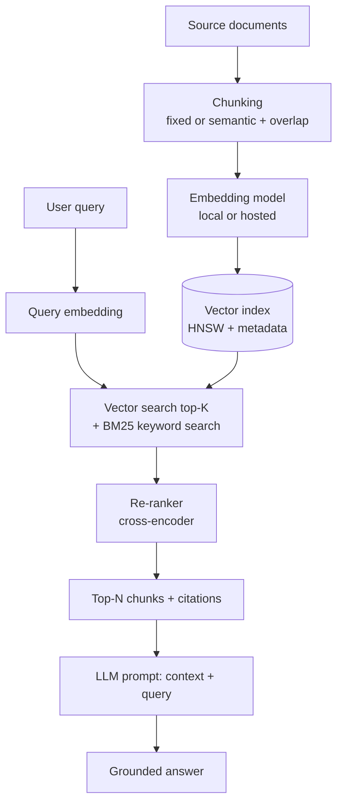

# RAG Architecture: Embeddings, Chunking and Vector Search

**Level:** Advanced
**Tree:** [Applied AI Systems](../README.md)
**Branch:** [RAG & Knowledge Systems](README.md)
**Forest:** [AI & Intelligent Systems](../../../README.md)

## Explanation

Retrieval-augmented generation solves the problem a model cannot solve on its own: it has no knowledge of your data and cannot be retrained fast enough to keep up. RAG instead retrieves relevant passages at query time and places them in the prompt, so the model reasons over facts it was never trained on. The architecture has four stages that each fail independently, and diagnosing a bad answer means knowing which stage broke.

**Ingestion and chunking** splits source documents into passages small enough to embed meaningfully and large enough to retain context. Fixed-size chunking (e.g. 512 tokens with 10-15% overlap) is simple and predictable. Semantic chunking splits at natural boundaries - headings, paragraphs - and produces higher-quality retrieval at the cost of variable chunk size. Overlap prevents a fact from being severed exactly at a chunk boundary. Chunk size is a direct trade-off: too large dilutes the embedding with irrelevant text and wastes context window; too small loses the surrounding context needed to interpret the fact correctly.

**Embedding** converts each chunk into a dense vector where semantic similarity becomes geometric proximity. Embedding model choice matters as much as the LLM: dimension count, domain fit (general vs. code vs. multilingual) and whether the model runs locally (e.g. nomic-embed-text via Ollama) or hosted (Azure OpenAI text-embedding-3) all affect quality and data residency.

**Vector storage and indexing** uses an approximate nearest-neighbour index (HNSW is the dominant algorithm) so similarity search scales sub-linearly. Metadata filtering (source, date, access tier) must run alongside vector search, not after it, or relevant results get filtered out post-hoc from an already-truncated top-k.

**Retrieval quality** is measured, not assumed: recall@k (is the right chunk in the top k?), and increasingly a re-ranking pass (a cross-encoder scoring query-chunk pairs directly) that reorders an over-fetched candidate set before the final top-k reaches the prompt. Hybrid search - combining vector similarity with BM25 keyword search - consistently beats either alone, because vector search misses exact identifiers (part numbers, error codes) that keyword search catches trivially.

## Architecture and flow



## Commands

### Command 1

Download a local embedding model for offline or private-data embedding pipelines.

```text
ollama pull nomic-embed-text
```

### Command 2

Generate an embedding vector locally without sending text to any external service.

```text
curl http://localhost:11434/api/embeddings -d "{\"model\":\"nomic-embed-text\",\"prompt\":\"chunk text here\"}"
```

### Command 3

Provision Azure AI Search as a managed vector + keyword hybrid search index.

```text
az search service create -g rg-ai -n aisearch-prod --sku standard --partition-count 1 --replica-count 2
```

### Command 4

Create an index with vector, text and metadata filter fields from a schema file.

```text
az search index create --service-name aisearch-prod --name kb-index --fields @index-schema.json
```

### Command 5

Install a local embedding model and vector store for prototyping RAG pipelines.

```text
python -m pip install sentence-transformers chromadb
```

### Command 6

Enable semantic re-ranking on an Azure AI Search service.

```text
az search service update -g rg-ai -n aisearch-prod --set semanticSearch.defaultConfiguration=default
```

## Automation scripts

### Chunk, embed and index documents with recall evaluation

```python
#!/usr/bin/env python3
"""Chunk a set of text documents, embed them locally via Ollama, store in a
simple on-disk vector index, and report recall@k against a labelled query set.

Designed to run entirely offline for private-data RAG pipelines.
"""
import json
import math
import os
import sys
import urllib.request

OLLAMA = os.environ.get("OLLAMA_HOST", "http://127.0.0.1:11434")
EMBED_MODEL = "nomic-embed-text"
CHUNK_SIZE = 500
CHUNK_OVERLAP = 75


def embed(text):
    body = json.dumps({"model": EMBED_MODEL, "prompt": text}).encode()
    req = urllib.request.Request(OLLAMA + "/api/embeddings", data=body,
                                 headers={"Content-Type": "application/json"})
    with urllib.request.urlopen(req, timeout=60) as resp:
        return json.loads(resp.read().decode())["embedding"]


def chunk_text(text, size=CHUNK_SIZE, overlap=CHUNK_OVERLAP):
    words = text.split()
    chunks = []
    start = 0
    while start < len(words):
        end = min(start + size, len(words))
        chunks.append(" ".join(words[start:end]))
        if end == len(words):
            break
        start = end - overlap
    return chunks


def cosine(a, b):
    dot = sum(x * y for x, y in zip(a, b))
    na = math.sqrt(sum(x * x for x in a))
    nb = math.sqrt(sum(y * y for y in b))
    return dot / (na * nb) if na and nb else 0.0


def build_index(doc_dir):
    index = []
    for fname in sorted(os.listdir(doc_dir)):
        path = os.path.join(doc_dir, fname)
        if not os.path.isfile(path):
            continue
        with open(path, encoding="utf-8", errors="ignore") as fh:
            text = fh.read()
        for i, chunk in enumerate(chunk_text(text)):
            vec = embed(chunk)
            index.append({"source": fname, "chunk_id": i, "text": chunk, "vector": vec})
    return index


def search(index, query, k=5):
    qvec = embed(query)
    scored = [(cosine(qvec, row["vector"]), row) for row in index]
    scored.sort(key=lambda t: t[0], reverse=True)
    return scored[:k]


def evaluate_recall(index, evalset_path, k=5):
    if not os.path.exists(evalset_path):
        print("No evaluation set at %s, skipping recall check." % evalset_path)
        return
    with open(evalset_path, encoding="utf-8") as fh:
        cases = json.load(fh)
    hits = 0
    for case in cases:
        results = search(index, case["query"], k=k)
        sources = set(r["source"] for _, r in results)
        if case["expected_source"] in sources:
            hits += 1
        else:
            print("  MISS: %r expected %s, got %s" % (
                case["query"], case["expected_source"], sources))
    print("Recall@%d: %.1f%% (%d/%d)" % (k, 100.0 * hits / len(cases), hits, len(cases)))


def main():
    if len(sys.argv) < 2:
        print("Usage: rag_index.py <doc_dir> [evalset.json]")
        sys.exit(2)
    doc_dir = sys.argv[1]
    index = build_index(doc_dir)
    with open("vector-index.json", "w", encoding="utf-8") as fh:
        json.dump(index, fh)
    print("Indexed %d chunks from %s" % (len(index), doc_dir))
    if len(sys.argv) > 2:
        evaluate_recall(index, sys.argv[2])


if __name__ == "__main__":
    main()
```

## Lab

**Objective:** Build a local RAG pipeline over a small document set, measure recall@k with and without a re-ranking pass, and tune chunk size against the result.

### Steps

1. Collect 10-20 representative internal documents (policies, runbooks) into a folder and pull the nomic-embed-text model with Ollama.
2. Write a labelled evaluation set of 15-20 queries as JSON, each with an expected_source file that should appear in the top results.
3. Run the chunking and indexing script at chunk size 500 with 75-word overlap and record recall@5 from the evaluation output.
4. Re-run indexing at chunk sizes 200 and 1000, keeping overlap proportional, and compare recall@5 across all three runs.
5. Add a hybrid keyword pass: for each query also run a simple substring/BM25-style match and merge the candidate sets before scoring.
6. Provision an Azure AI Search index with vector and semantic search enabled and re-index the same documents as a managed alternative.
7. Compare local Ollama+JSON index results against Azure AI Search semantic re-ranked results for the same query set.
8. Document the chosen chunk size, overlap and whether hybrid search was required, with the recall numbers that justified the choice.

### Validation

- The evaluation script reports a recall@5 percentage for at least three chunk-size configurations.
- The configuration with the highest recall@5 is identified explicitly, not assumed from defaults.
- Hybrid search recall is measured and compared against vector-only search on the same query set.
- vector-index.json exists and contains an embedding vector array for every chunk.
- Azure AI Search index returns results for a test query with semantic ranking scores present in the response.

## Operational automation

### Automating RAG pipeline maintenance

**Incremental ingestion, not full rebuilds.** Watch the source document store (SharePoint, file share, Git repo) for changes via webhook or scheduled diff, and re-chunk and re-embed only changed documents. Full re-embedding of a large corpus on every change is slow and expensive at scale, and a stale index is a silent RAG failure mode - the answer looks grounded but cites an outdated policy.

**Recall regression gate in CI.** Store the labelled evaluation set in the same repository as the ingestion pipeline. Any change to chunking parameters, embedding model version, or re-ranker configuration runs the recall evaluation automatically and blocks merge on regression, exactly like a code test suite.

**Embedding model version pinning.** Treat the embedding model like a schema. Changing embedding models invalidates the entire existing vector index because vectors from different models are not comparable - re-embedding the full corpus is mandatory, not optional, and must be scheduled as a maintenance window with the old and new indexes both available during cutover.

**Freshness monitoring.** Track the age of the oldest unindexed change and alert when it exceeds a business-defined staleness threshold (e.g. 24 hours for policy documents). Emit per-source ingestion success/failure metrics so a broken connector to one document source doesn't silently starve part of the knowledge base.

**Automated chunk quality checks.** Flag chunks that are pathologically short (likely a parsing artifact from a table or image) or that exceed the embedding model's context limit and were silently truncated - both are common, invisible sources of degraded retrieval.

## Troubleshooting

### Scenario 1: The model answers confidently but cites the wrong document or a document that does not exist.

**Likely cause:** Retrieval returned low-relevance chunks that still ranked in the top-k, and the prompt does not force the model to only use retrieved chunks and cite by source.

**Resolution:** Add a hard grounding rule requiring citations tied to actual chunk metadata, not free text. Increase retrieval k and add a re-ranking pass. Measure recall@k on a labelled set to confirm the retriever itself is not the root cause before blaming the prompt.

### Scenario 2: Retrieval works well for conceptual questions but fails on exact identifiers like part numbers or error codes.

**Likely cause:** Dense vector embeddings capture semantic meaning, not exact tokens, so an alphanumeric code embeds similarly to unrelated codes with similar surrounding text.

**Resolution:** Add a keyword/BM25 search path alongside vector search and merge results (hybrid search). For structured identifiers, add a metadata filter or exact-match pre-filter step rather than relying on embedding similarity alone.

### Scenario 3: Recall@k looks good in testing but users report the retrieved context is missing surrounding detail.

**Likely cause:** Chunk size is too small, so a fact is retrieved correctly but stripped of the context needed to interpret it, such as which product version a step applies to.

**Resolution:** Increase chunk size or overlap, or retrieve the chunk plus its immediate neighbours from the same document. Consider hierarchical chunking that stores a summary of the parent section alongside the fine-grained chunk.

### Scenario 4: Indexing a large document set takes many hours and the embedding service becomes a bottleneck.

**Likely cause:** Chunks are embedded one at a time synchronously, and the embedding endpoint has per-request overhead that dominates at scale.

**Resolution:** Batch embedding requests where the API supports it, parallelise across multiple workers respecting rate limits, and only re-embed changed documents rather than the full corpus on every run.

### Scenario 5: Vector search results degrade slowly over months with no code change.

**Likely cause:** The index has grown well beyond its planned size and the HNSW index parameters (ef_construction, M) were tuned for a smaller corpus, or stale/duplicate chunks were never pruned.

**Resolution:** Re-tune index parameters for the current corpus size, deduplicate near-identical chunks from repeated document versions, and implement a retention policy that removes superseded document versions from the index rather than only adding new ones.

## Interview questions

### 1. Walk through the RAG pipeline end to end and identify where quality typically breaks.

Four stages: ingestion/chunking, embedding, retrieval, and generation. Chunking breaks quality when chunks are too large (dilutes the embedding, wastes context) or too small (loses interpretive context) - this is diagnosed by measuring recall@k across chunk-size configurations rather than guessing. Embedding breaks quality when the model is a poor domain fit, for example a general-purpose embedding model on dense legal or medical text, or when the corpus grows past what the embedding dimension can meaningfully separate. Retrieval breaks quality most often on exact identifiers, since dense vectors capture semantic meaning, not literal tokens - the fix is hybrid search combining vector and keyword matching. Generation breaks quality when the prompt does not force the model to answer only from retrieved context, so it fills gaps with parametric knowledge that looks grounded but is not - the fix is an explicit grounding instruction plus a citation requirement that is checked programmatically, not trusted. I instrument each stage separately with its own metric so a bad answer can be attributed to the actual broken stage instead of re-prompting blindly.

### 2. How do you choose a chunking strategy and defend the choice?

I do not choose from a default, I measure. Start with a labelled evaluation set of realistic queries with a known correct source document. Run the same corpus through two or three chunking strategies - fixed-size at different sizes, and semantic chunking at natural document boundaries - and compute recall@k for each. The strategy that clears the recall bar with the smallest chunk size wins, because smaller chunks mean more precise citations and less wasted context window per retrieved passage. Overlap is a separate tuning parameter: enough to prevent a fact from being severed exactly at a boundary, typically 10-20% of chunk size, without so much that it inflates the index and dilutes distinct chunks into near-duplicates. The defense in a design review is always the recall numbers on the labelled set, not an assertion about what 'usually works', because chunking behaviour is highly corpus-dependent - dense technical tables behave completely differently from narrative policy text.

### 3. Why does hybrid search outperform pure vector search, and when would you skip it?

Vector search captures semantic similarity - it finds passages about the same topic even with different wording, which is exactly what dense embeddings are good at. It systematically underperforms on exact-match needs: part numbers, error codes, product SKUs, proper nouns, because two different codes surrounded by similar language embed close together, and the actual match is buried below irrelevant semantic neighbours. BM25 keyword search is the inverse - excellent at exact tokens, poor at paraphrase and synonym. Combining them, typically with reciprocal rank fusion or a weighted score merge, covers both failure modes and is now close to a default best practice for enterprise RAG. I would skip the added complexity only for a narrow, purely conversational use case with no structured identifiers in the corpus, where the operational cost of running two retrieval paths and merging results is not justified by the marginal precision gain - and I would still verify that assumption against the labelled evaluation set rather than assume it.

### 4. How does a re-ranker improve results over top-k vector search alone, and what does it cost?

Vector search with a bi-encoder embeds the query and every chunk independently, then compares vectors - fast because chunk embeddings are precomputed, but the query and chunk never interact directly, so the similarity score is an approximation. A re-ranker is a cross-encoder that takes the query and a candidate chunk together as one input and scores relevance directly, which is substantially more accurate but too slow to run against the entire corpus. The pattern is to over-fetch, retrieve a larger candidate set, say top 50, with fast vector search, then re-rank only those 50 with the cross-encoder and keep the top 5-10 for the prompt. The cost is one extra network or inference call per query with latency proportional to the candidate set size, which is why the over-fetch count is a tuned parameter, not the whole corpus. In practice this measurably improves recall@k and precision at low k, and is worth the added latency for any workload where answer correctness matters more than shaving 100-200ms.

## Certification alignment

- AI-102 Azure AI Engineer Associate - Implement knowledge mining and document intelligence solutions, including Azure AI Search
- AI-102 Azure AI Engineer Associate - Implement generative AI solutions: retrieval-augmented generation patterns
- AI-900 Azure AI Fundamentals - Identify features of generative AI solutions
- AZ-305 Designing Microsoft Azure Infrastructure Solutions - Design a data storage solution for non-relational and search data
- Vendor-neutral - NIST AI RMF MAP function: document data provenance for retrieval-grounded systems

## References

- Microsoft Learn - Azure AI Search vector search and hybrid search overview
- Microsoft Learn - Chunking and vectorization strategies for RAG in Azure AI Search
- Ollama documentation - embeddings API reference
- Hugging Face - sentence-transformers and cross-encoder re-ranking models
- Pinecone / vector database vendor documentation - HNSW indexing fundamentals

## Suggested video search

RAG architecture chunking strategy vector database embeddings retrieval quality enterprise

---

> Validate commands, versions, permissions, licensing, and rollback procedures in an isolated lab before production use.
