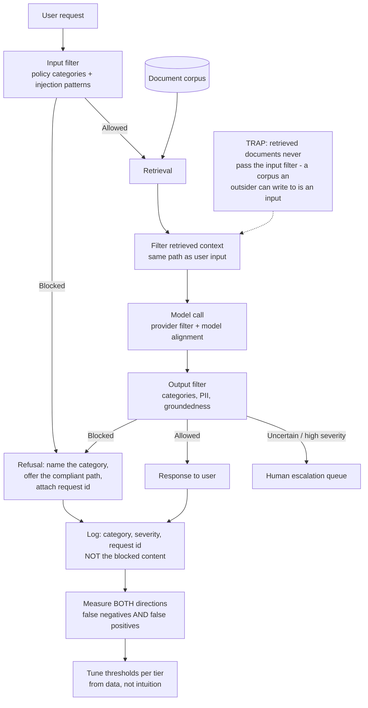

# Content Safety and Guardrails: Input Filtering, Output Classification and Refusal Design

**Level:** Intermediate
**Tree:** [Applied AI Systems](../README.md)
**Branch:** [Agents & Enterprise Integration](README.md)
**Forest:** [AI & Intelligent Systems](../../../README.md)
**Readiness:** [Lab](../../../READINESS.md#lab) - checked offline, not yet run against a live service. A live run needs an Azure subscription.

## Explanation

### Guardrails are layers, not a switch

Four layers sit between a request and a response, and each fails differently. The
model's own alignment refuses obvious harm but is the layer an attacker is directly
trying to talk past. The provider's content filter catches broad categories
consistently but knows nothing about your domain. **Your policy filter** encodes what
is unacceptable *for this application* - a rule the provider cannot know. And human
escalation handles the residue, because some decisions should not be automated at all.
Teams that treat safety as a single vendor toggle are relying on the one layer with no
knowledge of their context.

Layers say who decides; **intervention points** say where a check runs. Microsoft
Foundry guardrails name four: user input, tool call, tool response and output. This leaf
already filters three places: user input and retrieved context on one path (Commands
3-5) and output. Reading those as Foundry's user input and output points is the author's
mapping, not the page's. An agent adds the other two, both marked preview and "Agents
only": the tool call, "the action and data the agent proposes to send to a tool", and the
tool response, "the content returned from a tool to the agent". When a tool response
control finds an indirect attack, "the agent stops operating immediately".

Several facts limit what the platform does for you. "Agent guardrails are in preview", and
"The guardrail system currently applies only to agents developed in the Foundry Agent
Service, not to other agents registered in the Foundry Control Plane". So the LangGraph
agent in [Agent Orchestration with LangGraph](../../ai-tree-production-systems/ai-branch-agent-runtime-cost/ai-agent-orchestration-guardrails.md)
and the Ollama agents in [AI Agents and Orchestration Patterns](ai-agents-orchestration.md)
and [MCP Servers, AI Security and Evaluation](ai-mcp-security-evaluation.md) keep their
in-code checks: `authorise()` before a tool runs, `shield_verdict()` on each tool result,
and the Prompt Shields scan of a tool result before it enters context. Even for a Foundry
agent, tool call and tool response controls need moderation support from the tool. The
supported tools are Azure AI Search, Azure Functions, OpenAPI, SharePoint Grounding,
Fabric Data Agent, Bing Grounding, Bing Custom Search and Browser Automation, and for any
other tool those controls "won't take effect". "The agentic guardrail fully overrides the
model's guardrail", so a stricter threshold on the model deployment does not carry over
to an agent that has its own guardrail. Agents also take only **Annotate and block**
(Annotate alone is not applicable to agents), and Spotlighting and Groundedness, both
preview, are not applicable to agents, so an agent guardrail cannot supply the
Spotlighting containment or the groundedness output check this leaf describes. Each
point adds "approximately 50-100ms of latency", and the tool call point runs "every time
the agent is about to execute a tool call", so a multi-step run pays it more than once.

### Input and output filtering solve different problems

Input filtering rejects a request before it costs anything - a policy-violating ask, or
a recognisable injection pattern. Output filtering inspects what the model actually
produced. They are not redundant, because **a safe input can produce an unsafe output**:
the model can hallucinate a defamatory claim, leak content from a retrieved document the
requester should not see, or be talked into something the input filter did not recognise
as an attempt. Output filtering is the layer teams skip, and it is the layer that
catches the failure the input filter was never going to see.

### The false-positive cost is the real design constraint

An over-tight filter is not a safe filter. Block a security team's assistant from
discussing exploit techniques, a clinical team from describing symptoms, or a legal team
from quoting a threatening letter, and the users do not accept it - they route around
the system, and you have made the estate less safe while the dashboard reports
compliance. **Measure both directions**: how much unsafe content gets through, and how
much legitimate work is blocked. A guardrail with only the first number is untuned.

### Thresholds belong to the use case, not the platform

Severity thresholds should be per application tier, not one global setting. A
customer-facing assistant and an internal security research tool need genuinely
different violence and self-harm thresholds, and expressing that as configuration -
tiers with named policies - is what stops the argument being relitigated per team. The
tier a workload belongs to is a governance decision; enforcing it is a runtime one.

### Refusal is a user interface

A bare "I can't help with that" teaches nothing and generates a support ticket. A good
refusal names the category that was blocked and offers the compliant path. Two rules:
**never echo the blocked content back** in the refusal, and always attach the request id
so a wrongly blocked user can appeal with something actionable.

### Retrieved content is untrusted input

RAG changes the threat model. A document in the corpus can carry instructions, and it
reaches the model having never passed the input filter, because it was not typed by the
user. **Filter retrieved context on the same path as user input**, and treat any
document source that outsiders can write to as hostile by default.

Detection needs containment behind it, because the detector will miss some attacks.
Wrap each retrieved chunk in explicit delimiters and state in the system prompt that
delimited text is data, never instruction. Prompt Shields also offers **Spotlighting**,
which base64-encodes documents so the model treats them as lower trust than the user and
system prompts. It is a preview feature, off by default and available only for models
called through the Chat Completions API; it adds tokens, which can push a long document
past the input limit, and the model may mention the encoding in its answer.

## Architecture and flow



## Commands

### Command 1

Get a Microsoft Entra token for Content Safety - the signed-in identity needs the Cognitive Services User role on the resource, and a resource key is only the fallback where Entra ID cannot be used

```text
TOKEN=$(az account get-access-token --resource https://cognitiveservices.azure.com --query accessToken -o tsv)
```

### Command 2

Classify a single text against the standard harm categories and read back per-category severity, with the body built by jq so quotes in the sample cannot break the JSON

```text
jq -n --arg text "$SAMPLE" '{text: $text}' | curl -s "$ENDPOINT/contentsafety/text:analyze?api-version=2024-09-01" -H "Authorization: Bearer $TOKEN" -H "Content-Type: application/json" --data-binary @- | jq ".categoriesAnalysis"
```

### Command 3

Test a jailbreak attempt against the dedicated prompt-shield endpoint rather than the category classifier

```text
jq -n --arg prompt "$ATTACK" '{userPrompt: $prompt, documents: []}' | curl -s "$ENDPOINT/contentsafety/text:shieldPrompt?api-version=2024-09-01" -H "Authorization: Bearer $TOKEN" -H "Content-Type: application/json" --data-binary @- | jq
```

### Command 4

Batch retrieved chunks (one JSON object per line with `id` and `text`) within both Prompt Shields limits - at most five documents and 10,000 characters in total per call - splitting any chunk over 10,000 characters into numbered parts first, and failing on an empty file or a chunk with no text rather than writing a batch that skips it

```text
jq -s -c 'if length == 0 then error("no chunks to scan") else . end | map(if (.id == null or (.text | type) != "string" or .text == "") then error("chunk without an id or text: \(.id)") else .id as $id | .text as $t | range(0; $t | length; 10000) as $o | {id: $id, part: ($o / 10000), text: $t[$o:$o + 10000]} end) | reduce .[] as $p ([]; if length > 0 and (.[length - 1] | length) < 5 and ((.[length - 1] | map(.text | length) | add) + ($p.text | length)) <= 10000 then .[length - 1] += [$p] else . + [[$p]] end) | .[]' chunks.jsonl > batches.jsonl
```

### Command 5

Scan batch `N` (one line of `batches.jsonl`) for embedded instructions before it reaches the prompt, and print each chunk id and part beside its verdict - `documentsAnalysis` comes back in input order, and an unreachable service, an error body, an empty response or a missing verdict exits non-zero so the batch counts as unscanned, never as clean (the reply is captured and checked non-empty first, because jq 1.6 treats empty input as success)

```text
B=$(sed -n "${N:-1}p" batches.jsonl); R=$(jq -n --argjson b "$B" '{userPrompt: "", documents: ($b | map(.text))}' | curl -sS "$ENDPOINT/contentsafety/text:shieldPrompt?api-version=2024-09-01" -H "Authorization: Bearer $TOKEN" -H "Content-Type: application/json" --data-binary @-) && [ -n "$R" ] && printf '%s' "$R" | jq -e -r --argjson b "$B" 'if (.documentsAnalysis | type) == "array" and (.documentsAnalysis | length) == ($b | length) and all(.documentsAnalysis[]; (.attackDetected | type) == "boolean") then .documentsAnalysis | to_entries[] | [$b[.key].id, $b[.key].part, .value.attackDetected] | @tsv else error("no verdict for every document - treat batch as unscanned: \(tojson)") end'
```

### Command 6

Report the block rate by category from the gateway log - the false-negative half of the picture

```text
jq -r "select(.blocked) | .category" gateway.log | sort | uniq -c | sort -rn
```

### Command 7

Report refusals against total requests per application tier - the false-positive signal that precedes users routing around you

```text
jq -r "[.tier, (.blocked|tostring)] | @tsv" gateway.log | sort | uniq -c
```

### Command 8

Confirm the refusal path does not echo blocked content back to the caller

```text
grep -c "$KNOWN_BLOCKED_PHRASE" refusal-responses.log
```

## Automation scripts

### guardrail_threshold_tuner.py

Thresholds are usually set by intuition and then never revisited, which produces a
filter nobody can defend in either direction. This runs a labelled set through the
filter at every threshold and reports what each setting actually costs, so the choice is
made from a table rather than a feeling.

Requires `pip install requests azure-identity`. The endpoint is read from
`CONTENT_SAFETY_ENDPOINT`, and calls authenticate with a Microsoft Entra token
(`az login` on a laptop, managed identity on an Azure host) for an identity holding the
Cognitive Services User role on the resource. `CONTENT_SAFETY_KEY` is the fallback where
Entra ID cannot be used; it is read from the environment rather than the command line,
where a key would be kept in shell history and shown to anyone who can list processes.

```python
#!/usr/bin/env python3
"""Choose content-filter thresholds from measured precision and recall.

Takes a labelled corpus of prompts - benign ones drawn from real traffic and
violating ones per category - and sweeps the severity threshold. Reports, for
each category and threshold, what fraction of violations is caught and what
fraction of legitimate work is blocked.

Usage: guardrail_threshold_tuner.py <corpus.jsonl>
"""
import json
import os
import sys

import requests

ENDPOINT = os.environ.get("CONTENT_SAFETY_ENDPOINT", "").rstrip("/")
SCOPE = "https://cognitiveservices.azure.com/.default"
SEVERITIES = [0, 2, 4, 6]  # provider severity levels, ascending


def auth_headers():
    """Return a callable producing auth headers: Entra ID by default, key as fallback."""
    key = os.environ.get("CONTENT_SAFETY_KEY")
    if key:
        return lambda: {"Ocp-Apim-Subscription-Key": key}
    # Imported here so the key fallback works without azure-identity installed.
    try:
        from azure.identity import DefaultAzureCredential, get_bearer_token_provider
    except ImportError:
        sys.exit("azure-identity is not installed - pip install azure-identity requests, "
                 "or set CONTENT_SAFETY_KEY as the fallback")
    token = get_bearer_token_provider(DefaultAzureCredential(), SCOPE)
    try:
        token()  # fetch once up front, so a missing sign-in stops here and not mid-corpus
    except Exception as exc:
        sys.exit(f"could not get a Content Safety token - run az login first, or set "
                 f"CONTENT_SAFETY_KEY as the fallback ({type(exc).__name__})")
    return lambda: {"Authorization": f"Bearer {token()}"}


def classify(text, headers):
    try:
        response = requests.post(
            f"{ENDPOINT}/contentsafety/text:analyze?api-version=2024-09-01",
            headers=headers(),
            json={"text": text},
            timeout=30,
        )
        response.raise_for_status()
        analysis = response.json()["categoriesAnalysis"]
    except (requests.RequestException, ValueError, KeyError) as exc:
        # A failed call must stop the sweep: scoring it as severity 0 would read as "clean".
        sys.exit(f"Content Safety call failed, no thresholds reported ({type(exc).__name__}: {exc})")
    return {item["category"]: item["severity"] for item in analysis}


def main(corpus_path, headers):
    """corpus: JSONL of {"text": ..., "violates": "Hate"|null}"""
    with open(corpus_path) as handle:
        records = [json.loads(line) for line in handle if line.strip()]
    if not records:
        sys.exit(f"{corpus_path} has no records - an empty corpus measures nothing")

    scored = [(r, classify(r["text"], headers)) for r in records]
    categories = sorted({c for _, s in scored for c in s})

    print(f"{'category':<12}{'thresh':>7}{'caught':>9}{'missed':>8}{'blocked_ok':>12}{'note':>26}")
    for category in categories:
        violating = [(r, s) for r, s in scored if r.get("violates") == category]
        benign = [(r, s) for r, s in scored if not r.get("violates")]
        for threshold in SEVERITIES:
            caught = sum(1 for _, s in violating if s.get(category, 0) >= threshold)
            blocked_benign = sum(1 for _, s in benign if s.get(category, 0) >= threshold)
            recall = caught / len(violating) if violating else 0.0
            fpr = blocked_benign / len(benign) if benign else 0.0
            note = ""
            if fpr > 0.05:
                note = "users will route around this"
            elif violating and recall < 0.8:
                note = "misses most violations"
            print(
                f"{category:<12}{threshold:>7}{recall:>8.0%}{1 - recall:>8.0%}"
                f"{fpr:>11.1%}{note:>26}"
            )

    # The pairing that matters: a threshold is only defensible with both numbers.
    print(
        "\nPick per tier: the lowest threshold whose false-positive rate the tier's "
        "users will tolerate, then report the residual miss rate as accepted risk."
    )
    return 0


if __name__ == "__main__":
    if len(sys.argv) != 2:
        sys.exit("usage: guardrail_threshold_tuner.py <corpus.jsonl>")
    if not ENDPOINT:
        sys.exit("set CONTENT_SAFETY_ENDPOINT first (and sign in with az login, "
                 "or set CONTENT_SAFETY_KEY as the fallback)")
    sys.exit(main(sys.argv[1], auth_headers()))
```

## Lab

**Objective:** Build the four-layer guardrail path around one assistant, then measure what each threshold costs in both directions and demonstrate the failure that input filtering alone cannot catch.

### Steps

1. Stand up an assistant with no guardrails beyond the provider default and record its behaviour on a small adversarial prompt set.
2. Add input filtering at the gateway and confirm policy-violating requests are rejected before a model call is billed.
3. Assemble a labelled corpus: benign prompts drawn from real traffic, plus violating prompts per category.
4. Run `guardrail_threshold_tuner.py` and record, for each category and threshold, the catch rate and the fraction of benign traffic blocked.
5. Choose thresholds per application tier from that table, and write down the residual miss rate you are accepting.
6. Add output filtering and demonstrate a case where a benign input produces an output the output filter blocks.
7. Place a document containing embedded instructions into the retrieval corpus, and confirm it reaches the model without passing the input filter.
8. Route retrieved context through the same filtering path and confirm the injected document is now caught.
9. Implement the refusal response: name the category, offer the compliant path, attach the request id, and confirm the blocked content is not echoed back.
10. Drive a wrongly blocked request end to end through the appeal path, from the user-visible request id to the logged decision.

### Validation

- Both directions are measured: the residual false-negative rate and the fraction of benign traffic blocked are recorded per category and threshold.
- A benign input producing a blocked output is demonstrated, proving input filtering alone is insufficient.
- An injected document reaches the model before the fix and is caught after it, on the same retrieval path.
- Thresholds differ between at least two application tiers, and the difference traces to a named policy rather than preference.
- The refusal names the blocked category and carries a request id, and the blocked content appears nowhere in the response.
- Filter decisions are logged with category, severity and request id, and the logs contain no blocked content.

## Operational automation

### Automating the guardrail path in production

- **Enforce filtering in the retrieval pipeline, not the prompt template.** The day
  someone assembles a prompt by a different route, retrieved context arrives unfiltered.
  Placing the check on the path every document must cross makes the guarantee structural
  rather than a convention the next pull request can quietly drop.
- **Ship thresholds as versioned configuration keyed by application tier.** Thresholds
  scattered through service code cannot be reviewed, diffed or attested. As
  configuration, a change is a pull request with an owner, the security team reads the
  estate's posture in one file, and tier assignment becomes an onboarding decision
  rather than a per-team argument.
- **Log the decision, never the content.** Category, severity, tier and request id are
  enough to debug, tune and audit. Writing the blocked text into logs moves the most
  sensitive material in the system into the least protected store, turning a safety
  control into a data-classification incident at the next log export.
- **Alert on refusal rate per tier, not only on block counts.** A rising refusal rate in
  one tier is the earliest visible signal that users are about to route around the
  system, and shadow usage is invisible once it starts. Treat the false-positive side as
  an SLO with a threshold and a pager, exactly as you would latency.
- **Re-run the labelled corpus on every provider model or filter version change.**
  Vendors update classifiers on their own schedule, and behaviour shifts without a
  release note you will read. Pinning versions where the provider allows it and gating
  upgrades on the corpus turns a silent regression into a failed check.
- **Route disputed blocks back into the labelled corpus.** Every appealed refusal is a
  free, real-traffic label. Without that loop, thresholds are tuned once against a
  synthetic set and then decay; with it, the tuning table is refreshed from the
  distribution the system actually sees.
- **Do not build the policy layer on keyword blocklists.** Regular-expression matching
  as a primary defence is the superseded approach: it is evaded by paraphrase, encoding
  or translation, and it generates most of the false positives. Classifier-based
  category scoring plus a dedicated injection detector replaced it; keep pattern
  matching only as a cheap pre-filter for known literal strings such as leaked keys.

## Troubleshooting

### Scenario 1: Users report the assistant refuses ordinary work questions, and usage is falling.

**Likely cause:** A single global severity threshold tuned for the most sensitive tier is being applied to every workload, so domain-legitimate language - exploit names, clinical symptoms, quoted abuse in a legal matter - scores above the bar.

**Resolution:** Split thresholds by application tier and re-derive each from the labelled corpus rather than lowering the global setting by feel. Confirm the diagnosis first by pulling the refusal rate per tier and sampling the refused prompts: refusals concentrated in one tier and reading as legitimate work mean calibration, not attack traffic. Falling usage alongside rising refusals means the work has already moved somewhere unmonitored - the more urgent problem.

### Scenario 2: A jailbreak reached the model even though category filtering was enabled and passing tests.

**Likely cause:** Category classifiers and injection detection are different detectors. A prompt that instructs the model to ignore its instructions contains no hate, violence or sexual content, so every category scores zero and the request passes.

**Resolution:** Add the dedicated prompt-shield call alongside category analysis rather than expecting one endpoint to cover both. Confirm the diagnosis by replaying the attack through the category endpoint: all-zero severities on a prompt that obviously attacks the system is the signature. Treat a green category result as evidence about categories only, never as evidence the request was safe.

### Scenario 3: Filtering passes every test in staging and misses the same content in production.

**Likely cause:** Only the current user turn is being filtered, while the model receives an assembled prompt containing conversation history, system instructions and retrieved documents. The harmful content enters through a part of the payload the filter never sees.

**Resolution:** Filter each untrusted component on its own path - user turn, retrieved chunk, tool output - and assert at startup that every source of model-visible text has a filtering step. Confirm the diagnosis by logging a hash of the string sent to the filter and of the string sent to the model; where they diverge is the vulnerability. Fixtures that submit a bare string reproduce none of this, which is why staging stayed green.

### Scenario 4: Block rates changed sharply overnight with no deployment on your side.

**Likely cause:** The provider updated the model version or the safety classifier behind the same endpoint, shifting severity scores under thresholds tuned against the previous behaviour.

**Resolution:** Re-run the labelled corpus to quantify the shift in both directions before adjusting thresholds, because the move can be toward more blocking or less and the two demand opposite responses. Pin model and API versions where the provider supports it, and gate upgrades on the corpus run. Confirm it by checking the served model version in response metadata against the version recorded at the last tuning run.

### Scenario 5: A refusal message returned to the user contained the blocked text.

**Likely cause:** The error path echoes the offending input for debuggability - a pattern inherited from ordinary input validation, where echoing is helpful and harmless.

**Resolution:** Construct refusals from the category and request id alone, and add a test asserting a known blocked phrase never appears in a refusal body. Then check the logs on the same assumption, since the same reflex usually writes the content there too - the more serious finding, because it relocates the most sensitive material in the system into a store with weaker access controls and longer retention.

### Scenario 6: After Spotlighting was enabled, answers mention that the source documents are base64 encoded, and long documents start failing.

**Likely cause:** Spotlighting (preview) base64-encodes documents before the model sees them. The model may remark on the encoding even though neither the user nor the system prompt asked about it, and the encoding adds tokens, which pushes long documents past the input limit.

**Resolution:** Confirm the diagnosis by toggling Spotlighting off in the document attack control for the deployment and replaying the same request: the remark and the size failures disappear. Add a system-prompt line telling the model not to describe how documents are encoded, chunk long documents smaller before they are attached, and re-check token budgets and cost with Spotlighting on. Keep plain delimiting in place either way, since Spotlighting is a preview feature and works only through the Chat Completions API.

## Interview questions

### 1. The model provider already filters content. Why would you build another layer?

Because the provider's filter is the only layer that knows nothing about your application. It catches broad categories consistently, but it cannot know that this assistant must never discuss competitor pricing, or that this one must be free to discuss exploit techniques because it serves a security team. Those are policy statements about a specific use case, and they can only live in your layer. I think of it as four layers with different failure modes: the model's own alignment, which is exactly what an attacker is trying to talk past; the provider filter, broad and context-free; your policy filter, which encodes what is unacceptable here; and human escalation for decisions that should not be automated. A team relying on the vendor toggle alone has delegated its policy to a party that has never seen its requirements, and cannot tune the false-positive side - the side that determines whether users keep using the system at all.

### 2. How do you choose a severity threshold, and what would you show an auditor to defend it?

Not by intuition, because a number picked that way cannot be defended in either direction. I build a labelled corpus - benign prompts sampled from real traffic, plus violating prompts per category - sweep the threshold across every severity level, and produce a table showing what fraction of violations each setting catches and what fraction of legitimate work it blocks. I pick the lowest threshold whose false-positive rate that tier's users will tolerate, and write down the residual miss rate as accepted risk with a named owner. That table is what I show an auditor: it demonstrates the control was calibrated from measurement, states the risk knowingly accepted, and identifies who accepted it. A dashboard showing only blocks proves the filter fires, not that it is correct - and the re-run history proves it still is.

### 3. A RAG assistant summarises documents that partners upload. Where is the injection risk?

In the corpus, and teams miss it because the mental model is that filtering happens at the user's keyboard. A partner-uploaded document can carry instructions addressed to the model - reveal the system prompt, ignore prior constraints, call a tool with different arguments - and that text reaches the model having never crossed the input filter, because no user typed it. The fix is to put retrieved context on the same filtering path as user input, in the retrieval pipeline rather than the prompt template, so a future feature that assembles prompts differently cannot bypass it. Prompt Shields is a probabilistic detector, so a clean scan lowers the risk rather than proving the document safe, which is why the containment below still matters. Beyond filtering, I treat any source outsiders can write to as hostile by default: a separate index with tighter thresholds, no path by which its content influences tool selection, and output filtering on the way back out, since exfiltration is the usual goal.

### 4. Your filter blocks unsafe content effectively and complaints are rising. What is the actual risk?

That people stop using the system, which makes the estate less safe while the dashboard reports the opposite. Shadow usage is the failure mode: work moves to a personal account with no logging, no data residency and no filter at all, and it is invisible by construction, so the first evidence is falling volume rather than an alert. That is why I treat the false-positive rate as a first-class metric with an owner and a threshold, not as friction users absorb. Concretely I would split thresholds by tier so the complaining workload is calibrated against its own traffic, and rebuild the refusal itself - naming the blocked category, offering the compliant path, attaching a request id - so a wrongly blocked user has something actionable instead of a dead end. Then I would route appealed refusals back into the corpus, which is the only mechanism that keeps calibration from decaying after the initial tuning.

## Certification alignment

- **Microsoft Certified: Azure AI Apps and Agents Developer Associate (AI-103)** - Implement generative AI and agentic solutions: layering input filtering, Prompt Shields for user prompts and retrieved documents, and output filtering around a RAG assistant, with severity thresholds set per application tier.
- **Microsoft Certified: Multi-Agent AI Solutions Expert (AI-500, beta)** - Secure, govern, and deploy multi-agent solutions: guardrails at the four intervention points (user input, tool call, tool response and output), with the Foundry agent guardrails (preview) limited to Foundry Agent Service agents and in-code checks kept for other agents.
- **Microsoft Certified: Cybersecurity Architect Expert (SC-100)** - Design security solutions for applications and data: treating retrieved documents as untrusted input, filtering every source of model-visible text, and logging filter decisions without the blocked content.
- **Google Cloud Professional Machine Learning Engineer** - responsible AI practices, safety evaluation and production monitoring.
- **Vendor-neutral** - OWASP GenAI LLM Top 10 2026: LLM01:2026 Prompt Injection and LLM10:2026 Improper Output Handling, mapped to NIST AI RMF MANAGE.

## References

- [Microsoft Learn: Harm categories and severity levels](https://learn.microsoft.com/azure/ai-services/content-safety/concepts/harm-categories) - Harm categories and per-category severity levels used for threshold tuning.
- [Microsoft Learn: Prompt Shields](https://learn.microsoft.com/azure/ai-services/content-safety/concepts/jailbreak-detection) - Prompt Shields for user prompts and retrieved documents, and the Spotlighting preview with its base64 and token-count caveats.
- [Microsoft Learn: What is Azure AI Content Safety?](https://learn.microsoft.com/azure/ai-services/content-safety/overview) - Prompt Shields input limits (a 10K-character prompt, and up to five documents totalling 10K characters per call), Microsoft Entra ID authentication and the Cognitive Services User role used by the commands and the tuner script.
- [Microsoft Learn: Intervention points](https://learn.microsoft.com/azure/foundry/guardrails/intervention-points) - The four intervention points, the tool response behaviour on an indirect attack, the tools with moderation support and the 50-100ms latency per point.
- [Microsoft Learn: Guardrails and controls overview in Microsoft Foundry](https://learn.microsoft.com/azure/foundry/guardrails/guardrails-overview) - Agent guardrails in preview and only for Foundry Agent Service agents, the agentic guardrail overriding the model's, and the risks, points and actions applicable to agents.
- [Microsoft Learn: Defend against indirect prompt injection attacks](https://learn.microsoft.com/security/zero-trust/sfi/defend-indirect-prompt-injection) - Delimiting and data marking of retrieved content as containment behind detection.
- [OWASP Gen AI Security Project: OWASP GenAI LLM Top 10 2026](https://genai.owasp.org/resource/owasp-genai-llm-top-10-2026/) - LLM01:2026 Prompt Injection, LLM10:2026 Improper Output Handling and associated mitigations.
- [National Institute of Standards and Technology (NIST): Artificial Intelligence Risk Management Framework (AI RMF 1.0)](https://doi.org/10.6028/NIST.AI.100-1) - MEASURE and MANAGE functions for operational safeguards.
- [International Organization for Standardization (ISO): ISO/IEC 42001:2023 - AI management systems](https://www.iso.org/standard/42001) - AI management system requirements covering operational controls and incident handling.
- [EUR-Lex (Publications Office of the European Union): Regulation (EU) 2024/1689 of the European Parliament and of the Council laying down harmonised rules on artificial intelligence (Artificial Intelligence Act)](https://eur-lex.europa.eu/eli/reg/2024/1689/oj/eng) - Transparency and risk-management obligations for general-purpose and high-risk AI systems.

## Suggested video search

LLM content safety guardrails prompt injection output filtering threshold tuning false positives enterprise

---

> Validate commands, versions, permissions, licensing, and rollback procedures in an isolated lab before production use.
