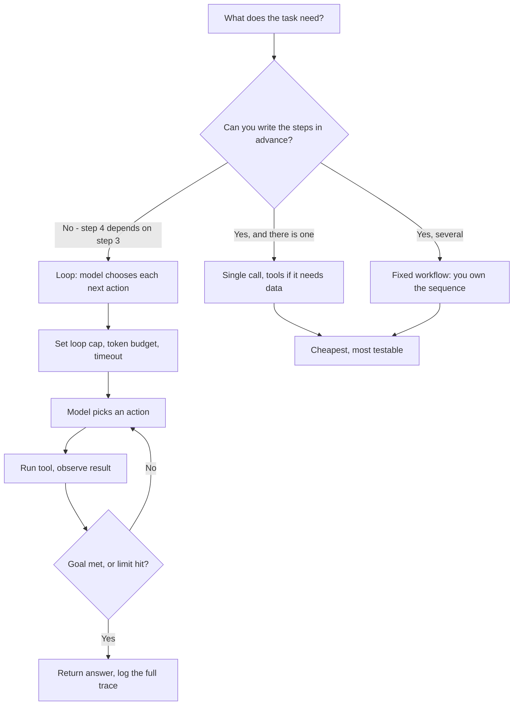

# Do You Need an Agent? Loops, Tools and the Cost of Letting a Model Decide

**Level:** Beginner
**Tree:** [Applied AI Systems](../README.md)
**Branch:** [Agents & Enterprise Integration](README.md)
**Forest:** [AI & Intelligent Systems](../../../README.md)
**Readiness:** [Lab](../../../READINESS.md#lab) - checked offline, not yet run against a live service. A live run needs a local Ollama server.

## Explanation

"Agent" is doing too much work as a word. It gets applied to a function call,
to a five-step script, and to a system that decides its own next move fifty
times in a row — three architectures with different costs, different failure
modes and different amounts of trouble. Being asked to "build an agent" without
settling which one is being asked for is how projects acquire a loop they never
needed.

### Three things called agents

**A single call with tools.** You describe some functions to the model, it
picks one and supplies arguments, your code runs it and hands back the result,
the model writes a reply. One round trip, possibly two. The model chose *what*,
your code controlled *whether* and *how*. This handles an enormous share of
what people mean by an agent — "look up this order", "convert these units" —
and it is bounded, cheap and debuggable.

**A fixed workflow.** You wrote the steps: fetch the ticket, summarise it,
classify urgency, draft a reply, post it. The model does the parts requiring
judgement; the sequence is yours. Each step is separately testable, the cost is
predictable because the number of calls is known, and a failure at step three
is visibly a step-three failure.

**A loop.** The model is given tools and a goal and decides repeatedly what to
do next, observing each result before choosing again, until it decides it is
finished. Nobody wrote the sequence. That is the actual distinguishing feature
of an agent, and everything difficult follows from it.

### What the loop costs

The loop is not a slightly more expensive workflow. Its costs are different in
kind.

**Cost grows faster than steps.** Each iteration re-sends the accumulated
history: the original goal, every action taken, every result observed. Step ten
carries the whole of steps one through nine. Token spend grows roughly with the
square of step count, so a run that takes twice as many steps costs around four
times as much — which is why agent bills surprise people who budgeted linearly.

**Errors compound.** In a workflow, a bad step three produces a bad step three.
In a loop, a bad observation at step three enters the context and shapes every
subsequent decision, and the model will reason confidently from it. The
characteristic agent failure is not a crash but a long, fluent, entirely wrong
sequence of actions.

**Every run differs.** Two identical requests can take four steps or eleven,
call different tools, and produce different answers. Testing something whose
execution path is not stable requires a different discipline than testing a
function, and "it worked when I tried it" stops being evidence.

**Unbounded means unbounded.** Without explicit limits a loop will keep going —
retrying a failing tool, oscillating between two actions, or spending your
budget on a task that was impossible from the start. Loop caps, token budgets
and wall-clock timeouts are not optional extras; they are the difference
between a feature and an incident.

**Observations can be hostile.** Everything a tool returns — a web page, an
email, a retrieved document — goes back into the context, and the model cannot
reliably tell text it should read from text it should obey. In a loop, an
instruction planted in one observation can choose the next tool and its
arguments. In a workflow it cannot: the next step is the one you wrote, so
injected text can spoil an answer but not redirect the run. This is LLM01:2026
Prompt Injection, and a loop widens it from a bad reply to an action.

### The question that decides it

Ask this: **can you write the steps down in advance?**

If you can, write them down. That is a workflow, and it will be cheaper, more
testable and easier to debug than a loop that rediscovers your sequence on
every run at full token price.

You need a loop only when the number and order of steps genuinely depends on
what is discovered along the way — when step four is unknowable until step
three has run. Investigating an unfamiliar incident across several systems
qualifies. Answering a support question usually does not, even when it feels
open-ended, because the shape is almost always: search, read, answer.

A useful sanity check is to write the last twenty real requests as step
sequences. If eighteen share a shape, build that shape as a workflow and route
the other two to a human. You have replaced a hard problem with an easy one
plus an exception path, which is usually the right trade.

### Start at the bottom and earn each rung

Take the ladder in order: single call, then tools, then workflow, then loop.
Move up only when the rung below demonstrably fails, and be able to say what
failed. "We started with a loop because that is what agents are" is the origin
of most of the expensive, unpredictable systems in this space.

Moving up is also not permanent. Teams routinely build a loop, watch its traces
for a month, notice that ninety percent follow the same four steps, and replace
it with a workflow plus a fallback. That is not a retreat — the loop earned its
keep by discovering the workflow.

## Architecture and flow



## Commands

### Command 1

The simplest rung: one call, no tools. Establish whether the task needs
anything beyond this before adding machinery.

```text
curl -s -X POST "$ENDPOINT/v1/chat/completions" -H "Authorization: Bearer $KEY" \
  -d '{"model":"<model>","messages":[{"role":"user","content":"<task>"}]}' | jq -r '.choices[0].message.content'
```

### Command 2

A tool call is the model choosing a function and arguments. It does not run
anything - your code does, which is where the control lives.

```text
curl -s -X POST "$ENDPOINT/v1/chat/completions" -H "Authorization: Bearer $KEY" \
  -d @tools-request.json | jq '.choices[0].message.tool_calls'
```

### Command 3

Count steps per run across a sample. A tight distribution means a workflow is
hiding inside your loop.

```text
jq -r 'select(.event=="run_complete") | .steps' agent.jsonl | sort -n | uniq -c
```

### Command 4

Token spend per run, sorted. The tail is where a loop goes wrong, and the mean
will not show it to you.

```text
jq -r 'select(.event=="run_complete") | [.run_id, .total_tokens] | @tsv' agent.jsonl | sort -k2 -rn | head
```

### Command 5

Repeated identical tool calls within one run are the signature of an
oscillating loop that will not terminate on its own.

```text
jq -r 'select(.event=="tool_call") | [.run_id, .tool, .arguments] | @tsv' agent.jsonl | sort | uniq -c | sort -rn | head
```

### Command 6

Runs that ended by hitting the cap rather than finishing. A high share means
the cap is doing the work your termination condition should.

```text
jq -r 'select(.event=="run_complete") | .stop_reason' agent.jsonl | sort | uniq -c
```

## Automation scripts

### agent_ladder.py

```python
#!/usr/bin/env python3
"""Decide which rung a task needs, and price the loop against a workflow.

The quadratic term is the point. Agent budgets are usually set by multiplying a
single call's cost by the expected number of steps, which is linear and wrong:
each iteration re-sends the whole accumulated history, so cost grows with
roughly the square of step count.
"""
import argparse

def ask(question: str) -> bool:
    while True:
        try:
            answer = input(f"{question} [y/n] ").strip().lower()
        except EOFError:  # stdin closed or piped empty: nobody is there to answer
            raise SystemExit("\nNo answer given. Run this in a terminal; it asks three questions.")
        if answer in {"y", "yes"}:
            return True
        if answer in {"n", "no"}:
            return False

def loop_tokens(steps: int, base_prompt: int, per_step: int) -> int:
    """Total tokens for a loop: every step re-sends everything before it."""
    total = 0
    context = base_prompt
    for _ in range(steps):
        total += context
        context += per_step  # this step's action and its observed result
    return total

def workflow_tokens(steps: int, base_prompt: int, per_step: int) -> int:
    """A fixed workflow passes only what each step needs, not the whole history."""
    return steps * (base_prompt + per_step)

def main() -> None:
    parser = argparse.ArgumentParser()
    parser.add_argument("--steps", type=int, default=8, help="Typical steps per task.")
    parser.add_argument("--base-prompt", type=int, default=800,
                        help="Tokens in the goal, instructions and tool definitions.")
    parser.add_argument("--per-step", type=int, default=400,
                        help="Tokens added per step by the action and its result.")
    parser.add_argument("--cost-mtok", type=float, default=3.0,
                        help="Input price per million tokens.")
    parser.add_argument("--runs-per-day", type=int, default=500)
    args = parser.parse_args()

    print("Three questions. Answer about the task you actually have, not the "
          "one you might have later.\n")
    needs_data = ask("Does it need data or actions the model cannot supply itself?")
    if not needs_data:
        print("\n-> Single call. No tools, no loop. Revisit if that genuinely fails.")
        return

    writable = ask("Can you write the steps down in advance for most requests?")
    if writable:
        multi = ask("Is it more than one step?")
        rung = "Fixed workflow: you own the sequence, the model fills in judgement." if multi \
            else "Single call with tools. One round trip, your code controls execution."
        print(f"\n-> {rung}")
        print("   Cheaper, testable step by step, and a failure is locatable.")
        return

    print("\n-> A loop may be justified. Price it first.\n")
    loop = loop_tokens(args.steps, args.base_prompt, args.per_step)
    flow = workflow_tokens(args.steps, args.base_prompt, args.per_step)
    rate = args.cost_mtok / 1_000_000

    print(f"{'':22}{'tokens/run':>12}{'cost/day':>12}")
    print(f"{'loop':22}{loop:>12,}{loop * args.runs_per_day * rate:>11.2f}")
    print(f"{'workflow (same steps)':22}{flow:>12,}{flow * args.runs_per_day * rate:>11.2f}")
    print(f"\nThe loop costs {loop / flow:.1f}x the workflow at {args.steps} steps.")

    doubled = loop_tokens(args.steps * 2, args.base_prompt, args.per_step)
    print(f"At twice the steps it costs {doubled / loop:.1f}x itself - growth is not linear, "
          "so a budget set by multiplying one call by the step count will be wrong.")
    print("\nBefore building it: set a loop cap, a token budget and a wall-clock timeout. "
          "An unbounded loop is an incident waiting for a bad observation.")

if __name__ == "__main__":
    main()
```

## Lab

**Objective:** Solve one real task at three rungs of the ladder and measure what
each costs, so the choice between them is evidence rather than vocabulary.

### Steps

1. Pick a genuine task from your work that someone has called agent-shaped.
2. Write the last ten real instances of it as explicit step sequences.
3. Count how many share a shape. Record the number before continuing.
4. Implement it as a single call with one tool and note tokens and wall time.
5. Implement it as a fixed workflow over the shared shape and note the same.
6. Implement it as a loop with tools and a goal, capped at ten iterations.
7. Run all three over the same ten inputs, logging steps, tokens and outcome per run.
8. Count loop runs that hit the cap rather than terminating on their own.
9. Look for repeated identical tool calls inside single loop runs.
10. Run `agent_ladder.py` with your measured step count and compare its estimate to reality.

### Validation

- Ten real requests written as step sequences, with a count of how many share a shape.
- Token and latency figures for the same task at all three rungs, on identical inputs.
- The share of loop runs that terminated by hitting the cap.
- At least one loop trace showing a repeated or wasted action, or a statement that none occurred in ten runs.
- A written decision naming the rung you will ship and the specific thing that failed at the rung below.

## Operational automation

### If you do ship a loop

- **Cap iterations, tokens and wall-clock time, and alert when caps are hit.** Caps stop the bleeding; the alert tells you the termination condition is not working, which is the actual bug.
- **Log the full trace for every run, not a sample.** Loop failures are sequences, not moments, and a sampled trace of a non-deterministic path is rarely the run you need.
- **Track the step-count distribution weekly.** When it tightens around one shape, the loop has finished discovering your workflow and should be replaced by it.
- **Make every tool idempotent or explicitly confirmed.** A loop will retry, and a non-idempotent action retried three times is three refunds issued.
- **Give each run a budget in money, not just tokens, and refuse to start without one.** Token caps are abstract to the people approving the feature; a per-run ceiling in currency is not.
- **Treat every tool result as untrusted input.** Mark it as data rather than instructions when it goes back into the context, give the loop only the tools and permissions the task needs, and confirm any write action whose arguments came from an observation - an injected instruction can only reach what the loop can reach (LLM01:2026 Prompt Injection).

## Troubleshooting

### Scenario 1: The agent works in testing and costs far more than budgeted in production.

**Likely cause:** The budget was computed as one call's cost multiplied by expected steps. Real cost grows with roughly the square of step count, because each iteration re-sends the whole history.

**Resolution:** Measure tokens per run against steps per run from your logs and fit the curve. Then cap steps, trim what is carried forward between iterations, or drop to a workflow.

### Scenario 2: Runs occasionally never finish and burn the whole token budget.

**Likely cause:** Oscillation - the model alternates between two actions because neither produces an observation that satisfies its goal condition.

**Resolution:** Detect repeated identical tool calls within a run and break out. Longer term the goal needs a checkable termination condition, since a loop with no falsifiable finish line will not reliably find one.

### Scenario 3: The same question produces different answers on different runs.

**Likely cause:** Expected behaviour for a loop. The execution path is chosen at runtime, so different paths reach different answers.

**Resolution:** If consistency matters more than flexibility, that is the signal to move down to a workflow. If you must keep the loop, constrain the tool set and pin the sampling - temperature to zero where the model accepts it, a fixed reasoning effort where it does not. Both narrow the path space without removing it.

### Scenario 4: A tool ran twice and something was duplicated - an email, a refund, a ticket.

**Likely cause:** The loop retried an action whose result it could not observe clearly, and the tool was not idempotent.

**Resolution:** Give write actions idempotency keys so a repeat is a no-op, and require explicit confirmation for irreversible ones. Treat this as urgent: the loop will retry again.

### Scenario 5: The loop's reasoning looks sound but the conclusion is clearly wrong.

**Likely cause:** A bad observation entered the context early and every later step reasoned correctly from a false premise.

**Resolution:** Read the trace forward and find the first observation that was wrong, rather than reading the conclusion backward. The fix is usually in the tool that returned a misleading result, not in the prompt.

## Interview questions

### 1. A stakeholder asks for an agent. What do you establish first?

Which of three architectures they mean, because the word covers all of them and they have very different costs. A single call with tools, where the model picks a function and my code runs it. A fixed workflow, where I wrote the sequence and the model supplies judgement at each step. Or a genuine loop, where the model decides its own next action repeatedly until it stops. The deciding question is whether the steps can be written down in advance. If they can, I write them down, because a workflow is cheaper, testable step by step, and produces locatable failures. A loop is warranted only when step four is genuinely unknowable until step three has run. It also lets text inside a fetched page or document choose the next tool, which a workflow never does, so a loop takes on LLM01:2026 Prompt Injection as an action risk rather than just a bad-answer risk. I would ask for the last twenty real requests and write each as a step sequence; if most share a shape, I build that shape and route the exceptions to a human. That usually converts a hard, unpredictable problem into an easy one with an escape hatch, which is a better system and a much smaller bill.

### 2. Why does agent cost grow faster than the number of steps?

Because each iteration re-sends everything that came before it. The model has no memory between calls, so continuing a loop means passing the original goal, every action taken and every result observed back in as input. Step one carries the base prompt; step ten carries the base prompt plus nine steps of accumulated history. Summed across the run, input tokens grow with roughly the square of step count rather than linearly. The practical consequence is that a run taking twice as many steps costs about four times as much, so a budget built by multiplying one call's cost by expected steps will be badly wrong in exactly the cases that matter - the long runs. It also means trimming what is carried forward is the highest-leverage optimisation available: summarising older steps instead of replaying them verbatim attacks the quadratic term directly, while a faster model only changes the constant.

### 3. How do you test something whose execution path changes every run?

Not the way I test a function, because there is no fixed path to assert on. I would test at three levels. Each tool gets ordinary unit tests, since tools are deterministic code and most real failures live there. Then outcome-level evaluation: a set of realistic tasks with checkable end states, scored on whether the goal was achieved rather than on which route was taken. Then trace review: read the full sequence for a sample of runs, looking for wasted actions, repeated calls and the first wrong observation. I would also track distributions rather than individual results - steps per run, tokens per run, share of runs hitting the cap - because a regression usually shows as the distribution shifting before any single run looks broken. And I would keep a small set of tasks the system should refuse or escalate, since a loop that never gives up is a failure mode, not a virtue.

### 4. When would you replace a working agent with a workflow?

When the traces show it has stopped being an agent in practice. If I look at a month of runs and ninety percent follow the same four steps, the loop is paying full price to rediscover a sequence I could write down, and paying it on every single request. Replacing it with that workflow plus a fallback path for the genuine exceptions gets cheaper, more predictable and easier to debug, while keeping the flexibility where it is actually used. I would not treat that as the loop having been a mistake - it discovered the workflow, which is a legitimate way to find one. The signals I watch for are a tightening step-count distribution, a dominant tool-call sequence, and a falling share of runs that genuinely diverge. The opposite signal matters too: if the distribution stays wide and divergent, the loop is doing real work and should stay.

## Certification alignment

- **Microsoft Certified: Azure AI Apps and Agents Developer Associate (AI-103)** - Implement generative AI and agentic solutions: choosing between a single call with tools, a fixed workflow and an agent loop, and bounding a loop with iteration caps, token budgets and wall-clock timeouts.
- **AWS Certified Machine Learning Engineer - Associate** - selecting appropriate inference and orchestration patterns.
- **Google Cloud Professional Machine Learning Engineer** - designing ML systems with appropriate automation boundaries.
- **PMI Agile Certified Practitioner (PMI-ACP)** - vendor-neutral incremental delivery and deferring irreversible complexity.
- **ISACA Certified in Risk and Information Systems Control (CRISC)** - control design for autonomous and semi-autonomous processes.

## References

- [Anthropic: Building Effective AI Agents](https://www.anthropic.com/engineering/building-effective-agents) - Workflow vs agent distinction and advice to start simple and add agentic complexity only when needed.
- [Anthropic (Claude Platform Docs): Tool use with Claude](https://platform.claude.com/docs/en/agents-and-tools/tool-use/overview) - How a tool call works: the model picks a function and its arguments, and your code runs it.
- [Model Context Protocol: Specification (2026-07-28)](https://modelcontextprotocol.io/specification/2026-07-28) - Current MCP specification, which defines the server features tools, resources and prompts.
- [Model Context Protocol: Tools](https://modelcontextprotocol.io/specification/2025-06-18/server/tools) - MCP definition of model-controlled tools that servers expose for models to invoke.
- [arXiv (Yao et al., ICLR 2023): ReAct: Synergizing Reasoning and Acting in Language Models](https://arxiv.org/abs/2210.03629) - Reason-act-observe loop pattern that underlies agent loops.
- [OWASP Gen AI Security Project: OWASP GenAI LLM Top 10 2026](https://genai.owasp.org/resource/owasp-genai-llm-top-10-2026/) - LLM01:2026 Prompt Injection, the risk a loop turns from a bad reply into an action when observations carry instructions.
- [OpenTelemetry (open-telemetry/semantic-conventions-genai on GitHub): Semantic Conventions for GenAI agent and framework spans](https://github.com/open-telemetry/semantic-conventions-genai/blob/main/docs/gen-ai/gen-ai-agent-spans.md) - Standard span conventions for tracing agent runs and tool calls, used to log full traces.

## Suggested video search

llm agent loop versus workflow tool calling cost token growth termination

---

> Validate commands, versions, permissions, licensing, and rollback procedures in an isolated lab before production use.
