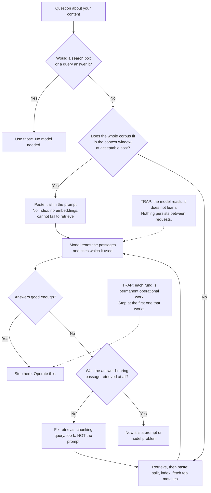

# Do You Need RAG? Context Windows, Grounding and the Cheapest Thing That Works

**Level:** Beginner
**Tree:** [Applied AI Systems](../README.md)
**Branch:** [RAG & Knowledge Systems](README.md)
**Forest:** [AI & Intelligent Systems](../../../README.md)

## Explanation

### The model has not read your documents, and never will

A foundation model was trained on public text up to a cutoff date. It has not seen your
contracts, your runbooks or last week's incident report, and no amount of asking will
change that. There are four ways to get your content into an answer: **paste it into the
prompt, retrieve the relevant part and paste that (RAG), tune the model on it, or do not
use a model at all** and let a search box or a database answer. They differ by orders of
magnitude in what you must then operate forever. Picking a rung before understanding the
ladder is how teams end up running a vector database for eleven documents.

### Context windows changed the answer, and most advice has not caught up

RAG became standard practice when models could hold a few thousand words. Current models
hold the equivalent of a few hundred pages, which means **for a genuinely small corpus,
"paste the whole thing" is now a correct engineering answer**, not a beginner's
shortcut. It has no index to keep fresh, no embedding model to version, no retrieval
quality to measure, and it cannot fail to retrieve. The honest test is arithmetic: if
your entire corpus fits in the window with room for the question and the answer, and the
per-query cost is acceptable, you do not need retrieval yet.

### Grounding is reading, not learning

This is the idea beginners most often have backwards. When you put a document in the
prompt, **the model does not learn it - it reads it, for that one request, and forgets
it**. Nothing is stored and the next request starts blank, so asking it to "remember"
does not work. Two consequences follow. The model can quote and cite exactly which
passage it used, so the answer is checkable in a way a trained-in fact never is. And
because nothing was stored, correcting the corpus fixes the next answer immediately.

### Retrieval quality is the ceiling on answer quality

Once you do add retrieval, one rule dominates everything else: **the model cannot answer
from a passage that was not retrieved.** If the chunk containing the answer never made
it into the prompt, the model will either say it does not know or, worse, produce a
confident answer from general knowledge. Beginners debug this by changing the prompt or
the model, because the symptom looks like a model failure. It almost never is. Before
touching either, look at what was actually retrieved - most "the AI is wrong" reports
are retrieval failures wearing a disguise.

### Chunking is a trade-off you cannot avoid

Documents are split before retrieval, because fetching an entire 200-page manual defeats
the point. The split is a real trade-off: **small chunks retrieve precisely but lose the
context that made them meaningful**, while large chunks carry context but dilute the
match and crowd the window. A table split from its caption, or a clause split from its
definition, produces a technically-retrieved passage that is useless. There is no
universally right size, only measuring whether the answer-bearing passage arrives
intact.

### Climb the ladder, and stop at the first rung that works

Each rung costs more to operate than the one below: a search box is already in your
estate, retrieval adds an index and an embedding model to version and monitor, and
tuning adds a training pipeline and an artifact to govern. **Start at the bottom and
stop as soon as the answers are good enough**, because every rung is permanent
operational work - and adding retrieval to a working prompt later is far easier than
removing a vector database from a system built around it before anyone checked.

## Architecture and flow



## Commands

### Command 1

Measure the corpus before designing anything - the whole decision starts as arithmetic

```text
wc -w docs/*.md | tail -1
```

### Command 2

Convert words to a rough token count, since context windows are measured in tokens

```text
python -c "import sys; w=int(sys.argv[1]); print(f'~{int(w*1.3):,} tokens')" 120000
```

### Command 3

Ask the question with the whole document pasted in, as the baseline every other approach must beat

```text
curl -s "$ENDPOINT/v1/messages" -H "x-api-key: $KEY" -H "content-type: application/json" -d "{\"model\":\"$MODEL\",\"max_tokens\":1024,\"messages\":[{\"role\":\"user\",\"content\":\"$(jq -Rs . < corpus.txt)\n\nQuestion: $Q\"}]}" | jq -r ".content[0].text"
```

### Command 4

Read the token usage back, because the per-query cost is what decides whether pasting scales

```text
jq -r ".usage | \"input=\(.input_tokens) output=\(.output_tokens)\"" response.json
```

### Command 5

Inspect what retrieval actually returned before blaming the model for the answer

```text
jq -r ".retrieved[] | [.score, .doc_id, (.text[0:80])] | @tsv" query-trace.json
```

### Command 6

Check whether the answer-bearing passage survived chunking intact

```text
grep -n "$KNOWN_ANSWER_PHRASE" chunks/*.txt | head
```

## Automation scripts

### rung_check.py

The RAG-or-not decision is usually made by reputation rather than measurement. This
sizes the corpus against a model's context window, prices both approaches at your actual
query volume, and names the rung - so the choice is arithmetic rather than a preference.

```python
#!/usr/bin/env python3
"""Decide whether a corpus needs retrieval, or just fits in the prompt.

Sizes a document set against a context window and compares the monthly cost
of pasting everything per query against retrieving a few passages. Prints the
cheapest rung that works, and what it would cost to skip past it.
"""
import argparse
import sys
from pathlib import Path

# Rough, deliberately conservative: real tokenisers vary by language and format.
TOKENS_PER_WORD = 1.35

def corpus_tokens(root, patterns):
    total, files = 0, 0
    for pattern in patterns:
        for path in Path(root).rglob(pattern):
            if not path.is_file():
                continue
            try:
                words = len(path.read_text(errors="ignore").split())
            except OSError:
                continue
            total += words * TOKENS_PER_WORD
            files += 1
    return int(total), files

def main():
    parser = argparse.ArgumentParser()
    parser.add_argument("corpus")
    parser.add_argument("--window", type=int, default=200_000,
                        help="model context window in tokens")
    parser.add_argument("--reserve", type=int, default=8_000,
                        help="tokens kept back for the question and the answer")
    parser.add_argument("--queries-per-month", type=int, default=10_000)
    parser.add_argument("--input-cost", type=float, default=3.0,
                        help="cost per million input tokens")
    parser.add_argument("--retrieved-tokens", type=int, default=4_000,
                        help="tokens of retrieved context per query under RAG")
    parser.add_argument("--patterns", nargs="+", default=["*.md", "*.txt"])
    args = parser.parse_args()

    tokens, files = corpus_tokens(args.corpus, args.patterns)
    usable = args.window - args.reserve
    fits = tokens <= usable

    per_million = args.input_cost / 1_000_000
    paste_cost = tokens * args.queries_per_month * per_million
    rag_cost = args.retrieved_tokens * args.queries_per_month * per_million

    print(f"corpus          : {files} files, ~{tokens:,} tokens")
    print(f"usable window   : {usable:,} tokens ({args.window:,} less {args.reserve:,})")
    print(f"fits in context : {'yes' if fits else 'no'}")
    print(f"paste-everything: ${paste_cost:,.0f}/month at {args.queries_per_month:,} queries")
    print(f"retrieval       : ${rag_cost:,.0f}/month, plus an index to operate")

    if not fits:
        print(
            f"\nRUNG: retrieval. The corpus is {tokens / usable:.1f}x the usable window, "
            "so it cannot be pasted. Measure retrieval quality before answer quality."
        )
        return 0

    # Caching changes this materially; say so rather than pricing a strawman.
    if paste_cost <= rag_cost * 3:
        print(
            "\nRUNG: paste it. It fits, and the cost gap does not justify an index, "
            "an embedding model and a retrieval quality problem you would then own. "
            "Prompt caching narrows this gap further when the corpus is stable."
        )
    else:
        print(
            f"\nRUNG: borderline. It fits, but pasting costs {paste_cost / rag_cost:.0f}x "
            "retrieval at this volume. Start by pasting to establish a quality baseline, "
            "then add retrieval as a cost optimisation you can measure against it."
        )
    return 0

if __name__ == "__main__":
    sys.exit(main())
```

## Lab

**Objective:** Decide between pasting and retrieving for one real corpus by measuring rather than assuming, then prove the rule that retrieval quality caps answer quality.

### Steps

1. Choose a real document set you have questions about, and write down five questions with answers you already know.
2. Size the corpus with `rung_check.py` against your model's context window and record which rung it names.
3. Establish the baseline: paste the whole corpus into the prompt and answer all five questions, recording token usage per query.
4. Score the baseline answers against the answers you knew, and record the per-query cost alongside.
5. Split the corpus into chunks and build a simple retrieval step that fetches the top matches for a question.
6. Answer the same five questions through retrieval, logging which passages were retrieved for each.
7. For any wrong answer, check first whether the answer-bearing passage was retrieved at all before changing the prompt or the model.
8. Deliberately break one chunk boundary - split a table from its caption, or a clause from its definition - and observe the effect on that question.
9. Compare the two approaches on answer quality, per-query cost, and what each requires you to operate.
10. Write down which rung you are choosing and the measurement that justifies it.

### Validation

- The corpus is sized in tokens against the context window, and the paste-versus-retrieve decision cites that number rather than a preference.
- A pasted-prompt baseline exists with recorded per-query token usage, and every later approach is compared against it.
- For each wrong answer, the retrieved passages are inspected first, and the failure is classified as retrieval or generation before any fix is attempted.
- At least one wrong answer is shown to be a retrieval failure, with the answer-bearing passage absent from what was retrieved.
- The deliberately broken chunk changes the answer to its question, demonstrating that chunking is a correctness concern rather than a tuning knob.
- The chosen rung is written down with the measurement behind it, including what the next rung up would cost to operate.

## Operational automation

### Keeping the decision honest as things change

- **Re-run the sizing when the corpus or the model changes.** Both move: documents are
  added, and context windows grow. A retrieval stack built when the corpus was ten times
  the window may now be infrastructure you no longer need, and nobody notices because
  nobody re-checks.
- **Keep the pasted-prompt baseline as a regression test.** It is the simplest correct
  system you have. Without it you cannot tell whether retrieval is helping or merely
  running.
- **Log what was retrieved for every query, not just the answer.** This single habit
  decides whether "the AI was wrong" takes ten minutes or two days, because it separates
  retrieval failures from generation failures immediately.
- **Measure retrieval before measuring answers.** Ask how often the answer-bearing
  passage appears in the retrieved set at all. If that number is poor, no prompt
  engineering will rescue the answers, and time spent there is wasted.
- **Re-index on a schedule tied to how fast the corpus changes.** A stale index answers
  confidently from deleted or superseded documents, and nothing in the output reveals
  it.
- **Use prompt caching before adding an index.** Where the corpus is stable and fits,
  caching cuts the cost of pasting substantially, which often removes the only remaining
  argument for retrieval. It is a configuration change rather than a system to operate.

## Troubleshooting

### Scenario 1: The assistant says it cannot find something that is definitely in the documents.

**Likely cause:** Retrieval did not return the passage. The model answers only from what reached the prompt, so an unretrieved document does not exist as far as it is concerned.

**Resolution:** Look at the retrieved passages for that query before changing anything else. Confirm the diagnosis by pasting the correct passage in by hand and asking again: a correct answer proves the model and prompt are fine and the fault is in retrieval. Then work on chunking, the query, or how many results you fetch - not on the wording of the prompt.

### Scenario 2: The answer is confident and wrong, and cites nothing.

**Likely cause:** Nothing relevant was retrieved, so the model fell back on general knowledge from training rather than saying it did not know.

**Resolution:** Instruct the model to answer only from the supplied passages and to say when they do not contain the answer, then verify it actually refuses when given irrelevant context. Confirm it by checking whether the retrieved set was empty or off-topic. A system that cannot say "not in the documents" fabricates at exactly the moment retrieval fails.

### Scenario 3: A question about a table or a defined term gets a nonsense answer.

**Likely cause:** Chunking split the content from what made it meaningful - the table from its caption and column headers, or the clause from the definition it relies on.

**Resolution:** Check whether the retrieved chunk is intelligible on its own, reading it as the model receives it. If it is not, the fix is at the splitting stage: respect document structure rather than cutting at a fixed character count, and overlap chunks so context carries across the boundary. This is invisible in retrieval scores: the chunk matched the query perfectly well.

### Scenario 4: The proof of concept was fast and the production system is slow and expensive.

**Likely cause:** The prototype pasted a handful of documents, and the same approach was carried to a corpus hundreds of times larger without re-running the arithmetic.

**Resolution:** Re-size the corpus against the window and price both rungs at real query volume, which is what `rung_check.py` does. Confirm the diagnosis from token usage per query: input tokens growing with the corpus rather than staying flat means everything is being pasted. This is the one direction where moving up a rung is clearly right, and the trigger is a number rather than a feeling.

### Scenario 5: Answers reference a document that was deleted weeks ago.

**Likely cause:** The index still holds it. Deleting the source file does not remove its embeddings, and retrieval has no idea the original is gone.

**Resolution:** Make deletion a first-class operation in the indexing pipeline rather than relying on periodic rebuilds, and reconcile index contents against the source of truth on a schedule. Confirm the diagnosis by querying the index directly for the removed document. A system answering from withdrawn documents is a compliance finding, not a bug report.

## Interview questions

### 1. A team wants to build RAG over forty internal documents. What do you ask first?

How big is that in tokens, and what does a query cost if we just paste the lot. Forty documents is plausibly well inside a current context window, and if it fits, pasting is not a shortcut - it is the simplest correct system. It has no index to keep fresh, no embedding model to version, no retrieval quality to measure, and it cannot fail to retrieve, which removes the single largest source of RAG failures before it exists. So I build the pasted version first, answer real questions with it, and treat that as the quality baseline. Retrieval then has to earn its place by beating that baseline on cost, latency or quality. The reason I push on this is that the rung you choose is permanent operational work: adding retrieval to a working prompt later is easy, while removing a vector database from a system designed around it is a rewrite.

### 2. Someone reports "the AI gave a wrong answer". How do you investigate?

I look at what was retrieved before I look at anything else, because most of these are retrieval failures wearing a model failure's clothes. The model can only answer from what reached the prompt, so if the answer-bearing passage was never fetched, no prompt change and no better model will fix it. The fastest test is to paste the correct passage in by hand and ask again: if the answer is now right, the generation side is fine and the fault is in chunking, the query or how many results are fetched. If it is still wrong with the right passage in front of it, it is genuinely a prompt or model problem - the rarer case. This is why I log retrieved passages alongside every answer: without them the investigation starts with guesswork and usually lands on rewriting the prompt, which changes nothing.

### 3. What does "grounding" actually mean, and what does it not mean?

Grounding means the model answers from text you placed in front of it rather than from what it absorbed in training. The crucial part is that it reads that text for one request and forgets it - nothing is stored and nothing is learned. Two things follow that people get wrong. First, you cannot ask it to remember a document from an earlier conversation; if the text is not in this request, it is not available, which is why "I told it yesterday" is never an explanation. Second, because the passage was present, the model can cite exactly what it used, so the answer is checkable against a source - which is a stronger guarantee than anything a trained-in fact offers. It also means corrections are immediate: fix the document and the next answer is right, with no retraining involved.

### 4. When is RAG the wrong tool entirely?

When something simpler already answers the question. If a user wants "the invoices over ten thousand from last quarter", that is a database query, and wrapping it in retrieval makes it slower, more expensive and less reliable than a WHERE clause. If they want to find a document by name, a search box already does that well and returns the document rather than a paraphrase of it. RAG earns its place when the question requires synthesis across passages and the answer is not retrievable as a single record. It is also wrong when the requirement is behavioural rather than factual: answers that are correct but too long or badly formatted are a prompt or tuning problem, and retrieval addresses neither. The check I apply is whether the answer exists somewhere as a fact to be looked up - in which case, look it up.

## Certification alignment

- **Microsoft Certified: Azure AI Fundamentals (AI-901)** - Identify AI concepts and capabilities: grounding as reading rather than learning, context windows, and why a model cannot answer from content it was never given.
- **Microsoft Certified: Azure AI Apps and Agents Developer Associate (AI-103)** - Implement generative AI and agentic solutions: grounding answers on your own content by pasting the corpus or retrieving passages, and chunking so the answer-bearing passage arrives intact.
- **AWS Certified AI Practitioner** - Domain 3: Applications of Foundation Models: choosing between pasting content into the prompt, retrieval and tuning, and pricing pasting against retrieval at real query volume.
- **Google Cloud Professional Machine Learning Engineer** - grounding generative applications on enterprise data sources.
- **Vendor-neutral** - NIST AI RMF MAP function: framing the problem and establishing whether AI is the right approach.

## References

- Azure AI Search documentation - retrieval-augmented generation patterns, chunking and indexing
- Anthropic documentation - context windows, long-context prompting and prompt caching
- OpenAI documentation - retrieval, embeddings and when to use each
- Original RAG paper (Lewis et al., 2020) - the retrieval-then-generate formulation this all descends from
- NIST AI Risk Management Framework (AI 100-1) - MAP function, including problem framing and alternatives

## Suggested video search

RAG versus long context window grounding chunking retrieval quality when you do not need a vector database beginner

---

> Validate commands, versions, permissions, licensing, and rollback procedures in an isolated lab before production use.
