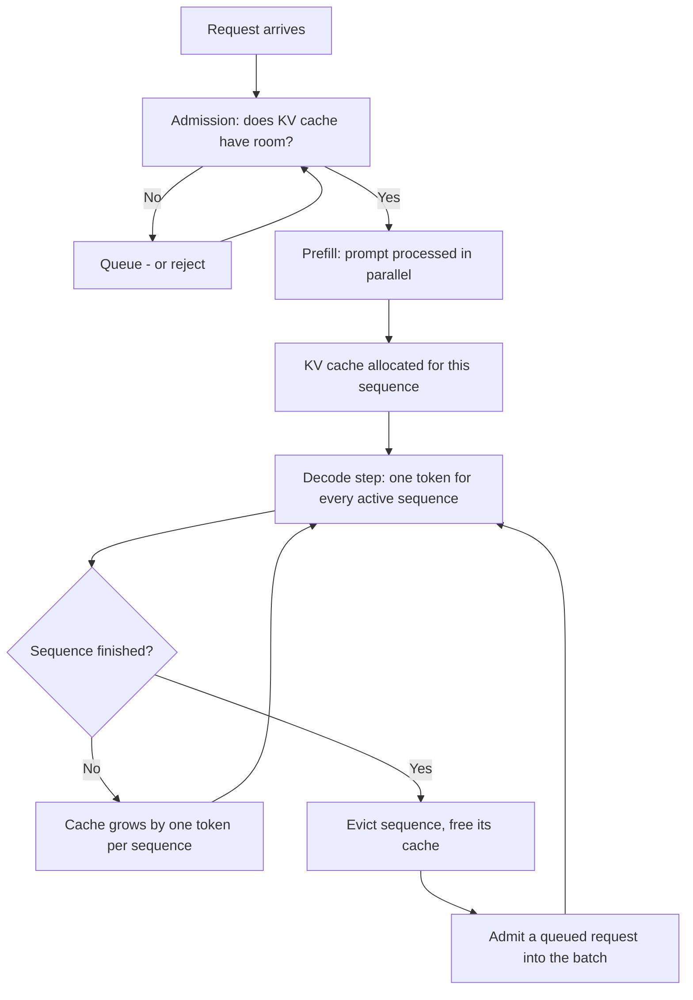

# Local Inference at Production Scale: Batching, KV Cache and the Point It Stops Being Cheaper

**Level:** Advanced
**Tree:** [Running and Integrating Models](../README.md)
**Branch:** [Local and Private Inference](README.md)
**Forest:** [AI & Intelligent Systems](../../../README.md)

## Explanation

A local model that answers in 300ms for you will not answer in 300ms for forty
people. That sentence is the whole leaf. The benchmark everyone runs first -
one prompt, one stream, stopwatch - measures the one condition production never
has, and the number it produces is not merely optimistic, it is measuring a
different system.

### Prefill and decode are different machines

A generation request has two phases with opposite bottlenecks. Prefill consumes
the prompt: every input token is processed in parallel, the GPU's arithmetic
units saturate, and the phase is compute-bound. Decode then emits one token at
a time, and each token requires reading the entire weight set out of memory to
produce a single value. Decode is memory-bandwidth-bound, and the arithmetic
units sit largely idle.

This is why a GPU showing 95% "utilisation" during decode may be delivering a
fraction of its arithmetic capability - the metric reports that kernels are
resident, not that they are doing useful arithmetic. It is also why the two
phases respond to different fixes. A slow first token is a prefill problem:
shorter prompts, prefix caching, more compute. Slow tokens after the first are
a decode problem: higher memory bandwidth, a smaller model, quantisation, or
more requests batched together to amortise each weight read.

Users experience these as separate products. Time-to-first-token is felt as
responsiveness; inter-token latency is felt as reading speed. A system that
fixes the wrong one improves a number nobody was complaining about.

### Batching is the only real throughput lever

Because decode re-reads the weights for every token, generating for one request
and generating for thirty cost almost the same memory traffic. Batching is
therefore close to free throughput until something else runs out - which is the
single most important economic fact about self-hosting.

Static batching, where the server waits for a fixed number of requests and
returns them together, is superseded and should not be built new: the whole
batch runs until its longest member finishes, so one 2,000-token answer holds
twenty 50-token answers hostage. Continuous batching (also called in-flight
batching) evicts finished sequences each step and admits waiting ones, keeping
the batch full. Every current serving stack - vLLM, TGI, TensorRT-LLM, SGLang -
implements some form of it. If your throughput plan assumes static batching, it
is measuring a design nobody ships.

### The KV cache is what actually runs out

Weights occupy a fixed amount of memory. The KV cache does not: it grows with
concurrency multiplied by sequence length, and it is where a local deployment
dies. The arithmetic is worth internalising, because it converts a vague fear
into a capacity number:

```text
bytes_per_token = 2 (K and V) x layers x kv_heads x head_dim x dtype_bytes
cache_per_request = bytes_per_token x (prompt_tokens + generated_tokens)
max_concurrency  = (vram - weights - activations) / cache_per_request
```

For a 7B model in FP16 with 32 layers and 4,096 context, that lands near 2GB of
cache per fully-extended request. On a 24GB card holding ~14GB of weights, the
honest concurrency ceiling is four or five - not the thirty the throughput curve
implied. Grouped-query attention, which shares K/V across query heads, is the
main reason modern models are servable at all; it cuts that term by the
head-sharing ratio.

Two consequences follow. First, your effective capacity depends on prompt
length, so a change in prompt template is a capacity change. Second, quantising
weights buys less than expected at high concurrency - it frees fixed memory
while the growing term is untouched. KV cache quantisation is the lever that
matches the problem.

### Utilisation, not price per token, decides build versus buy

The comparison people make is cost per million tokens, local against API. It is
the wrong comparison because it implicitly assumes the GPU is busy. A rented
A100 costs the same overnight as at midday; an API costs nothing when idle. So
the real question is what fraction of the hour your hardware is working.

Set it up as a break-even: divide the hourly cost of the instance by the API's
price per token, and you get the number of tokens per hour you must genuinely
serve before local is cheaper. Compare that with your measured sustained
throughput, not your peak. Most internal tools - a support assistant used during
business hours by one region - fall far below the line, and the honest
recommendation is an API. Batch workloads that can run a queue at high
occupancy overnight are usually above it. Between those, the deciding factors
are rarely financial: data residency, air-gap requirements, and latency floors
that a network round trip cannot meet.

## Architecture and flow



## Commands

### Command 1

Weights are only part of the memory story; this shows what is actually resident
while the server is idle, which is your fixed cost before any request arrives.

```text
nvidia-smi --query-gpu=memory.used,memory.total,utilization.gpu --format=csv
```

### Command 2

Serve with an explicit cache budget rather than the default. Pinning the
fraction makes capacity a decision you made instead of one the library made.

```text
vllm serve <model> --gpu-memory-utilization 0.90 --max-model-len 4096
```

### Command 3

The server's own metrics distinguish queue time from generation time. A rising
queue with flat generation latency means admission is the bottleneck, not speed.

```text
curl -s localhost:8000/metrics | grep -E 'num_requests|time_to_first_token|gpu_cache_usage'
```

### Command 4

A concurrency sweep is the only benchmark worth quoting. Single-stream numbers
describe a condition production never has.

```text
vllm bench serve --model <model> --num-prompts 200 --request-rate 8
```

### Command 5

Decode is memory-bandwidth-bound, so bandwidth saturation - not compute - is the
ceiling to watch. This samples what the arithmetic units are actually doing.

```text
nvidia-smi dmon -s um -d 1 -c 60
```

### Command 6

Prefix caching reuses the KV entries of a shared prompt prefix across requests.
Where a long system prompt is common to every call, this removes it from both
the prefill bill and the cache budget.

```text
vllm serve <model> --enable-prefix-caching --max-num-seqs 64
```

## Automation scripts

### capacity_probe.py

Requires `pip install requests`.

```python
#!/usr/bin/env python3
"""Find the concurrency a local endpoint actually sustains, and price it.

Deliberately refuses to report a bare tokens-per-second figure. That number is
the one that misleads: it is quoted from a single-stream run and then used to
plan for forty users. Every throughput result here is reported with the
concurrency that produced it, or not at all.
"""
import argparse
import statistics
import time
from concurrent.futures import ThreadPoolExecutor

import requests

# A first token later than this reads as broken rather than slow. Raise it for
# batch work; lower it for anything a person waits on.
TTFT_BUDGET_S = 1.5

def one_request(url: str, model: str, prompt: str, max_tokens: int) -> dict:
    """Return time to first token and total time for a single stream."""
    started = time.perf_counter()
    first = None
    tokens = 0
    response = requests.post(
        url,
        json={"model": model, "prompt": prompt, "max_tokens": max_tokens, "stream": True},
        stream=True,
        timeout=120,
    )
    for line in response.iter_lines():
        if not line or line == b"data: [DONE]":
            continue
        if first is None:
            first = time.perf_counter() - started
        tokens += 1
    return {"ttft": first or 0.0, "total": time.perf_counter() - started, "tokens": tokens}

def sweep(url: str, model: str, prompt: str, max_tokens: int, levels: list[int]) -> list[dict]:
    rows = []
    for concurrency in levels:
        with ThreadPoolExecutor(max_workers=concurrency) as pool:
            started = time.perf_counter()
            results = list(pool.map(
                lambda _: one_request(url, model, prompt, max_tokens), range(concurrency)
            ))
            wall = time.perf_counter() - started
        ttfts = sorted(r["ttft"] for r in results)
        rows.append({
            "concurrency": concurrency,
            "p50_ttft": statistics.median(ttfts),
            "p95_ttft": ttfts[min(len(ttfts) - 1, int(len(ttfts) * 0.95))],
            "throughput": sum(r["tokens"] for r in results) / wall,
        })
    return rows

def main() -> None:
    parser = argparse.ArgumentParser()
    parser.add_argument("--url", default="http://localhost:8000/v1/completions")
    parser.add_argument("--model", required=True)
    parser.add_argument("--max-tokens", type=int, default=128)
    parser.add_argument("--gpu-cost-hour", type=float, required=True,
                        help="What this instance costs per hour, idle or not.")
    parser.add_argument("--api-cost-mtok", type=float, required=True,
                        help="Output price per million tokens of the API you would use instead.")
    args = parser.parse_args()

    prompt = "Summarise the following incident report in three sentences: " + ("lorem ipsum " * 200)
    rows = sweep(args.url, args.model, prompt, args.max_tokens, [1, 2, 4, 8, 16, 32])

    print(f"{'conc':>5} {'p50 TTFT':>9} {'p95 TTFT':>9} {'tok/s':>9}  within budget")
    usable = None
    for row in rows:
        ok = row["p95_ttft"] <= TTFT_BUDGET_S
        if ok:
            usable = row
        print(f"{row['concurrency']:>5} {row['p50_ttft']:>8.2f}s {row['p95_ttft']:>8.2f}s "
              f"{row['throughput']:>9.1f}  {'yes' if ok else 'NO'}")

    if usable is None:
        print(f"\nNo concurrency level held p95 TTFT under {TTFT_BUDGET_S}s. "
              "The endpoint is not servable at this budget; reduce context or model size.")
        return

    # Break-even is a utilisation question. The GPU bills whether or not it works.
    tokens_per_hour = usable["throughput"] * 3600
    break_even = args.gpu_cost_hour / (args.api_cost_mtok / 1_000_000)
    print(f"\nSustained at concurrency {usable['concurrency']}: {tokens_per_hour:,.0f} tokens/hour")
    print(f"Break-even against the API:  {break_even:,.0f} tokens/hour")
    if tokens_per_hour < break_even:
        need = break_even / tokens_per_hour * 100
        print(f"Local is more expensive unless the endpoint runs at {need:.0f}% of this "
              "rate continuously. Below that, the API is cheaper and the GPU is idle capacity "
              "you are paying for.")
    else:
        print("Local is cheaper at full occupancy. Confirm your real duty cycle before "
              "committing - this assumes the endpoint stays this busy.")

if __name__ == "__main__":
    main()
```

## Lab

**Objective:** Establish the concurrency your hardware actually sustains within a
latency budget, show that the KV cache is the binding constraint, and decide
build-versus-buy on measured utilisation rather than price per token.

### Steps

1. Serve a 7B-class model with `--gpu-memory-utilization 0.90` and record idle VRAM.
2. Compute the predicted per-request cache cost from the model's layer count, KV heads and head dimension.
3. Divide the free VRAM by that figure to predict a concurrency ceiling. Write the number down before testing.
4. Run `capacity_probe.py` across the concurrency sweep with a realistic prompt length.
5. Record where p95 time-to-first-token crosses the budget, and compare that concurrency with your prediction.
6. Re-run with a prompt four times longer, holding everything else constant.
7. Re-run the original prompt with `--enable-prefix-caching` and a shared system prefix.
8. Sample `nvidia-smi dmon` during a sustained decode to observe bandwidth against compute.
9. Feed your real instance cost and API price into the probe's break-even output.
10. Repeat the sweep with a quantised build and note where the ceiling moves - and where it does not.

### Validation

- A recorded concurrency at which p95 TTFT crosses the budget, and the throughput measured at that exact level.
- A predicted cache ceiling and a measured one, with the gap between them explained.
- Sweep output at two prompt lengths showing capacity falling as prompts grow.
- A dmon sample from decode showing memory utilisation high while compute utilisation is not.
- A break-even figure in tokens per hour, next to your measured sustained rate, with the build-or-buy call written down.

## Operational automation

### Running this as a service rather than an experiment

- **Alert on queue depth and cache occupancy, not GPU utilisation.** GPU utilisation reads high during decode regardless of throughput; queue depth and `gpu_cache_usage` are the metrics that move before users notice.
- **Make max context a deployment parameter with a stated capacity cost.** Raising `--max-model-len` silently lowers concurrency. If the number can be changed without review, capacity changes without anyone deciding to change it.
- **Re-run the sweep on every model, quantisation or serving-version change.** Throughput characteristics are not portable across any of the three; a figure carried over from the previous model is a guess.
- **Load-shed at admission rather than degrading everyone.** Rejecting or queueing past the measured ceiling keeps latency predictable for admitted requests. Accepting everything makes the whole service slow at once.
- **Track duty cycle continuously and revisit the build-versus-buy call quarterly.** The break-even moves whenever API prices fall, which they do; a decision made at last year's prices is not evidence for this year's.

## Troubleshooting

### Scenario 1: Throughput looks excellent in benchmarks but users say it is slow.

**Likely cause:** The benchmark reports aggregate tokens per second across a full batch, while each individual user experiences their own stream's inter-token latency, which falls as the batch grows.

**Resolution:** Report per-request percentiles alongside aggregate throughput. Confirm by running the sweep and watching p95 TTFT rise while total tokens per second also rises - both numbers are true, and only one is what the user feels.

### Scenario 2: The server crashes with out-of-memory after running fine for an hour.

**Likely cause:** KV cache growth, not a leak. Sequences that started short have generated their way into long contexts, and the cache grew with them until admission and residency collided.

**Resolution:** Check `gpu_cache_usage` over the hour rather than instantaneous free memory. Cap `--max-model-len`, cap `--max-num-seqs`, and confirm the serving stack is configured to preempt rather than crash.

### Scenario 3: Quantising the model freed VRAM but concurrency barely improved.

**Likely cause:** Quantisation reduced the fixed weight term; the term that scales with concurrency is the KV cache, which is unchanged.

**Resolution:** Apply KV cache quantisation, which targets the growing term, or reduce context length. Verify by recomputing the cache arithmetic rather than inferring from free VRAM.

### Scenario 4: First token is fast in testing, slow in production, with identical hardware.

**Likely cause:** Production prompts are longer - retrieved context, chat history, a grown system prompt - and prefill is compute-bound in prompt length.

**Resolution:** Log prompt token counts at the gateway and compare distributions. Enable prefix caching for the shared portion, and treat prompt-template changes as capacity changes requiring a re-measure.

### Scenario 5: GPU utilisation sits at 95% but throughput is far below the vendor's figures.

**Likely cause:** The metric reports kernel residency, not arithmetic throughput. During decode the arithmetic units wait on memory, and the vendor's figure was measured on a compute-bound workload.

**Resolution:** Sample achieved memory bandwidth with `dmon` or DCGM. If bandwidth is saturated and compute is not, the fix is batching, a smaller model or better hardware bandwidth - not more arithmetic capability.

## Interview questions

### 1. A team benchmarked a local model at 90 tokens per second and promised forty concurrent users. What is wrong?

The number was almost certainly measured with one stream, and single-stream throughput tells you nothing about capacity. Adding users does not divide that figure evenly, because batching amortises weight reads and aggregate throughput actually rises - while each user's experience degrades. The real ceiling is usually not speed at all but KV cache memory: capacity equals free VRAM divided by per-request cache, and per-request cache scales with context length. For a 7B model at 4K context on a 24GB card, the ceiling is commonly four or five concurrent requests, not forty. I would ask for a concurrency sweep with p95 time-to-first-token at each level, and for the prompt length used, because a longer prompt lowers the ceiling directly. Then I would ask what latency budget the forty users are promised, because capacity is meaningless without it. The promise may still be reachable - with more cards, a smaller model, quantised cache, or shorter prompts - but not from the evidence they have.

### 2. Why do prefill and decode need different optimisations?

They have opposite bottlenecks. Prefill processes all prompt tokens in parallel, saturating the arithmetic units, so it is compute-bound and scales with prompt length. Decode emits one token at a time and must read the full weight set from memory for each one, so it is memory-bandwidth-bound and scales with generated length. That means a slow first token and slow subsequent tokens are different faults with different fixes. Shortening prompts, caching shared prefixes or adding compute helps prefill and does nothing for decode. Batching, quantisation or higher-bandwidth memory helps decode and does little for prefill. Conflating them produces the classic waste: buying a card with more arithmetic capability to fix a decode problem, then finding throughput unchanged because the memory bus was the constraint all along. It also explains why GPU utilisation misleads here - during decode it reports high while the arithmetic units are largely waiting.

### 3. When is self-hosting actually cheaper than an API?

When the hardware is genuinely busy. The comparison usually made is price per million tokens, which quietly assumes full occupancy; a GPU bills identically whether it is saturated or idle, while an API bills nothing when nobody calls it. So I convert it into a utilisation question: divide the instance's hourly cost by the API's per-token price to get the tokens per hour at which they break even, then compare that with measured sustained throughput - not peak. An internal tool used by one region during business hours typically sits far below that line, and the honest answer is to use an API. A batch pipeline that can keep a queue full overnight is usually above it. Between the two, the decision is rarely financial: data residency, air-gap requirements, or a latency floor a network round trip cannot meet will decide it, and those are worth paying for explicitly rather than pretending the arithmetic favours local.

### 4. Your serving stack offers static and continuous batching. Which, and why does it matter?

Continuous batching, and the difference is large enough that static batching should be treated as superseded. Static batching collects a fixed number of requests, runs them together, and returns when the longest finishes - so a single long generation holds every short one in the batch hostage, and tail latency becomes a function of the unluckiest request in your group. Continuous batching evicts each sequence as it completes and admits a waiting one into the freed slot, keeping the batch full and decoupling each request's latency from its neighbours'. Every serving stack worth deploying implements it. The practical implication is that capacity planning built on static-batching assumptions is measuring a system nobody runs, and will both understate achievable throughput and badly mispredict tail latency. It also changes what to monitor: with continuous batching the meaningful signals are admission queue depth and cache occupancy, because those govern whether a request gets into the batch at all.

## Certification alignment

- **NVIDIA Certified Associate: AI Infrastructure and Operations** - GPU memory management and inference serving characteristics.
- **Microsoft Azure AI Engineer Associate (AI-102)** - selecting and operating model hosting options against latency and throughput requirements.
- **AWS Certified Machine Learning Engineer - Associate (MLA-C01)** - model deployment, inference optimisation and cost-aware instance selection.
- **Google Cloud Professional Machine Learning Engineer** - serving infrastructure design and scaling of online prediction.
- **Linux Foundation Certified Kubernetes Administrator (CKA)** - vendor-neutral resource requests, limits and scheduling for accelerator workloads.

## References

- NVIDIA. *TensorRT-LLM Documentation: In-Flight Batching and KV Cache Management.*
- vLLM Project. *vLLM Documentation: Paged Attention, Continuous Batching and Prefix Caching.*
- Hugging Face. *Text Generation Inference: Architecture and Performance Tuning.*
- Ainslie et al. *GQA: Training Generalized Multi-Query Transformer Models from Multi-Head Checkpoints.* arXiv:2305.13245.
- NVIDIA. *Data Center GPU Manager (DCGM) Documentation: Profiling and Bandwidth Metrics.*

## Suggested video search

vllm continuous batching kv cache paged attention throughput benchmark

---

> Validate commands, versions, permissions, licensing, and rollback procedures in an isolated lab before production use.
