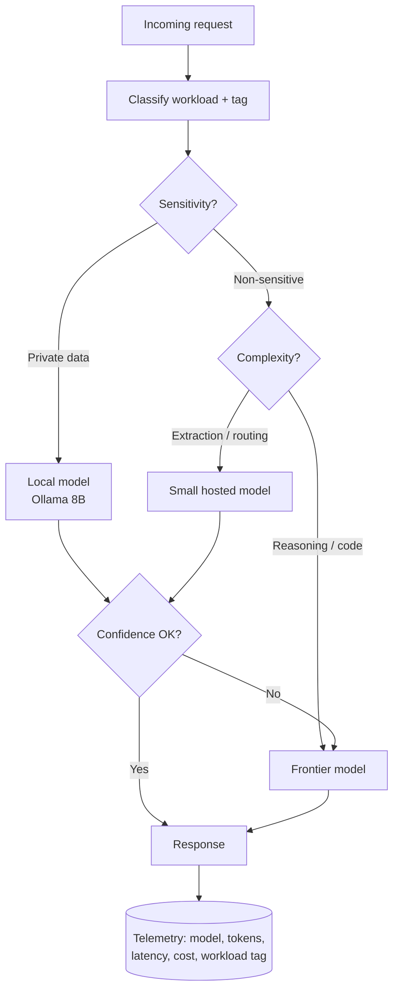

# Model Selection, Sizing and Cost Control

**Level:** Intermediate
**Tree:** [Running and Integrating Models](../README.md)
**Branch:** [Local and Private Inference](README.md)
**Forest:** [AI & Intelligent Systems](../../../README.md)
**Readiness:** [Lab](../../../READINESS.md#lab) - checked offline, not yet run against a live service. A live run needs a local Ollama server, an NVIDIA GPU and an Azure subscription.

## Explanation

Model selection is a capacity-planning exercise, not a preference. The architect's job is to map each workload to the cheapest model that clears an explicit quality bar, then prove the mapping with data.

Start by classifying workloads. **Extraction and classification** - pulling fields from a ticket, routing an alert, tagging a document - are solved well by small models in the 3-8 billion parameter range, often locally. **Summarisation and drafting** sit in the middle. **Multi-step reasoning, code generation and tool orchestration** genuinely need frontier models. Sending every request to the largest model is the single most common source of runaway AI spend, and it also costs latency.

The economics have two shapes. Hosted APIs bill per token, split into input and output, with output typically 3-5x the input price. Local inference is fixed cost per GPU hour. Crossover analysis is straightforward: compute monthly token volume, price it at the hosted rate, and compare against the amortised cost of a GPU that can serve that throughput. Steady high-volume narrow tasks favour local; spiky low-volume complex tasks favour hosted.

Three levers cut hosted cost without touching quality. **Prompt caching** discounts repeated prefixes heavily - put the long static system prompt and retrieved boilerplate first so it can be cached. **Batch processing** offers a large discount for work tolerating a delayed completion window, which covers most back-office jobs. **Routing** sends easy requests to a small model and escalates only on low confidence.

Finally, instrument before optimising. Log model, input tokens, output tokens, latency and a workload tag on every call. Without that dimension you cannot attribute spend, and cost control degenerates into guesswork and blanket rate limits that frustrate users.

## Architecture and flow



## Commands

### Command 1

List Azure OpenAI model deployments with SKU and capacity for a cost review.

```text
az cognitiveservices account deployment list -g rg-ai -n aoai-prod -o table
```

### Command 2

Create a deployment with an explicit tokens-per-minute capacity to cap spend. Newer small models reach Global Standard first; it may process prompts outside the account's region, so use it only where data residency allows.

```text
az cognitiveservices account deployment create -g rg-ai -n aoai-prod --deployment-name chat-small --model-name gpt-5.4-mini --model-version 2026-03-17 --model-format OpenAI --sku-name GlobalStandard --sku-capacity 50
```

### Command 3

Pull hourly input and output token metrics as the raw input to a chargeback report.

```text
az monitor metrics list --resource $AOAI_ID --metric ProcessedPromptTokens GeneratedTokens --interval PT1H
```

### Command 4

Extract actual billed Azure OpenAI usage for the month.

```text
az consumption usage list --start-date 2026-06-01 --end-date 2026-06-30 --query "[?contains(instanceName,'aoai')]" -o table
```

### Command 5

Measure local tokens per second, the throughput number that drives crossover analysis.

```text
ollama run llama3.1:8b --verbose
```

### Command 6

Throttle a deployment by re-applying it at lower TPM capacity as an emergency cost brake. The CLI has no deployment update command; create with the same name, model and SKU replaces the capacity.

```text
az cognitiveservices account deployment create -g rg-ai -n aoai-prod --deployment-name chat-small --model-name gpt-5.4-mini --model-version 2026-03-17 --model-format OpenAI --sku-name GlobalStandard --sku-capacity 10
```

### Command 7

Sample GPU utilisation to size local inference capacity honestly.

```text
nvidia-smi --query-gpu=utilization.gpu,memory.used,memory.total --format=csv -l 5
```

### Command 8

Send request-level logs to Log Analytics so spend can be attributed per application.

```text
az monitor diagnostic-settings create --name aoai-logs --resource $AOAI_ID --workspace $LAW_ID --logs "[{category:RequestResponse,enabled:true}]"
```

### Command 9

Grant the identity that runs the harness the least-privilege inference role on the account, so it calls with a Microsoft Entra ID token instead of an API key. It does not cover deployment create or list, which are control-plane calls needing a role such as Cognitive Services Contributor; the assignment can take up to five minutes to apply.

```text
az role assignment create --assignee <principal-object-id> --role "Cognitive Services OpenAI User" --scope $AOAI_ID
```

## Automation scripts

### Model routing cost and quality comparison harness

The Azure candidates authenticate with Microsoft Entra ID - az login on a laptop, managed identity on an Azure host - and require `pip install azure-identity`; the Ollama candidate needs only the standard library. If a key is unavoidable, keep it in Key Vault and read it at runtime, never in an environment file or the repository.

```python
#!/usr/bin/env python3
"""Run one evaluation set against several candidate models and report
cost, latency and agreement with reference answers.

Use the output to justify routing decisions with numbers rather than opinion.
"""
import csv
import json
import os
import statistics
import sys
import time
import urllib.request

# Price per 1M tokens (input, output) in USD, for your region and deployment
# type. Left blank on purpose: prices change and differ by region, so copy them
# from the current Azure OpenAI pricing page rather than trusting a number
# printed in a lesson. Azure keys are deployment names, not model names.
CANDIDATES = {
    "local:llama3.1:8b": {"price": (0.0, 0.0), "endpoint": "ollama"},
    "chat-small": {"price": None, "endpoint": "azure"},  # e.g. gpt-5.4-mini
    "chat-large": {"price": None, "endpoint": "azure"},  # e.g. gpt-5.1
}

OLLAMA = os.environ.get("OLLAMA_HOST", "http://127.0.0.1:11434")
AOAI = os.environ.get("AZURE_OPENAI_ENDPOINT", "")
_TOKEN_PROVIDER = None


def load_evalset(path):
    if not os.path.exists(path):
        print("ERROR: evaluation set not found: %s" % path)
        sys.exit(2)
    with open(path, encoding="utf-8") as fh:
        rows = list(csv.DictReader(fh))
    for r in rows:
        if "prompt" not in r or "expected" not in r:
            print("ERROR: CSV needs columns: prompt, expected")
            sys.exit(2)
    return rows


def post(url, payload, headers, timeout=180):
    req = urllib.request.Request(url, data=json.dumps(payload).encode(),
                                 headers=headers)
    with urllib.request.urlopen(req, timeout=timeout) as resp:
        return json.loads(resp.read().decode())


def call_ollama(model, prompt):
    body = {"model": model.split(":", 1)[1], "prompt": prompt, "stream": False}
    out = post(OLLAMA + "/api/generate", body,
               {"Content-Type": "application/json"})
    return (out.get("response", ""),
            out.get("prompt_eval_count", 0),
            out.get("eval_count", 0))


def aoai_token():
    """Short-lived Entra ID token for Azure OpenAI - no API key. Imported
    lazily so an Ollama-only run needs no azure-identity install."""
    global _TOKEN_PROVIDER
    if _TOKEN_PROVIDER is None:
        try:
            from azure.identity import DefaultAzureCredential, get_bearer_token_provider
        except ImportError:
            raise RuntimeError("Azure candidates need azure-identity: "
                               "pip install azure-identity") from None
        _TOKEN_PROVIDER = get_bearer_token_provider(
            DefaultAzureCredential(), "https://ai.azure.com/.default")
    return _TOKEN_PROVIDER()


def call_azure(model, prompt):
    if not AOAI:
        raise RuntimeError("AZURE_OPENAI_ENDPOINT not set")
    url = "%s/openai/v1/chat/completions" % AOAI.rstrip("/")
    body = {"model": model, "messages": [{"role": "user", "content": prompt}],
            # Reasoning models - the GPT-5 family - reject temperature and max_tokens;
            # the cap is max_completion_tokens, and it counts reasoning tokens too,
            # so an empty answer means the cap is too low for the effort used.
            "max_completion_tokens": 512}
    out = post(url, body, {"Content-Type": "application/json",
                           "Authorization": "Bearer " + aoai_token()})
    usage = out.get("usage", {})
    text = out["choices"][0]["message"]["content"]
    return (text, usage.get("prompt_tokens", 0),
            usage.get("completion_tokens", 0))


def score(answer, expected):
    """Cheap deterministic proxy: token overlap. Replace with an LLM judge
    or exact-match on structured fields for production decisions."""
    a = set(answer.lower().split())
    e = set(expected.lower().split())
    return len(a & e) / len(e) if e else 0.0


def evaluate(model, cfg, rows):
    latencies, scores, cost = [], [], 0.0
    p_in, p_out = cfg["price"]
    for row in rows:
        start = time.time()
        try:
            if cfg["endpoint"] == "ollama":
                text, tin, tout = call_ollama(model, row["prompt"])
            else:
                text, tin, tout = call_azure(model, row["prompt"])
        except Exception as exc:
            print("  %s: request failed: %s" % (model, exc))
            continue
        latencies.append(time.time() - start)
        scores.append(score(text, row["expected"]))
        cost += (tin / 1e6) * p_in + (tout / 1e6) * p_out
    if not latencies:
        return None
    return {
        "model": model,
        "n": len(latencies),
        "quality": round(statistics.mean(scores), 3),
        "p50_latency_s": round(statistics.median(latencies), 2),
        "p95_latency_s": round(sorted(latencies)[int(len(latencies) * 0.95) - 1], 2),
        "usd_per_1k_requests": round(cost / len(latencies) * 1000, 2),
    }


def main():
    path = sys.argv[1] if len(sys.argv) > 1 else "evalset.csv"
    rows = load_evalset(path)
    unpriced = [m for m, cfg in CANDIDATES.items() if cfg["price"] is None]
    if unpriced:
        print("ERROR: fill in current prices for: %s" % ", ".join(unpriced))
        sys.exit(2)
    print("Evaluating %d prompts against %d candidates\n" % (len(rows), len(CANDIDATES)))

    results = []
    for model, cfg in CANDIDATES.items():
        print("Running %s ..." % model)
        res = evaluate(model, cfg, rows)
        if res:
            results.append(res)

    results.sort(key=lambda r: (-r["quality"], r["usd_per_1k_requests"]))
    print("\n%-24s %6s %8s %8s %8s %12s" % (
        "MODEL", "N", "QUALITY", "P50 s", "P95 s", "USD/1k req"))
    for r in results:
        print("%-24s %6d %8.3f %8.2f %8.2f %12.2f" % (
            r["model"], r["n"], r["quality"],
            r["p50_latency_s"], r["p95_latency_s"], r["usd_per_1k_requests"]))

    with open("model-comparison.json", "w", encoding="utf-8") as fh:
        json.dump(results, fh, indent=2)
    print("\nWritten to model-comparison.json")


if __name__ == "__main__":
    main()
```

## Lab

**Objective:** Build an evidence-based routing policy by measuring quality, latency and cost of three models against one representative evaluation set.

### Steps

1. Collect 50-100 real prompts from one production workload, for example incident summarisation, and write a reference answer for each into evalset.csv with columns prompt and expected.
2. Deploy a small hosted model as chat-small (Command 2) and a larger one as chat-large - gpt-5.1 2025-11-13 in regional Standard, for example - in Azure OpenAI with explicit TPM capacity, and pull an 8B model locally with Ollama. Creating deployments is a control-plane action that needs a role such as Cognitive Services Contributor. If you choose other names, rename the CANDIDATES keys to match.
3. Copy the current per-million-token input and output prices for your region and deployment type from the Azure OpenAI pricing page into CANDIDATES, grant your identity Cognitive Services OpenAI User on the account (Command 9), run az login and set AZURE_OPENAI_ENDPOINT - no API key - then run the comparison harness against the evaluation set.
4. Record quality, p50 and p95 latency and USD per 1000 requests for each candidate from model-comparison.json.
5. Compute the crossover point: at what monthly request volume does the amortised GPU cost of the local model beat the hosted per-token cost?
6. Restructure one prompt so the long static system instructions come first, re-run it, and confirm cached input tokens appear in the usage payload.
7. Enable diagnostic settings to Log Analytics and write a KQL query that reports token spend grouped by application tag.
8. Draft a one-page routing policy stating which workload class goes to which model and the confidence threshold that triggers escalation.

### Validation

- model-comparison.json contains a complete row for each candidate with non-zero n.
- The cheapest model that clears the agreed quality bar is identified explicitly and differs from the most capable model.
- A KQL query in Log Analytics returns token counts grouped by application, proving per-app attribution works.
- The prompt-caching test shows a measurable reduction in billed input tokens on the second identical call.
- The routing policy names a specific model per workload class and a numeric escalation threshold.

## Operational automation

### Automating cost governance

**Attribute every call.** Emit a structured log line per request carrying application id, workload class, model, input tokens, output tokens, cached tokens, latency and outcome. Without the application dimension you can see total spend but cannot allocate it, and unallocatable spend never gets optimised. In Azure this means diagnostic settings to Log Analytics plus your own application-level telemetry.

**Cap at the platform, not in code.** Set sku-capacity TPM per deployment so a runaway loop hits a hard ceiling regardless of application bugs. Give each major consumer its own deployment so one team's incident cannot starve another's. This is the single most effective control and it takes minutes.

**Budget alerts with automated response.** Azure Budgets can fire an action group at 80 percent of the monthly forecast that invokes a runbook to reduce sku-capacity on non-production deployments. Pair it with a daily scheduled query alert on anomalous token growth, which catches a bad deploy hours before the monthly budget does.

**Regression-test the routing policy.** Run the comparison harness in CI weekly and on any model version change. Models are re-versioned and deprecated on a schedule; a routing policy validated once decays quietly. Fail the pipeline when a routed model drops below its quality floor, and store every run so quality trends are visible.

**Automate the cheap wins.** Enforce prompt structure with a shared client library that always places static instructions first for cache eligibility. Route any workload with a tolerable completion window through the batch API automatically based on the workload tag rather than leaving it to each developer.

## Troubleshooting

### Scenario 1: Monthly AI spend doubled with no change in user-facing traffic.

**Likely cause:** Usually a retry loop on a failed tool call, a prompt that started including full documents instead of retrieved chunks, or a silent default to a larger model after a deployment change.

**Resolution:** Query logs grouped by application and model for the period. Compare mean input tokens per request before and after - a jump points at prompt bloat or retrieval returning too much. Compare request counts per outcome - a jump in retries points at an error path with no backoff or attempt ceiling. Add a max-attempts guard and cap retrieved context size.

### Scenario 2: Requests fail with HTTP 429 during business hours despite low overall spend.

**Likely cause:** The deployment TPM capacity is exhausted by burst concurrency, not by monthly volume.

**Resolution:** Raise sku-capacity for the deployment or add a second deployment and load balance. Implement exponential backoff honouring the retry-after header. If bursts come from batch-style work, move that traffic to the batch API so it stops competing with interactive users.

### Scenario 3: Prompt caching shows no cost benefit despite a large repeated system prompt.

**Likely cause:** The static content is not at the very start of the prompt, or it varies slightly per request - a timestamp, a session id, or reordered retrieved chunks break the prefix match.

**Resolution:** Restructure so the byte-identical static block leads the prompt, and move all variable content to the end. Ensure retrieved chunks are ordered deterministically. Confirm the prefix exceeds the provider minimum cacheable length, then verify cached token counts in the usage payload.

### Scenario 4: A model routed as 'good enough' starts producing worse results months after validation.

**Likely cause:** The provider moved the deployment to a newer model version, or the input distribution drifted away from the original evaluation set.

**Resolution:** Pin explicit model versions in deployments and treat version upgrades as a change requiring re-evaluation. Refresh the evaluation set quarterly from recent production traffic so it tracks real input distribution, and run the harness on a schedule rather than only at design time.

### Scenario 5: Local inference was projected to be cheaper but the GPU sits at 5 percent utilisation.

**Likely cause:** The crossover analysis used peak throughput while real traffic is spiky and low-volume, so fixed GPU cost is spread over few requests.

**Resolution:** Measure actual requests per hour over a fortnight rather than assuming. Consolidate multiple workloads onto one inference host to raise utilisation, or move the spiky workload back to per-token hosted pricing and keep local inference for the genuinely high-volume or data-restricted paths.

## Interview questions

### 1. How do you decide between a hosted API and self-hosted inference for a given workload?

I build a decision on four axes and require evidence on each. **Data sensitivity** is a gate, not a trade-off - if the data cannot leave the boundary, self-hosting is the only option and the analysis ends. **Volume and shape** drives economics: hosted is variable cost per token, self-hosted is fixed cost per GPU. I compute monthly tokens, price them at current rates, and compare to the amortised cost of a GPU sized from measured tokens per second. Steady high volume favours self-hosting, spiky low volume favours hosted, and the crossover is usually higher than teams expect because GPU utilisation in practice is poor. **Capability requirement** is set by the evaluation set - if an 8B open-weight model clears the quality bar, self-hosting is viable; if only a frontier model does, it is not. **Operational cost** is the axis people forget: self-hosting means owning GPU drivers, capacity, patching, model supply chain and on-call. That is real headcount and belongs in the comparison. Most mature architectures end up hybrid, with a router enforcing the policy.

### 2. Explain prompt caching and what breaks it.

Prompt caching lets a provider reuse the computed attention state for a repeated prompt prefix, billing those input tokens at a steep discount and cutting time-to-first-token. It works on an exact byte-identical prefix match from the start of the prompt. That is what breaks it: anything variable near the front. A timestamp, a request id, a user name, a randomly ordered set of retrieved chunks, or a few-shot example set that gets shuffled all invalidate the cache. The engineering rule is to structure prompts as static-first: system instructions, tool definitions, and long stable reference material at the top in a fixed order, then variable retrieved context, then the user turn last. Prefixes must also exceed a provider minimum length to be cacheable at all, so caching does not help short prompts. Verify empirically by inspecting cached token counts in the usage payload rather than assuming it is working - silent cache misses are common and invisible without that check.

### 3. Your AI spend tripled in a month. Walk me through the investigation.

First establish whether it is volume or unit cost, because the fixes differ entirely. Query logs grouped by application, model and day. If request count is flat but mean input tokens per request rose, it is prompt bloat - typically retrieval returning too many or too large chunks, or someone stuffing full documents into context instead of retrieved passages. If request count rose without matching user activity, it is a retry storm or an agent loop; look at the ratio of requests to user sessions and at the distribution of attempts per operation. If the model mix shifted toward an expensive model, a routing change or a deployment default is responsible. Immediate containment is to lower sku-capacity on the offending deployment, which bounds the bleed while you fix the cause. Then the durable fixes: a maximum-attempts guard with backoff, a hard cap on retrieved context tokens, per-application deployments so blast radius is contained, and a daily anomaly alert on token growth so the next occurrence is caught in hours rather than at month end.

### 4. How do you size GPU capacity for a self-hosted model?

Memory first, then throughput. Memory is weights plus KV cache plus overhead. Weights come from parameter count times bytes per parameter at the chosen quantisation - 8B at Q4 is roughly 4.7 GB. The KV cache is the part people miss: it scales with context length and concurrency, and at long contexts it can exceed the weights themselves. Size for your real p95 context length and target concurrency, not for a short test prompt. Then throughput: measure tokens per second on the actual hardware with a representative prompt, because it varies hugely with quantisation, batch size and whether all layers fit on the GPU. Convert your traffic forecast into required tokens per second including a peak factor, and divide. Finally add redundancy - a single GPU host is a single point of failure, so for anything production-facing you need at least two behind a load balancer, which often changes the economics enough to reconsider the hosted option.

## Certification alignment

- **Microsoft Certified: Azure AI Apps and Agents Developer Associate (AI-103)** - Plan and manage an Azure AI solution: choosing between local and hosted deployment, and creating Azure OpenAI deployments with explicit tokens-per-minute capacity to cap spend.
- **Microsoft Certified: Azure AI Fundamentals (AI-901)** - Identify AI concepts and capabilities: matching extraction, summarisation and reasoning workloads to small or frontier models, and how hosted models bill per input and output token.
- **Microsoft Certified: Azure Solutions Architect Expert (AZ-305)** - Design identity, governance, and monitoring solutions: request-level diagnostic logs to Log Analytics, budget alerts and per-application spend attribution.
- **FinOps Certified Practitioner** - Allocation, showback and unit economics applied to AI workloads.
- **Vendor-neutral** - ISO/IEC 42001 AI management systems: resource planning and performance evaluation clauses.

## References

- [Microsoft Learn: Azure OpenAI in Microsoft Foundry Models quotas and limits](https://learn.microsoft.com/azure/foundry/openai/quotas-limits) - TPM quotas and rate limits per deployment, used to cap spend and to explain 429 throttling.
- [Microsoft Learn: How to configure Azure OpenAI in Microsoft Foundry Models with Microsoft Entra ID authentication (classic)](https://learn.microsoft.com/azure/foundry-classic/openai/how-to/managed-identity) - Keyless harness calls with DefaultAzureCredential, the Cognitive Services OpenAI User role, and the separate control-plane role for deployments.
- [Microsoft Learn: What is provisioned throughput for Foundry Models?](https://learn.microsoft.com/azure/foundry/openai/concepts/provisioned-throughput) - Provisioned throughput units and fixed-capacity versus per-token billing economics.
- [Microsoft Learn: Getting started with Azure OpenAI batch deployments](https://learn.microsoft.com/azure/foundry/openai/how-to/batch) - Batch processing discount for work that can wait for a delayed completion window.
- [Microsoft Learn: Prompt caching](https://learn.microsoft.com/azure/foundry/openai/how-to/prompt-caching) - Prompt caching of repeated prefixes, what breaks it, and checking cached tokens in the usage payload.
- [FinOps Foundation: FinOps for AI - FinOps Framework Technology Category](https://www.finops.org/framework/technology-categories/ai/) - Applying FinOps allocation, showback and unit economics to AI workloads.
- [Anthropic: Prompt caching - Claude Platform Docs](https://docs.anthropic.com/en/docs/build-with-claude/prompt-caching) - Anthropic prompt caching semantics.
- [Anthropic: Batch processing - Claude Platform Docs](https://platform.claude.com/docs/en/build-with-claude/batch-processing) - Anthropic batch processing semantics.
- [OpenAI: Prompt caching | OpenAI API](https://developers.openai.com/api/docs/guides/prompt-caching) - OpenAI prompt caching semantics.
- [OpenAI: Batch API | OpenAI API](https://developers.openai.com/api/docs/guides/batch) - OpenAI batch processing semantics.
- [Microsoft Learn: Design principles for AI workloads on Azure](https://learn.microsoft.com/azure/well-architected/ai/design-principles#cost-optimization) - Well-Architected Cost Optimization principles applied to AI workloads.

## Suggested video search

LLM cost optimization prompt caching batch API model routing enterprise

---

> Validate commands, versions, permissions, licensing, and rollback procedures in an isolated lab before production use.
