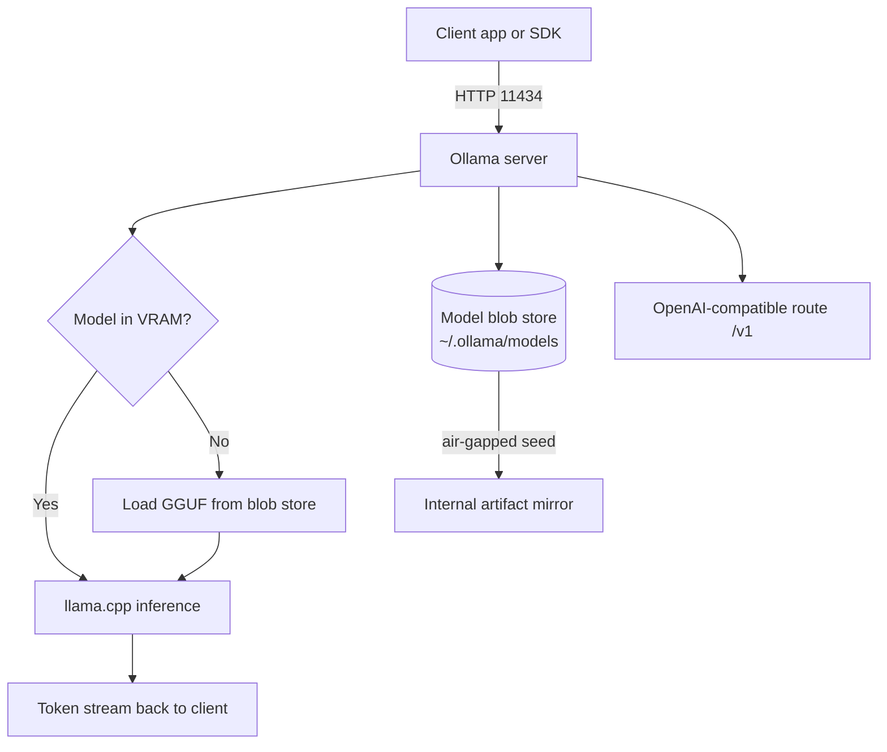

# Ollama and Local Model Serving

**Level:** Beginner
**Tree:** [Running and Integrating Models](../README.md)
**Branch:** [Local and Private Inference](README.md)
**Forest:** [AI & Intelligent Systems](../../../README.md)

## Explanation

Ollama is a self-contained runtime that downloads open-weight models, quantises them, and exposes them over a **local HTTP API on port 11434**. For enterprises it matters for one reason: the prompt never leaves the machine. That makes it the default answer for classified data, air-gapped labs, offline training environments, and any workload where a data-residency clause forbids sending text to a hosted endpoint.

Under the hood Ollama wraps llama.cpp and uses **GGUF** model files. A GGUF file bundles the weights plus the quantisation scheme. Quantisation is the single biggest lever an architect controls: an 8-billion-parameter model at FP16 needs roughly 16 GB of memory, the same model at Q4_K_M needs roughly 4.7 GB and loses only a few percent of benchmark quality. That difference decides whether the model runs on a laptop GPU, a shared VM, or not at all.

The mental model has three layers. A **model** is the downloaded weights. A **Modelfile** is a small declarative build file that pins a base model, a system prompt, and sampling parameters into a new named model - this is how you ship a standard corporate assistant to every engineer with identical behaviour. A **running instance** is what Ollama loads into VRAM on first request and evicts after an idle timeout controlled by OLLAMA_KEEP_ALIVE.

Ollama exposes an OpenAI-compatible route at /v1/chat/completions, so most SDKs and RAG frameworks point at it by changing a base URL. Operationally, treat it like any other service: pin model versions by digest, mirror the model blobs to internal storage so air-gapped hosts can be seeded offline, watch VRAM with nvidia-smi, and never expose 11434 beyond localhost without a reverse proxy that adds authentication, because the API has none of its own.

## Architecture and flow



## Commands

### Command 1

Run the Ollama API server in the foreground on 127.0.0.1:11434.

```text
ollama serve
```

### Command 2

Download a specific quantised model tag rather than the floating latest tag.

```text
ollama pull llama3.1:8b-instruct-q4_K_M
```

### Command 3

Show locally cached models with size and digest for inventory and drift checks.

```text
ollama list
```

### Command 4

Interactive chat that also prints tokens per second and load time for benchmarking.

```text
ollama run llama3.1:8b --verbose
```

### Command 5

Build a named derived model from a Modelfile that pins system prompt and parameters.

```text
ollama create corp-assistant -f Modelfile
```

### Command 6

Print the effective Modelfile of a model, including template and stop tokens.

```text
ollama show llama3.1:8b --modelfile
```

### Command 7

List models currently resident in memory with VRAM footprint and expiry time.

```text
ollama ps
```

### Command 8

Machine-readable model inventory, useful for a compliance or asset report.

```text
curl http://localhost:11434/api/tags
```

### Command 9

Keep models warm for 30 minutes and bind to all interfaces - only behind an authenticating proxy.

```text
OLLAMA_KEEP_ALIVE=30m OLLAMA_HOST=0.0.0.0 ollama serve
```

### Command 10

Delete a model and reclaim disk, used when retiring an approved model version.

```text
ollama rm llama3.1:8b
```

## Automation scripts

### Seed and benchmark an offline Ollama host

```python
#!/usr/bin/env python3
"""Seed an air-gapped Ollama host from an approved model list and benchmark each model.

Writes a JSON report used as evidence that only approved models are resident.
"""
import json
import sys
import time
import urllib.request

OLLAMA = "http://127.0.0.1:11434"
APPROVED = [
    "llama3.1:8b-instruct-q4_K_M",
    "qwen2.5:7b-instruct-q4_K_M",
    "nomic-embed-text:latest",
]
PROBE = "Summarise in one sentence: a firewall rule was changed at 02:00 by an unknown account."


def call(path, payload=None, timeout=600):
    url = OLLAMA + path
    data = json.dumps(payload).encode() if payload is not None else None
    req = urllib.request.Request(url, data=data,
                                headers={"Content-Type": "application/json"})
    with urllib.request.urlopen(req, timeout=timeout) as resp:
        return json.loads(resp.read().decode())


def installed():
    try:
        tags = call("/api/tags")
    except Exception as exc:
        print("ERROR: cannot reach Ollama at %s: %s" % (OLLAMA, exc))
        sys.exit(2)
    return set(m["name"] for m in tags.get("models", []))


def pull(name):
    print("  pulling %s ..." % name)
    try:
        call("/api/pull", {"name": name, "stream": False})
        return True
    except Exception as exc:
        print("  FAILED to pull %s: %s" % (name, exc))
        return False


def benchmark(name):
    start = time.time()
    try:
        out = call("/api/generate",
                   {"model": name, "prompt": PROBE, "stream": False})
    except Exception as exc:
        return {"model": name, "status": "error", "detail": str(exc)}
    wall = time.time() - start
    eval_count = out.get("eval_count", 0)
    eval_ns = out.get("eval_duration", 1)
    tps = eval_count / (eval_ns / 1e9) if eval_ns else 0.0
    return {
        "model": name,
        "status": "ok",
        "wall_seconds": round(wall, 2),
        "load_seconds": round(out.get("load_duration", 0) / 1e9, 2),
        "tokens_out": eval_count,
        "tokens_per_second": round(tps, 1),
    }


def main():
    have = installed()
    report = {"endpoint": OLLAMA, "results": [], "unapproved": []}

    for name in APPROVED:
        if name not in have:
            if not pull(name):
                report["results"].append({"model": name, "status": "missing"})
                continue
        report["results"].append(benchmark(name))

    for name in sorted(have - set(APPROVED)):
        print("  WARNING unapproved model present: %s" % name)
        report["unapproved"].append(name)

    with open("ollama-host-report.json", "w", encoding="utf-8") as fh:
        json.dump(report, fh, indent=2)

    for row in report["results"]:
        print(row)
    print("\nReport written to ollama-host-report.json")
    sys.exit(1 if report["unapproved"] else 0)


if __name__ == "__main__":
    main()
```

## Lab

**Objective:** Stand up an offline-capable Ollama host, publish a standardised corporate assistant model via a Modelfile, and prove that no prompt data leaves the machine.

### Steps

1. Install Ollama on a Windows or Linux host with at least 16 GB RAM, then start the service and confirm it is listening only on 127.0.0.1:11434.
2. Pull two models of different sizes, for example llama3.1:8b-instruct-q4_K_M and a 3b class model, and record disk size from ollama list.
3. Run each model with --verbose against the same 200-word prompt and record load time, tokens per second, and peak VRAM from nvidia-smi or Task Manager.
4. Author a Modelfile that sets FROM llama3.1:8b-instruct-q4_K_M, a SYSTEM prompt defining a change-management assistant, PARAMETER temperature 0.2 and PARAMETER num_ctx 8192.
5. Build it with ollama create corp-assistant -f Modelfile and verify the baked-in behaviour with ollama show corp-assistant --modelfile.
6. Call the OpenAI-compatible endpoint at /v1/chat/completions with curl and confirm an identical response shape to a hosted provider.
7. Disconnect the network adapter entirely and repeat the call to prove offline operation.
8. Capture traffic with tcpdump or Wireshark during a request and confirm no packets leave the loopback interface.
9. Run the provided Python seeding script and review ollama-host-report.json.

### Validation

- ollama list shows both models with distinct digests and the derived corp-assistant model.
- A chat completion returns correct content while the network adapter is disabled.
- Packet capture during inference shows only loopback traffic and zero egress to any public address.
- ollama show corp-assistant --modelfile prints the SYSTEM prompt and temperature 0.2 exactly as authored.
- ollama-host-report.json lists tokens_per_second above zero for every approved model and an empty unapproved array.

## Operational automation

### Automating local model estate management

**Golden image, not manual installs.** Bake Ollama plus the approved model blobs into a VM template or container image. The blobs live under ~/.ollama/models and are content-addressed, so they layer cleanly and deduplicate across images.

**Air-gapped distribution.** Pull models once on a connected staging host, tar the models directory, sign the tarball, and publish it to the internal artifact repository. Air-gapped hosts fetch and extract it - no internet path required. Pin by digest, never by the latest tag, so a rebuild six months later produces byte-identical weights.

**Configuration as code.** Store every Modelfile in Git alongside the application that consumes it. A pipeline stage runs ollama create on merge and publishes the derived model to the internal registry, giving you review, diff and rollback on system prompts - which are production configuration, not prose.

**Run it as a service.** On Linux use a systemd unit with Environment=OLLAMA_HOST=127.0.0.1 and Restart=always. On Windows register it with NSSM or a scheduled task set to run at startup. Front it with nginx or Caddy terminating TLS and enforcing an API key or mTLS, because Ollama itself performs no authentication.

**Continuous verification.** Schedule the seeding script nightly. It fails the job when an unapproved model appears on a host - the cheapest possible control against an engineer pulling an unvetted model onto a production box. Ship results to your monitoring stack and alert on tokens_per_second regressions, which reliably indicate a driver rollback or a model that silently fell back to CPU.

## Troubleshooting

### Scenario 1: Inference is 10-30x slower than expected and the CPU is pegged while the GPU sits idle.

**Likely cause:** The model did not fit in VRAM so llama.cpp offloaded all layers to CPU, or the CUDA/ROCm runtime is not visible to the Ollama process.

**Resolution:** Check ollama ps for the resident size versus free VRAM from nvidia-smi. Drop to a smaller quantisation such as Q4_K_M, reduce num_ctx, or set num_gpu to partially offload layers. If VRAM is ample, verify the driver is loaded in the service context - a service started before the GPU driver will silently run CPU-only until restarted.

### Scenario 2: Requests fail with connection refused from another machine although curl works locally.

**Likely cause:** Ollama binds to 127.0.0.1 by default, so it is unreachable from the network by design.

**Resolution:** Do not simply set OLLAMA_HOST=0.0.0.0 and stop there - the API is unauthenticated. Put a reverse proxy in front that terminates TLS and enforces an API key or mTLS, bind Ollama to localhost, and let only the proxy talk to it.

### Scenario 3: The first request after an idle period takes 20-60 seconds, then subsequent requests are fast.

**Likely cause:** The model was evicted from memory after the default 5-minute keep-alive expired and must be reloaded from disk.

**Resolution:** Raise OLLAMA_KEEP_ALIVE to 30m or -1 for always-resident on a dedicated inference host, or send a tiny warm-up request on a schedule. Budget the VRAM for permanently resident models before choosing -1.

### Scenario 4: Responses are truncated mid-sentence or the model forgets the start of a long document.

**Likely cause:** num_ctx is smaller than the combined prompt and response length, so the context window silently slides.

**Resolution:** Raise PARAMETER num_ctx in the Modelfile to a value the model actually supports and that fits VRAM - the KV cache grows linearly with context. If the document still does not fit, that is a signal to move to retrieval rather than to a larger window.

### Scenario 5: The same model tag produces different behaviour on two hosts.

**Likely cause:** The floating tag was re-pointed upstream between pulls, so the hosts hold different weights, or one host has a derived Modelfile applied.

**Resolution:** Compare digests with ollama list on both hosts and pin the immutable digest in your provisioning. Compare `ollama show <model> --modelfile` to detect a divergent system prompt or sampling parameter.

## Interview questions

### 1. Why would an enterprise run local inference when hosted frontier models are more capable?

Four drivers, in rough order of how often they decide the architecture. **Data residency and confidentiality** - regulated, classified or contractually restricted data may not leave a boundary, and local inference makes that provable at the network layer rather than by trusting a vendor policy. **Offline and edge operation** - factory floors, ships, field sites, and air-gapped labs need the capability with no egress path at all. **Cost shape** - hosted models are variable cost per token; local inference is fixed cost per GPU. At high steady volume on a narrow task the local option becomes dramatically cheaper, and the crossover is calculable. **Latency and determinism** - no network hop, no provider rate limits, no surprise deprecation of a model version you have validated against. The honest counterpoint is capability: an 8B open-weight model is not a frontier model. The mature enterprise pattern is a router - local models handle classification, extraction, summarisation and PII-bearing traffic, while a governed hosted endpoint handles complex reasoning on non-sensitive data.

### 2. Explain quantisation and how you choose a level for production.

Quantisation reduces the numeric precision of model weights - FP16 to 8-bit or 4-bit integers - shrinking memory footprint and increasing throughput at some cost in output quality. Q4_K_M is the usual production sweet spot: roughly a quarter of the FP16 memory for a small single-digit percentage quality loss on most benchmarks. Q8_0 is near-lossless but roughly double the memory. Anything below 4-bit degrades noticeably, especially on reasoning and code. The choice is not made from a chart, it is made from an evaluation set: assemble 100-200 representative prompts with known-good answers from your own domain, score each quantisation with an LLM judge plus exact-match checks on the structured fields, and pick the smallest one that clears your quality bar. Then verify it fits VRAM *including* the KV cache at your target context length, because that cache grows linearly with context and is what actually causes production out-of-memory events.

### 3. How do you distribute and govern models in an air-gapped environment?

Treat model weights exactly like any other binary artifact under supply-chain control. Pull once on a connected staging host, verify the digest against the publisher, scan and record provenance and licence - open weights carry real licence obligations, Llama has an acceptable-use policy and a monthly-active-user threshold. Sign the artifact and publish it to the internal repository. Air-gapped hosts pull only from that mirror. Pin immutable digests, never floating tags, so builds are reproducible. On the governance side maintain an approved-model register with the business justification, evaluation results and licence for each entry, and run a scheduled job on every inference host that compares resident models to the register and alerts on anything unapproved. That last control is what stops an engineer quietly pulling an unvetted model onto a production host.

### 4. A team reports their local model is much slower in production than in their laptop test. How do you diagnose it?

Work down the stack. First confirm the model is actually on the GPU - ollama ps against nvidia-smi shows resident size versus free VRAM; a service that started before the GPU driver runs CPU-only and silently. Second check context length, because the KV cache scales with num_ctx and a production prompt carrying retrieved documents may be 10x the test prompt, pushing layers off the GPU. Third check concurrency: multiple simultaneous requests share the GPU, so per-request tokens per second falls even though aggregate throughput is fine - measure both before concluding there is a regression. Fourth compare quantisation and digest between the two hosts; laptops often hold a smaller variant. Fifth check keep-alive - if the measurement includes a cold load, you are timing disk I/O, not inference. The instrumentation that answers this in seconds is emitting load_duration, prompt_eval_count and eval_count from the API response into your metrics store from day one.

## Certification alignment

- AI-900 Azure AI Fundamentals - Describe fundamental principles of machine learning and AI workloads
- AI-102 Azure AI Engineer Associate - Plan and manage an Azure AI solution, including deployment and consumption options
- AZ-305 Designing Microsoft Azure Infrastructure Solutions - Design a compute solution, including GPU-backed VM sizing
- Vendor-neutral - CNCF and Linux Foundation AI infrastructure practice: GPU scheduling, model artifact supply chain
- Vendor-neutral - NIST AI Risk Management Framework, MAP function: document model provenance and deployment context

## References

- Ollama documentation - Modelfile reference and API specification
- llama.cpp repository - GGUF format specification and quantisation types
- Hugging Face - open-weight model cards, licences and evaluation leaderboards
- NVIDIA CUDA documentation - GPU memory management and nvidia-smi monitoring
- NIST AI 100-1 - Artificial Intelligence Risk Management Framework

## Suggested video search

Ollama enterprise local LLM deployment GGUF quantization guide

---

> Validate commands, versions, permissions, licensing, and rollback procedures in an isolated lab before production use.
