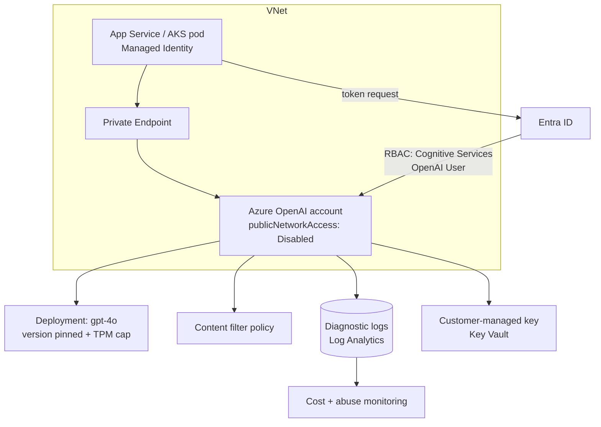

# Azure OpenAI Enterprise Integration

**Level:** Advanced
**Tree:** [Running and Integrating Models](../README.md)
**Branch:** [Managed Model Services and Prompt Discipline](README.md)
**Forest:** [AI & Intelligent Systems](../../../README.md)

## Explanation

Azure OpenAI is the same model family as the public API wrapped in Azure's control plane, and that wrapper is the entire point for an enterprise. It brings **Entra ID authentication**, **private networking**, **customer-managed keys**, **regional data residency**, **diagnostic logging** and **Azure Policy** to a capability that would otherwise be an unmanaged internet dependency.

The resource model has three levels. An **account** is the Azure resource carrying networking, identity and encryption settings. A **deployment** is a named instance of a specific model at a specific version with an allocated capacity. Applications call the deployment name, not the model name, which gives you an indirection layer for version upgrades and rollbacks.

The capacity choice is architectural. **Standard** is pay-per-token with shared capacity and best-effort latency. **Provisioned Throughput Units** reserve dedicated capacity for predictable latency at a fixed monthly cost - appropriate when a workload is latency-sensitive and steady, wasteful otherwise. **Data zone** and **global** deployments trade residency guarantees against availability and price.

For identity, never ship API keys. Assign the application a managed identity and grant it the Cognitive Services OpenAI User role. Keys cannot be attributed to a caller, do not expire, and leak through config files. Managed identity gives token-based auth with full audit attribution and no secret to rotate.

Network isolation means a private endpoint into your VNet plus publicNetworkAccess disabled, so the service is unreachable from the internet even with a valid credential. Combine that with a content-filter policy configured to your risk appetite, diagnostic settings streaming request logs to Log Analytics, and Azure Policy denying creation of accounts with public access enabled. Together these turn a model endpoint into a governed enterprise service.

## Architecture and flow



## Commands

### Command 1

Create the account with a custom domain, required for private endpoints and Entra auth.

```text
az cognitiveservices account create -g rg-ai -n aoai-prod -l swedencentral --kind OpenAI --sku S0 --custom-domain aoai-prod --assign-identity
```

### Command 2

Disable public network access so the endpoint is reachable only through private endpoints.

```text
az cognitiveservices account update -g rg-ai -n aoai-prod --public-network-access Disabled
```

### Command 3

Attach a private endpoint into the application VNet.

```text
az network private-endpoint create -g rg-ai -n pe-aoai --vnet-name vnet-hub --subnet snet-pe --private-connection-resource-id $AOAI_ID --group-id account --connection-name aoai
```

### Command 4

Grant a managed identity data-plane access without any API key.

```text
az role assignment create --assignee $APP_PRINCIPAL_ID --role "Cognitive Services OpenAI User" --scope $AOAI_ID
```

### Command 5

Create a version-pinned deployment with a TPM ceiling.

```text
az cognitiveservices account deployment create -g rg-ai -n aoai-prod --deployment-name chat --model-name gpt-4o --model-version 2024-11-20 --model-format OpenAI --sku-name Standard --sku-capacity 30
```

### Command 6

Rotate a key during migration away from key auth; audit that no caller breaks.

```text
az cognitiveservices account keys regenerate -g rg-ai -n aoai-prod --key-name key1
```

### Command 7

Stream request and audit logs for security monitoring and chargeback.

```text
az monitor diagnostic-settings create --name aoai-diag --resource $AOAI_ID --workspace $LAW_ID --logs "[{category:RequestResponse,enabled:true},{category:Audit,enabled:true}]"
```

### Command 8

Verify the effective network ACLs during a compliance review.

```text
az cognitiveservices account show -g rg-ai -n aoai-prod --query "properties.networkAcls"
```

### Command 9

Enforce that no Azure OpenAI account can be created with public access enabled.

```text
az policy assignment create --name deny-public-aoai --policy $POLICY_ID --scope /subscriptions/$SUB
```

## Automation scripts

### Azure OpenAI enterprise posture audit

```powershell
#Requires -Version 7.0
<#
.SYNOPSIS
    Audits every Azure OpenAI account in scope against enterprise baseline controls.
.DESCRIPTION
    Checks public network access, private endpoints, managed identity, customer-managed
    keys, diagnostic settings, key-based auth and deployment version pinning.
    Emits a CSV and exits non-zero when any FAIL is found, so it can gate a pipeline.
.PARAMETER SubscriptionId
    Subscription to audit. Defaults to the current context.
.PARAMETER OutputPath
    CSV report path.
#>
[CmdletBinding()]
param(
    [string] $SubscriptionId,
    [string] $OutputPath = "aoai-posture.csv"
)

Set-StrictMode -Version Latest
$ErrorActionPreference = 'Stop'

function Write-Log {
    param([string] $Message, [string] $Level = 'INFO')
    $ts = (Get-Date).ToString('s')
    Write-Host ('[{0}] [{1}] {2}' -f $ts, $Level, $Message)
}

function Test-Control {
    param([string] $Name, [bool] $Passed, [string] $Detail)
    [pscustomobject]@{
        Control = $Name
        Result  = if ($Passed) { 'PASS' } else { 'FAIL' }
        Detail  = $Detail
    }
}

try {
    if (-not (Get-Command Get-AzContext -ErrorAction SilentlyContinue)) {
        throw 'Az PowerShell module not installed. Run: Install-Module Az -Scope CurrentUser'
    }
    $ctx = Get-AzContext
    if (-not $ctx) { throw 'Not signed in. Run Connect-AzAccount first.' }
    if ($SubscriptionId) {
        Write-Log "Selecting subscription $SubscriptionId"
        Set-AzContext -Subscription $SubscriptionId | Out-Null
    }
}
catch {
    Write-Log $_.Exception.Message 'ERROR'
    exit 2
}

$results = New-Object System.Collections.Generic.List[object]
$accounts = Get-AzCognitiveServicesAccount | Where-Object { $_.Kind -eq 'OpenAI' }

if (-not $accounts) {
    Write-Log 'No Azure OpenAI accounts found in scope.' 'WARN'
    exit 0
}

Write-Log ("Auditing {0} Azure OpenAI account(s)" -f $accounts.Count)

foreach ($acct in $accounts) {
    Write-Log ("--- {0} ({1}) ---" -f $acct.AccountName, $acct.Location)
    $checks = New-Object System.Collections.Generic.List[object]

    # 1. Public network access must be disabled
    $pna = $acct.Properties.PublicNetworkAccess
    $checks.Add((Test-Control 'PublicNetworkAccessDisabled' ($pna -eq 'Disabled') "PublicNetworkAccess=$pna"))

    # 2. At least one approved private endpoint connection
    $peList = @()
    try {
        $peList = @(Get-AzPrivateEndpointConnection -PrivateLinkResourceId $acct.Id -ErrorAction Stop)
    } catch {
        Write-Log ("Could not enumerate private endpoints: {0}" -f $_.Exception.Message) 'WARN'
    }
    $approved = @($peList | Where-Object { $_.PrivateLinkServiceConnectionState.Status -eq 'Approved' })
    $checks.Add((Test-Control 'PrivateEndpointApproved' ($approved.Count -gt 0) ("approved={0}" -f $approved.Count)))

    # 3. System-assigned managed identity present
    $hasMi = $null -ne $acct.Identity -and $acct.Identity.Type -match 'SystemAssigned'
    $checks.Add((Test-Control 'ManagedIdentityEnabled' $hasMi ("IdentityType={0}" -f $acct.Identity.Type)))

    # 4. Local (key) authentication disabled in favour of Entra ID
    $localAuth = $true
    if ($acct.Properties.PSObject.Properties.Name -contains 'DisableLocalAuth') {
        $localAuth = -not $acct.Properties.DisableLocalAuth
    }
    $checks.Add((Test-Control 'KeyAuthDisabled' (-not $localAuth) ("LocalAuthEnabled=$localAuth")))

    # 5. Customer-managed key encryption
    $cmk = $acct.Properties.Encryption -and $acct.Properties.Encryption.KeySource -eq 'Microsoft.KeyVault'
    $keySrc = if ($acct.Properties.Encryption) { $acct.Properties.Encryption.KeySource } else { 'Microsoft.CognitiveServices' }
    $checks.Add((Test-Control 'CustomerManagedKey' ([bool]$cmk) "KeySource=$keySrc"))

    # 6. Diagnostic settings shipping logs
    $diag = @()
    try {
        $diag = @(Get-AzDiagnosticSetting -ResourceId $acct.Id -ErrorAction Stop)
    } catch {
        Write-Log ("Could not read diagnostic settings: {0}" -f $_.Exception.Message) 'WARN'
    }
    $checks.Add((Test-Control 'DiagnosticLogsEnabled' ($diag.Count -gt 0) ("settings={0}" -f $diag.Count)))

    # 7. Every deployment pins an explicit model version
    $deployments = @()
    try {
        $deployments = @(Get-AzCognitiveServicesAccountDeployment -ResourceGroupName $acct.ResourceGroupName -AccountName $acct.AccountName -ErrorAction Stop)
    } catch {
        Write-Log ("Could not enumerate deployments: {0}" -f $_.Exception.Message) 'WARN'
    }
    $unpinned = @($deployments | Where-Object { -not $_.Properties.Model.Version })
    $checks.Add((Test-Control 'DeploymentVersionsPinned' ($unpinned.Count -eq 0) ("total={0}; unpinned={1}" -f $deployments.Count, $unpinned.Count)))

    # 8. Every deployment has a capacity ceiling
    $uncapped = @($deployments | Where-Object { -not $_.Sku -or -not $_.Sku.Capacity })
    $checks.Add((Test-Control 'DeploymentCapacityCapped' ($uncapped.Count -eq 0) ("uncapped={0}" -f $uncapped.Count)))

    foreach ($c in $checks) {
        $level = if ($c.Result -eq 'PASS') { 'INFO' } else { 'WARN' }
        Write-Log ("  {0,-28} {1}  {2}" -f $c.Control, $c.Result, $c.Detail) $level
        $results.Add([pscustomobject]@{
            Account       = $acct.AccountName
            ResourceGroup = $acct.ResourceGroupName
            Location      = $acct.Location
            Control       = $c.Control
            Result        = $c.Result
            Detail        = $c.Detail
        })
    }
}

try {
    $results | Export-Csv -Path $OutputPath -NoTypeInformation -Encoding UTF8
    Write-Log "Report written to $OutputPath"
}
catch {
    Write-Log ("Failed to write report: {0}" -f $_.Exception.Message) 'ERROR'
    exit 2
}

$failCount = @($results | Where-Object { $_.Result -eq 'FAIL' }).Count
Write-Log ("Total controls: {0}; failures: {1}" -f $results.Count, $failCount)
exit ([int]($failCount -gt 0))
```

## Lab

**Objective:** Deploy a network-isolated Azure OpenAI service authenticated by managed identity with no API keys in use, and prove the posture with an automated audit.

### Steps

1. Create a resource group, VNet with an application subnet and a private endpoint subnet, and an Azure OpenAI account with a custom domain and system-assigned identity.
2. Create a version-pinned deployment named chat with an explicit sku-capacity, so the model version cannot drift underneath the application.
3. Confirm the endpoint works from the internet with a key, then disable public network access and confirm the same call now fails.
4. Create a private endpoint into the application subnet and link the privatelink.openai.azure.com private DNS zone to the VNet.
5. Deploy a small App Service or container into the VNet with a managed identity and assign it the Cognitive Services OpenAI User role.
6. Modify the application to acquire an Entra token via DefaultAzureCredential rather than reading an API key, and confirm a successful completion.
7. Disable local authentication on the account and confirm key-based calls now fail while the managed identity path still succeeds.
8. Enable diagnostic settings to a Log Analytics workspace and locate your own request in the RequestResponse table.
9. Configure a content filter policy and verify a disallowed prompt is blocked with the expected error shape.
10. Run the PowerShell posture audit and remediate any FAIL rows until it exits zero.

### Validation

A call from the public internet to the account endpoint fails with a network or forbidden error.,A call from inside the VNet using managed identity succeeds and returns a completion.,nslookup of the account hostname from inside the VNet resolves to a private IP in the private endpoint subnet.,An API-key call fails after local authentication is disabled.,The RequestResponse table in Log Analytics contains the test request with the calling identity recorded.,The posture audit script exits with code 0 and every control reports PASS in aoai-posture.csv.

## Operational automation

### Automating governed model endpoints

**Infrastructure as code, always.** Express the account, private endpoint, private DNS zone link, deployments, role assignments and diagnostic settings in Bicep or Terraform. Manual portal creation reliably misses the private DNS zone link, which produces the classic failure where the hostname still resolves publicly and the private endpoint appears not to work.

**Policy as the backstop.** Azure Policy is what stops the exception becoming the norm. Assign deny effects for Cognitive Services accounts with publicNetworkAccess enabled and for accounts without diagnostic settings, plus an audit effect for deployments without a pinned model version. Policy catches the resource created outside your pipeline; IaC alone does not.

**Deployment names as an abstraction layer.** Applications reference a stable deployment name such as chat-primary. Model version upgrades become a controlled operation: create a new deployment on the new version, run the evaluation harness against it, shift traffic, then retire the old one. Because the application never names a model version, rollback is a configuration change rather than a code release.

**Continuous posture verification.** Run the audit script on a schedule in Azure Automation or a pipeline, publishing results to a workbook. It exits non-zero on any failure so it can gate a release. This closes the gap between the compliance statement and the running configuration, which is where audit findings actually come from.

**Key elimination as a project.** Enumerate every caller from the diagnostic logs, migrate each to managed identity, then set disableLocalAuth. Regenerating keys first is a useful forcing function - anything that breaks was still using key auth.

## Troubleshooting

### Scenario 1: After creating a private endpoint, calls from inside the VNet still fail or resolve to a public IP.

**Likely cause:** The private DNS zone privatelink.openai.azure.com was not created, or it exists but is not linked to the calling VNet.

**Resolution:** Verify the zone exists with an A record for the account name pointing at the private endpoint NIC address, and confirm a virtual network link to the VNet with registration disabled. Run nslookup from a VM in the subnet - a public IP in the answer proves DNS, not networking, is the problem. Custom DNS servers must conditionally forward to 168.63.129.16.

### Scenario 2: The application gets 401 Unauthorized using managed identity although the role assignment exists.

**Likely cause:** The wrong scope or role was assigned, the token was requested for the wrong audience, or role assignment propagation has not completed.

**Resolution:** Confirm the role is Cognitive Services OpenAI User assigned at the account scope - Contributor grants control-plane rights but not data-plane inference. Ensure the token audience is https://cognitiveservices.azure.com. Allow several minutes for propagation and restart the application so it does not serve a cached negative token.

### Scenario 3: Requests intermittently return 429 despite provisioned capacity that looks sufficient.

**Likely cause:** TPM capacity is evaluated over short windows, so burst concurrency exhausts it even when the hourly average is low.

**Resolution:** Implement exponential backoff honouring retry-after, spread load across two deployments, and consider provisioned throughput units for latency-sensitive paths. Review the metric at one-minute granularity rather than hourly - the hourly view hides the burst entirely.

### Scenario 4: Legitimate business prompts are being blocked by the content filter.

**Likely cause:** Default content filter thresholds are too aggressive for the domain, common in security, medical and legal use cases where threat or clinical language is normal.

**Resolution:** Create a custom content filter policy with adjusted severity thresholds for the specific categories, attach it to the deployment, and document the risk acceptance. Log every filter trigger so you can measure the false-positive rate rather than argue about it.

### Scenario 5: A model upgrade silently changed application behaviour and quality regressed.

**Likely cause:** The deployment used auto-update or an unpinned version, so the underlying model moved without a change record.

**Resolution:** Pin explicit model versions on every deployment and set the upgrade policy to manual. Treat version changes as a change-managed event: deploy the new version alongside, run the evaluation harness, compare scores, then cut over. Add a policy audit rule for unpinned deployments.

## Interview questions

### 1. Why use Azure OpenAI rather than calling the model provider directly?

The models are comparable; the difference is the control plane, and that is what an enterprise is buying. **Identity** - Entra ID authentication with managed identities and RBAC means no long-lived API keys and full attribution of every call to a principal. **Network isolation** - private endpoints let you disable public access entirely, so a leaked credential is not sufficient to reach the service. **Data residency** - you choose the region and can commit to data zones, which is often a hard regulatory requirement. **Encryption** - customer-managed keys in Key Vault. **Observability and governance** - diagnostic settings into Log Analytics, Azure Policy enforcement, Defender for Cloud coverage, and cost management integrated with the rest of the estate. **Commercial** - it lands on an existing enterprise agreement with existing contractual terms rather than a new vendor relationship and procurement cycle. The trade-off is that new models and features usually arrive on the provider's own API first, and regional availability lags, so a genuinely leading-edge capability may not be available on Azure yet.

### 2. Walk me through securing an Azure OpenAI deployment end to end.

**Identity layer**: system-assigned or user-assigned managed identity on every calling workload, Cognitive Services OpenAI User granted at account scope, and disableLocalAuth set so API keys cannot be used at all. **Network layer**: publicNetworkAccess disabled, a private endpoint into the application VNet, the privatelink.openai.azure.com private DNS zone linked to that VNet, and NSGs restricting which subnets reach the endpoint. **Data layer**: customer-managed keys for encryption at rest, and a decision documented about abuse-monitoring data retention - some regulated customers apply for the modified abuse monitoring exemption. **Application layer**: a content filter policy tuned to the domain, input validation against prompt injection, and output handling that never renders model output as trusted markup or executes it. **Governance layer**: diagnostic settings streaming RequestResponse and Audit logs to Log Analytics with alerts on anomalous volume, Azure Policy denying non-compliant account creation, version-pinned deployments with capacity ceilings, and a scheduled posture audit that gates releases. Finally, everything expressed as IaC so the configuration is reviewable and reproducible.

### 3. What is the difference between Standard and Provisioned Throughput, and when do you choose each?

Standard is pay-per-token on shared infrastructure. Cost tracks usage exactly, so it is efficient for spiky or low-volume workloads, but latency is best-effort and you compete with other tenants, which shows up as variable time-to-first-token and occasional 429s under burst. Provisioned Throughput Units reserve dedicated capacity: you pay a fixed monthly amount regardless of usage and get predictable, consistent latency plus guaranteed throughput. Choose PTU when the workload is latency-sensitive with a defined SLA - a customer-facing assistant, a real-time call-centre aid - and when volume is steady enough that the fixed cost is well utilised. Choose Standard for internal tooling, batch work, development, and anything bursty. The analysis is a utilisation calculation: convert the PTU throughput into monthly token capacity, price the same volume at Standard rates, and find the utilisation percentage at which PTU wins. Many organisations run both - PTU for the interactive path with Standard as spillover once the reserved capacity is saturated.

### 4. How do you handle a model version deprecation notice for a system in production?

Treat it as a planned migration with an evaluation gate, not a config change. First, inventory impact: query diagnostic logs for every deployment and calling application on the affected version, because the list is usually longer than the team believes. Second, stand up a parallel deployment on the target version - the deployment-name indirection means applications need no code change to be tested against it. Third, run the regression evaluation set against both versions and compare quality scores per workload; model upgrades are usually improvements in aggregate but frequently regress a specific prompt pattern, most often structured output formatting or instruction-following edge cases. Fourth, fix the prompts that regressed and re-test. Fifth, cut over progressively - shift a percentage of traffic, watch error rates and quality telemetry, then complete. Keep the old deployment until its hard deprecation date so rollback stays a configuration change. The whole approach depends on having an evaluation set built before you needed it, which is why that is day-one work rather than a later refinement.

## Certification alignment

- AI-102 Azure AI Engineer Associate - Plan and manage an Azure AI solution: create, secure and monitor AI services
- AI-102 Azure AI Engineer Associate - Implement generative AI solutions with Azure OpenAI Service
- AI-900 Azure AI Fundamentals - Describe responsible AI and Azure AI service capabilities
- AZ-305 Designing Microsoft Azure Infrastructure Solutions - Design identity, governance and monitoring solutions; design network security
- SC-100 Microsoft Cybersecurity Architect - Design a strategy for securing PaaS services and data
- Vendor-neutral - ISO/IEC 42001 AI management system controls for third-party AI service governance

## References

- Microsoft Learn - Azure OpenAI Service documentation: networking, identity and content filtering
- Microsoft Learn - Configure Azure OpenAI with managed identity and disable local authentication
- Microsoft Learn - Azure Private Link and private DNS zone configuration for Cognitive Services
- Azure Architecture Center - Baseline OpenAI end-to-end chat reference architecture
- Microsoft Learn - Azure OpenAI model deprecations and retirement schedule

## Suggested video search

Azure OpenAI private endpoint managed identity enterprise architecture AI-102

---

> Validate commands, versions, permissions, licensing, and rollback procedures in an isolated lab before production use.
