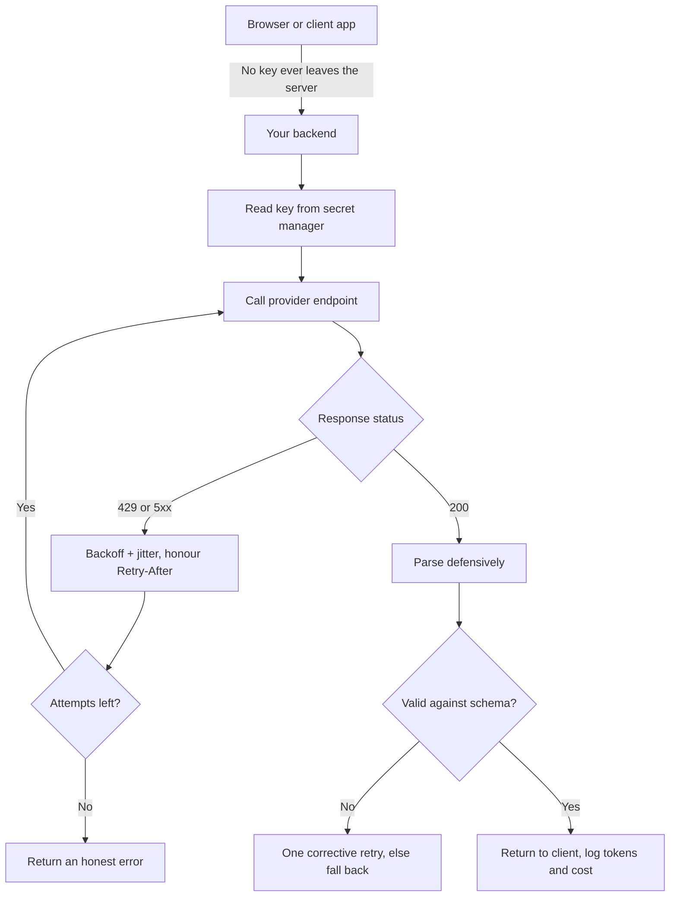

# Your First Managed Endpoint: Keys, Quotas and Responses You Cannot Trust

**Level:** Beginner
**Tree:** [Running and Integrating Models](../README.md)
**Branch:** [Managed Model Services and Prompt Discipline](README.md)
**Forest:** [AI & Intelligent Systems](../../../README.md)
**Readiness:** [Lab](../../../READINESS.md#lab) - checked offline, not yet run against a live service. A live run needs a hosted model provider's API key.

## Explanation

Calling a managed model endpoint is four lines of code, which is why the first
version usually ships in an afternoon and the second version takes three weeks.
The four lines are genuinely easy. What surrounds them — where the key lives,
what happens at the rate limit, and what to do with a reply that is text rather
than data — is where the work actually is.

### The key is a credential, not configuration

An API key is a bearer token: whoever holds it can spend your money at your
quota until it is revoked. Two placements cause most incidents, and both feel
reasonable at the time.

**In client-side code.** If your JavaScript calls the provider directly, the
key is in the browser. Not hidden, not obfuscated — visible in the network tab
to anyone who opens it. Every deployment doing this has published its key.
There is no client-side mitigation, because the browser must be able to read
whatever it sends. The fix is structural: calls go through your own server,
which holds the key and never returns it.

That has a consequence worth stating plainly, because it surprises people
building a "simple" feature: **you need a backend**. Even for a demo that is
going to be reachable from the internet.

**In the repository.** Committing a key puts it in history, where deleting the
line does not remove it. Anyone who has ever cloned the repo has a copy.
Rotation, not deletion, is the remedy — and rotation is the remedy for any key
you are unsure about, because uncertainty is itself the answer.

Keys belong in a secret manager or environment variables injected at deploy
time, scoped narrowly, rotated on a schedule, and with separate keys per
environment so that revoking a leaked development key does not take production
down with it.

### Rate limits are capacity, not errors

A 429 response reads like a failure and is better understood as the provider
telling you its capacity number. At any real volume it is a normal operating
condition, and the code's reaction determines whether users notice.

Two limits usually apply at once: requests per minute and **tokens** per
minute. The token limit is the one that catches people out, because a modest
request rate with long prompts can exhaust it while the request counter looks
comfortable. If you are being throttled and your request rate seems fine, check
tokens.

The wrong reaction is an immediate retry. Every throttled caller retrying at
once produces a synchronised burst against a service that just said it was
full, which extends the outage — the classic thundering herd. The right
reaction has three parts:

- **Exponential backoff.** Double the wait between attempts.
- **Jitter.** Randomise each wait so callers spread out instead of
  re-synchronising.
- **A cap on attempts.** Retrying forever converts a brief throttle into an
  unbounded queue and an unbounded bill.

Honour the provider's `Retry-After` header when it sends one: that is the
service stating when it will be ready, which beats any guess.

### The response is text that resembles data

Ask for JSON and you will usually get JSON. Usually. You will also get JSON
wrapped in a code fence, JSON preceded by "Here is the JSON you requested:",
JSON with a trailing comma, and occasionally a polite explanation of why it
could not comply. A parser that assumes well-formed output will crash on a
Tuesday.

Structured output modes — JSON mode, schema-constrained decoding, tool calling
— substantially improve this and are worth using wherever available. They do
not remove the need to validate, because a syntactically valid object can still
carry a field you did not ask for or omit one you did.

The durable habit: parse defensively, validate against a schema, and decide in
advance what happens on failure. Retry once with a corrective instruction,
fall back to a simpler question, or surface an honest error — any of those
beats an exception reaching a user.

The same caution applies to content. The reply is generated text, not a
retrieved fact, and it can be confidently wrong in ways that read as
authoritative. Anything consequential needs grounding in a source you control
or a human in the path.

### The bill is per token, and the prompt is charged every time

Input and output tokens are priced separately, usually with output several
times more expensive. Two consequences follow immediately.

A long system prompt is not paid once at deployment — it is paid on **every
call**, forever. Two thousand tokens of instructions across a million monthly
calls is two billion input tokens of pure overhead.

And retries cost. A failed call that consumed its input is billed even when you
discard the answer, so a retry loop with no cap is a spending loop with no cap.
Set a ceiling in money as well as attempts.

## Architecture and flow



## Commands

### Command 1

The smallest working call. Confirm connectivity and credentials before adding
anything, so a later failure has one fewer possible cause.

```text
curl -s -X POST "$ENDPOINT/v1/chat/completions" -H "Authorization: Bearer $KEY" \
  -H "Content-Type: application/json" \
  -d '{"model":"<model>","messages":[{"role":"user","content":"Reply with OK"}]}' | jq -r '.choices[0].message.content'
```

### Command 2

Rate-limit headers tell you your remaining capacity before you hit the wall.
Reading them is how throttling becomes a planned condition.

```text
curl -s -D - -o /dev/null -X POST "$ENDPOINT/v1/chat/completions" \
  -H "Authorization: Bearer $KEY" -d @request.json | grep -i 'ratelimit\|retry-after'
```

### Command 3

Token counts are the bill. Reading them from the response, per call, keeps cost
visible from the first day rather than the first invoice.

```text
curl -s -X POST "$ENDPOINT/v1/chat/completions" -H "Authorization: Bearer $KEY" \
  -d @request.json | jq '.usage'
```

### Command 4

Check the key is not in the repository, including history. A clean working tree
proves nothing about what was committed last March.

```text
git log --all -p -S "$(echo "$KEY" | cut -c1-12)" --oneline | head
```

### Command 5

Ask for structured output and confirm the parse, rather than assuming it. This
is the check that catches a fenced or prefixed response.

```text
curl -s -X POST "$ENDPOINT/v1/chat/completions" -H "Authorization: Bearer $KEY" \
  -d @json-request.json | jq -r '.choices[0].message.content' | jq . 2>&1 | head -3
```

### Command 6

Deliberately exceed your rate limit in a controlled test and watch the
behaviour. Finding out how your retry code behaves under 429 should not happen
in production.

```text
seq 1 40 | xargs -P 20 -I{} curl -s -o /dev/null -w '%{http_code}\n' \
  -X POST "$ENDPOINT/v1/chat/completions" -H "Authorization: Bearer $KEY" -d @request.json | sort | uniq -c
```

## Automation scripts

### endpoint_preflight.py

```python
#!/usr/bin/env python3
"""Check a managed-endpoint integration before it reaches production.

Four checks, each corresponding to an incident that happens regularly: the key
reachable from a client, retries without backoff, a parser that assumes
well-formed output, and a system prompt whose real cost was never multiplied by
call volume.
"""
import argparse
import pathlib
import re
import sys

CLIENT_HINTS = re.compile(r"\.(js|jsx|ts|tsx|html|vue|svelte)$")
KEY_IN_SOURCE = re.compile(r"""(sk-[A-Za-z0-9]{16,}|api[_-]?key\s*[:=]\s*["'][^"']{12,})""", re.I)
CALLS_PROVIDER = re.compile(r"(openai\.com|anthropic\.com|azure\.com/openai|generativelanguage)", re.I)
HAS_BACKOFF = re.compile(r"(backoff|exponential|retry_after|retry-after|jitter)", re.I)
HAS_RETRY = re.compile(r"(retry|max_attempts|max_retries)", re.I)
BARE_PARSE = re.compile(r"json\.loads\([^)]*(content|message|response|text)[^)]*\)")
GUARDED = re.compile(r"(try:|except|JSONDecodeError|validate|schema)", re.I)

def scan(root: pathlib.Path) -> list[str]:
    findings = []
    for path in root.rglob("*"):
        if not path.is_file() or "node_modules" in path.parts or ".git" in path.parts:
            continue
        try:
            text = path.read_text(encoding="utf-8", errors="ignore")
        except OSError:
            continue

        if CLIENT_HINTS.search(path.name) and CALLS_PROVIDER.search(text):
            findings.append(
                f"{path}: client-side file calls a provider directly. The key is in the "
                "browser and is readable by anyone. Route calls through your own server."
            )
        if KEY_IN_SOURCE.search(text):
            findings.append(
                f"{path}: looks like a key in source. Rotate it - deleting the line does "
                "not remove it from history - and move it to a secret manager."
            )
        if HAS_RETRY.search(text) and not HAS_BACKOFF.search(text):
            findings.append(
                f"{path}: retries without any sign of backoff or Retry-After. Immediate "
                "retries synchronise callers and extend the outage."
            )
        for match in BARE_PARSE.finditer(text):
            window = text[max(0, match.start() - 400):match.end() + 400]
            if not GUARDED.search(window):
                findings.append(
                    f"{path}: parses model output as JSON with no visible guard. Fenced, "
                    "prefixed or malformed replies are normal, not exceptional."
                )
                break
    return findings

def cost(system_tokens: int, user_tokens: int, output_tokens: int,
         calls_month: int, in_price: float, out_price: float) -> None:
    per_call_in = system_tokens + user_tokens
    monthly_in = per_call_in * calls_month
    monthly_out = output_tokens * calls_month
    overhead = system_tokens * calls_month

    print(f"\n  input  {monthly_in:>14,} tokens   ${monthly_in / 1e6 * in_price:>9,.2f}")
    print(f"  output {monthly_out:>14,} tokens   ${monthly_out / 1e6 * out_price:>9,.2f}")
    print(f"  total                          ${(monthly_in / 1e6 * in_price + monthly_out / 1e6 * out_price):>9,.2f}")
    print(f"\n  Of that, {overhead:,} input tokens (${overhead / 1e6 * in_price:,.2f}) are the "
          f"system prompt alone.")
    print("  It is charged on every call, not once. Trimming it is the cheapest saving "
          "available and nobody ever looks at it.")

def main() -> None:
    parser = argparse.ArgumentParser()
    parser.add_argument("path", nargs="?", default=".")
    parser.add_argument("--system-tokens", type=int, default=800)
    parser.add_argument("--user-tokens", type=int, default=300)
    parser.add_argument("--output-tokens", type=int, default=400)
    parser.add_argument("--calls-month", type=int, default=100_000)
    parser.add_argument("--in-price", type=float, default=3.0, help="Per million input tokens.")
    parser.add_argument("--out-price", type=float, default=15.0, help="Per million output tokens.")
    args = parser.parse_args()

    findings = scan(pathlib.Path(args.path))
    if findings:
        print("Findings:\n")
        for item in findings:
            print(f"  - {item}\n")
    else:
        print("No structural findings. That is not a security review, only four checks.")

    print("Monthly cost at the stated volume:")
    cost(args.system_tokens, args.user_tokens, args.output_tokens,
         args.calls_month, args.in_price, args.out_price)

    if findings:
        sys.exit(1)

if __name__ == "__main__":
    main()
```

## Lab

**Objective:** Ship a managed-endpoint call that survives a leaked-key review, a
rate limit and a malformed response - and know what it will cost per month.

### Steps

1. Make one successful call with the key supplied from an environment variable.
2. Move the call behind a minimal server endpoint so no key reaches the client.
3. Confirm with browser developer tools that no key appears in any request.
4. Read and record the rate-limit headers, noting both request and token limits.
5. Send forty concurrent requests and record how many return 429.
6. Implement retry with exponential backoff, jitter, a cap, and `Retry-After` honoured.
7. Re-run the burst and compare the share of requests that ultimately succeed.
8. Ask for JSON, then force a failure by requesting a fenced code block, and confirm your parser survives.
9. Run `endpoint_preflight.py` against the repository and address each finding.
10. Feed your real system-prompt length and expected volume into its cost estimate.

### Validation

- A screenshot or header dump proving no key is present in client traffic.
- Recorded request and token rate limits from the provider's headers.
- Success rates for the forty-request burst before and after backoff.
- A malformed response handled without an unhandled exception, with the fallback shown.
- A monthly cost figure, and the portion of it attributable to the system prompt alone.

## Operational automation

### Before this is something people depend on

- **Separate keys per environment, rotated on a schedule.** A shared key means revoking a leaked development credential takes production down at the same moment.
- **Run the preflight scan in CI.** A key committed on a Friday should fail a build, not wait for a quarterly audit.
- **Alert on 429 rate as a share of traffic, not on individual occurrences.** Occasional throttling is normal; a rising share is a capacity conversation with your provider.
- **Track token spend daily against a budget with an automatic cutoff.** Monthly invoices discover runaway loops several weeks after they start.
- **Pin the model version explicitly and test before moving.** Providers retire versions on a schedule; being moved automatically means your prompt was tuned against a model you are no longer using.

## Troubleshooting

### Scenario 1: Requests fail with 401 after working yesterday.

**Likely cause:** The key was rotated, revoked after a leak detection, or the deployment is reading from an environment that no longer has it.

**Resolution:** Confirm which key the running process actually loaded - not which one the config file names - then check the provider's dashboard for revocation. If a leak triggered it, rotate rather than restore.

### Scenario 2: Throttling at a request rate well under the documented limit.

**Likely cause:** The token-per-minute limit is binding, not the request limit. Long prompts exhaust it at modest request rates.

**Resolution:** Read both limits from the response headers and compare against your measured tokens per minute. Shorten prompts, batch less aggressively, or request a quota increase citing the token figure.

### Scenario 3: The parser crashes intermittently on responses that look fine in testing.

**Likely cause:** The model occasionally wraps JSON in a code fence or prefaces it with explanatory text. Both are common and neither is an error.

**Resolution:** Strip fences and leading prose before parsing, use a structured output mode where available, and validate against a schema. Log the raw text on every parse failure so the actual shape is visible rather than inferred.

### Scenario 4: The first invoice is far higher than the estimate.

**Likely cause:** The estimate counted user input and ignored the system prompt, which is charged on every call, and probably ignored retries and output pricing.

**Resolution:** Multiply system-prompt tokens by call volume to see the true overhead, then price output separately - it is usually several times input. Check retry counts too: uncapped retries bill for every attempt.

### Scenario 5: Answers changed noticeably without any deployment.

**Likely cause:** The provider moved the endpoint to a new model version, or an alias you referenced now points elsewhere.

**Resolution:** Compare the model string reported in recent responses against older logs. Pin an explicit version rather than an alias, and test prompts before adopting a new one.

## Interview questions

### 1. A developer wants to call the model API directly from the front end. What do you say?

That the key would be published. Anything the browser sends, the browser can read, so the credential appears in the network tab for any visitor - there is no obfuscation that survives this, because the code must be able to read what it transmits. The fix is structural rather than defensive: calls go through a server that holds the key and never returns it, which also gives you the place to enforce authentication, rate limiting per user, input validation and logging. I would be explicit that this means the feature needs a backend even when it feels too small to warrant one, since that is usually the real objection. If a key has already shipped this way, I would rotate immediately rather than remove it and hope, and check provider usage for spend that was not ours. The same reasoning covers keys committed to a repository: deleting the line leaves it in history, so rotation is the only remedy.

### 2. How should code respond to a 429?

Treat it as capacity information, not a failure. The provider is stating that it is full, so the reaction determines whether users notice. Immediate retry is the worst option: every throttled caller retries simultaneously, producing a synchronised burst against a service that just said it was saturated, which extends the outage. Correct handling is exponential backoff so waits grow, jitter so callers desynchronise, a cap on attempts so a throttle cannot become an unbounded queue and an unbounded bill, and honouring `Retry-After` when the provider sends it, since that is the service telling you exactly when it will be ready. I would also check which limit is binding - requests per minute or tokens per minute - because the token limit catches people out when prompts are long and the request counter looks healthy. And I would alert on 429 as a share of traffic, since a rising share is a capacity conversation, while occasional throttling is just normal operation.

### 3. Why not parse the model's JSON output directly?

Because the output is text that usually resembles JSON rather than a guaranteed data structure. Real responses arrive fenced in code blocks, prefixed with "Here is the JSON you asked for", carrying a trailing comma, or occasionally replaced by a polite refusal. A bare parse handles none of those, and each is normal rather than exceptional. Structured output modes - JSON mode, schema-constrained decoding, tool calling - improve this a great deal and I would use them wherever the provider offers them, but they do not remove validation, because a syntactically valid object can still omit a required field or include one you never asked for. So: strip fences and leading prose, parse inside a guard, validate against a schema, and decide the failure path in advance - one corrective retry, a simpler fallback question, or an honest error. Logging the raw text on every parse failure matters too, since otherwise you are guessing at a shape you have never seen.

### 4. What surprises teams about the bill?

Three things, consistently. First, the system prompt is charged on every call rather than once: two thousand tokens of instructions across a million monthly calls is two billion input tokens of pure overhead, and trimming it is the cheapest saving available precisely because nobody looks at it. Second, output tokens usually cost several times input tokens, so an estimate built on prompt size alone understates a verbose feature badly. Third, retries bill for every attempt - a failed call still consumed its input - so an uncapped retry loop is an uncapped spending loop, and that is how a bad afternoon becomes a memorable invoice. I would add that per-token pricing makes cost a function of user behaviour, which means it moves without any deployment: users writing longer questions raises the bill silently. The mitigation is tracking spend daily against a budget with an automatic cutoff, rather than discovering it on a monthly invoice several weeks after the cause.

## Certification alignment

- **Microsoft Certified: Azure AI Apps and Agents Developer Associate (AI-103)** - Plan and manage an Azure AI solution: keeping endpoint keys server-side in a secret manager with separate keys per environment, and planning around request and token rate limits.
- **AWS Certified Machine Learning Engineer - Associate** - managed inference endpoints, throttling and cost control.
- **Google Cloud Professional Machine Learning Engineer** - serving predictions through managed APIs with quota management.
- **Microsoft Certified: Security, Compliance, and Identity Fundamentals (SC-900)** - Describe the concepts of security, compliance, and identity: treating an API key as a bearer credential, and why rotation rather than deletion is the remedy for a leaked key.
- **CompTIA Security+** - vendor-neutral key management, rotation and secure API authentication.

## References

- [Microsoft Learn: Azure OpenAI in Microsoft Foundry Models quotas and limits](https://learn.microsoft.com/azure/foundry/openai/quotas-limits) - Request-per-minute and token-per-minute quotas and rate limits on Azure OpenAI deployments.
- [Microsoft Learn: What is provisioned throughput for Foundry Models?](https://learn.microsoft.com/azure/foundry/openai/concepts/provisioned-throughput) - Provisioned throughput capacity and 429 behavior with retry-after headers.
- [OpenAI: Rate limits | OpenAI API](https://developers.openai.com/api/docs/guides/rate-limits) - Request and token rate limits, rate-limit headers, and handling 429s.
- [OpenAI: Structured model outputs | OpenAI API](https://developers.openai.com/api/docs/guides/structured-outputs) - JSON mode and schema-constrained structured output.
- [OpenAI: Error codes | OpenAI API](https://developers.openai.com/api/docs/guides/error-codes) - API error handling, including 401 and 429 responses.
- [Anthropic: Rate limits - Claude Platform Docs](https://platform.claude.com/docs/en/api/rate-limits) - Request and token rate limits and the retry-after header.
- [Anthropic: Claude API errors - Claude Platform Docs](https://platform.claude.com/docs/en/api/errors) - API error types and how to handle them, including 429 and overloaded responses.
- [OWASP Gen AI Security Project: OWASP GenAI LLM Top 10 2026](https://genai.owasp.org/resource/owasp-genai-llm-top-10-2026/) - LLM application security risks, such as trusting model output unchecked and unbounded consumption.
- [Amazon Web Services (AWS Architecture Blog): Exponential Backoff And Jitter](https://aws.amazon.com/blogs/architecture/exponential-backoff-and-jitter/) - Exponential backoff with jitter to avoid synchronized retry bursts.

## Suggested video search

api key server side proxy rate limit 429 exponential backoff jitter structured output

---

> Validate commands, versions, permissions, licensing, and rollback procedures in an isolated lab before production use.
