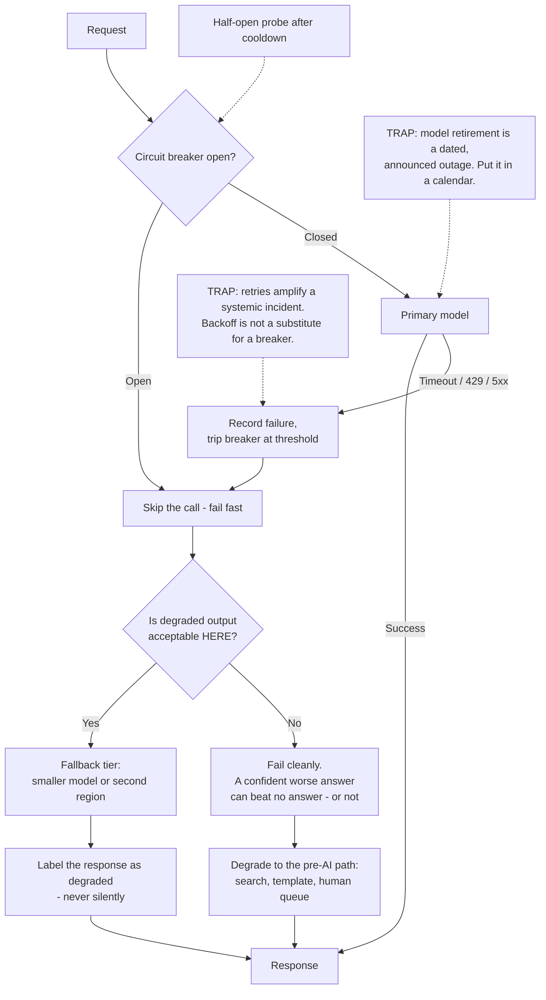

# When the Provider Fails: Fallback Tiers, Graceful Degradation and Model Deprecation

**Level:** Intermediate
**Tree:** [Running and Integrating Models](../README.md)
**Branch:** [Managed Model Services and Prompt Discipline](README.md)
**Forest:** [AI & Intelligent Systems](../../../README.md)

## Explanation

### You have a hard dependency on somebody else's uptime

A managed model is an external service on the critical path of a feature you own, and
unlike a database you cannot restore it or fail it over yourself. The realistic failures
are broader than "the API is down": elevated latency, rate limiting under regional load,
a capacity error on a deployment that worked yesterday, and the model version you depend
on being retired on a published schedule. **Provider availability is not something you
influence** - the only decisions you control are what your system does without it.

### Retry with backoff makes a provider incident worse

The reflex is to retry, and at small scale it works. During a provider incident it is
harmful: every client retries at once, amplifying load at the moment capacity is
scarcest, and rate-limit responses convert into more rate-limit responses. **Retries help
with an isolated blip and hurt during a systemic failure**, which is precisely when you
need them to behave. The control that distinguishes the two is a circuit breaker - after
a failure threshold, stop calling and fail immediately for a cooling period, so the
provider gets room to recover and your callers get a fast answer instead of a slow one.

### Fallback has a quality cliff, and you must measure it before the incident

Routing to a cheaper model when the primary is unavailable sounds obviously correct. It
is a genuine trade only if you know what it costs: the fallback produces different,
usually worse output, and **"degraded" is a decision about acceptable quality, not a
technical state**. Measure the delta on a golden set in advance, per use case. For a
meeting summary, a weaker answer beats an error. For anything a person acts on without
checking, a confidently worse answer can be worse than none, and failing cleanly is
safer.

### Degrade to the old path, not to nothing

The most useful fallback is frequently not another model. Before the assistant existed
there was a search box, a template, a form or a human queue, and that path usually still
works. **Falling back to the pre-AI experience keeps the user productive** where a
spinner and an error message do not, and it costs nothing to keep available. Design the
degraded state explicitly and tell the user which one they are in: silent degradation
produces answers people trust at the exact moment they should not.

### Multi-provider abstraction is insurance with a premium

Putting an abstraction over two providers is standard advice and it is not free. You
converge on the features both support, so structured outputs, caching and tool-calling
drift to the lowest common denominator. **The same prompt is not the same behaviour
across providers**, so every prompt needs evaluating on each, and that suite has to be
maintained. Portability is a project, not a configuration flag - worth it when an outage
is business-critical, and overhead when the real requirement was a documented degraded
mode.

### Deprecation is a scheduled outage you were told about

Providers retire model versions on published dates. Teams pin a version, ship, and meet
the retirement months later as a surprise incident. This is the one AI outage that is
entirely preventable: **pin the version, record the retirement date as a dated task with
an owner, and re-run your evaluation suite against the successor before the deadline**
rather than discovering the behaviour change in production. Treating an announced
end-of-life as background noise turns a planned migration into an unplanned one.

## Architecture and flow



## Commands

### Command 1

Read the provider's current service health rather than inferring an incident from your own error rate

```text
curl -s https://status.example-provider.com/api/v2/summary.json | jq -r ".incidents[] | [.impact, .name] | @tsv"
```

### Command 2

Separate rate limiting from genuine outage in your own logs, because the two need opposite responses

```text
jq -r "select(.upstream_status != 200) | .upstream_status" gateway.log | sort | uniq -c | sort -rn
```

### Command 3

Check the remaining rate-limit headroom before concluding that capacity is the problem

```text
curl -sD - -o /dev/null "$ENDPOINT/v1/messages" -H "x-api-key: $KEY" | grep -i "ratelimit"
```

### Command 4

List the model versions you depend on and the dates they retire, which is the outage you can prevent

```text
az cognitiveservices account deployment list -g "$RG" -n "$ACCOUNT" --query "[].{name:name, model:properties.model.version, expires:properties.rateLimits}" -o table
```

### Command 5

Report how often the fallback tier served traffic, since a fallback nobody measures is untested

```text
jq -r "select(.tier != \"primary\") | .tier" gateway.log | sort | uniq -c
```

### Command 6

Confirm the circuit breaker actually opens, by counting fast failures against upstream calls during a drill

```text
jq -r "[.breaker_state, .upstream_called] | @tsv" drill.log | sort | uniq -c
```

## Automation scripts

### failover_drill.py

Fallback tiers are configured once and never exercised, so the quality cliff is
discovered during the incident. This runs a golden set against the primary and each
fallback, reports the delta per tier, and says whether degrading beats failing here.

Requires `pip install requests`. The key is read from `PROVIDER_API_KEY` rather than the
command line, where it would be kept in shell history.

```python
#!/usr/bin/env python3
"""Measure what each fallback tier actually costs in answer quality.

Runs a golden set of prompts with known-good answers against the primary
model and every configured fallback, scoring each tier. The output is the
number you need before an incident: how much worse degraded is, per tier.
"""
import argparse
import json
import os
import sys
import time

import requests

# Below this, a tier is worse than returning an error for anything a person
# will act on without checking. Above it, degrading beats failing.
ACCEPTABLE_DELTA = 0.15

def ask(endpoint, key, model, prompt, timeout=30):
    started = time.monotonic()
    response = requests.post(
        f"{endpoint}/v1/messages",
        headers={"x-api-key": key, "content-type": "application/json"},
        json={"model": model, "max_tokens": 512,
              "messages": [{"role": "user", "content": prompt}]},
        timeout=timeout,
    )
    response.raise_for_status()
    body = response.json()
    return body["content"][0]["text"], time.monotonic() - started

def score(answer, expected_keywords):
    """Deliberately crude. Replace with your evaluation harness - the point is
    that SOME number exists per tier before the incident, not that it is subtle."""
    hits = sum(1 for k in expected_keywords if k.lower() in answer.lower())
    return hits / len(expected_keywords) if expected_keywords else 0.0

def main():
    parser = argparse.ArgumentParser()
    parser.add_argument("golden", help='JSONL of {"prompt": ..., "keywords": [...]}')
    parser.add_argument("--endpoint", required=True)
    parser.add_argument("--tiers", nargs="+", required=True,
                        help="model ids, primary first")
    args = parser.parse_args()
    key = os.environ.get("PROVIDER_API_KEY") or parser.error("set PROVIDER_API_KEY first")

    with open(args.golden) as handle:
        cases = [json.loads(line) for line in handle if line.strip()]

    results = {}
    for tier in args.tiers:
        scores, latencies, errors = [], [], 0
        for case in cases:
            try:
                answer, elapsed = ask(args.endpoint, key, tier, case["prompt"])
            except requests.RequestException:
                errors += 1
                continue
            scores.append(score(answer, case.get("keywords", [])))
            latencies.append(elapsed)
        results[tier] = {
            "score": sum(scores) / len(scores) if scores else 0.0,
            "p50_latency": sorted(latencies)[len(latencies) // 2] if latencies else None,
            "errors": errors,
        }

    primary = args.tiers[0]
    baseline = results[primary]["score"]
    print(f"{'tier':<28}{'score':>8}{'delta':>9}{'p50 s':>8}{'errors':>8}")
    for tier in args.tiers:
        r = results[tier]
        delta = r["score"] - baseline
        latency = f"{r['p50_latency']:.1f}" if r["p50_latency"] else "-"
        print(f"{tier:<28}{r['score']:>8.0%}{delta:>+9.0%}{latency:>8}{r['errors']:>8}")

    print()
    for tier in args.tiers[1:]:
        delta = baseline - results[tier]["score"]
        if delta > ACCEPTABLE_DELTA:
            print(
                f"{tier}: {delta:.0%} worse than primary. For anything a person acts "
                "on unchecked, failing cleanly is safer than serving this quietly. "
                "If you keep it, label the response as degraded."
            )
        else:
            print(f"{tier}: {delta:.0%} worse than primary - degrading beats failing.")

    # A tier nobody has exercised is a guess, not a control.
    print("\nRe-run this whenever a tier, a model version or the prompt changes.")
    return 0

if __name__ == "__main__":
    sys.exit(main())
```

## Lab

**Objective:** Make one AI feature survive a provider outage, and decide from measurement rather than instinct whether it should degrade or fail.

### Steps

1. Take a working feature that calls a managed model through a gateway, and record its normal success rate and latency.
2. Build a small golden set of prompts with known-good answers for that feature.
3. Run `failover_drill.py` across the primary and two candidate fallback tiers, recording the quality delta for each.
4. Decide, per use case, whether degraded output is acceptable or whether failing cleanly is safer, and write the decision down with the number behind it.
5. Simulate an outage by pointing the primary at an unreachable endpoint, and observe what the feature does with no failover in place.
6. Add retry with backoff only, then simulate rate limiting and measure the total request volume you send upstream.
7. Add a circuit breaker, repeat the rate-limit simulation, and compare upstream volume against the retry-only run.
8. Implement the chosen fallback, and confirm the response is visibly labelled as degraded rather than passing silently.
9. Implement the non-AI degraded path - the search box, template or queue that predates the feature - and confirm a user can still finish the task.
10. Find the retirement date of the model version you depend on, and create a dated task with a named owner to evaluate its successor.

### Validation

- The quality delta for each fallback tier is a recorded number from the golden set, not an assumption.
- The degrade-or-fail decision is written down per use case, with the measurement and the reasoning that produced it.
- Upstream request volume under simulated rate limiting is measurably lower with the circuit breaker than with retries alone.
- The breaker is observed opening, serving fast failures, and closing after its cooldown probe; a degraded response is distinguishable from a normal one by the user and by a log field.
- A user completes the task through the non-AI path while the model is unavailable.
- The model retirement date exists as a dated task with a named owner, not as a note in a document.

## Operational automation

### Making the degraded path real rather than theoretical

- **Exercise the fallback on a schedule, not during incidents.** A tier nobody has
  routed traffic to is a guess. Send a small share of production traffic through it
  periodically, or run the drill in CI, so its quality and latency are known numbers.
- **Put the breaker in the gateway, not in each service.** Placed per-service, the
  threshold is inconsistent and half the callers lack one. In the gateway it is a single
  policy, observable in one place, and every caller inherits it - including the one
  someone ships next month.
- **Alert on fallback rate, not only on errors.** Traffic quietly served by a degraded
  tier looks healthy on an error dashboard while quality has dropped for everyone. Treat
  a rising fallback share as an incident signal in its own right.
- **Record the tier that served every request.** Without it you cannot answer "was this
  produced by the degraded model" during a complaint - exactly what a support escalation
  asks.
- **Track model retirement dates as dated tasks with owners.** Providers announce them;
  teams file them mentally and meet them as surprises. This is the only AI outage that is
  fully preventable, and preventing it costs one calendar entry per pinned version.
- **Re-run the evaluation suite against a successor version before migrating.** A newer
  model is not automatically a compatible one, and prompts tuned against the old version
  can regress. The migration deadline is the provider's; the evidence is yours.

## Troubleshooting

### Scenario 1: A provider blip became a full outage for your service.

**Likely cause:** Retries without a circuit breaker. Every client retried at once, amplifying load at the moment capacity was scarcest, and rate-limit responses generated more retries.

**Resolution:** Add a breaker that stops calling after a failure threshold and fails fast for a cooldown, then probes with a single request before closing. Confirm it by comparing upstream request volume during the incident against normal: volume rising while success falls is retry amplification, not provider failure alone. Backoff and jitter help but do not substitute for a breaker, because they still call.

### Scenario 2: Users report bad answers, but no errors were logged.

**Likely cause:** The fallback tier served traffic silently. From the dashboard's perspective everything succeeded, because a degraded answer is a 200.

**Resolution:** Record the serving tier on every request and alert on fallback share, so a silent switch is visible. Confirm it from the tier field for the complaint window, then decide whether that tier should serve this use case at all - if the delta is large and users act on the output unchecked, failing cleanly is safer, and labelling the response is the minimum either way.

### Scenario 3: The model version stopped working with no change on your side.

**Likely cause:** The version reached its announced retirement date. This is a scheduled outage that was communicated and not tracked.

**Resolution:** Pin versions explicitly, list every pinned version with its retirement date, and create a dated task with an owner for each. Confirm it from the provider's deprecation notice and your deployment configuration. Migrating under time pressure is how prompt regressions reach production, so evaluating the successor belongs well before the deadline.

### Scenario 4: Failover to a second region did not help.

**Likely cause:** The incident was in a shared control plane, or the account-level quota is global, so the second region was never independent in the way the diagram implied.

**Resolution:** Establish what is actually independent - region, account, provider - and test the failover path against the failure mode you are defending against rather than against a reachability check. Confirm it by checking whether the second region returned the same error class. Where only cross-provider failover gives real independence, accept that cost or document the degraded mode honestly instead.

### Scenario 5: The abstraction layer works, but answers differ between providers.

**Likely cause:** The same prompt is not the same behaviour across providers. Instruction following, formatting and refusal behaviour differ, and the abstraction hid the difference rather than removing it.

**Resolution:** Evaluate every prompt against each provider and maintain that suite, treating provider portability as a project with ongoing cost rather than a configuration flag. Confirm the scope by running your golden set on both. If the evaluation burden is not justified, the honest alternative is a single provider plus a well-designed degraded mode, which is cheaper and more predictable than an abstraction nobody validates.

## Interview questions

### 1. Your assistant depends on one model provider. How do you make it survive an outage?

I start by separating what I control from what I do not. Provider availability is not something I influence, so the design question is only what my system does when calls fail. First a circuit breaker at the gateway, because retries alone amplify a systemic incident. Then a per-use-case decision about whether degraded output is acceptable, measured against a golden set before the incident: "degraded" is a statement about acceptable quality, not a technical state. For a summary, a weaker model beats an error; for something a person acts on unchecked, a confidently worse answer can be worse than failing. And the fallback I reach for first is often not another model - the search box or form that predates the feature usually still works. Whatever the path, the degraded state is labelled - silent degradation produces answers people trust at the moment they should not.

### 2. Why is retry with exponential backoff not enough?

Because it helps with the failure it was designed for and hurts with the one that actually takes you down. For an isolated blip - a dropped connection, one bad instance - a retry succeeds and nobody notices. During a provider-wide incident every client retries at once, so offered load rises while capacity is already short, rate limits produce more retries, and recovery takes longer for everyone. Backoff and jitter spread retries out, which helps, but they still call. What distinguishes the two cases is a circuit breaker: after a threshold of failures you stop calling entirely for a cooling period, give the provider room to recover, and return a fast failure rather than a slow one, which also stops your own request queues filling with waiting work. A single half-open probe then decides whether to resume. I put that in the gateway rather than each service, so the policy is consistent and every future caller inherits it.

### 3. When is falling back to a cheaper model the wrong answer?

When the output is something a person will act on without checking. The fallback produces different and usually worse answers, so if that output feeds a decision - a figure someone will quote, a recommendation someone will follow - a confidently wrong answer is worse than an error, because an error prompts a human to go and look while a plausible answer does not. So I treat it as a per-use-case decision backed by a measured quality delta rather than a platform-wide setting. It is also wrong when the fallback has not been exercised: a tier nobody has routed traffic through is a guess about behaviour, not a control. And it is wrong whenever the degradation is silent: if I keep a weaker tier, the response is labelled and the serving tier logged, so a complaint can be answered and the quality drop is visible rather than hidden behind a wall of successful 200s.

### 4. Is a multi-provider abstraction layer worth building?

Sometimes, but I would not treat it as free insurance, because the premium is real. You converge on features both providers support, so structured outputs, caching and tool-calling drift to the lowest common denominator. More importantly the same prompt is not the same behaviour across providers - instruction following, formatting and refusals differ - so each prompt needs its own evaluation per provider, and that suite has to be maintained as prompts change. That is a project with ongoing cost, not a configuration flag. I build it when an outage is genuinely business-critical and the organisation will fund the evaluation. Otherwise the honest alternative is usually better: one provider, a circuit breaker, a measured degraded mode, and the pre-AI path kept alive. That fails in a way you have actually tested - more than can be said for an abstraction whose second provider nobody has validated this quarter.

## Certification alignment

- **Microsoft Certified: Azure AI Apps and Agents Developer Associate (AI-103)** - Plan and manage an Azure AI solution: listing Azure AI deployments and their pinned model versions, tracking each version's retirement date as a dated task with an owner, and evaluating the successor before the deadline.
- **Microsoft Certified: Azure Solutions Architect Expert (AZ-305)** - Design business continuity solutions: fallback tiers to a smaller model or second region, testing whether that region is genuinely independent, and degrading to the pre-AI path.
- **AWS Certified Solutions Architect - Associate** - Domain 2: Design Resilient Architectures: circuit breakers instead of retry-only handling, separating rate limiting from genuine outage, and graceful degradation for a managed model dependency.
- **Google Cloud Professional Cloud Architect** - reliability design, failure modes and dependency management.
- **Vendor-neutral** - Google SRE practice: circuit breaking, load shedding and graceful degradation under overload.

## References

- [Microsoft Learn: Microsoft Foundry Models lifecycle and support policy](https://learn.microsoft.com/azure/ai-foundry/openai/concepts/model-retirements) - Model deprecation and retirement lifecycle, notification timelines and schedules.
- [Microsoft Learn: Azure OpenAI in Microsoft Foundry Models quotas and limits](https://learn.microsoft.com/azure/foundry/openai/quotas-limits) - Quota, rate limits and capacity for Azure OpenAI deployments.
- [Microsoft Learn: What is provisioned throughput?](https://learn.microsoft.com/azure/ai-foundry/openai/concepts/provisioned-throughput) - Provisioned throughput (PTU) capacity.
- [Anthropic (Claude Platform Docs): Rate limits](https://platform.claude.com/docs/en/api/rate-limits) - API rate limits and rate-limit headroom.
- [Anthropic (Claude Platform Docs): Claude API errors](https://platform.claude.com/docs/en/api/errors) - Error codes and recommended retry behaviour.
- [Microsoft Learn (Azure Architecture Center): Circuit Breaker pattern](https://learn.microsoft.com/azure/architecture/patterns/circuit-breaker) - Circuit Breaker pattern and when it applies.
- [Microsoft Learn (Azure Architecture Center): Retry pattern](https://learn.microsoft.com/azure/architecture/patterns/retry) - Retry pattern and when it applies.
- [Google (sre.google): Handling Overload (Site Reliability Engineering, Chapter 21)](https://sre.google/sre-book/handling-overload/) - Handling overload and degraded responses.
- [Google (sre.google): Addressing Cascading Failures (Site Reliability Engineering, Chapter 22)](https://sre.google/sre-book/addressing-cascading-failures/) - Load shedding and graceful degradation.
- [Amazon Web Services (AWS Well-Architected Framework, Reliability Pillar): Design interactions in a distributed system to mitigate or withstand failures](https://docs.aws.amazon.com/wellarchitected/latest/reliability-pillar/design-interactions-in-a-distributed-system-to-mitigate-or-withstand-failures.html) - Dependency failure modes and mitigation.
- [Amazon Web Services (AWS Well-Architected Framework, Reliability Pillar): REL05-BP01 Implement graceful degradation to transform applicable hard dependencies into soft dependencies](https://docs.aws.amazon.com/wellarchitected/latest/reliability-pillar/rel_mitigate_interaction_failure_graceful_degradation.html) - Graceful degradation when a dependency fails.

## Suggested video search

LLM provider outage failover circuit breaker graceful degradation fallback model quality delta deprecation

---

> Validate commands, versions, permissions, licensing, and rollback procedures in an isolated lab before production use.
