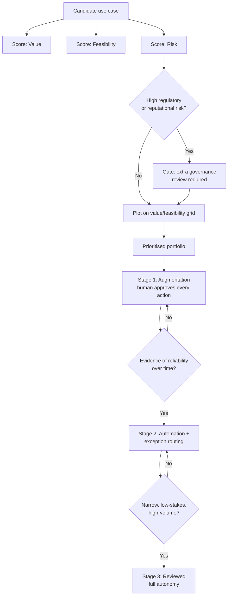

# Enterprise AI Adoption Patterns and Use-Case Selection

**Level:** Expert
**Tree:** [AI Operations & Governance](../README.md)
**Branch:** [Governance, Compliance and Enterprise Adoption](README.md)
**Forest:** [AI & Intelligent Systems](../../../README.md)

## Explanation

Most enterprise AI programs fail at the portfolio level, not the technical level: they pick the wrong use cases, in the wrong order, with no shared way to compare one candidate against another. Getting use-case selection right matters more than getting any single model choice right.

A workable selection framework scores every candidate on three axes. **Value** - quantified business impact: hours saved, error rate reduced, revenue influenced, expressed in a comparable unit across very different use cases. **Feasibility** - data availability and quality, integration complexity with existing systems, and whether the task is within current model capability at an acceptable cost. **Risk** - regulatory exposure (does this fall into an EU AI Act high-risk category), reputational exposure if it fails publicly, and reversibility of a bad decision the system makes. Plotting candidates on a value-versus-feasibility grid, with risk as a gating filter, surfaces an honest priority order instead of whichever use case the loudest stakeholder championed.

Adoption maturity follows a recognisable path. **Augmentation** - a human remains in the loop for every decision, the AI drafts and the human approves - is the correct starting point for nearly every new use case, because it builds organisational trust and produces the labelled data needed to evaluate the next stage. **Automation with exception handling** - the AI acts autonomously on high-confidence cases and routes low-confidence cases to a human - is earned only after augmentation has produced enough evidence of reliability. **Full autonomy** is appropriate for a narrow set of low-stakes, high-volume, well-bounded tasks, and should be treated as an explicit, reviewed graduation, not a default target.

The most common adoption failure is skipping stages under pressure to show ROI quickly: automating a high-stakes decision before the augmentation stage produced real evidence of reliability, which produces the very incident that destroys organisational trust in the whole program.

## Architecture and flow



## Commands

### Command 1

Inventory existing AI resources as a starting point for a use-case adoption audit.

```text
az cognitiveservices account list --query "[].{name:name, kind:kind, region:location}" -o table
```

### Command 2

Measure how often humans override an augmentation-stage AI suggestion, a key readiness signal for graduating to automation.

```text
az monitor log-analytics query -w $LAW_ID --analytics-query "AppTraces | where Message has 'human_override' | summarize count() by bin(TimeGenerated, 7d)"
```

### Command 3

Track daily usage volume per use case as an input to the value-versus-feasibility scoring.

```text
az monitor metrics list --resource $AOAI_ID --metric ProcessedPromptTokens,GeneratedTokens --interval P1D
```

### Command 4

Tag AI resources with their adoption stage and business owner for portfolio-level reporting.

```text
az resource tag --tags useCaseStage=augmentation businessOwner=finance-ops --ids $RESOURCE_ID
```

### Command 5

Break down AI spend by adoption stage to see where investment is concentrated versus where value is proven.

```text
az costmanagement query --type Usage --timeframe MonthToDate --scope /subscriptions/$SUB --dataset "{\"granularity\":\"Monthly\",\"aggregation\":{\"totalCost\":{\"name\":\"PreTaxCost\",\"function\":\"Sum\"}},\"grouping\":[{\"type\":\"TagKey\",\"name\":\"useCaseStage\"}]}"
```

## Automation scripts

### Use-case portfolio scorer and readiness gate

```python
#!/usr/bin/env python3
"""Score a portfolio of candidate AI use cases on value, feasibility and
risk, rank them, and flag which augmentation-stage use cases have enough
human-override evidence to be considered for automation graduation.

Input is a JSON file (use_cases.json): a list of entries with fields
name, value_score (1-10), feasibility_score (1-10), risk_tier
(low|medium|high), stage (augmentation|automation|autonomy),
override_rate (0-1, only meaningful at augmentation stage),
sample_size (number of reviewed decisions).
"""
import json
import sys

MIN_SAMPLE_FOR_GRADUATION = 200
MAX_OVERRIDE_RATE_FOR_GRADUATION = 0.10


def load_use_cases(path):
    try:
        with open(path, encoding="utf-8") as fh:
            return json.load(fh)
    except FileNotFoundError:
        print("ERROR: use case file not found: %s" % path)
        sys.exit(2)
    except json.JSONDecodeError as exc:
        print("ERROR: invalid JSON in use case file: %s" % exc)
        sys.exit(2)


def priority_score(entry):
    value = entry.get("value_score", 0)
    feasibility = entry.get("feasibility_score", 0)
    risk_penalty = {"low": 0, "medium": 2, "high": 5}.get(entry.get("risk_tier", "medium"), 3)
    return (value * feasibility) - risk_penalty


def graduation_ready(entry):
    if entry.get("stage") != "augmentation":
        return None
    sample = entry.get("sample_size", 0)
    override = entry.get("override_rate", 1.0)
    if sample < MIN_SAMPLE_FOR_GRADUATION:
        return "insufficient sample (%d < %d)" % (sample, MIN_SAMPLE_FOR_GRADUATION)
    if override > MAX_OVERRIDE_RATE_FOR_GRADUATION:
        return "override rate too high (%.2f > %.2f)" % (override, MAX_OVERRIDE_RATE_FOR_GRADUATION)
    if entry.get("risk_tier") == "high":
        return "high risk tier requires manual governance sign-off before graduation"
    return "READY"


def main():
    path = sys.argv[1] if len(sys.argv) > 1 else "use_cases.json"
    entries = load_use_cases(path)
    if not isinstance(entries, list):
        print("ERROR: use case file must contain a JSON list")
        sys.exit(2)

    for entry in entries:
        entry["priority_score"] = priority_score(entry)
        entry["graduation_status"] = graduation_ready(entry)

    ranked = sorted(entries, key=lambda e: e["priority_score"], reverse=True)

    print("%-28s %6s %6s %8s %10s %-40s" % (
        "USE CASE", "VALUE", "FEAS", "PRIORITY", "STAGE", "GRADUATION STATUS"))
    for e in ranked:
        print("%-28s %6s %6s %8.1f %10s %-40s" % (
            e.get("name", "unnamed"), e.get("value_score", "-"),
            e.get("feasibility_score", "-"), e["priority_score"],
            e.get("stage", "-"), e["graduation_status"] or "n/a"))

    with open("use-case-portfolio.json", "w", encoding="utf-8") as fh:
        json.dump(ranked, fh, indent=2)
    print("\nWritten to use-case-portfolio.json")


if __name__ == "__main__":
    main()
```

## Lab

**Objective:** Build and score a portfolio of candidate AI use cases, then apply an objective readiness gate to decide which augmentation-stage use case is actually ready to graduate toward automation.

### Steps

1. Draft use_cases.json with 5-6 realistic candidate use cases for a mid-size enterprise (contract review assistant, IT helpdesk triage, financial forecast drafting, employment screening, code review assistant), each with value_score, feasibility_score, risk_tier and stage.
2. For each candidate, write a one-paragraph justification for its value_score and feasibility_score, citing a concrete estimated metric such as hours saved per week.
3. For any candidate already at the augmentation stage, add override_rate and sample_size fields reflecting a plausible pilot period.
4. Run the portfolio scorer script and review the ranked priority list and graduation_status column.
5. Identify the highest-priority augmentation-stage candidate whose graduation_status is not READY, and explain in writing which specific gate it fails and what evidence would need to change that.
6. Adjust that candidate's sample_size and override_rate to plausible improved values reflecting three more months of pilot data, and confirm the graduation_status changes to READY.
7. For the employment-screening use case, cross-reference its risk_tier against the EU AI Act high-risk categories from the governance leaf and confirm the graduation logic correctly requires manual governance sign-off regardless of override rate.

### Validation

- use-case-portfolio.json contains a priority_score and graduation_status for every entry, correctly ranked.
- At least one augmentation-stage entry is correctly flagged as not ready with a specific, correct reason (insufficient sample or high override rate).
- After adjusting sample_size and override_rate, the same entry's graduation_status changes to READY on re-run.
- The employment-screening entry's graduation_status requires manual sign-off specifically because of its high risk_tier, independent of its sample_size or override_rate values.
- The written justifications name a concrete, plausible business metric for each use case's value_score.

## Operational automation

### Automating adoption governance at portfolio scale

**Run the portfolio scorer as a living document, not a one-time exercise.** Schedule the scoring script to run monthly against an updated use_cases.json maintained by the business owners, so the priority ranking reflects current pilot data rather than the assumptions made at kickoff.

**Automate the override-rate signal from production, not from memory.** Pull the human-override rate directly from application logs (a log line whenever a human edits or rejects an AI suggestion) rather than from a survey or a manually-updated spreadsheet, so the graduation gate is evidence-based and cannot be gamed by an optimistic self-report.

**Wire the graduation gate into the change-management process.** A use case's stage transition (augmentation to automation, automation to autonomy) should require a change request that automatically attaches the current graduation_status output as supporting evidence, giving the approving body an objective artifact instead of a verbal assurance.

**Automate the risk re-check on every stage transition.** Any proposed graduation should automatically re-run the EU AI Act risk classification, because a use case's effective risk can change as its scope creeps - a summarisation tool that started drafting internal notes and grew into producing customer-facing decisions is a different risk tier than the one originally approved.

**Report portfolio health, not just individual pilots.** Aggregate value delivered, cost, and incident counts across the whole portfolio on a recurring cadence to leadership, so investment decisions are made from a comparable, standing view rather than whichever pilot presented most recently.

## Troubleshooting

### Scenario 1: An AI pilot that looked successful in a demo produces a costly public-facing error within weeks of full automation.

**Likely cause:** The use case skipped the augmentation stage, or graduated from it without enough reviewed volume to detect a low-frequency but high-impact failure mode.

**Resolution:** Require a minimum reviewed sample size and a maximum human-override rate, tracked from real production logs, before any graduation to automation, and treat this as a hard gate rather than a guideline that can be waived under delivery pressure.

### Scenario 2: The AI program has a dozen active pilots and leadership cannot say which ones are actually delivering value.

**Likely cause:** Use cases were selected individually by different teams with no shared scoring framework, so there is no comparable basis for prioritisation or for deciding what to defund.

**Resolution:** Retroactively score every active pilot on the same value/feasibility/risk framework and publish a single ranked portfolio view, making trade-offs explicit instead of implicit.

### Scenario 3: A use case initially approved as low-risk later turns out to influence a high-stakes decision.

**Likely cause:** The use case's scope expanded gradually after initial approval (scope creep) with no re-classification checkpoint, so its actual risk tier outgrew its original governance controls.

**Resolution:** Require risk re-classification on any material change to a use case's scope or decision authority, not only at initial approval, and tie this check to the same change-management gate used for stage graduation.

### Scenario 4: A promising, high-value use case stalls indefinitely at the augmentation stage with no clear path forward.

**Likely cause:** There is no objective, pre-agreed readiness threshold for graduation, so the decision to automate becomes a subjective and politically fraught judgment call that nobody wants to own.

**Resolution:** Define the graduation thresholds (minimum sample size, maximum override rate) in writing before the pilot starts, so the eventual decision is a mechanical evaluation against a pre-agreed bar rather than a fresh negotiation.

### Scenario 5: Two business units independently build overlapping AI solutions for essentially the same problem.

**Likely cause:** There is no shared, visible use-case register, so teams cannot discover what already exists or is already in flight before starting their own build.

**Resolution:** Maintain the use-case portfolio as a shared, visible register (the same one feeding the AI governance system register), and require a check against it as part of any new AI initiative's kickoff.

## Interview questions

### 1. How would you build a framework to prioritise AI use cases across a large enterprise?

I score every candidate consistently on three axes so different business units' proposals become comparable. Value, expressed in a common unit wherever possible - hours saved, error rate reduction, revenue influenced - forces sponsors to quantify a benefit rather than assert one. Feasibility captures data availability and quality, integration complexity with existing systems, and whether the task is genuinely within current model capability at acceptable cost - many failed pilots are actually feasibility failures mislabelled as model-quality failures. Risk covers regulatory exposure (does it fall into an EU AI Act high-risk category), reputational exposure if it fails publicly, and reversibility of a bad decision. I plot value against feasibility on a simple grid and use risk as a gating filter rather than a third axis on the same chart, because a high-risk, high-value use case still needs to proceed if it is truly feasible - it just needs proportionally more governance, not automatic deprioritisation. The output is a ranked, defensible portfolio view that survives a change in which team is asking loudest for their pet project.

### 2. Describe the augmentation-to-automation-to-autonomy maturity path and why skipping stages causes real incidents.

Augmentation keeps a human in the loop for every decision - the AI drafts, suggests or scores, and a person approves or overrides. This is the correct default starting point for nearly any new use case because it builds organisational trust gradually and, critically, it generates the labelled evidence - override rate, error patterns, edge cases - needed to make an informed decision about the next stage. Automation with exception handling lets the AI act autonomously on high-confidence cases while routing low-confidence cases to a human, and it should only be earned once augmentation has produced real evidence of low override rates across a meaningful sample size. Full autonomy, appropriate only for narrow, low-stakes, high-volume, well-bounded tasks, should be an explicit graduation decision reviewed against pre-agreed thresholds, not a default end state. The common failure mode is organisational pressure to show ROI quickly, which pushes a team to automate before augmentation produced real evidence - the resulting incident, when a rare but severe failure mode surfaces at scale, damages trust far more broadly than the specific use case, often stalling the entire AI program's other, genuinely ready initiatives.

### 3. How do you decide whether a proposed AI use case is ready to move from a human-in-the-loop pilot to autonomous operation?

I require an explicit, pre-agreed, quantitative gate rather than a subjective judgment made under delivery pressure. Concretely: a minimum sample size of reviewed decisions large enough to have plausibly surfaced rare failure modes, not just common ones - a few dozen reviewed cases proves almost nothing, a few hundred starts to. A maximum human-override rate over that sample, because a high rate means the AI's suggestions are frequently wrong or the human reviewer does not trust them, either of which disqualifies automation regardless of aggregate accuracy claims. A risk re-classification check, because even a use case with excellent pilot metrics may sit in an EU AI Act high-risk category that mandates manual governance sign-off regardless of technical readiness - technical readiness and regulatory permission are separate gates, and both must clear. Finally I look for evidence the override cases were actually analysed, not just counted - a low override rate on a review process nobody is paying attention to is not evidence of quality, it is evidence of neglect.

### 4. What is the most common way enterprise AI adoption programs fail, and how would you prevent it structurally?

The most common failure is at the portfolio level rather than the technical level: organisations pick use cases based on stakeholder enthusiasm or visibility rather than a comparable value/feasibility/risk assessment, then compound it by rushing high-visibility pilots straight to automation to demonstrate ROI before the augmentation stage has produced real evidence of reliability. The resulting incident - typically a rare failure mode that the small pilot sample never surfaced - becomes a headline example that damages trust in the entire program, not just the one use case, and stalls unrelated initiatives that were actually ready. Preventing this structurally means separating two decisions that are often conflated: which use cases are worth pursuing (the portfolio-level value/feasibility/risk scoring, applied consistently and revisited on a schedule) and when a specific use case is ready to advance in maturity stage (an objective, pre-agreed graduation gate on sample size, override rate, and risk re-classification, immune to being waived under schedule pressure because the thresholds were fixed before anyone had a personal stake in a specific outcome).

## Certification alignment

- AI-900 Azure AI Fundamentals - Identify common AI workloads and their business scenarios
- AI-102 Azure AI Engineer Associate - Plan an Azure AI solution aligned to business requirements
- Vendor-neutral - PMI/Agile portfolio prioritisation practice applied to AI initiative selection
- Vendor-neutral - NIST AI RMF GOVERN function: organisational accountability and risk tolerance for AI adoption

## References

- NIST AI 100-1 - AI Risk Management Framework, GOVERN and MAP functions
- Microsoft Learn - Cloud Adoption Framework, AI adoption guidance
- McKinsey and Gartner enterprise AI adoption surveys - human-in-the-loop maturity models
- ISO/IEC 42001 - Artificial intelligence management systems standard, Annex A controls on lifecycle stages

## Suggested video search

enterprise AI adoption strategy use case prioritization value feasibility framework

---

> Validate commands, versions, permissions, licensing, and rollback procedures in an isolated lab before production use.
