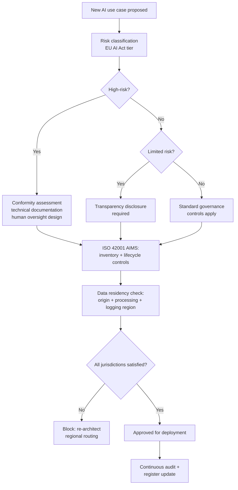

# AI Governance and Compliance: ISO 42001, EU AI Act and Data Residency

**Level:** Enterprise
**Tree:** [AI Operations & Governance](../README.md)
**Branch:** [Governance, Compliance and Enterprise Adoption](README.md)
**Forest:** [AI & Intelligent Systems](../../../README.md)

## Explanation

AI governance turns "we use AI responsibly" from a slogan into an auditable management system. Three frameworks dominate enterprise conversations today and they are complementary rather than competing.

**ISO/IEC 42001** is a certifiable AI management system standard, structured like ISO 27001: it requires a documented AI policy, defined roles and responsibilities, a risk assessment process specific to AI systems, an inventory of AI systems in use, lifecycle controls from design through decommissioning, and a continual-improvement cycle audited by an accredited body. Its value is procedural rigor - it does not dictate specific technical controls, it dictates that you have a disciplined, evidenced process for deciding and enforcing them.

The **EU AI Act** is binding regulation with a risk-tiered structure: unacceptable-risk uses are banned outright, high-risk systems (biometric identification, employment decisions, critical infrastructure control, among others) carry substantial obligations - conformity assessment, technical documentation, human oversight, logging - before market placement, limited-risk systems mainly carry transparency duties (disclosing AI-generated content, informing users they are interacting with AI), and minimal-risk systems have no specific obligations. Extraterritorial reach means it applies to systems used by EU-based individuals regardless of where the provider is headquartered, so most multinational enterprises need a classification exercise even without an EU legal entity.

**Data residency** intersects both: where prompts, embeddings and logs are physically processed and stored must satisfy the strictest applicable jurisdiction across all three - the data's origin, the model provider's processing location, and any downstream logging or evaluation pipeline. A conversation entirely within one region can still violate residency if telemetry is shipped to a global log sink. Practical governance treats residency as a routing constraint enforced at the infrastructure layer (regional deployments, data-zone SKUs), not a policy document alone.

## Architecture and flow



## Commands

### Command 1

Provision an Azure OpenAI account in an EU data-boundary region to satisfy residency requirements.

```text
az cognitiveservices account create -g rg-ai-eu -n aoai-eu-prod -l swedencentral --kind OpenAI --sku S0 --custom-domain aoai-eu-prod
```

### Command 2

Confirm the deployed region as evidence for a data residency audit.

```text
az cognitiveservices account show -g rg-ai-eu -n aoai-eu-prod --query location
```

### Command 3

Route diagnostic logs to an EU-region Log Analytics workspace so telemetry does not leave the residency boundary.

```text
az monitor diagnostic-settings create --name eu-only-logs --resource $AOAI_ID --workspace $LAW_EU_ID --logs "[{category:RequestResponse,enabled:true}]"
```

### Command 4

Enforce via Azure Policy that AI resources can only be created in approved EU regions.

```text
az policy assignment create --name enforce-eu-region --policy $LOCATION_POLICY_ID --scope /subscriptions/$SUB --params "{\"listOfAllowedLocations\":{\"value\":[\"swedencentral\",\"francecentral\"]}}"
```

### Command 5

Produce the AI system inventory table required as evidence for an ISO 42001 audit.

```text
az cognitiveservices account list --query "[].{name:name, region:location, kind:kind}" -o table
```

### Command 6

Tag a resource with its EU AI Act risk classification for reporting and access control.

```text
az resource tag --tags aiActRiskTier=high --ids $RESOURCE_ID
```

## Automation scripts

### AI system register and residency compliance report

```python
#!/usr/bin/env python3
"""Build an AI system inventory and residency/risk compliance report from a
simple JSON register file, suitable as ISO 42001 audit evidence and as a
gate for the EU AI Act risk-classification workflow.

Register format (register.json): a list of entries with fields
name, purpose, risk_tier (unacceptable|high|limited|minimal),
deployment_region, data_origin_region, log_region, owner, last_reviewed.
"""
import datetime
import json
import sys

APPROVED_REGIONS = {"swedencentral", "francecentral", "germanywestcentral"}
REQUIRED_FIELDS = (
    "name", "purpose", "risk_tier", "deployment_region",
    "data_origin_region", "log_region", "owner", "last_reviewed",
)
MAX_REVIEW_AGE_DAYS = 365


def load_register(path):
    try:
        with open(path, encoding="utf-8") as fh:
            return json.load(fh)
    except FileNotFoundError:
        print("ERROR: register file not found: %s" % path)
        sys.exit(2)
    except json.JSONDecodeError as exc:
        print("ERROR: register file is not valid JSON: %s" % exc)
        sys.exit(2)


def check_entry(entry):
    findings = []
    missing = [f for f in REQUIRED_FIELDS if not entry.get(f)]
    if missing:
        findings.append("missing fields: %s" % ", ".join(missing))
        return findings

    if entry["risk_tier"] == "unacceptable":
        findings.append("CRITICAL: use case classified unacceptable-risk under EU AI Act, must not proceed")

    if entry["deployment_region"] not in APPROVED_REGIONS:
        findings.append("deployment_region '%s' is outside the approved region list" % entry["deployment_region"])
    if entry["log_region"] not in APPROVED_REGIONS:
        findings.append("log_region '%s' is outside the approved region list, residency at risk" % entry["log_region"])

    try:
        reviewed = datetime.date.fromisoformat(entry["last_reviewed"])
    except ValueError:
        findings.append("last_reviewed is not a valid ISO date")
    else:
        age_days = (datetime.date.today() - reviewed).days
        if age_days > MAX_REVIEW_AGE_DAYS:
            findings.append("review overdue: last reviewed %d days ago" % age_days)

    if entry["risk_tier"] == "high" and "conformity_assessment" not in entry:
        findings.append("high-risk system missing conformity_assessment evidence field")

    return findings


def main():
    path = sys.argv[1] if len(sys.argv) > 1 else "register.json"
    entries = load_register(path)
    if not isinstance(entries, list):
        print("ERROR: register must be a JSON list of entries")
        sys.exit(2)

    report = {"total_systems": len(entries), "entries": [], "critical_count": 0}
    for entry in entries:
        findings = check_entry(entry)
        status = "FAIL" if findings else "PASS"
        if any(f.startswith("CRITICAL") for f in findings):
            report["critical_count"] += 1
        report["entries"].append({
            "name": entry.get("name", "UNNAMED"),
            "status": status,
            "findings": findings,
        })

    with open("ai-compliance-report.json", "w", encoding="utf-8") as fh:
        json.dump(report, fh, indent=2)

    for row in report["entries"]:
        print("%-30s %s %s" % (row["name"], row["status"], row["findings"]))
    print("\nTotal systems: %d, critical findings: %d" % (report["total_systems"], report["critical_count"]))
    sys.exit(1 if report["critical_count"] > 0 else 0)


if __name__ == "__main__":
    main()
```

## Lab

**Objective:** Build a minimal but functioning AI system register that classifies use cases by EU AI Act risk tier, validates regional data residency, and produces audit-ready evidence for an ISO 42001 review.

### Steps

1. Create register.json listing 4-5 fictional but realistic AI use cases (a customer-support chatbot, an employment-screening tool, an internal document summariser, a biometric access system) with purpose, risk_tier, deployment_region, data_origin_region, log_region, owner and last_reviewed.
2. Classify each use case's risk_tier by reading the EU AI Act's Annex III high-risk categories and matching them against each use case's purpose.
3. Run the compliance report script against register.json and review ai-compliance-report.json for findings.
4. Deliberately set one entry's log_region to a non-approved region and re-run the script to confirm the residency finding appears.
5. Deliberately set one entry's risk_tier to unacceptable and confirm the script flags it as a CRITICAL finding with a non-zero exit code.
6. For the high-risk entry, add a conformity_assessment field with assessment date and assessor, then re-run to confirm the finding clears.
7. Draft a one-page AI use policy referencing ISO 42001 clauses (context, leadership, planning, support, operation, evaluation, improvement) and map each fictional use case to the relevant clause responsible for its ongoing control.

### Validation

- ai-compliance-report.json lists all entries with correct PASS/FAIL status matching the deliberate misconfigurations.
- The unacceptable-risk entry produces a CRITICAL finding and the script exits non-zero.
- The non-approved log_region entry is flagged specifically as a residency finding.
- Adding conformity_assessment to the high-risk entry clears its missing-evidence finding on re-run.
- The one-page policy document names a specific ISO 42001 clause for each of the five fictional use cases.

## Operational automation

### Automating AI governance operations

**Make the register the source of truth, not a document.** Store the AI system register as structured data (JSON, or rows in a governance database) alongside infrastructure-as-code, so a new AI resource cannot be provisioned without a corresponding register entry - enforce this with a pull-request template checklist or a policy-as-code check in the deployment pipeline.

**Automate risk classification triggers.** Any pull request that adds a new model deployment, a new MCP server connection, or a new agent capability should automatically prompt a short, templated risk-classification questionnaire, captured as metadata in the same repository, rather than relying on someone remembering to loop in a governance team.

**Enforce residency with policy-as-code, not documentation.** Azure Policy (or the equivalent in another cloud) denying resource creation outside an approved region list turns a residency requirement from a written rule into an infrastructure-level guarantee that cannot be silently violated by a rushed deployment.

**Automate the audit trail.** Feed the compliance report script into a scheduled pipeline job (weekly is typical) and archive each run's output as immutable audit evidence, so an ISO 42001 surveillance audit or an EU AI Act market-surveillance request can be answered with a historical record rather than a scramble to reconstruct one.

**Tie conformity assessment to the LLMOps evaluation gate.** For high-risk systems, require that the same evaluation harness used for LLMOps quality gating also captures and retains the specific evidence needed for conformity assessment - documented test results, human oversight sign-off - so compliance evidence is a byproduct of normal engineering practice rather than a separate parallel effort.

## Troubleshooting

### Scenario 1: An AI use case shipped to production with no one having assessed its EU AI Act risk tier.

**Likely cause:** There was no mandatory gate tying new AI deployments to a risk-classification step, so classification depended on someone remembering to ask.

**Resolution:** Add a required risk-classification field to the deployment pipeline or infrastructure-as-code template that must be populated before a deployment can proceed, and route high-risk classifications to a mandatory review queue.

### Scenario 2: A regional data-residency audit finds telemetry from an EU-hosted model landing in a non-EU Log Analytics workspace.

**Likely cause:** The model deployment satisfied residency but its diagnostic settings were pointed at a shared, non-regional logging workspace configured before the residency requirement existed.

**Resolution:** Audit diagnostic settings on every AI resource specifically, not just the compute/storage location, and enforce log destination region via policy alongside deployment region policy.

### Scenario 3: The organisation cannot answer, within a reasonable time, how many AI systems it operates and what each one does.

**Likely cause:** No central AI system inventory exists; systems were provisioned ad hoc by individual teams without a mandatory registration step.

**Resolution:** Stand up a lightweight, mandatory AI system register as structured data, require every new AI resource provisioning to include a register entry, and periodically reconcile the register against actual cloud resource inventories to catch unregistered systems.

### Scenario 4: A high-risk AI system passed internal review but fails an external ISO 42001 audit on documentation completeness.

**Likely cause:** Internal review checked functional quality and security but not the specific ISO 42001-required artifacts: documented risk assessment, defined roles, lifecycle records and continual-improvement evidence.

**Resolution:** Map each ISO 42001 clause to a specific artifact your pipeline already produces or can be extended to produce - risk classification records, evaluation harness results, deployment approval records - and confirm each clause has a retrievable, dated piece of evidence before the audit, not during it.

### Scenario 5: Legal flags that a vendor's AI feature processes company data in a region the company never explicitly approved.

**Likely cause:** A SaaS or platform AI feature was enabled by default with its own data-processing region, distinct from the region of the surrounding platform tenant, and no review step covered third-party embedded AI features.

**Resolution:** Extend the AI system register and residency review process to cover embedded/third-party AI features, not just directly-provisioned model deployments, and require an explicit region confirmation before enabling any new AI feature in a SaaS platform.

## Interview questions

### 1. How do ISO 42001, the EU AI Act, and data residency requirements fit together in an enterprise governance program?

They operate at different layers and are complementary rather than overlapping obligations. ISO/IEC 42001 is a certifiable management-system standard - it requires you to have a documented, audited process for governing AI: policy, roles, risk assessment, system inventory, lifecycle controls, continual improvement. It does not tell you which specific technical controls to implement; it tells you to have a disciplined and evidenced way of deciding and enforcing them. The EU AI Act is binding regulation that classifies AI systems by risk tier and imposes escalating legal obligations - transparency duties for limited-risk systems, substantial conformity-assessment and documentation obligations for high-risk systems, an outright ban for unacceptable-risk uses - and its extraterritorial reach means it applies based on where affected individuals are, not where the provider is based. Data residency is a technical and contractual constraint that cuts across both: wherever ISO 42001 requires you to document data handling and wherever the AI Act requires evidence of a compliant process, the actual data - prompts, embeddings, logs - has to physically stay within the jurisdictions your obligations require, which in practice means routing enforced at the infrastructure layer via regional deployments and policy-as-code, not a written promise.

### 2. How would you classify a new internal AI use case's risk tier under the EU AI Act, in practice?

Start from the use case's actual function and effect on individuals, not its underlying technology. Check first against the unacceptable-risk list - social scoring, certain biometric categorisation, manipulative techniques causing harm - because if it matches, the use case cannot proceed regardless of any mitigation. Then check Annex III high-risk categories: employment decisions (screening, promotion, termination), access to essential services, biometric identification, critical infrastructure control, and several others - a match here means substantial pre-market obligations before it can ship: technical documentation, a conformity assessment, defined human-oversight mechanisms, and logging. If it does not match either list, check whether it involves generating or manipulating content that could be mistaken for human-produced or interacting with a person without disclosing it is AI - that triggers the limited-risk transparency obligations, typically a disclosure notice. Everything else falls to minimal risk with no specific statutory obligation, though your own internal governance policy may still require registration and periodic review regardless of statutory risk tier.

### 3. Why does data residency matter even when the prompt itself contains nothing obviously sensitive?

Because residency obligations typically attach to the data subject's jurisdiction and to categories of data broader than the visible prompt text alone - metadata, user identifiers, and the fact that a person interacted with a system at all can carry the same protection as the content itself under many regimes. It also matters because compliance is evaluated across the entire pipeline, not just the primary inference call: a conversation processed correctly within an approved region can still violate residency if diagnostic logs, evaluation samples, or a fallback routing path ship the same content to a global log sink or a secondary region for redundancy. The practical governance implication is that residency has to be verified end-to-end - deployment region, logging region, backup/DR region, and any downstream evaluation or fine-tuning pipeline that touches the same data - rather than confirmed once at the point of the primary model call and assumed to hold everywhere else.

### 4. What evidence would you present to an ISO 42001 auditor to demonstrate ongoing AI risk management, as opposed to a one-time assessment?

Auditors under ISO 42001 are specifically looking for a functioning management system, not a point-in-time snapshot, so the evidence has to show a cadence. I would present the AI system register showing every in-scope system with its risk classification and last review date, demonstrating the inventory is maintained rather than assembled for the audit. I would show the risk-classification questionnaire triggered automatically on relevant pull requests, with a sample of completed questionnaires, proving classification happens at the point of change. I would show a history of evaluation harness runs and drift-detection reports over time, proving performance is monitored continually rather than validated once at launch. I would show incident records where a real production issue led to a documented corrective action and, where relevant, a new regression test case, demonstrating the continual-improvement loop the standard requires. Finally I would show the escalation path and a completed example of a high-risk system's conformity assessment record, demonstrating that classification actually changes what controls get applied rather than being a label with no consequence.

## Certification alignment

- AI-900 Azure AI Fundamentals - Describe considerations for responsible AI and compliance
- AI-102 Azure AI Engineer Associate - Implement responsible AI and content safety for AI solutions
- Vendor-neutral - ISO/IEC 42001 Artificial Intelligence Management Systems - lead implementer / lead auditor practice
- Vendor-neutral - EU AI Act practitioner certification and risk-classification methodology
- Vendor-neutral - IAPP AI Governance Professional (AIGP)

## References

- ISO/IEC 42001:2023 - Artificial intelligence management systems standard
- Regulation (EU) 2024/1689 - the EU Artificial Intelligence Act, full text and Annex III high-risk categories
- NIST AI 100-1 - AI Risk Management Framework, GOVERN function
- Microsoft Learn - Responsible AI and Azure OpenAI data, privacy and security documentation
- European Commission - guidance and FAQ on the EU AI Act phased application timeline

## Suggested video search

ISO 42001 AI management system EU AI Act compliance data residency enterprise

---

> Validate commands, versions, permissions, licensing, and rollback procedures in an isolated lab before production use.
