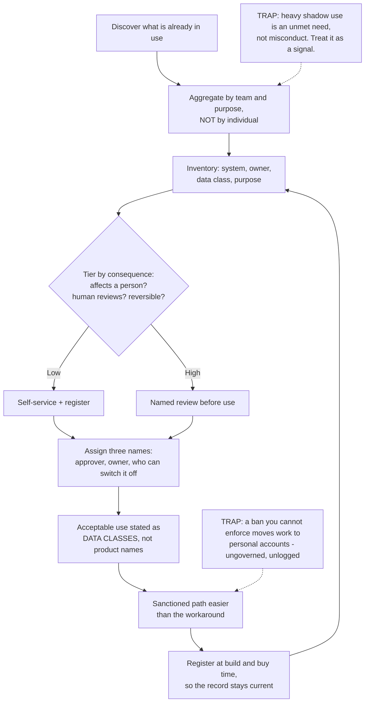

# Before the Framework: AI Inventory, Acceptable Use and Who Decides

**Level:** Beginner
**Tree:** [AI Operations & Governance](../README.md)
**Branch:** [Governance, Compliance and Enterprise Adoption](README.md)
**Forest:** [AI & Intelligent Systems](../../../README.md)

## Explanation

### You cannot govern what you cannot see

Most organisations use AI before anyone approves it. People paste documents into free
assistants, extensions summarise email, and a team somewhere has wired a model into a
workflow on a corporate card. **Shadow AI is the default state, not an edge case**, so a
programme that begins by writing policy is writing rules for a world it has not looked
at. Begin with discovery: what is actually in use, by which parts of the business, for
what. The inventory is the first artifact, and every framework you adopt later takes it
as input.

### A policy nobody can follow produces the thing it forbids

The instinct is to ban everything until a review exists. It reliably fails, because the
work does not stop - it moves to personal accounts, where there is no logging, no data
residency and no filter at all. **A ban you cannot enforce converts governed usage into
ungoverned usage** while the policy reports success. The workable shape is a narrow,
genuinely enforced prohibition on what is actually unacceptable, plus a sanctioned path
easier than the workaround. If the compliant route is slower than pasting into a browser,
you have already chosen which one people use.

### Ask what data, not which tool

Approved-product lists go stale within a month and say nothing about actual risk. The
durable axis is **what class of data may leave, and to where** - public material,
internal documents, personal data, regulated or customer-confidential content. Expressed
that way, one rule covers tools nobody has heard of yet, and works equally for a chatbot,
a coding assistant and a meeting recorder. It is also the only form a non-specialist can
apply correctly at the moment of use, which is the only moment that matters.

### Not every use deserves the same scrutiny

Treating a meeting summariser and a credit decision identically means either strangling
the first or waving through the second. **Tier by consequence**: whether a person is
affected, whether a human reviews before it acts, and whether the effect is reversible.
Low tiers are self-service with a registration step; high tiers need named review. The
tiering matters more than the policy text, because it decides where friction lands - and
friction spent in the wrong place is what pushes people into the shadows.

### An unowned AI system is the real governance failure

Ask who owns a deployed assistant and the answer is often that a contractor built it and
moved on. That is worse than an unapproved system, because nobody can answer a question,
apply a fix or decide to retire it. **Decision rights come before frameworks**: who
approves a use case, who owns it afterwards, and who can switch it off. Those three
names, recorded per system, do more than a long policy nobody has read - and they are
the first thing an auditor asks for.

### The inventory is a living record, not an audit

A one-off discovery exercise is out of date the week it finishes. Registration has to be
a step in how systems are built and bought, so the record stays current by construction.
**Discovery finds the backlog; process keeps it from rebuilding.** Aim it at unmet need
rather than individuals: a department heavily using an unapproved tool is describing a
capability gap, and treating that as misconduct guarantees the next round of shadow usage
is better hidden.

## Architecture and flow



## Commands

### Command 1

List the AI provider domains your network actually reaches, which is the fastest honest picture of current usage

```text
awk -F'\t' '{print $3}' proxy.log | grep -Ei "openai|anthropic|gemini|copilot|perplexity" | sort | uniq -c | sort -rn
```

### Command 2

Aggregate that usage by department rather than by person, because the goal is unmet need and not enforcement

```text
jq -r "[.department, .destination] | @tsv" proxy-enriched.json | sort | uniq -c | sort -rn | head -20
```

### Command 3

Find AI spending that never passed through procurement - the systems nobody registered

```text
grep -Ei "openai|anthropic|cursor|midjourney" expenses.csv | awk -F, '{print $4, $6}' | sort -u
```

### Command 4

Check which registered systems have no named owner, the single most useful gap in any inventory

```text
jq -r '.systems[] | select(.owner == null or .owner == "") | .name' inventory.json
```

### Command 5

Compare what is running against what is registered, and list the difference

```text
comm -23 <(sort discovered-systems.txt) <(jq -r ".systems[].name" inventory.json | sort)
```

### Command 6

Report the inventory by risk tier, which is what a reviewer or auditor actually asks for

```text
jq -r ".systems[] | [.tier, .name, .owner, .data_class] | @tsv" inventory.json | sort
```

## Automation scripts

### shadow_ai_report.py

Discovery is usually done as a one-off spreadsheet exercise aimed at catching people.
This does the opposite: it reads traffic the organisation already logs, reports usage
aggregated by team against the registered inventory, and refuses to emit per-user
detail - because the finding you want is an unmet capability need, not a name.

```python
#!/usr/bin/env python3
"""Compare observed AI usage against the registered inventory.

Reads enriched proxy or egress records and a registry file, and reports which
AI services are in use by which teams and which are unregistered. Deliberately
aggregates: teams below a minimum size are suppressed rather than reported,
so the output cannot be used to identify an individual.
"""
import argparse
import json
import sys
from collections import defaultdict

# Aggregates smaller than this are withheld: below it, "the team" is a person.
MIN_TEAM_SIZE = 5

KNOWN = {
    "api.openai.com": "OpenAI API",
    "chatgpt.com": "ChatGPT",
    "api.anthropic.com": "Anthropic API",
    "claude.ai": "Claude",
    "generativelanguage.googleapis.com": "Google Gemini API",
    "copilot.microsoft.com": "Microsoft Copilot",
}

def load_registry(path):
    with open(path) as handle:
        registry = json.load(handle)
    return {s["name"] for s in registry.get("systems", [])}

def main():
    parser = argparse.ArgumentParser()
    parser.add_argument("traffic", help="JSONL of {department, destination, user_id}")
    parser.add_argument("--registry", required=True)
    args = parser.parse_args()

    registered = load_registry(args.registry)
    usage = defaultdict(lambda: defaultdict(set))

    with open(args.traffic) as handle:
        for line in handle:
            if not line.strip():
                continue
            record = json.loads(line)
            service = KNOWN.get(record.get("destination", ""))
            if not service:
                continue
            usage[service][record.get("department", "unknown")].add(
                record.get("user_id")
            )

    if not usage:
        print("No known AI destinations seen. Widen the destination list before "
              "concluding there is no shadow usage.")
        return 0

    print(f"{'service':<22}{'registered':>11}{'teams':>7}  departments")
    for service in sorted(usage):
        departments = usage[service]
        # Suppress small groups entirely rather than naming them.
        reportable = sorted(
            d for d, users in departments.items() if len(users) >= MIN_TEAM_SIZE
        )
        suppressed = len(departments) - len(reportable)
        status = "yes" if service in registered else "NO"
        shown = ", ".join(reportable) if reportable else "(all below threshold)"
        if suppressed:
            shown += f" [+{suppressed} withheld]"
        print(f"{service:<22}{status:>11}{len(departments):>7}  {shown}")

    unregistered = [s for s in usage if s not in registered]
    if unregistered:
        print(
            "\nUnregistered and in use: " + ", ".join(sorted(unregistered)) +
            "\nRead this as a capability request. Heavy use of an unapproved tool "
            "means the sanctioned path is missing or harder than the workaround; "
            "responding with enforcement alone drives the next round out of sight."
        )
    return 0

if __name__ == "__main__":
    sys.exit(main())
```

## Lab

**Objective:** Produce a first AI inventory for one real department, tier what you find by consequence, and write an acceptable-use rule that a non-specialist can apply correctly without asking anyone.

### Steps

1. Pick one department and list the AI tools you believe they use, before looking at any data.
2. Pull the evidence you already have - proxy or egress destinations, and AI-related expense lines.
3. Run `shadow_ai_report.py` against a registry file and compare the result with your list from step 1.
4. Record the gap: how many systems were in use that you did not know about, and how many you expected that nobody uses.
5. For each discovered system, find the three names - who approved it, who owns it now, and who can switch it off.
6. Note every system where one of those three names does not exist, which is the finding that matters most.
7. Tier each system by consequence: does it affect a person, does a human review the output, and is the effect reversible.
8. Draft one acceptable-use rule expressed as data classes rather than product names.
9. Test that rule on five real scenarios with someone outside the team, and record where they answered incorrectly.
10. Rewrite the rule where it failed the test, then define where registration will live in the build and buy process.

### Validation

- The inventory lists systems discovered from evidence, and the gap against the pre-exercise guess is recorded as a number.
- Every entry names an approver, an owner and someone who can switch it off, or explicitly records that no such person exists.
- The discovery output is aggregated by team, with small groups suppressed, and no per-individual list is produced at any point.
- Each system carries a tier, and the tier traces to the three consequence questions rather than to how the tool feels.
- A non-specialist applies the acceptable-use rule correctly to five scenarios without asking for help; failures are recorded and the rule rewritten.
- Registration is placed in a named existing process, so the inventory stays current without another discovery exercise.

## Operational automation

### Keeping the record true without another audit

- **Put registration where systems are already born.** A step in procurement, in the
  cloud landing zone request, and in the deployment pipeline keeps the inventory current
  by construction. A quarterly spreadsheet chase does not, because it is out of date the
  week it finishes.
- **Alert on the missing owner, not on the new system.** New systems are healthy; systems
  with nobody accountable are the failure. Make an empty owner field an actionable
  finding, since it is the first thing an auditor asks for and the reason nobody can fix
  or retire the thing later.
- **Reconcile observed usage against the registry monthly, aggregated by team.** The gap
  is the signal. Keep the threshold high enough that the output can never identify a
  person: a discovery process people fear produces better-hidden shadow usage, not less
  of it.
- **Express acceptable use as data classes and review it when the classes change.**
  Product-name lists need constant maintenance and are wrong between updates. A rule
  about what may leave and to where survives tools nobody has heard of yet.
- **Treat a heavily used unapproved tool as a capability request with an SLA.** Someone
  has found a real need the estate does not meet. Respond with a sanctioned path on a
  committed timescale; enforcement alone moves the same work somewhere you cannot see.
- **Re-tier after any change to what a system touches.** A summariser that gains the
  ability to send email is no longer the low-risk thing that was registered, and tier is
  the field most likely to be set once and never revisited.

## Troubleshooting

### Scenario 1: Policy says no external AI tools, and everyone is clearly using them.

**Likely cause:** The prohibition is unenforceable and there is no sanctioned alternative, so the work moved to personal accounts where nothing is logged.

**Resolution:** Provide a compliant path that is genuinely easier than the workaround, and narrow the prohibition to the few things that are actually unacceptable. Confirm it by comparing corporate AI traffic against what the headcount would predict: far below expectation means the usage exists somewhere you cannot see. A policy reporting full compliance with no enforcement mechanism is measuring itself, not behaviour.

### Scenario 2: Nobody can say who owns a deployed assistant.

**Likely cause:** It was built during a project or by a contractor, went live, and ownership was never assigned because nothing in the process required it.

**Resolution:** Assign the three names now - approver, owner, and who can switch it off - and treat an empty owner field as a blocking finding rather than a data-quality issue. Confirm the scope by counting owner-less entries across the inventory: more than a few means the gap is in the process, not one project.

### Scenario 3: Staff cannot tell whether a particular use is allowed.

**Likely cause:** The policy is written as a list of approved products, so anything not on the list has no answer, and the list is stale anyway.

**Resolution:** Rewrite the rule in terms of data classes - what may leave, and to where - so a person can apply it to a tool that did not exist when the rule was written. Confirm it works by testing real scenarios on people outside the policy team and recording the wrong answers. A rule only its authors can apply is not yet a rule.

### Scenario 4: The inventory was accurate at the audit and wrong three months later.

**Likely cause:** Discovery was run as a project rather than built into how systems are created and bought, so the record decays from the day it is finished.

**Resolution:** Move registration into the existing intake paths and reconcile against observed usage on a schedule, so drift shows up as a small monthly delta instead of an annual surprise. Confirm the diagnosis by checking whether any system added since the audit appears in the record: if none do, nothing in the process is creating entries and a repeat audit will produce the same decay.

### Scenario 5: The discovery report named individuals and the effort stalled.

**Likely cause:** Output was produced per user, which turns a capability exercise into an investigation - and people respond by hiding usage more carefully.

**Resolution:** Aggregate by team, suppress groups too small to anonymise, and state the purpose before running anything, as `shadow_ai_report.py` enforces by default. Confirm the damage by asking whether usage dropped without any new sanctioned tool appearing: that is concealment, not compliance. Rebuilding trust is slower than getting it right first time, which is why the threshold is a default rather than an option.

## Interview questions

### 1. Where do you start an AI governance programme?

With discovery, not policy. Almost every organisation is already using AI before anyone approves it, so a policy written first is a set of rules for a world nobody has looked at. I would pull the evidence that already exists - proxy destinations, expense lines, SaaS records - and build an inventory of what is genuinely in use, by which teams and for what. That inventory is the artifact everything else consumes: risk tiering, ISO 42001, an EU AI Act classification all take it as input, and none of them can be done honestly without it. I would aggregate that discovery by team rather than by person, because the useful finding is an unmet capability need rather than a name. Starting here also buys credibility: a policy written before anyone looked reads as theoretical, while one responding to what people actually do gets taken seriously by those who must follow it.

### 2. Leadership wants to ban external AI tools until a review is done. What do you say?

That it will produce the opposite of what they want. The work does not stop when you ban the tool - it moves to personal accounts and personal devices, where there is no logging, no data residency, no filtering and no way to know what was shared. So the ban converts governed usage into ungoverned usage while the policy document reports compliance, and it takes the visibility away at exactly the moment they have decided visibility matters. What I would propose instead is a narrow prohibition that is genuinely enforced on the few things that are actually unacceptable, plus a sanctioned path that is easier than the workaround, because the relative convenience of the two decides which one people use. If a review is genuinely needed before wider use, I would scope it to the high-consequence cases and let the low-risk ones proceed with registration, so the friction lands where the risk is.

### 3. How do you decide how much scrutiny a use case gets?

By consequence, using three questions: does the output affect a person, does a human review it before it acts, and can the effect be undone. A meeting summariser scores low on all three; a system influencing a credit decision or a hiring shortlist scores high. Tiering that way means low-risk uses can be self-service with a registration step while high-risk ones get named review, which is what makes the whole thing survivable - if everything needs review, either the queue collapses or people route around it, and you have lost the low-risk cases from view as well. Tiering matters more in practice than the policy wording, because it decides where friction is spent. The one thing I watch is that tier gets set once and never revisited, so any change to what a system can touch - a summariser that gains the ability to send email - has to trigger a re-tier.

### 4. What is the single most useful field in an AI inventory?

The owner, and specifically a named person rather than a team. An unapproved system with a clear owner is a conversation; an approved system with nobody accountable is the real failure, because there is no one to answer a question about it, apply a fix, or decide to retire it. In practice the owner-less entries are the ones built during a project or by a contractor who has since moved on, and they are exactly the systems still running against data nobody has reviewed. I would extend it to three names - who approved it, who owns it now, and who can switch it off - since the third is the one you need during an incident and the one nobody records. If I could only add one control to an organisation's process, it would be that an AI system cannot go live without those names, which does more for governance than a long policy document nobody has read.

## Certification alignment

- **Microsoft Certified: Security, Compliance, and Identity Fundamentals (SC-900)** - Describe the concepts of security, compliance, and identity: decision rights recorded per system (approver, owner, who can switch it off) and acceptable use expressed as classes of data that may leave, and to where.
- **AWS Certified AI Practitioner** - Domain 5: Security, Compliance, and Governance for AI Solutions: building an AI inventory from observed usage, tiering use cases by consequence, and keeping registration current through procurement and deployment.
- **Google Cloud Digital Leader** - AI adoption, governance and organisational readiness.
- **Vendor-neutral** - NIST AI RMF GOVERN function: accountability structures, roles and organisational policy.

## References

- NIST AI Risk Management Framework (AI 100-1) - GOVERN function, accountability and organisational policy
- ISO/IEC 42001 - AI management system requirements, including scope definition and the AI system inventory
- EU AI Act - risk categories and the obligations that follow from how a system is classified
- Microsoft Purview documentation - data classification and sensitivity labelling as the basis for acceptable use
- Cloud Security Alliance AI Controls Matrix - vendor-neutral control set for AI governance and oversight

## Suggested video search

AI governance getting started shadow AI inventory acceptable use policy data classification risk tiering ownership beginner

---

> Validate commands, versions, permissions, licensing, and rollback procedures in an isolated lab before production use.
