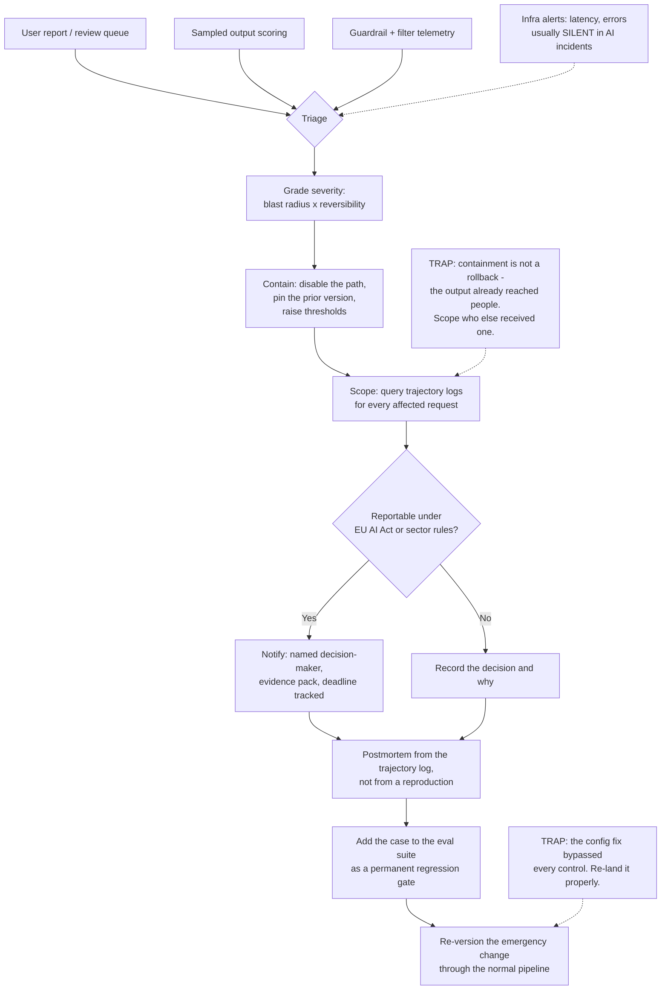

# AI Incident Response: Detection, Containment and Postmortems for Non-Deterministic Systems

**Level:** Advanced
**Tree:** [AI Operations & Governance](../README.md)
**Branch:** [LLMOps and Production Observability](README.md)
**Forest:** [AI & Intelligent Systems](../../../README.md)
**Readiness:** [Lab](../../../READINESS.md#lab) - checked offline, not yet run against a live service. A live run needs a local Ollama server, an Azure subscription and a service you already operate.

## Explanation

### You cannot roll back an output

Every incident runbook an enterprise already owns assumes the fix is a revert: redeploy
the previous version and the bad state stops existing. That fails here. A harmful,
defamatory or confidential answer was rendered to a person, and reverting the model
changes nothing about the copy in their inbox, their screenshot, or the ticket they
pasted it into. **Containment means finding everyone else who received the same class of
output**, not restoring a previous state. The first question in an AI incident is not
"what changed" but "who else got one".

### Detection is the hard half, and it usually is not a monitor

Classic incidents announce themselves: error rates spike, latency climbs, a pod
crashloops. The characteristic AI incident has **perfect operational health** - 200s,
normal latency, no alerts - while producing wrong, unsafe or leaking answers. No
infrastructure signal has an opinion about content. So detection runs through user
reports, review queues and sampled output scoring, and those channels need the same
pager as the alerts. Treating "a user complained" as feedback rather than as a detection
signal is what turns a one-hour incident into a three-week one.

### Severity is about blast radius and reversibility, not about how wrong it was

The instinct is to grade by how bad the output looked, which produces inconsistent
decisions: one wildly wrong answer to an internal tester is not an incident, while a
subtly wrong figure sent to two thousand customers is a serious one. Grade on **who
received it, whether they could act on it, and whether the effect can be undone**. A
wrong number that triggered a payment is unrecoverable; the same number in an unsent
draft is not. This is also the grading a regulator recognises.

### Non-determinism breaks the postmortem you know how to write

"Reproduce the failure" frequently cannot be done. The same prompt against the same
model version can return something different, and the offending request may have carried
context - a retrieved document, a conversation history, a tool result - that no longer
exists. **The trajectory log is the artifact, not the repro case.** Without the assembled
prompt, retrieved chunk ids, tool calls and arguments, model and filter versions, and a
content hash of the response, the investigation is over before it starts and the
postmortem will invent a cause.

### The clock is regulatory, not just operational

For systems in scope, the EU AI Act requires serious incidents to be reported within
defined windows, and sector rules stack on top. The detection-to-decision path therefore
has a deadline attached, and somebody must be able to decide **"is this reportable"**
out of hours with the evidence already assembled. Deciding that mid-incident, with no
prepared criteria and no named decision-maker, is how organisations miss the window
while doing everything else right.

### The fix is usually configuration, and that is a trap

Most AI incidents are closed by changing a prompt, a threshold, a retrieval filter or a
model version - minutes of work, no review, no pipeline. That speed is valuable during
containment and it is also how the fix escapes every control the organisation has. **Any
change made under incident pressure needs the same versioning and evaluation as a
planned one**, retrospectively if not at the time, or the next incident starts from a
configuration nobody can explain.

## Architecture and flow



## Commands

### Command 1

Find every request in the incident window that touched the same retrieved document - the blast-radius query, not a health check

```text
jq -r "select(.retrieved_ids[]? == \"$DOC_ID\") | [.ts, .request_id, .user_id] | @tsv" trajectory.log
```

### Command 2

Count affected users rather than affected requests, because notification duties follow people

```text
jq -r "select(.incident_tag == \"$INC\") | .user_id" trajectory.log | sort -u | wc -l
```

### Command 3

Pin the deployment to the last known-good model version as a containment step, before any root cause is known. The CLI has no update command: create with the deployment's existing name, model and SKU re-applies it, and it requires the model name and format

```text
az cognitiveservices account deployment create -g "$RG" -n "$ACCOUNT" --deployment-name prod --model-name "$MODEL" --model-version "$LAST_GOOD" --model-format OpenAI --sku-name "$SKU" --sku-capacity 50
```

### Command 4

Confirm which model and filter versions actually served the window, rather than which ones you believe were configured

```text
jq -r "select(.ts >= \"$START\" and .ts <= \"$END\") | [.model_version, .filter_version] | @tsv" trajectory.log | sort | uniq -c
```

### Command 5

Reconstruct one request end to end for the postmortem, since it very likely cannot be reproduced

```text
jq -r "select(.request_id == \"$REQ\") | {prompt_sha, retrieved_ids, tool_calls, response_sha, model_version}" trajectory.log
```

### Command 6

Prove the containment worked by scoring traffic after the change, instead of assuming it did

```text
jq -r "select(.ts > \"$CONTAINED_AT\") | select(.detector_hit == true) | .category" trajectory.log | sort | uniq -c
```

## Automation scripts

### blast_radius.py

The first question in every AI incident is "who else got one", and it is usually
answered by hand while the clock runs. This walks the trajectory log from one
confirmed-bad request, finds every other request sharing its causal inputs, and emits
the affected-user list with a notification-readiness verdict.

```python
#!/usr/bin/env python3
"""Scope an AI incident from one known-bad request.

Finds every request in the window that shared a causal input with it - the same
retrieved document, prompt template or tool - and reports affected users rather
than affected requests, because notification duties are counted in people.
"""
import argparse
import json
from collections import Counter, defaultdict


def load(path, start, end):
    with open(path) as handle:
        for line in handle:
            if not line.strip():
                continue
            record = json.loads(line)
            if start <= record.get("ts", "") <= end:
                yield record


def causal_keys(record):
    """Inputs that could have produced the same failure in another request."""
    keys = set()
    for doc in record.get("retrieved_ids", []):
        keys.add(("doc", doc))
    for call in record.get("tool_calls", []):
        keys.add(("tool", call.get("name")))
    keys.add(("model", record.get("model_version")))
    keys.add(("filter", record.get("filter_version")))
    keys.add(("prompt", record.get("prompt_template_id")))
    return keys


def main():
    parser = argparse.ArgumentParser()
    parser.add_argument("log")
    parser.add_argument("--request-id", required=True)
    parser.add_argument("--start", required=True)
    parser.add_argument("--end", required=True)
    args = parser.parse_args()

    records = list(load(args.log, args.start, args.end))
    seed = next((r for r in records if r.get("request_id") == args.request_id), None)
    if seed is None:
        raise SystemExit(f"request {args.request_id} not found in the window")

    seed_keys = causal_keys(seed)
    matched = defaultdict(list)
    for record in records:
        shared = seed_keys & causal_keys(record)
        # The model version alone matches all traffic, so it is not evidence
        # on its own - require a narrower input to have been shared too.
        narrow = {k for k in shared if k[0] in ("doc", "tool", "prompt")}
        if narrow:
            matched[record.get("user_id", "unknown")].append(record)

    users = sorted(matched)
    requests = sum(len(v) for v in matched.values())
    reasons = Counter(k[0] for r in records for k in (seed_keys & causal_keys(r)))

    print(f"seed request : {args.request_id}")
    print(f"window       : {args.start} .. {args.end}")
    print(f"shared inputs: {', '.join(f'{k}={v}' for k, v in reasons.most_common())}")
    print(f"affected     : {len(users)} users across {requests} requests")

    unidentified = [u for u in users if u == "unknown"]
    if unidentified:
        print(
            "\nWARNING: some affected requests carry no user id. They cannot be "
            "notified, and the affected count above is a floor, not a total."
        )

    print("\nAffected users:")
    for user in users:
        print(f"  {user:<24} {len(matched[user])} request(s)")

    # Scoping is not the same as being able to notify. Say which one you have.
    print(
        "\nNotification readiness: "
        + ("BLOCKED - unidentified recipients" if unidentified else "user list complete")
    )
    return 0


if __name__ == "__main__":
    raise SystemExit(main())
```

## Lab

**Objective:** Run one AI incident end to end - detect it without an infrastructure alert, scope it by people rather than requests, decide reportability against written criteria, and close it with a regression gate that would catch a recurrence.

### Steps

1. Deploy an assistant with trajectory logging capturing the assembled prompt hash, retrieved chunk ids, tool calls, model version, filter version and response hash.
2. Inject a defect that leaves infrastructure signals clean: place a document with a wrong figure into the retrieval corpus, so answers are confidently wrong while every request returns 200.
3. Confirm the blind spot. Check the latency, error-rate and availability dashboards and record that none of them moved.
4. Detect it through the channel that actually works: file a user report and confirm it reaches the same pager as an infrastructure alert, with a time recorded.
5. Grade the severity from blast radius and reversibility using a written rubric, and record the grade before any investigation begins.
6. Contain without a rollback: disable the retrieval path or pin the prior index, then prove with fresh traffic that the bad answers stopped.
7. Run `blast_radius.py` from the one reported request and produce the affected-user list.
8. Take the reportability decision against written criteria, name the decision-maker, and record the decision and its timestamp whether or not it is reportable.
9. Write the postmortem from the trajectory log alone, without reproducing the output, stating which facts the log could not supply.
10. Add the case to the evaluation suite as a regression gate, then re-land the emergency configuration change through the normal versioned pipeline.

### Validation

- The infrastructure dashboards are shown unmoved for the whole incident window, demonstrating that the detection path could not have been an alert.
- Time-to-detect is measured from the first bad response to the first human report.
- The affected count is a number of people, and any request without an identifiable recipient is reported as a notification blocker rather than dropped.
- Containment is demonstrated on fresh traffic after the change, not asserted from the fact that a change was made.
- A reportability decision exists in writing with a named owner and a timestamp, including for the case where the answer was no.
- The postmortem names at least one fact the trajectory log could not supply, and raises a logging change to close that gap.
- The regression gate fails against the pre-fix configuration and passes after it, proving it catches a recurrence.

## Operational automation

### Making the response path exist before you need it

- **Wire user reports to the pager.** The characteristic AI incident produces no
  infrastructure signal at all, so a complaint queue that is read on weekday mornings is
  the actual detection latency of the system. Route it like an alert, with an
  acknowledgement target, or accept that time-to-detect is measured in days.
- **Log the trajectory, not the response.** Assembled prompt hash, retrieved chunk ids,
  tool calls and arguments, model and filter versions, response hash. Without these an
  investigation cannot establish what the model was given, and the postmortem will
  attribute the failure to whatever is most convenient.
- **Keep the last known-good version pinned and reachable.** Containment is a minutes
  decision, and discovering mid-incident that the previous model version has been
  deprovisioned turns a rollback into a redesign. Treat the prior version as a standing
  asset with an owner.
- **Write the reportability criteria in advance, and name the out-of-hours
  decision-maker.** The EU AI Act attaches a deadline to serious incidents, so the
  decision needs prepared criteria, an authorised person, and a severity rubric graded on
  recipients and reversibility rather than on how alarming the output looked. Deciding
  what counts during the incident is how organisations miss a window while handling
  everything else well.
- **Re-land every emergency configuration change through the normal pipeline.** A
  prompt, threshold or index changed under pressure has bypassed review, versioning and
  evaluation. Left there it becomes state nobody can explain, and the next incident
  starts from an unknown baseline.
- **Add every incident to the evaluation suite as a gate.** An incident you cannot
  detect automatically on recurrence has taught the organisation nothing durable. The
  gate must fail against the pre-fix configuration, or it is not testing what you think.

## Troubleshooting

### Scenario 1: A customer posts a screenshot of a bad answer and nobody internally knew.

**Likely cause:** Detection depends entirely on infrastructure signals, and the failure produced none - normal latency, 200 responses, no errors, because the model answered confidently and wrongly.

**Resolution:** Route user reports and review-queue rejections to the same pager as alerts, and add sampled output scoring so a fraction of traffic is graded continuously. Confirm the diagnosis by checking whether any dashboard moved during the window: flat infrastructure graphs across a confirmed incident prove the detection path was never capable of catching it - a finding about the system, not the responder.

### Scenario 2: The model version was rolled back and the complaints continued.

**Likely cause:** Containment was treated as a deployment problem when the defect was in an input - a poisoned or simply wrong document in the retrieval corpus, which the previous model version reads just as faithfully.

**Resolution:** Contain the input path rather than the model: pin the prior index, remove the document, or disable retrieval for the affected route, then prove it on fresh traffic. Confirm this before rolling anything back by checking whether bad responses share retrieved chunk ids rather than a model version - `blast_radius.py` reports exactly that, and a shared document across several model versions rules the model out.

### Scenario 3: The postmortem cannot establish why the model produced the output.

**Likely cause:** Only the prompt and the response were logged. The retrieved context, tool results and conversation history that actually drove the answer were never captured, and they no longer exist.

**Resolution:** Write the postmortem with the gap stated explicitly rather than inventing a plausible cause, and raise the logging change as an incident action. Confirm it by attempting one reconstruction: if the assembled prompt cannot be rebuilt from the log, nothing downstream of it is knowable. Resist naming a root cause anyway - a fabricated cause produces a fix aimed at the wrong thing and closes the incident falsely.

### Scenario 4: The team fixed it in four minutes and cannot say what they changed.

**Likely cause:** The fix was a prompt, threshold or index edit made directly in a portal under pressure, outside version control and outside the deployment pipeline.

**Resolution:** Reconstruct the change from portal audit logs while the memory is fresh, commit it, and re-land it through the normal pipeline with evaluation. Confirm the scope by diffing live configuration against what version control claims is deployed: drift elsewhere means this is standing practice rather than one shortcut, and every future investigation already starts from an unreliable baseline.

### Scenario 5: A serious incident was reported to the regulator two days after the deadline.

**Likely cause:** Reportability was assessed only after technical resolution, by people who were busy fixing it, with no prepared criteria and no authorised decision-maker out of hours.

**Resolution:** Make the reportability assessment a step in triage rather than in closure, with written criteria and a named on-call decision-maker, and track the deadline from detection rather than from resolution. Confirm it from the incident timeline: if notification is first mentioned after the fix, the process places it there by design and the next incident will miss the window too.

## Interview questions

### 1. An AI assistant gave a customer wrong pricing. Walk me through the first hour.

The first thing I do not do is roll back, because the output has already reached a person and reverting changes nothing about that. The first hour is detection confirmation, grading and scoping, in that order. I confirm it is real and note how it was detected, which is nearly always a human rather than an alert. I grade severity from blast radius and reversibility - a wrong price someone acted on is a different incident from the same price in an unsent draft. Then I scope by people, not requests: find what causal input the bad request shared with others - a retrieved document, a prompt template, a tool - and count affected users, because notification duties are counted in people. Containment runs alongside: disable the offending path or pin the prior index and prove on fresh traffic that it stopped. Somewhere in that hour, not at the end, someone authorised decides whether this is reportable, because the regulatory clock starts at detection and not at resolution.

### 2. Why does a standard incident runbook fail for AI systems?

Because it is built on two assumptions that do not hold. The first is that a revert restores the world: for a model, the harmful output was delivered, so containment means finding who else received the same class of output rather than restoring a previous state. The second is that failures are visible in operational telemetry. The characteristic AI incident has perfect health - 200s, normal latency, no errors - while the content is wrong, unsafe or leaking, and no infrastructure signal has an opinion about content. So the detection path has to run through user reports, review queues and sampled scoring, wired to the same pager. A third difference shows up in the postmortem: you often cannot reproduce the failure, because the model is non-deterministic and the context that drove it is gone. The trajectory log becomes the artifact instead of the repro case - which means the quality of every AI postmortem was decided months earlier, when logging was designed.

### 3. How do you grade severity when the system technically worked?

On blast radius and reversibility, and I write the rubric before I need it. Blast radius is how many people received the output and whether they could act on it - an internal tester and two thousand customers are different incidents for identical text. Reversibility is whether the effect can be undone: a wrong figure that triggered a payment or went into a filed document is unrecoverable, while the same figure in a draft a human reviewed is not. I deliberately exclude how alarming the output looked, because that grades the screenshot rather than the harm. Those two axes also map onto what a regulator asks, so the same grading feeds the reportability decision instead of being redone. The practical benefit is out of hours: someone woken at 3am can apply recipients-times-reversibility consistently, where "how bad is this" invites an argument at exactly the wrong moment.

### 4. Your team resolved an incident in four minutes by editing a prompt. What concerns you?

That the fix bypassed every control the organisation has, and that speed is precisely why. A prompt, threshold or index edit needs no review, no pipeline and no evaluation, so nothing recorded what changed, nobody verified it did not break other behaviour, and the live configuration now differs from what version control claims is deployed. The next investigation starts from a baseline nobody can reconstruct. I would not slow containment down - four minutes is the right answer during an incident - but re-landing the change through the normal pipeline becomes a required action item, and I would diff live configuration against version control to see whether this is a habit rather than one shortcut. The second concern is that a four-minute fix usually addresses a symptom. Without a regression gate that fails against the pre-fix configuration, there is no evidence the underlying cause was touched at all.

## Certification alignment

- **Microsoft Certified: Azure AI Apps and Agents Developer Associate (AI-103)** - Plan and manage an Azure AI solution: pinning a deployment to the last known-good model version as containment, and logging model and filter versions per request so an incident can be investigated.
- **Microsoft Certified: Security Operations Analyst Associate (SC-200)** - Respond to security incidents: triage, severity grading, containment, blast-radius scoping and postmortem workflow applied to AI workloads.
- **AWS Certified Machine Learning Engineer - Associate** - Model monitoring, production troubleshooting and operational response.
- **Google Cloud Professional Machine Learning Engineer** - ML solution monitoring, incident handling and continuous evaluation.
- **Vendor-neutral** - NIST AI RMF and NIST SP 800-61: the MANAGE function and the incident handling lifecycle, adapted for non-deterministic systems.

## References

- [European Union (EUR-Lex, Official Journal): Regulation (EU) 2024/1689 of the European Parliament and of the Council of 13 June 2024 laying down harmonised rules on artificial intelligence (Artificial Intelligence Act)](https://eur-lex.europa.eu/eli/reg/2024/1689/oj/eng) - Legal text of the AI Act, including the definition of 'serious incident' and the high-risk provider obligations.
- [European Commission (AI Act Service Desk): Article 73: Reporting of serious incidents](https://ai-act-service-desk.ec.europa.eu/en/ai-act/article-73) - Serious-incident reporting obligations and notification windows for high-risk AI systems.
- [National Institute of Standards and Technology (NIST): Incident Response Recommendations and Considerations for Cybersecurity Risk Management: A CSF 2.0 Community Profile (NIST SP 800-61 Rev. 3)](https://doi.org/10.6028/NIST.SP.800-61r3) - Baseline incident-response lifecycle that AI incident response adapts (current edition).
- [National Institute of Standards and Technology (NIST): Artificial Intelligence Risk Management Framework (AI RMF 1.0) (NIST AI 100-1)](https://doi.org/10.6028/NIST.AI.100-1) - MANAGE function guidance on AI incident response, recovery and risk treatment.
- [International Organization for Standardization (ISO) / IEC: ISO/IEC 42001:2023 - Information technology — Artificial intelligence — Management system](https://www.iso.org/standard/42001) - AI management system requirements for operational control, monitoring and incident handling.
- [OpenTelemetry (open-telemetry/semantic-conventions-genai on GitHub): Semantic conventions for generative client AI spans](https://github.com/open-telemetry/semantic-conventions-genai/blob/main/docs/gen-ai/gen-ai-spans.md) - GenAI span and attribute model used for trajectory logging.
- [OpenTelemetry (open-telemetry/semantic-conventions-genai on GitHub): Semantic Conventions for GenAI agent and framework spans](https://github.com/open-telemetry/semantic-conventions-genai/blob/main/docs/gen-ai/gen-ai-agent-spans.md) - Agent-level spans for logging multi-step agent trajectories.

## Suggested video search

AI incident response LLM production outage trajectory logging blast radius postmortem non-deterministic regulatory reporting

---

> Validate commands, versions, permissions, licensing, and rollback procedures in an isolated lab before production use.
