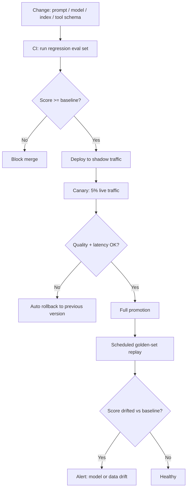

# LLMOps: Deployment, Versioning and Drift Detection

**Level:** Intermediate
**Tree:** [AI Operations & Governance](../README.md)
**Branch:** [LLMOps and Production Observability](README.md)
**Forest:** [AI & Intelligent Systems](../../../README.md)

## Explanation

LLMOps applies the discipline of MLOps and classic release engineering to systems built around a language model, but the unit of change is wider than a model file: a prompt template, a retrieval index, a tool schema and the model itself can each independently break behaviour. Treating only the model as a version means the other three drift silently.

The practical answer is to version everything that participates in a response. Pin the model by an explicit version string, never a floating alias like "latest" - providers rotate the underlying weights behind unpinned tags without notice. Store prompt templates in the same repository as application code, reviewed through the normal pull-request process, because a system prompt is production configuration, not prose. Tag retrieval indexes with a build id so a regression can be bisected to a specific corpus snapshot rather than "the RAG got worse sometime last month".

Deployment should follow a staged rollout: shadow traffic against the new version while continuing to serve the old one, then a canary slice with automatic rollback triggers on quality or latency regression, then full promotion. This mirrors blue-green deployment but the health signal is not just HTTP 200s - it is an evaluation score against a fixed regression set plus real-time quality proxies (refusal rate, empty-response rate, tool-call error rate).

Drift detection has two forms. Input drift is a change in the distribution of what users ask - new topics, new phrasing, a new locale - detected by embedding incoming prompts and tracking cluster movement against a baseline. Output/model drift is a change in the answers the same inputs receive, caught by re-running a frozen golden-question set on a schedule and diffing scores over time. Both must run continuously, because a provider-side model update can silently change behaviour with no deployment on your side at all.

## Architecture and flow



## Commands

### Command 1

Confirm the exact pinned model version currently serving production.

```text
az cognitiveservices account deployment show -g rg-ai -n aoai-prod --deployment-name chat --query properties.model.version
```

### Command 2

Stand up a canary deployment at low capacity alongside the production deployment.

```text
az cognitiveservices account deployment create -g rg-ai -n aoai-prod --deployment-name chat-canary --model-name gpt-4o --model-version 2025-03-01 --sku-name Standard --sku-capacity 5
```

### Command 3

Watch a progressive canary rollout of the LLM gateway service with Argo Rollouts.

```text
kubectl argo rollouts get rollout llm-gateway --watch
```

### Command 4

Manually promote a canary once automated analysis gates have passed.

```text
kubectl argo rollouts promote llm-gateway
```

### Command 5

Roll back to the previous stable revision on a failed analysis run.

```text
kubectl argo rollouts undo llm-gateway
```

### Command 6

Show the full review history of a system prompt tracked as code.

```text
git log --oneline -- prompts/system_prompt.txt
```

### Command 7

Run a frozen golden-question set against canary and production and diff scores.

```text
python -m evalharness --set golden_questions.jsonl --model chat-canary --baseline chat-prod --report drift.json
```

### Command 8

Create a scheduled query alert that fires when a drift signal appears in logs.

```text
az monitor scheduled-query create -g rg-ai -n aoai-drift-alert --scopes $LAW_ID --condition "count 'AppTraces | where Message contains \"drift_score_low\"' > 0" --evaluation-frequency 1h --window-size 1h
```

## Automation scripts

### Golden-set drift detector and canary gate

```python
#!/usr/bin/env python3
"""Replay a frozen golden-question set against a candidate deployment and a
known-good baseline, score both, and fail (exit 1) if the candidate drifted
below an acceptable margin. Designed to run as a CI gate or a nightly job.
"""
import json
import os
import sys
import time
import urllib.request

AOAI_ENDPOINT = os.environ.get("AZURE_OPENAI_ENDPOINT", "")
AOAI_KEY = os.environ.get("AZURE_OPENAI_API_KEY", "")
API_VERSION = "2024-10-21"
MAX_DRIFT_PCT = float(os.environ.get("MAX_DRIFT_PCT", "5.0"))


def load_goldenset(path):
    if not os.path.exists(path):
        print("ERROR: golden set not found: %s" % path)
        sys.exit(2)
    rows = []
    with open(path, encoding="utf-8") as fh:
        for line in fh:
            line = line.strip()
            if line:
                rows.append(json.loads(line))
    return rows


def call_deployment(deployment, prompt):
    url = "%s/openai/deployments/%s/chat/completions?api-version=%s" % (
        AOAI_ENDPOINT.rstrip("/"), deployment, API_VERSION)
    body = {"messages": [{"role": "user", "content": prompt}],
            "temperature": 0, "max_tokens": 400}
    req = urllib.request.Request(url, data=json.dumps(body).encode(),
                                 headers={"Content-Type": "application/json",
                                          "api-key": AOAI_KEY})
    with urllib.request.urlopen(req, timeout=120) as resp:
        out = json.loads(resp.read().decode())
    return out["choices"][0]["message"]["content"]


def score(answer, expected_keywords):
    a = answer.lower()
    hits = sum(1 for kw in expected_keywords if kw.lower() in a)
    return hits / len(expected_keywords) if expected_keywords else 0.0


def run_suite(deployment, rows):
    scores = []
    for row in rows:
        try:
            answer = call_deployment(deployment, row["prompt"])
        except Exception as exc:
            print("  %s: request failed for '%s...': %s" % (
                deployment, row["prompt"][:40], exc))
            scores.append(0.0)
            continue
        scores.append(score(answer, row.get("expected_keywords", [])))
        time.sleep(0.2)
    return sum(scores) / len(scores) if scores else 0.0


def main():
    if len(sys.argv) < 3:
        print("Usage: drift_gate.py <golden_set.jsonl> <candidate_deployment> [baseline_deployment]")
        sys.exit(2)
    path, candidate = sys.argv[1], sys.argv[2]
    baseline = sys.argv[3] if len(sys.argv) > 3 else "chat-prod"

    if not AOAI_ENDPOINT or not AOAI_KEY:
        print("ERROR: AZURE_OPENAI_ENDPOINT / AZURE_OPENAI_API_KEY not set")
        sys.exit(2)

    rows = load_goldenset(path)
    print("Scoring baseline deployment '%s' on %d questions..." % (baseline, len(rows)))
    baseline_score = run_suite(baseline, rows)
    print("Scoring candidate deployment '%s' on %d questions..." % (candidate, len(rows)))
    candidate_score = run_suite(candidate, rows)

    drift_pct = (baseline_score - candidate_score) * 100.0
    report = {
        "baseline_deployment": baseline,
        "candidate_deployment": candidate,
        "baseline_score": round(baseline_score, 4),
        "candidate_score": round(candidate_score, 4),
        "drift_pct": round(drift_pct, 2),
        "max_drift_pct": MAX_DRIFT_PCT,
        "pass": drift_pct <= MAX_DRIFT_PCT,
    }
    with open("drift.json", "w", encoding="utf-8") as fh:
        json.dump(report, fh, indent=2)
    print(json.dumps(report, indent=2))
    sys.exit(0 if report["pass"] else 1)


if __name__ == "__main__":
    main()
```

## Lab

**Objective:** Build a two-deployment canary pipeline with a frozen golden-question set that automatically blocks promotion when the candidate deployment drifts below the production baseline.

### Steps

1. Create two Azure OpenAI deployments of the same model at different pinned versions: chat-prod and chat-canary, each with an explicit sku-capacity.
2. Write 20-30 golden questions with expected keyword lists into golden_questions.jsonl, covering the core intents your application actually serves.
3. Set AZURE_OPENAI_ENDPOINT and AZURE_OPENAI_API_KEY, then run the drift detector script comparing chat-canary against chat-prod.
4. Deliberately edit the canary deployment's system prompt to remove a key instruction, re-run the script, and confirm drift_pct rises and the script exits non-zero.
5. Wire the script into a CI pipeline stage that runs on every pull request touching prompts/ or the deployment configuration, failing the build on non-zero exit.
6. Add a scheduled nightly run of the same script against production only, comparing today's score to a stored baseline from last week to catch provider-side model drift.
7. Configure an Azure Monitor scheduled query alert that fires when drift.json's pass field is false, routed to your on-call channel.

### Validation

drift.json contains non-zero scores for both deployments on a clean run with pass true.,After the deliberate system-prompt regression, drift.json shows pass false and the CI job exits 1.,The CI pipeline blocks a merge that regresses the golden-set score beyond MAX_DRIFT_PCT.,The nightly scheduled run produces a dated drift.json artifact usable to plot a trend over weeks.,The Azure Monitor alert fires within the configured evaluation window when a failing drift.json is produced.

## Operational automation

### Automating the LLMOps lifecycle

**Version everything as one unit.** Store prompts, tool schemas, and the pinned model/version string together in the application repository, and cut a release only when all three are tagged together. A retrieval index build id belongs in the same release manifest so a regression can be bisected to an exact combination rather than guessed at.

**Gate merges on evaluation, not on review alone.** Run the golden-set drift script as a required CI check on any pull request touching prompts, tool definitions or deployment configuration. A human reviewer catches obvious mistakes; the evaluation gate catches subtle quality regressions a reviewer cannot eyeball from a diff.

**Automate the canary and rollback.** Use Argo Rollouts, Azure Traffic Manager weighted routing, or an API gateway's traffic-splitting feature to send a small percentage of live traffic to the candidate deployment. Wire the analysis step to the same evaluation harness plus real-time proxies - refusal rate, tool-error rate, latency p95 - and configure an automatic rollback on failure so a bad release self-heals before a human notices.

**Schedule drift replay independently of deployments.** Provider-hosted models can change behind a pinned deployment name during a provider-side update, so run the golden-set replay nightly regardless of whether your side shipped anything, and alert on any unexplained score movement.

**Close the loop with production data.** Periodically sample real production prompts (with consent and PII scrubbing), add the interesting or failing ones to the golden set, and retire stale questions that no longer reflect real usage. A golden set that never grows stops catching new failure modes.

## Troubleshooting

### Scenario 1: A prompt change that passed code review caused a silent quality regression in production.

**Likely cause:** No automated evaluation ran against the change before merge; review caught grammar and intent but not measurable answer quality.

**Resolution:** Make the golden-set evaluation script a required CI status check on any path touching prompts/ or tool schemas, blocking merge on regression rather than relying on human review alone.

### Scenario 2: Two engineers debugging the same incident get different answers from what they believe is the same deployment.

**Likely cause:** One is calling a deployment pinned to an older model version while the other calls a deployment that was silently updated to a newer version alias.

**Resolution:** Audit every deployment for an explicit pinned model-version string, forbid floating aliases in provisioning, and require a change-managed step to move a deployment to a new version.

### Scenario 3: The canary deployment shows a healthy HTTP success rate but users report worse answers after a rollout.

**Likely cause:** Health checks only monitored transport-layer signals (status codes, latency) and not answer quality, so a functionally-successful but lower-quality response passed every gate.

**Resolution:** Add the golden-set score and business-specific quality proxies (refusal rate, empty-response rate) as first-class canary analysis metrics alongside HTTP and latency signals.

### Scenario 4: Drift alerts fire constantly with no clear actionable cause.

**Likely cause:** The golden set is too small or too narrow, so normal question-to-question variance produces noisy score swings that look like drift.

**Resolution:** Grow the golden set to represent the real spread of production intents (20-30 is a floor, not a target for a broad system), and set MAX_DRIFT_PCT from the observed variance of repeated baseline runs rather than an arbitrary number.

### Scenario 5: A retrieval-augmented answer regressed after a routine content update to the knowledge base, with no code or prompt change at all.

**Likely cause:** The RAG index was not versioned or tagged, so there is no way to correlate the regression to the specific corpus build that shipped it.

**Resolution:** Tag every index build with an id and timestamp, record which build a given deployment serves, and include index-build changes in the same evaluation gate as prompt and model changes.

## Interview questions

### 1. What distinguishes LLMOps from classic MLOps?

Classic MLOps versions and monitors a trained model artifact - weights, a fixed input schema, a defined feature pipeline. LLMOps has to version and monitor several additional, independently-changing surfaces that all affect the same response: the prompt template, the tool/function schemas an agent can call, the retrieval index content, and the model version itself, which for a hosted provider can change without any action on your side at all. The evaluation problem is also harder - classic ML metrics like accuracy or F1 assume a single correct label, while LLM outputs are open-ended text that needs either an LLM-judge, keyword/structural checks, or human review to score. Practically this means an LLMOps pipeline needs a release manifest that pins all of prompt, tool schema, index build and model version together, a continuous evaluation harness rather than a one-time validation, and drift detection that runs independently of your own deployments because the provider is a moving part you do not control.

### 2. How would you design a rollback strategy for a bad LLM deployment discovered in production?

Design for fast, automatic rollback triggered by the same signals used to gate the canary, not just a manual runbook. Keep the previous known-good deployment warm and reachable at all times rather than tearing it down after promotion - in Azure OpenAI this means not deleting the prior deployment for at least one full release cycle. Route traffic through a layer (API gateway, service mesh, or Argo Rollouts) that can shift percentages without an application redeploy. Define the rollback trigger objectively in advance: golden-set score drop beyond a threshold, tool-call error rate spike, or latency regression, so the decision does not depend on someone noticing complaints. Once rolled back, freeze the bad release's artifacts (prompt version, model version, index build) for post-incident analysis, and add the specific failure as a new golden-set case so the same regression cannot reach production silently again.

### 3. How do you detect model drift when you do not control the underlying model, as with a hosted API?

You cannot inspect weights you do not own, so drift detection has to be behavioural and continuous. Maintain a frozen golden-question set with stable expected answers or keyword checks, and replay it against the same pinned deployment on a fixed schedule - nightly is typical. Track the score as a time series, not a single pass/fail, because a provider-side update can shift quality gradually rather than as a step function. Alert on a sustained score decline over several runs rather than a single noisy data point, to avoid false positives from ordinary sampling variance. Complement this with input drift monitoring - embed a sample of real incoming prompts and track distributional movement against a baseline, because behaviour can also 'drift' simply because users are asking for genuinely new things the system was never evaluated against. Both signals feed the same incident process: input drift often means the golden set needs new cases, output drift on unchanged input means the model itself changed underneath you.

### 4. Why treat a system prompt as production code rather than as configuration set once and forgotten?

A system prompt directly determines model behaviour with the same blast radius as application logic - it can change what data the model will disclose, what tools it is willing to call, and what it refuses. Treating it as ordinary text invites uncontrolled edits with no review trail and no way to correlate a behaviour regression to a specific change. Storing it in the same repository as application code gets it a diff, a required reviewer, a commit history for audit, and inclusion in the same CI evaluation gate as any other change. It also enables safe experimentation: a prompt change becomes a normal pull request that can be evaluated against the golden set and canaried like any other release, rather than an out-of-band edit made directly against a production configuration panel with no rollback path.

## Certification alignment

- AI-102 Azure AI Engineer Associate - Plan and manage an Azure AI solution: monitor and deploy Azure AI solutions
- AZ-400 Designing and Implementing Microsoft DevOps Solutions - Design and implement a release strategy, including progressive exposure
- Vendor-neutral - CNCF Progressive Delivery practice: canary analysis and automated rollback with Argo Rollouts
- Vendor-neutral - NIST AI RMF MEASURE function: continuous monitoring of deployed AI system performance

## References

- Microsoft Learn - Azure OpenAI deployment management and version lifecycle
- Argo Rollouts documentation - canary strategies and automated analysis
- Google - Practitioners guide to MLOps, extended considerations for generative systems
- NIST AI 100-1 - AI Risk Management Framework, MEASURE function

## Suggested video search

LLMOps production deployment versioning drift detection best practices

---

> Validate commands, versions, permissions, licensing, and rollback procedures in an isolated lab before production use.
