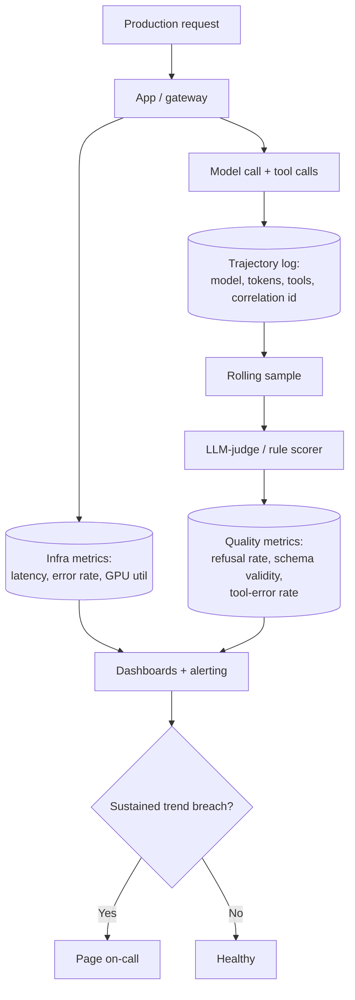

# AI Observability and Production Performance Monitoring

**Level:** Advanced
**Tree:** [AI Operations & Governance](../README.md)
**Branch:** [LLMOps and Production Observability](README.md)
**Forest:** [AI & Intelligent Systems](../../../README.md)

## Explanation

Observability for an AI system covers a wider surface than a conventional service, because failure is often silent: the system returns HTTP 200 with a confident, fluent, wrong answer. Standard infrastructure metrics (CPU, memory, request latency) tell you the pipes are open; they say nothing about whether the answers flowing through them are good.

A mature monitoring stack layers three kinds of signal. **Infrastructure and traffic** - request rate, error rate, latency percentiles per model deployment, GPU/queue utilisation for self-hosted inference - is the baseline every service needs. **Model-specific quality proxies** are the layer unique to AI systems: token-level metrics (input/output token counts, cache-hit ratio), structural validity rate (does the output parse against the required schema), tool-call error rate for agents, refusal rate, and empty or truncated response rate. **Sampled quality evaluation** runs an LLM-judge or rule-based scorer against a rolling sample of real production traffic, because synthetic golden sets alone miss the actual distribution of what users ask.

Trajectory logging matters as much as aggregate metrics for agentic systems: capture every model call, every tool call with its arguments and result, and every intermediate reasoning step where available, tagged with a correlation id that ties the whole interaction together. Without full trajectory capture, root-causing a bad decision three weeks later is close to impossible.

Alerting has to be tuned to avoid two failure modes: alert fatigue from noisy thresholds on naturally variable metrics like per-request latency, and blind spots from only alerting on infrastructure signals while a quality regression runs unnoticed for weeks. The practical answer is a small number of high-confidence alerts on sustained trend changes (moving averages, not single data points) covering both infrastructure and quality dimensions, feeding the same on-call rotation as any other production service.

## Architecture and flow



## Commands

### Command 1

Provision Application Insights to collect distributed traces for the AI application.

```text
az monitor app-insights component create -g rg-ai -a llm-app-insights -l swedencentral --application-type web
```

### Command 2

Pull five-minute granularity latency, error and token metrics for dashboarding.

```text
az monitor metrics list --resource $AOAI_ID --metric Latency,Errors,ProcessedPromptTokens,GeneratedTokens --interval PT5M
```

### Command 3

Check GPU-node pod memory pressure for self-hosted inference workloads.

```text
kubectl top pods -n ai-inference --sort-by=memory
```

### Command 4

Stream GPU utilisation samples every 5 seconds for a live performance view.

```text
nvidia-smi dmon -s u -d 5
```

### Command 5

Aggregate tool-call error counts per hour from trajectory logs in Log Analytics.

```text
az monitor log-analytics query -w $LAW_ID --analytics-query "AppTraces | where Message has 'tool_call_error' | summarize count() by bin(TimeGenerated, 1h)"
```

### Command 6

Alert when the six-hour rolling refusal rate exceeds an agreed threshold.

```text
az monitor scheduled-query create -g rg-ai -n refusal-rate-alert --scopes $LAW_ID --condition "avg 'refusal_rate' > 0.15" --evaluation-frequency 30m --window-size 6h
```

### Command 7

Emit an OpenTelemetry span for a completion call, enabling standard trace tooling.

```text
otel-cli span --name llm.chat.completion --attrs model=gpt-4o,tokens_in=512,tokens_out=180
```

### Command 8

Check locally resident model VRAM footprint as part of an infra-health check.

```text
curl -s http://localhost:11434/api/ps | jq '.models[] | {name, size_vram}'
```

## Automation scripts

### Rolling quality-sample scorer and alert feed

```python
#!/usr/bin/env python3
"""Sample recent production interactions from a log store, score each with
a lightweight rule-based quality check, and emit rolling metrics suitable
for a dashboard or an alert pipeline.

Expects a JSON Lines input file where each line is one logged interaction
with fields: request_id, prompt, response, tool_calls, schema_ok (bool or null).
"""
import json
import statistics
import sys
from collections import Counter

REFUSAL_MARKERS = (
    "i cannot help with that",
    "i'm not able to assist",
    "i can't provide",
    "as an ai",
)


def load_interactions(path):
    rows = []
    with open(path, encoding="utf-8") as fh:
        for line in fh:
            line = line.strip()
            if line:
                rows.append(json.loads(line))
    return rows


def is_refusal(text):
    low = text.lower()
    return any(marker in low for marker in REFUSAL_MARKERS)


def is_empty_or_truncated(text):
    stripped = text.strip()
    if not stripped:
        return True
    return len(stripped) < 5


def score_interaction(row):
    response = row.get("response", "") or ""
    result = {
        "request_id": row.get("request_id", "unknown"),
        "refusal": is_refusal(response),
        "empty_or_truncated": is_empty_or_truncated(response),
        "schema_ok": row.get("schema_ok"),
        "tool_error": False,
    }
    for call in row.get("tool_calls", []) or []:
        if call.get("error"):
            result["tool_error"] = True
            break
    return result


def main():
    if len(sys.argv) < 2:
        print("Usage: quality_monitor.py <interactions.jsonl>")
        sys.exit(2)
    path = sys.argv[1]
    rows = load_interactions(path)
    if not rows:
        print("No interactions found in %s" % path)
        sys.exit(1)

    scored = [score_interaction(r) for r in rows]
    n = len(scored)
    refusal_rate = sum(1 for s in scored if s["refusal"]) / n
    empty_rate = sum(1 for s in scored if s["empty_or_truncated"]) / n
    tool_error_rate = sum(1 for s in scored if s["tool_error"]) / n
    schema_checked = [s for s in scored if s["schema_ok"] is not None]
    schema_valid_rate = (
        sum(1 for s in schema_checked if s["schema_ok"]) / len(schema_checked)
        if schema_checked else None
    )

    report = {
        "sample_size": n,
        "refusal_rate": round(refusal_rate, 4),
        "empty_or_truncated_rate": round(empty_rate, 4),
        "tool_error_rate": round(tool_error_rate, 4),
        "schema_valid_rate": round(schema_valid_rate, 4) if schema_valid_rate is not None else None,
        "alerts": [],
    }

    if refusal_rate > 0.15:
        report["alerts"].append("refusal_rate above 15%% threshold")
    if empty_rate > 0.05:
        report["alerts"].append("empty_or_truncated_rate above 5%% threshold")
    if tool_error_rate > 0.10:
        report["alerts"].append("tool_error_rate above 10%% threshold")
    if schema_valid_rate is not None and schema_valid_rate < 0.95:
        report["alerts"].append("schema_valid_rate below 95%% threshold")

    with open("quality-monitor-report.json", "w", encoding="utf-8") as fh:
        json.dump(report, fh, indent=2)
    print(json.dumps(report, indent=2))
    sys.exit(1 if report["alerts"] else 0)


if __name__ == "__main__":
    main()
```

## Lab

**Objective:** Instrument an AI application with trajectory logging and rolling quality metrics, and prove that a sustained quality regression triggers an alert distinct from any infrastructure signal.

### Steps

1. Add structured logging to a sample chat application that writes one JSON line per interaction with request_id, prompt, response, tool_calls and a schema_ok flag.
2. Run 50-100 varied interactions through the application, including at least a few that should trigger a refusal and a few with intentionally malformed tool arguments.
3. Run the quality-monitor script against the resulting interactions.jsonl and review the computed refusal_rate, empty_or_truncated_rate, tool_error_rate and schema_valid_rate.
4. Provision Application Insights or an equivalent APM and confirm infra-level latency and error-rate metrics are visible for the same time window.
5. Deliberately introduce a change that increases refusals, for example tightening a content filter too aggressively, and re-run the quality monitor to confirm the refusal_rate alert fires while infra metrics remain healthy.
6. Configure a scheduled query alert in Log Analytics against the tool_error_rate signal and confirm it fires when tool arguments are malformed.
7. Build a single dashboard panel combining one infra metric (p95 latency) and one quality metric (refusal_rate) on the same timeline to demonstrate they can diverge independently.

### Validation

- quality-monitor-report.json is produced with a non-zero sample_size and populated rate fields.
- The deliberate refusal-inducing change produces a report with refusal_rate above 0.15 and a non-zero exit code.
- Infra-level latency and error-rate metrics remain within normal bounds during the refusal-rate regression, demonstrating the two signal classes are independent.
- The Log Analytics scheduled query alert fires specifically on the tool-error scenario.
- The combined dashboard panel visibly shows quality degrading while infra metrics stay flat.

## Operational automation

### Automating AI observability at scale

**Instrument once, at the platform layer.** Build trajectory logging (model calls, tool calls, correlation ids) into a shared client library or gateway every application uses, rather than leaving each team to add it inconsistently. This is the single highest-leverage investment - it turns every future incident investigation from an archaeology exercise into a query.

**Automate the rolling sample and score.** Schedule the quality-monitor style scorer to run continuously against a rolling window of recent production interactions - hourly is typical for high-volume systems - rather than only during incident response, and ship the output metrics to the same time-series store as infrastructure metrics so they sit on the same dashboards and alerting pipeline.

**Correlate, don't silo.** Tag every log line and metric with a common correlation id and application id so an on-call engineer can pivot from an infra alert straight to the trajectory logs for the affected requests without switching tools or losing context.

**Automate threshold tuning.** Static thresholds age badly as usage patterns shift. Recompute alert thresholds periodically from trailing statistical baselines (for example, a rolling 30-day mean plus a fixed number of standard deviations) rather than hand-picked constants that were reasonable once and are now either too noisy or too blind.

**Close the loop into evaluation.** Route interactions flagged by the quality monitor - refusals, tool errors, low schema validity - into a review queue, and periodically promote the interesting ones into the golden evaluation set used by the LLMOps CI gate, so production observability directly improves pre-release testing over time.

## Troubleshooting

### Scenario 1: Every infrastructure dashboard is green but users are complaining about answer quality.

**Likely cause:** Monitoring only covers transport-layer signals (latency, HTTP status) with no model-specific quality proxies, so a quality regression is invisible to the existing stack.

**Resolution:** Add refusal rate, empty/truncated response rate, schema validity rate and tool-call error rate as first-class metrics on the same dashboard and alerting pipeline as infrastructure signals.

### Scenario 2: An incident investigation cannot determine what the agent actually did three weeks ago.

**Likely cause:** Logging captured only the final response, not the full call trajectory - which tools were invoked, with what arguments, and what they returned.

**Resolution:** Instrument full trajectory logging at the platform/gateway layer with a correlation id per interaction, retained for at least the incident-review window your compliance policy requires.

### Scenario 3: Quality alerts fire several times a week and the on-call team has started ignoring them.

**Likely cause:** Thresholds were set as fixed constants without reference to normal variance, so ordinary sampling noise crosses them regularly.

**Resolution:** Recompute thresholds from a trailing statistical baseline (rolling mean plus standard deviations) and require a sustained trend across multiple windows before paging, rather than a single noisy sample.

### Scenario 4: GPU-hosted inference nodes show low utilisation on dashboards but users report slow responses at peak hours.

**Likely cause:** Aggregate utilisation is averaged across the day and masks a short but severe peak-hour saturation window.

**Resolution:** Monitor utilisation and queue depth at a finer time granularity (1-5 minute buckets) and alert on peak-window saturation specifically, not on the daily average.

### Scenario 5: The rolling quality sample looks healthy but a specific customer segment is receiving consistently poor answers.

**Likely cause:** The sample is drawn uniformly across all traffic and the affected segment is a small fraction, so its degradation is diluted into the aggregate.

**Resolution:** Stratify the quality sample by relevant dimensions (customer tier, locale, workload type) and compute metrics per stratum, not only in aggregate, so a segment-specific regression is visible.

## Interview questions

### 1. Why do standard APM tools fall short for monitoring an LLM-based application?

Standard APM is built around the assumption that a successful response (correct status code, acceptable latency) means the request succeeded. For an LLM system that assumption breaks: the model can return a confident, fluent, well-formed, completely wrong answer with a 200 status and normal latency, and APM will show it as healthy. LLM observability needs an additional layer of model-specific signals - refusal rate, schema/structural validity, tool-call error rate, and sampled quality scoring against a judge or rule set - that assess the content of the response, not just its transport. It also needs deeper request-level detail: token counts for cost, cache-hit ratio for efficiency, and for agentic systems the full trajectory of tool calls, because a bad outcome is often the result of a chain of individually-plausible steps rather than one obvious failure a trace waterfall would highlight.

### 2. How do you avoid alert fatigue while still catching real quality regressions quickly?

Two disciplines matter most. First, alert on sustained trend changes using a rolling window and a statistically-derived threshold - a moving average crossing a baseline plus a margin of standard deviations - rather than a single data point crossing a fixed constant; this filters ordinary sampling noise while still catching genuine step-changes within an acceptable delay. Second, keep the number of paging alerts small and high-confidence, reserving lower-severity signals for a dashboard or a daily digest rather than a page. It also helps to stratify: an aggregate metric can look fine while a specific segment or workload type degrades badly, so segment-level thresholds catch real regressions the aggregate would hide, without needing to lower the aggregate threshold to a noisy level just to catch them.

### 3. What would you capture in trajectory logging for an agentic AI system, and why does it matter for incident response?

Capture, per interaction, a correlation id; every model call with its exact prompt, model/version and token usage; every tool call with its arguments, the tool's raw response, latency and any error; and, where the framework exposes it, the intermediate reasoning or planning step that led to each tool choice. This matters because agent failures are usually the result of a chain: a slightly ambiguous retrieval result led to a wrong tool choice which led to a wrong final answer, and none of the individual steps look obviously broken in isolation. Without full trajectory capture, reconstructing that chain days or weeks after the fact is close to impossible - you are left guessing from the final output alone. With it, an investigator can replay exactly what the agent saw and decided at each step, which is also the raw material for turning a real incident into a new regression test case.

### 4. How would you monitor cost and performance together without one metric hiding a problem in the other?

Track them on the same timeline but as genuinely separate axes, because optimising one can silently regress the other - routing more traffic to a cheaper small model cuts cost but can raise refusal or error rates, and raising GPU keep-alive to cut latency raises steady-state cost. Concretely: token counts, cache-hit ratio and per-request cost sit on one panel; latency percentiles, refusal rate, tool-error rate and schema validity sit on another; and both are sliced by the same dimensions - model, deployment, workload tag - so a reviewer can see whether a cost-driven routing change moved the quality panel at all. The practical governance step is to require any cost-optimisation change (a new routing rule, a smaller model swap, a caching change) to pass through the same evaluation gate used for prompt changes, so a cost win is never accepted without confirming quality held.

## Certification alignment

- AI-102 Azure AI Engineer Associate - Monitor Azure AI solutions to ensure operational reliability
- AZ-500 Microsoft Azure Security Technologies - Implement monitoring by using Azure Monitor and Log Analytics
- Vendor-neutral - OpenTelemetry certified practice: distributed tracing for AI and agentic workloads
- Vendor-neutral - NIST AI RMF MEASURE function: ongoing performance and impact monitoring

## References

- Microsoft Learn - Azure Monitor and Application Insights for AI workloads
- OpenTelemetry documentation - semantic conventions for generative AI systems
- Google SRE Workbook - monitoring distributed systems, adapted for AI-specific signals
- NIST AI 100-1 - AI Risk Management Framework, MEASURE function

## Suggested video search

LLM observability production monitoring dashboards OpenTelemetry AI applications

---

> Validate commands, versions, permissions, licensing, and rollback procedures in an isolated lab before production use.
