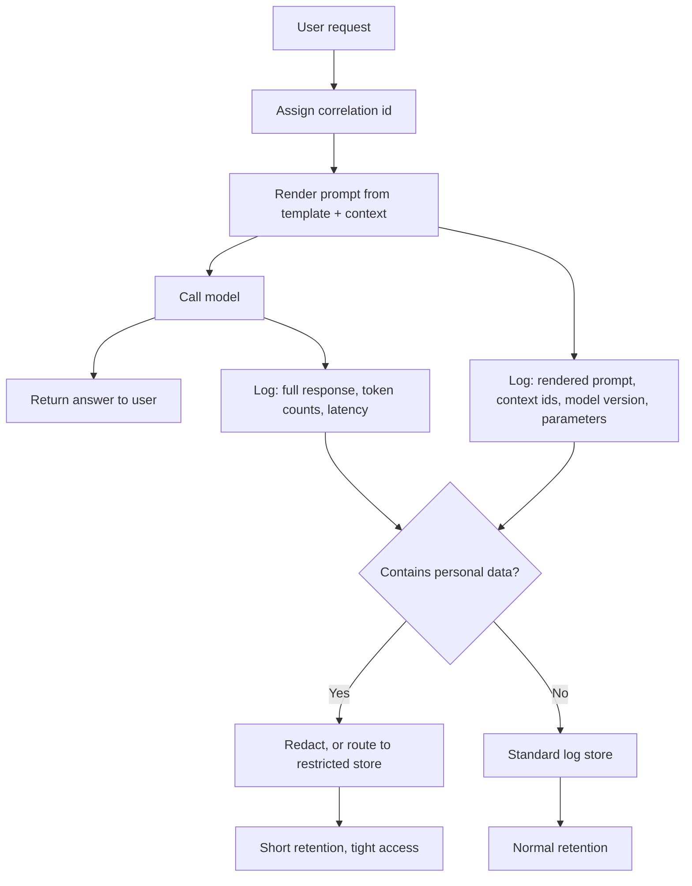

# What to Log When Your AI Feature Goes Live

**Level:** Beginner
**Tree:** [AI Operations & Governance](../README.md)
**Branch:** [LLMOps and Production Observability](README.md)
**Forest:** [AI & Intelligent Systems](../../../README.md)

## Explanation

Your AI feature is live. Someone reports that it "gave a wrong answer yesterday
afternoon". You open the logs and find a row saying the request succeeded in
1.2 seconds with HTTP 200. That row is true and completely useless, and the gap
between those two facts is what this leaf is about.

### The normal failure returns 200

Conventional application logging is built around a simple assumption: things
that went wrong produce errors. A database refuses a write, a service times
out, a null reference explodes — each leaves a stack trace, and the stack trace
tells you where to look.

Language models break that assumption. The most common failure is a request
that succeeded perfectly by every technical measure and produced an answer that
was wrong, irrelevant, or subtly misleading. No exception was raised because no
exception occurred. The system did exactly what it was asked; what it was asked
turned out to be the problem.

So the question "was there an error?" cannot find your failures. The question
you actually need to answer is different: **what did the model see, and what did
it say?** Nothing else reconstructs the event.

### Log the decision, not the request

Think of each call as a decision the system made, and log everything that fed
that decision plus everything that came out of it. In practice that is:

- **The rendered prompt** — not your template, the final text after variables
  were substituted and context inserted. The template is what you wrote; the
  rendered prompt is what the model read, and they diverge constantly.
- **The retrieved context**, if any, with identifiers for each document. When
  an answer is wrong because the wrong document was retrieved, this is the only
  field that shows it.
- **The model and version string**, exactly as the provider reports it. Model
  behaviour changes between versions, and "we were on the latest" is not a
  version.
- **The parameters** — temperature or reasoning effort, the token cap, any tool definitions passed.
- **The full response**, including the parts you discarded.
- **Token counts for input and output**, which are your cost and your capacity.
- **A correlation identifier** linking this row to the user-visible interaction.

That last one sounds like housekeeping and is the difference between an
investigation and a shrug. A report always arrives as "yesterday afternoon,
this looked wrong". Without an identifier that ties the complaint to the row,
you are searching thousands of records for a conversation you cannot describe.

### The unavoidable tension

Everything above says log the prompt. The prompt contains whatever the user
typed, and users type customer names, account numbers, medical details and
passwords into text boxes. The complete log you need for debugging is also a
new copy of personal data, in a system that was probably never assessed to
hold it.

This is a real tension and it does not have a purely technical resolution. What
it has is a set of honest options, each with a cost:

**Redact before storing.** Run detection for the categories you expect and mask
them. Cheap, and imperfect: detection misses things, and you lose the ability
to see exactly what the model saw — which is sometimes the bug.

**Shorten retention.** Keep full records for a few days and metadata for
months. Most investigations start within hours of the event, so this covers the
common case while limiting exposure. Note the trade: a pattern that emerges
slowly becomes invisible.

**Split the store.** Metadata, token counts and identifiers in your normal
logging system; prompts and responses in a separate store with tighter access
control and its own retention. More work, and the option that survives scrutiny
best.

**Sample.** Full capture for a small percentage, metadata for everything. Good
for measuring quality trends, bad for investigating one specific complaint —
which is usually what you are asked to do.

Choose deliberately and write the choice down. The failure mode is not picking
the wrong option; it is never making the decision, logging everything by
default, and discovering the exposure during an audit.

### Metrics are not logs, and you need both

Logs answer "what happened in this one case". Metrics answer "is the system
getting worse". Keep them separate and keep both: latency percentiles (not
averages — the mean hides the tail users complain about), token consumption per
day, error and refusal rates, and requests hitting the token ceiling.

A rise in truncated responses, for instance, usually means prompts are growing
— someone added context and nobody noticed. That is invisible in any single log
line and obvious in a daily count.

## Architecture and flow



## Commands

### Command 1

Confirm what the provider actually served. The model string you asked for and
the one that answered are not always the same, and version drift explains a
surprising share of "it changed by itself" reports.

```text
curl -s -X POST "$ENDPOINT/v1/chat/completions" -H "Authorization: Bearer $KEY" \
  -d '{"model":"<model>","messages":[{"role":"user","content":"ping"}]}' | jq '.model, .usage'
```

### Command 2

Token counts are cost and capacity in one number. Reading them from the
response, rather than estimating, keeps both honest.

```text
jq -r '[.timestamp, .correlation_id, .usage.prompt_tokens, .usage.completion_tokens] | @tsv' app.log
```

### Command 3

Find the interaction a user is complaining about. This is the query that
justifies storing a correlation identifier at all.

```text
grep -h '"correlation_id":"abc-123"' logs/*.jsonl | jq '.rendered_prompt, .response'
```

### Command 4

Averages hide the experience people complain about. Percentiles do not.

```text
jq -s 'map(.latency_ms) | sort | {p50: .[length/2|floor], p95: .[length*0.95|floor]}' app.log
```

### Command 5

Responses stopped by the token ceiling are truncated answers users read as
wrong. Counting them daily catches prompt growth before users report it.

```text
jq -r 'select(.finish_reason=="length") | .timestamp[0:10]' app.log | sort | uniq -c
```

### Command 6

Before shipping, prove your logger is not writing secrets. Grepping your own
log for the key you configured is a ten-second check that has saved real
incidents.

```text
grep -c "$(echo "$KEY" | cut -c1-12)" logs/*.jsonl
```

## Automation scripts

### log_shape.py

```python
#!/usr/bin/env python3
"""Check that AI call logs carry the fields an investigation needs.

Refuses to pass a record whose free-text fields are not marked as reviewed for
personal data. That refusal is the point: the common failure is not choosing
the wrong retention policy, it is logging prompts by default and discovering
during an audit that nobody decided to.
"""
import argparse
import json
import re
import sys

# Without these you cannot reconstruct what the model saw or said.
REQUIRED = [
    "correlation_id",
    "timestamp",
    "model",          # the version the provider reported, not the one requested
    "rendered_prompt",  # after substitution, not the template
    "response",
    "usage",
]

# Fields holding user-supplied text. Each needs a deliberate handling decision.
FREE_TEXT = ["rendered_prompt", "response", "retrieved_context"]

# Cheap signals, not a compliance tool. A hit means look; no hit means nothing.
PATTERNS = {
    "email": re.compile(r"[\w.+-]+@[\w-]+\.[\w.]+"),
    "long digit run (card, account, phone)": re.compile(r"\b\d{9,}\b"),
    "possible secret": re.compile(r"\b(sk-|ghp_|AKIA)[A-Za-z0-9_-]{8,}"),
}

def check(record: dict, handling: set[str]) -> list[str]:
    problems = []
    for field in REQUIRED:
        if field not in record:
            problems.append(f"missing required field '{field}'")

    for field in FREE_TEXT:
        value = record.get(field)
        if value is None:
            continue
        text = value if isinstance(value, str) else json.dumps(value)
        if field not in handling:
            problems.append(
                f"'{field}' holds user text but no handling was declared for it. "
                "Pass --handled to state that redaction, retention or store separation "
                "was decided for this field."
            )
        for label, pattern in PATTERNS.items():
            if pattern.search(text):
                problems.append(f"'{field}' contains what looks like {label}")
    return problems

def main() -> None:
    parser = argparse.ArgumentParser()
    parser.add_argument("logfile", help="JSON Lines file of AI call records")
    parser.add_argument("--handled", default="",
                        help="Comma-separated free-text fields you have a stated policy for.")
    args = parser.parse_args()
    handling = {f.strip() for f in args.handled.split(",") if f.strip()}

    total = 0
    failed = 0
    seen = set()
    with open(args.logfile, encoding="utf-8") as handle:
        for number, line in enumerate(handle, 1):
            line = line.strip()
            if not line:
                continue
            total += 1
            try:
                record = json.loads(line)
            except json.JSONDecodeError as error:
                print(f"line {number}: not valid JSON - {error}")
                failed += 1
                continue
            for problem in check(record, handling):
                if problem not in seen:
                    seen.add(problem)
                    print(f"line {number}: {problem}")
                failed += 1

    print(f"\n{total} record(s) checked, {failed} problem(s) found.")
    if failed:
        print("Fix the shape before shipping: a log you cannot investigate from is "
              "storage cost without benefit, and one holding undeclared personal data "
              "is a liability.")
        sys.exit(1)

if __name__ == "__main__":
    main()
```

## Lab

**Objective:** Produce a log record you could actually investigate a complaint
from, then prove it does not silently hold personal data or secrets.

### Steps

1. Call a model from a small script and log only what you would have logged by habit.
2. Wait an hour, then try to answer "what exactly did the model see?" from that log alone. Write down what is missing.
3. Add every field from the required list, including the rendered prompt rather than the template.
4. Generate twenty calls, at least three containing an email address and an account-like number in the user text.
5. Run `log_shape.py` with no `--handled` and read what it refuses.
6. Choose one handling option - redact, shorten retention, split the store or sample - and write the decision and its cost in one sentence.
7. Implement that choice, then re-run with `--handled` naming the fields you covered.
8. Grep the log for the first twelve characters of your API key.
9. Pick one call and reconstruct it end to end from its correlation identifier only.
10. Compute p50 and p95 latency across the twenty calls and note the gap.

### Validation

- A log record containing all six required fields, with the rendered prompt distinguishable from the template.
- `log_shape.py` output before and after your handling decision, showing the refusal and then the pass.
- One sentence naming your retention choice and what it costs you.
- A grep for your API key prefix returning zero.
- A single complaint reconstructed from its correlation identifier, with the prompt, retrieved context and full response shown.

## Operational automation

### Making this survive contact with production

- **Run the shape check in CI against sample records.** A logger that silently drops a field degrades quietly; the first time anyone notices is during an investigation that then cannot proceed.
- **Alert on truncated responses as a share of traffic.** A rising `finish_reason: length` means prompts are growing, which is a cost and quality change nobody announced.
- **Enforce retention with a scheduled deletion job, not a policy document.** An unenforced retention period is an intention, and auditors treat it as one.
- **Log the provider's reported model string on every call, never a constant.** Providers move endpoints between versions, and a hard-coded string will happily record a fiction.
- **Review the redaction patterns quarterly against real samples.** Detection decays as user behaviour changes, and a rule that worked at launch will quietly stop matching.

## Troubleshooting

### Scenario 1: A user reports a wrong answer and the logs show only a successful request.

**Likely cause:** The logging was built for exceptions, and no exception occurred. The prompt and response were never captured.

**Resolution:** Add the decision fields listed above, starting with the rendered prompt and full response. Until then the honest answer to the complaint is that the event cannot be reconstructed - say so rather than guessing.

### Scenario 2: The same prompt produces different answers on different days.

**Likely cause:** Either a sampling setting changed - a non-zero temperature, or a different reasoning effort on a reasoning model - or the provider moved you to a new model version. All are invisible without logging.

**Resolution:** Compare the logged model version string across the two dates and check the logged sampling parameters. If the version changed, that is the answer; if not, fix them for the comparison - temperature to zero where the model accepts it, the reasoning effort where it does not - and re-test.

### Scenario 3: Log volume and storage cost grew far faster than traffic.

**Likely cause:** You are logging full prompts including retrieved context, and context grew - more documents, or longer ones - while request count stayed flat.

**Resolution:** Log document identifiers rather than full retrieved text, keeping the text only in the retrieval store. Confirm by comparing average record size against average prompt tokens over the same period.

### Scenario 4: An audit finds customer data in the application log store.

**Likely cause:** Prompts were logged by default without a handling decision, which is the normal outcome when nobody makes one.

**Resolution:** Split free-text fields into a restricted store with its own retention, redact what you can detect, and shorten retention on the rest. Run the shape check over historical records to find the extent before reporting it.

### Scenario 5: Latency looks fine in dashboards but users describe the feature as slow.

**Likely cause:** The dashboard reports averages. A fast median with a heavy tail averages to "fine" while a meaningful share of users wait.

**Resolution:** Replace averages with p50, p95 and p99. Confirm by finding the p99 requests in the log and checking their prompt lengths - long prompts are the usual cause.

## Interview questions

### 1. Why is standard application logging insufficient for an AI feature?

Because it is built on the assumption that failures produce errors, and the characteristic LLM failure does not. A request that returns a confidently wrong answer completes with HTTP 200 in normal latency and raises no exception, so every signal conventional logging watches reads healthy. The information needed instead is what the model saw and what it said: the rendered prompt after substitution, the retrieved context, the model version, the parameters and the full response. None of that is captured by default anywhere. I would also stress the correlation identifier, because complaints arrive as "yesterday afternoon this looked wrong" and without an identifier tying that to a row you are searching thousands of records for a conversation the user cannot describe precisely. The practical test is simple: pick a call from an hour ago and try to reconstruct exactly what happened from the log alone. Most teams discover they cannot, and discovering it during an investigation is much worse than discovering it deliberately.

### 2. You need prompts for debugging but they contain personal data. How do you resolve that?

I would treat it as a decision to be made and written down rather than a problem to be solved, because there is no option without a cost. Redaction is cheap but imperfect, and it removes exactly the detail that is sometimes the bug. Short retention covers most investigations, which start within hours, but hides slow-emerging patterns. Splitting the store - metadata in normal logging, prompts and responses behind tighter access with separate retention - is more work and survives scrutiny best. Sampling supports quality trends but fails the common task of investigating one named complaint. Which is right depends on the data and the regime you operate under, so I would ask what categories actually appear in prompts before choosing. The failure mode I would guard against is not choosing wrongly; it is never deciding, logging everything by default, and learning the extent of the exposure from an auditor rather than from your own records.

### 3. What would you monitor beyond individual log records?

Metrics that answer "is this getting worse", which logs cannot. Latency as percentiles rather than averages, because the mean hides the tail that generates complaints. Token consumption per day split by input and output, since that is simultaneously cost and a leading indicator of prompt growth. The rate of responses stopped by the token ceiling, because rising truncation almost always means someone added context and nobody measured the effect. Refusal and error rates, which move when a provider changes safety behaviour underneath you. I would watch the ratio of input to output tokens too: a sharp rise usually means retrieved context is growing without anyone deciding it should. The point of these is that each is invisible in any single record and obvious in a daily aggregate, which is exactly the class of problem that otherwise gets discovered by users.

### 4. A colleague suggests logging only inputs, to halve storage cost. What do you say?

That it removes most of the value while keeping most of the cost. The response is where the failure actually appears: a wrong answer, a refusal, a truncation, a malformed structure. With inputs only you can see what was asked and never what went wrong, so the single question an investigation exists to answer stays unanswerable. I would also point out that the privacy argument does not favour it either, since prompts typically carry more user-supplied personal data than responses do, so dropping responses saves storage without meaningfully reducing exposure. If cost is genuinely the constraint, the better levers are logging retrieved document identifiers rather than full text - usually the largest field by far - shortening retention on free text while keeping metadata longer, or sampling full capture while retaining metadata for everything. Each of those reduces volume without destroying the ability to investigate, which halving the record does.

## Certification alignment

- **Microsoft Certified: Azure AI Apps and Agents Developer Associate (AI-103)** - Plan and manage an Azure AI solution: logging the rendered prompt, model version, parameters, full response, token counts and a correlation identifier for each deployed call, and choosing redaction, retention and store separation for that data.
- **AWS Certified Machine Learning Engineer - Associate** - Model monitoring, logging and data capture.
- **Google Cloud Professional Machine Learning Engineer** - Production model observability and performance tracking.
- **ISACA Certified Information Systems Auditor (CISA)** - Logging controls, retention and evidence quality.
- **Prometheus Certified Associate (PCA)** - Vendor-neutral metric instrumentation and percentile aggregation.

## References

- [OpenTelemetry: Semantic conventions for generative AI systems](https://github.com/open-telemetry/semantic-conventions-genai/blob/main/docs/gen-ai/README.md) - Standard attributes for recording GenAI calls: model, token usage, parameters and opt-in prompt/response content.
- [Microsoft: Monitor model deployments in Microsoft Foundry Models](https://learn.microsoft.com/azure/foundry/foundry-models/how-to/monitor-models) - Monitoring, diagnostic settings and request/response logging for deployed model calls.
- [Microsoft: Tracing and data handling](https://learn.microsoft.com/azure/foundry/observability/concepts/trace-data) - Handling personal data in logged prompts and responses: redaction, access control and retention.
- [Google Cloud: Log requests and responses | Generative AI on Vertex AI](https://docs.cloud.google.com/vertex-ai/generative-ai/docs/multimodal/request-response-logging) - Provider-side request-response logging with sampling for generative models.
- [National Institute of Standards and Technology: Artificial Intelligence Risk Management Framework (AI RMF 1.0) (NIST AI 100-1)](https://doi.org/10.6028/NIST.AI.100-1) - Measure and Manage functions: ongoing monitoring and management of deployed AI system risks.
- [European Data Protection Board: Guidelines 4/2019 on Article 25 Data Protection by Design and by Default](https://www.edpb.europa.eu/our-work-tools/our-documents/guidelines/guidelines-42019-article-25-data-protection-design-and_en) - Data minimisation, retention and default-protective handling of personal data captured in prompt logs.

## Suggested video search

llm observability logging prompt response tracing correlation id production

---

> Validate commands, versions, permissions, licensing, and rollback procedures in an isolated lab before production use.
