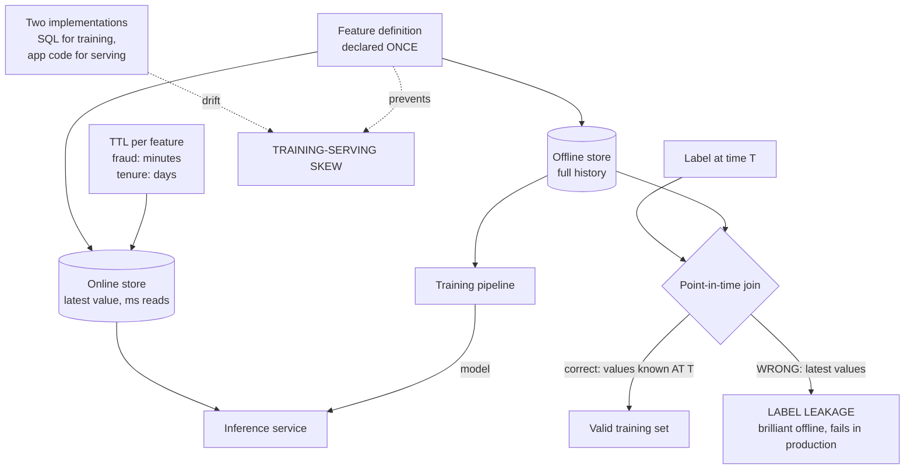

# Feature Stores and Training-Serving Skew: Point-in-Time Correctness with Feast

**Level:** Advanced
**Tree:** [AI Platform Engineering](../README.md)
**Branch:** [Model and Feature Lifecycle](README.md)
**Forest:** [AI & Intelligent Systems](../../../README.md)

## Explanation

### The bug that makes a model look brilliant and perform badly

Two failures cause most of the gap between offline evaluation and production
behaviour, and a feature store exists to prevent both.

### Training-serving skew

A feature is computed one way for training - typically a SQL query over a warehouse -
and a different way at inference, in application code. The two implementations start
identical and drift. The model then receives inputs at serving time that differ subtly
from what it learned on, and performance degrades for reasons no metric explains.
**Declaring the transformation once and materialising it to both the offline and
online stores is the only structural fix**; code review is not sufficient because the
drift is usually a change on one side that nobody thought would matter.

### Point-in-time correctness and label leakage

A training row labelled at time T must use only feature values that were known at T.
Naively joining the latest feature value to a historical label leaks future
information into training. The model scores extraordinarily well offline, because it
is effectively being told the answer, and then fails in production where the future is
not available. **This is the most expensive bug in applied machine learning**, and it
is easy to introduce with an ordinary SQL join.

### Freshness is a per-feature decision

A fraud signal stale by an hour is useless. A customer-tenure feature stale by a day
is fine. Setting one TTL for the whole store either wastes compute refreshing stable
features or serves dangerously stale values for volatile ones. Set freshness per
feature against its business meaning.

## Architecture and flow



## Commands

### Command 1

Register feature definitions from the repository - this single declaration is what keeps both stores consistent

```text
feast apply
```

### Command 2

Push latest offline values into the online store; the incremental form is what runs on a schedule

```text
feast materialize-incremental $(date -u +%FT%T)
```

### Command 3

Point-in-time correct join for training - this is the command that prevents label leakage

```text
feast get-historical-features --entity-df entities.parquet
```

### Command 4

Fetch serving-time features by the same definitions used in training

```text
feast get-online-features --features "user:tenure_days,txn:count_1h"
```

### Command 5

Registered feature views with their sources and TTLs - the freshness contract per feature

```text
feast feature-views list
```

### Command 6

List features whose materialisation is lagging their configured TTL - staleness that a failure-based alert never surfaces

```text
feast materialize-incremental $(date -u +%Y-%m-%dT%H:%M:%S) && feast feature-views list
```

## Automation scripts

### detect_training_serving_skew.py

```python
#!/usr/bin/env python3
"""Compares feature values from the offline and online stores for the same
entities. Any material difference is training-serving skew.
Run on a schedule - skew appears gradually after a one-sided change.
"""
import sys
from datetime import datetime, timezone

import pandas as pd
from feast import FeatureStore

FEATURES = [
    "user_stats:tenure_days",
    "user_stats:txn_count_7d",
    "user_stats:avg_basket_value",
]
TOLERANCE = 0.01          # 1 percent relative difference
SAMPLE_SIZE = 500

store = FeatureStore(repo_path=".")

# Sample entities to compare.
entities = pd.read_parquet("sample_entities.parquet").head(SAMPLE_SIZE)
entities["event_timestamp"] = datetime.now(timezone.utc)

# Offline path - what training would see.
offline = store.get_historical_features(
    entity_df=entities,
    features=FEATURES,
).to_df()

# Online path - what inference actually sees.
rows = entities[["user_id"]].to_dict("records")
online = store.get_online_features(
    features=FEATURES,
    entity_rows=rows,
).to_df()

failures = []

for feature in FEATURES:
    col = feature.split(":")[1]
    if col not in offline or col not in online:
        failures.append("%s missing from one store" % feature)
        continue

    off = offline[col].astype(float).fillna(0)
    onl = online[col].astype(float).fillna(0)

    denom = off.abs().clip(lower=1e-9)
    rel_diff = ((off - onl).abs() / denom)
    skewed = (rel_diff > TOLERANCE).sum()
    pct = 100.0 * skewed / len(off)

    print("%-40s skewed rows: %4d / %4d (%.1f%%)" % (feature, skewed, len(off), pct))

    # Any sustained skew is a defect - the two stores derive from one
    # definition and should agree.
    if pct > 1.0:
        failures.append(
            "%s: %.1f%% of rows differ beyond tolerance" % (feature, pct)
        )

print("")
if failures:
    print("TRAINING-SERVING SKEW DETECTED")
    for f in failures:
        print("  " + f)
    print("")
    print("Likely causes: materialisation lagging, a transformation changed on")
    print("one side only, or a feature computed in application code rather")
    print("than read from the store.")
    sys.exit(1)

print("No skew detected above tolerance.")
sys.exit(0)
```

## Lab

**Objective:** Deliberately introduce both label leakage and training-serving skew, observe how each inflates offline metrics or degrades production behaviour, then eliminate both with a feature store.

### Steps

1. Build a dataset with historical labels and a feature that changes over time.
2. Train a model using a naive join of the latest feature value to each historical label.
3. Record the offline evaluation score - it will look excellent.
4. Evaluate the same model against a properly held-out future period and observe the collapse. This is label leakage.
5. Rebuild the training set with a point-in-time correct join using get-historical-features, retrain, and compare both scores.
6. Define features once in Feast and materialise to both offline and online stores.
7. Serve inference reading features from the online store and confirm parity with the training path.
8. Introduce skew deliberately: change the transformation for the online path only.
9. Run the skew detection script and confirm it identifies the affected feature and the percentage of rows differing.
10. Revert to the single declared transformation and confirm the detector returns clean.

### Validation

- The leaky model scores far higher offline than on a future holdout while the point-in-time model scores consistently.
- The skew detector identifies a deliberately introduced one-sided change and returns clean after the fix.
- The offline-versus-future-holdout gap is quantified for the leaky model, not merely observed.
- Features are declared once and materialised to both stores, with online and offline values matching for the same entity and timestamp.
- Per-feature TTL is configured from business meaning and a stale-value alert fires when a value is served beyond its window.

## Operational automation

### Automating feature store operations

- **Schedule incremental materialisation** and alert on lag rather than only on job
  failure. A job that succeeds but runs less often than a feature's freshness requires
  produces steadily growing staleness that no failure-based alert will ever surface.
- **Run skew detection continuously**, not once at launch. Skew appears gradually after a
  change made on one side by someone who had no reason to know the other existed, so a
  one-time validation at go-live proves nothing about the following month.
- **Fail CI on any model input that does not resolve to a registered feature.** A feature
  computed in application code has no offline counterpart by construction, so it does not
  merely risk skew - it guarantees it.
- **Version feature definitions with the models that consume them.** A model trained
  against version 3 of a feature must not silently begin receiving version 4 at serving
  time; adopting a new definition should require retraining and re-promotion.
- **Set TTL per feature** from its business meaning, and alert when a value is served
  beyond its own freshness window. One store-wide TTL either wastes compute refreshing
  stable features or serves dangerously stale values for volatile ones.
- **Make point-in-time correctness the default path** by generating training sets only
  through the historical-features API. Leakage is introduced by an ordinary join that
  looks entirely reasonable in review, so the defence has to be structural.

## Troubleshooting

### Scenario 1: Model performs far worse in production than offline evaluation predicted.

**Likely cause:** Either label leakage in the training join or training-serving skew in feature computation.

**Resolution:** Test for leakage first, because it is the more damaging of the two: evaluate on a strictly future holdout period, and a large drop confirms it. If the model holds up on future data, run skew detection instead - compare offline and online feature values for the same entities at the same timestamps and look for systematic differences rather than noise. Diagnosing in that order avoids rebuilding a serving pipeline that was never the problem.

### Scenario 2: Predictions degrade gradually over hours and recover after a pipeline run.

**Likely cause:** Online store materialisation is lagging, so inference reads increasingly stale feature values between runs.

**Resolution:** Alert on materialisation lag rather than only on job failure, and shorten the interval for volatile features specifically. The sawtooth recovery pattern is diagnostic of a job that succeeds but runs too infrequently for the freshness its features require, which no failure-based alert will ever catch.

### Scenario 3: A model scores near-perfectly during development.

**Likely cause:** Almost always label leakage - some feature encodes information that only becomes available after the label event.

**Resolution:** Use point-in-time correct joins so each training row sees only values known at its own label timestamp, and re-evaluate. Trace the highest-importance features back to when they are actually populated in the source system relative to the label. Treat implausible offline performance as a defect signal rather than a result, because genuine models on genuine problems rarely score near-perfectly.

### Scenario 4: Offline and online feature values disagree for the same entity at the same timestamp.

**Likely cause:** A feature is being computed in application code on the serving path rather than read from the online store, so it has no shared definition with the offline side.

**Resolution:** Move the computation into a declared feature definition materialised to both stores, and fail CI on any model input that does not resolve to a registered feature. A feature computed in application code has no offline counterpart by construction, so it does not merely risk skew - it guarantees it, and no amount of monitoring will converge the two implementations.

### Scenario 5: A model degrades immediately after a feature definition change that was reviewed and approved.

**Likely cause:** Feature definitions are not versioned with the models that consume them, so a model trained against version 3 silently began receiving version 4 at serving time.

**Resolution:** Version feature definitions and pin each model to the versions it was trained on, so a definition change creates a new version rather than mutating the one in use. Require retraining and re-promotion to adopt it. This makes a feature change an explicit model lifecycle event instead of an invisible change to a deployed model's inputs.

## Interview questions

### 1. What is training-serving skew and why does a feature store prevent it?

It is the situation where a feature is computed one way for training and a different way at inference - typically a SQL expression over a warehouse for training, and application code in the serving path for inference. The two implementations are written to match and they do match on the day they are written. Then they drift, because someone changes a rounding rule, a null-handling default, a time-zone assumption or a unit on one side without knowing the other exists. The model then receives inputs at serving time that differ subtly from those it was fitted on, and performance degrades in a way no monitoring metric explains, because every individual system is healthy. A feature store prevents it structurally rather than procedurally: the transformation is declared once and materialised to both the offline store used for training and the online store used for serving, so there is a single implementation and nothing to drift against. Code review is not an adequate substitute, because the change that introduces skew is usually small, plausible, and made by someone who had no reason to think a model depended on it.

### 2. What is point-in-time correctness?

It is the requirement that a training row labelled at time T must be constructed using only feature values that were actually known at time T. The violation is easy to write and hard to see: an ordinary SQL join between a labels table and a features table matches on entity id and picks up the current feature value, which for a label from six months ago means joining information from the future onto a historical example. The model is then trained on inputs that partly encode the outcome, so it scores extraordinarily well offline - it is effectively being shown the answer - and fails in production where that information does not yet exist. This is the most expensive bug in applied machine learning, because it is not caught by any of the usual defences: the code runs, the metrics are excellent, and the review looks fine. The feature store's historical-features API exists specifically to make the correct join the default one, matching each label to the feature values as of its own timestamp rather than as of now.

### 3. Your model scores 0.99 AUC in development. What is your reaction?

Suspicion, and an investigation before anyone is told the good news. Genuine models on genuine business problems rarely score near-perfectly, so an implausibly high score is far more likely to be a defect signal than a breakthrough - and the defect is almost always label leakage, where some feature encodes information that only exists after the labelled event. The classic examples are innocuous-looking: a status field updated when the case closed, an aggregate recomputed nightly over all history, a timestamp that only gets populated once the outcome is known. The check I run first is evaluation on a strictly future holdout period, entirely after the training window, because leakage collapses under it while genuine signal survives; a large gap between the two confirms it. I would then trace the highest-importance features back to when their values are actually populated in the source system relative to the label event. Treating an unbelievable result as a bug rather than a success is the discipline that catches this in development instead of in production.

### 4. Why set TTL per feature rather than per store?

Because freshness is a property of what the feature means, not of the infrastructure holding it. A fraud velocity signal that is an hour stale is worthless and actively dangerous, since it will report normal behaviour during exactly the burst it exists to detect. A customer-tenure feature that is a day stale is entirely fine, because it changes by one day per day. Setting one TTL across the whole store forces a single compromise on both: tight enough for the volatile features and you burn compute continuously refreshing values that have not changed, loose enough for the stable ones and you serve dangerously stale values where it matters most. Per-feature TTL prices freshness where it is actually needed. It also gives you a meaningful alert: rather than only alerting when a materialisation job fails, you can alert when a value is served beyond its own freshness window, which catches the more common failure of a job that succeeds but does not run often enough for the feature it feeds.

## Certification alignment

- DP-100 Designing and Implementing a Data Science Solution on Azure - feature engineering and data preparation
- AWS Certified Machine Learning - Specialty - feature engineering, data pipelines and SageMaker Feature Store
- Databricks Certified Machine Learning Professional - feature store workflows and point-in-time lookups
- Google Professional Machine Learning Engineer - ML pipeline design, data validation and skew detection
- Vendor-neutral - data engineering fundamentals: temporal joins, slowly changing dimensions and lineage

## References

- Feast documentation - feature views, point-in-time joins and materialisation
- Google - Rules of Machine Learning, training-serving skew guidance
- TensorFlow Data Validation - schema and skew detection between training and serving
- Uber Michelangelo - the origin case study for production feature stores
- Airbnb Zipline - point-in-time correct feature generation at scale

## Suggested video search

Feature store Feast point-in-time correctness training serving skew label leakage

---

> Validate commands, versions, permissions, licensing, and rollback procedures in an isolated lab before production use.
