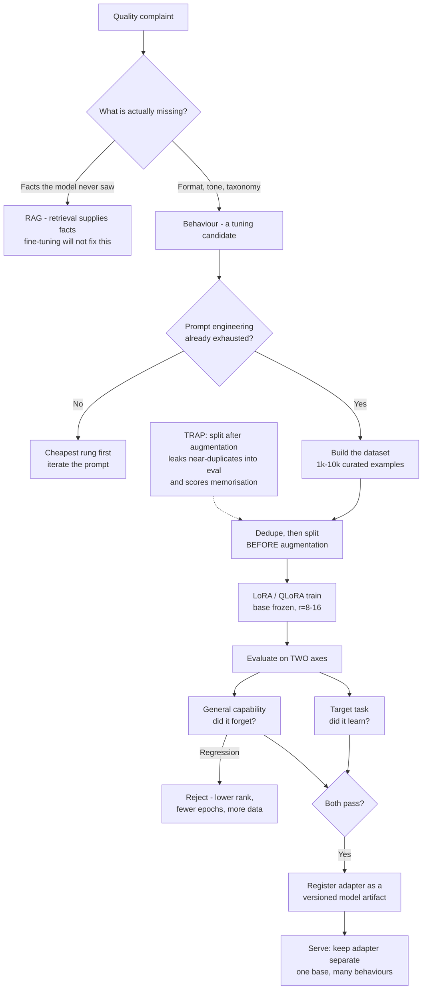

# Fine-Tuning and PEFT: When to Tune, LoRA Adapters and Evaluation

**Level:** Intermediate
**Tree:** [AI Platform Engineering](../README.md)
**Branch:** [Model and Feature Lifecycle](README.md)
**Forest:** [AI & Intelligent Systems](../../../README.md)

## Explanation

### Fine-tuning is the third thing to try, not the first

Most requests to fine-tune are requests for knowledge the model does not have, and
fine-tuning is a poor way to deliver knowledge. The reliable rule: **fine-tuning teaches
form, retrieval supplies facts**. If the complaint is "it does not know our products",
that is a retrieval problem and tuning will produce a model that is confidently wrong in
your house style. If the complaint is "it will not answer in our required format", "it
is too verbose", or "it ignores our classification taxonomy", that is behaviour, and
tuning addresses it directly. Work the ladder in order - prompt, then retrieval, then
tuning - because each rung is cheaper to build, cheaper to change and easier to explain
in an audit than the one above it.

### What PEFT actually changes

Full fine-tuning updates every weight. It needs optimiser state several times the model
size in GPU memory, produces a complete model copy per task, and risks **catastrophic
forgetting** - the model gets better at your task and measurably worse at everything
else. **LoRA** avoids this by freezing the base weights and training small low-rank
matrices injected beside the attention projections. Typically **well under one percent
of parameters** are trainable, the resulting adapter is tens of megabytes rather than
tens of gigabytes, and because the base is untouched the forgetting risk is much lower.

### Rank, alpha and what to target

Rank `r` sets adapter capacity. r=8 to 16 is sufficient for tone, format and
classification behaviour; higher ranks help only when teaching genuinely new skills, and
mostly cost memory otherwise. `alpha` scales the adapter's contribution and is commonly
set to roughly twice the rank. Target modules matter more than rank: applying LoRA to
all attention projections consistently beats applying it to a subset. **QLoRA**
quantises the frozen base to 4-bit so a model that would not otherwise fit can be tuned
on a single GPU, at some throughput cost and with the base precision fixed for training.

### The dataset is the project

A few thousand carefully constructed examples beat a hundred thousand scraped ones, and
the effort is nearly all in the data rather than the training run. Examples must match
the production request format exactly - same system prompt, same field names, same
output shape - because the model learns the mapping it is shown, including any
inconsistency in it. Deduplicate, and hold out an evaluation split **before** any
augmentation, or near-duplicates leak across the boundary and the eval score measures
memorisation.

### Serving: adapters are swappable

Adapters can be merged into base weights for the lowest latency, or kept separate and
loaded at request time so one base model serves several tuned behaviours. Keeping them
separate is usually right in an enterprise: adapters version independently, roll back by
selection, and a runtime like vLLM can hold several at once.

## Architecture and flow



## Commands

### Command 1

Count examples and confirm every record carries the exact fields the training format expects

```text
jq -s "length, (map(select(.messages == null)) | length)" data/train.jsonl
```

### Command 2

Detect exact duplicates before splitting - the cheapest leak to eliminate

```text
sort data/train.jsonl | uniq -d | wc -l
```

### Command 3

Report trainable versus total parameters - the number that tells you PEFT is actually engaged

```text
python -c "from peft import PeftModel; m.print_trainable_parameters()"
```

### Command 4

Launch a LoRA run targeting all attention projections rather than a subset

```text
python -m trl.scripts.sft --model_name_or_path base-model --use_peft --lora_r 16 --lora_alpha 32 --lora_target_modules q_proj k_proj v_proj o_proj
```

### Command 5

Inspect adapter size - tens of megabytes confirms an adapter rather than a full copy

```text
du -sh adapters/support-classifier/ && cat adapters/support-classifier/adapter_config.json
```

### Command 6

Serve the base with adapters loaded separately so one model serves several tuned behaviours

```text
vllm serve base-model --enable-lora --lora-modules classifier=adapters/support-classifier
```

## Automation scripts

### ft_dataset_gate.py

Most failed fine-tunes are dataset failures, and the two that matter most - format drift
and evaluation leakage - are both detectable before a GPU is ever allocated. This gate
runs in CI on the dataset, not on the model.

```python
#!/usr/bin/env python3
"""Reject a fine-tuning dataset before it reaches a GPU.

Checks the three failure modes that waste a training run: records that do not
match the production message format, duplicates, and near-duplicate leakage
between the train and evaluation splits.
"""
import json
import re
import sys
from collections import Counter

MIN_EXAMPLES = 200


def load(path):
    with open(path) as handle:
        return [json.loads(line) for line in handle if line.strip()]


def shingles(text, size=5):
    """Word shingles - near-duplicate detection that survives light editing."""
    words = re.findall(r"\w+", text.lower())
    return {tuple(words[i:i + size]) for i in range(max(len(words) - size + 1, 1))}


def jaccard(a, b):
    return len(a & b) / len(a | b) if a | b else 0.0


def text_of(record):
    return " ".join(m.get("content", "") for m in record.get("messages", []))


def main(train_path, eval_path, threshold=0.8):
    train, evaluation = load(train_path), load(eval_path)
    errors = []

    if len(train) < MIN_EXAMPLES:
        errors.append(f"only {len(train)} training examples; below the {MIN_EXAMPLES} floor")

    # Format: every record must carry the same role sequence the portal will send.
    shapes = Counter(
        tuple(m.get("role") for m in r.get("messages", [])) for r in train
    )
    if len(shapes) > 1:
        errors.append(
            "inconsistent message shapes - the model learns the mapping it is shown: "
            + "; ".join(f"{shape}: {count}" for shape, count in shapes.most_common())
        )

    exact = Counter(json.dumps(r, sort_keys=True) for r in train)
    if duplicates := sum(c - 1 for c in exact.values() if c > 1):
        errors.append(f"{duplicates} exact duplicate training records")

    # Leakage: a near-duplicate across the split makes the eval score measure recall.
    train_shingles = [shingles(text_of(r)) for r in train]
    leaked = 0
    for record in evaluation:
        target = shingles(text_of(record))
        if any(jaccard(target, candidate) >= threshold for candidate in train_shingles):
            leaked += 1
    if leaked:
        errors.append(
            f"{leaked} of {len(evaluation)} evaluation records are near-duplicates of "
            f"training records (Jaccard >= {threshold}); split before augmenting, not after"
        )

    if errors:
        print("\n".join(f"FAIL: {e}" for e in errors))
        return 1

    print(f"PASS: {len(train)} train / {len(evaluation)} eval, one message shape, no leakage")
    return 0


if __name__ == "__main__":
    sys.exit(main(sys.argv[1], sys.argv[2]))
```

## Lab

**Objective:** Work the prompt-RAG-tuning ladder on one task, measure what each rung buys, then demonstrate that a tuned model can win on its target task while losing general capability - and catch it.

### Steps

1. Pick a narrow behavioural task with a checkable output, such as classifying support tickets into a fixed taxonomy and replying in a required format.
2. Establish a baseline with prompt engineering alone and record accuracy on a held-out set of real tickets.
3. Add retrieval over the product documentation and record the same metric, to separate missing knowledge from missing behaviour.
4. Build a dataset of 500 to 2,000 examples in exactly the message format the portal sends, including the system prompt.
5. Run `ft_dataset_gate.py` and fix what it reports before allocating a GPU.
6. Deliberately re-split after augmentation, re-run the gate, and observe the leakage check fire.
7. Train a LoRA adapter at r=16 targeting all attention projections, recording trainable parameter percentage and peak GPU memory.
8. Score the adapter on the target task and compare against both the prompt and RAG baselines.
9. Score the same adapter on a general capability benchmark unrelated to the task and compare against the untuned base.
10. Serve the base with the adapter loaded separately, swap between adapter and base per request, and measure the latency difference against a merged adapter.

### Validation

- Prompt, RAG and tuned scores are recorded on the same held-out set, so the value of each rung is attributable rather than assumed.
- The dataset gate fails on a deliberately leaked split and passes on a correctly ordered one.
- Trainable parameters are reported as well under one percent of total.
- General capability is measured before and after tuning, and any regression is quantified rather than assumed absent.
- One base model serves both the tuned and untuned behaviour by adapter selection, with the latency cost of unmerged adapters recorded.

## Operational automation

### Automating the tuning lifecycle

- **Gate the dataset in CI, not the model.** Format drift, duplicates and split leakage
  are all detectable before a GPU is allocated, and they are the causes of most failed
  runs. A dataset that fails the gate has wasted nothing; one that fails after training
  has wasted the run and the reviewer's time.
- **Split before augmenting, and enforce it mechanically.** Paraphrase or synthetic
  expansion applied before the split places near-duplicates on both sides, and the
  evaluation score then measures memorisation. This is invisible in the number itself -
  it looks like an unusually good result.
- **Measure general capability on every run, not only the target task.** A tuned model
  that gains on its task and loses elsewhere is a regression, and nothing in the training
  loss will tell you. Treat an unrelated benchmark as a required gate alongside the
  target metric.
- **Version adapters as model artifacts** in the registry, with the base model version,
  rank, target modules and dataset hash recorded. An adapter is meaningless without the
  base it was trained against, so the pair is the unit of promotion.
- **Pin the base model version.** An adapter trained against one base and served against
  another is undefined behaviour that usually degrades quietly rather than failing, so
  the serving layer must refuse a mismatched pair instead of loading it.
- **Re-run the ladder comparison each quarter.** Base models improve quickly, and a
  behaviour that needed tuning a year ago is frequently achievable by prompt alone on a
  current model - which removes a training pipeline, a dataset and an artifact from the
  estate.

## Troubleshooting

### Scenario 1: The tuned model answers in the right style but states facts that are wrong.

**Likely cause:** Fine-tuning was used to deliver knowledge rather than behaviour, so the model learned the shape of confident answers without acquiring the underlying facts.

**Resolution:** Move the knowledge to retrieval and keep the adapter for form. This failure is worse than the untuned baseline because the output is now stylistically authoritative while remaining wrong, which makes reviewers less likely to check it. Confirm the diagnosis by asking questions whose answers appeared in the training data versus questions that did not - a large gap between the two confirms the model memorised rather than generalised.

### Scenario 2: Evaluation accuracy is far higher than production accuracy.

**Likely cause:** Near-duplicate leakage between the training and evaluation splits, usually from splitting after augmentation rather than before.

**Resolution:** Re-split from the raw examples before any paraphrase or synthetic expansion, and run near-duplicate detection across the boundary rather than exact-match deduplication, which misses lightly edited copies. Treat an unusually high eval score as a defect signal: on a genuinely hard task, a near-perfect number is far more likely to be leakage than success.

### Scenario 3: The model is better at the target task and noticeably worse at everything else.

**Likely cause:** Catastrophic forgetting - too many epochs, too high a rank, or a learning rate that moved the model further than the task required.

**Resolution:** Reduce epochs first, then rank, then learning rate, re-measuring general capability at each step. Confirm PEFT is actually active by checking trainable parameters are well under one percent - a misconfigured run that silently updates all weights presents exactly this way. Keep the general benchmark as a hard gate, since the target metric improves throughout and will not reveal the trade.

### Scenario 4: Training runs out of GPU memory on a model that should fit.

**Likely cause:** Full fine-tuning was configured rather than PEFT, so optimiser state for every parameter is being allocated.

**Resolution:** Print trainable parameters before training starts and fail the run if the fraction exceeds a threshold, rather than discovering the problem from an out-of-memory error partway through. If the model genuinely does not fit even under LoRA, use QLoRA to quantise the frozen base to 4-bit, accepting reduced throughput and a fixed base precision for training.

### Scenario 5: An adapter that scored well in evaluation behaves differently in production.

**Likely cause:** The serving request format differs from the training format - a different system prompt, different field names, or a chat template the training data did not use.

**Resolution:** Construct training examples from the exact payload the portal sends, including the system prompt, and assert that the serving template matches the training template as a startup check. The model learned a mapping from one specific input shape; changing that shape at serve time is a different task from the one it was tuned on, and the degradation is usually partial rather than obvious.

## Interview questions

### 1. A stakeholder says the model "does not know our products" and asks you to fine-tune it. What do you do?

I push back, because that sentence describes a retrieval problem and fine-tuning is a poor way to deliver facts. The distinction I work from is that tuning teaches form and retrieval supplies facts. If I tune on product documentation, the model learns the shape of confident product answers without reliably acquiring the products themselves - so it produces fluent, in-house-style claims that are wrong, which is worse than the untuned baseline because the style makes reviewers less likely to check. It also means every product change requires a retraining cycle, where a retrieval index just needs reindexing. So I would first establish what is actually failing: put the relevant documentation in the context by hand and see whether the answers become correct. If they do, it is retrieval, and I build that. Fine-tuning stays on the table for the separate complaint that often arrives alongside - the answers are correct but too long, or ignore the required format - which is behaviour, and which tuning genuinely fixes. Working the ladder in order also matters for audit: a prompt or an index is far easier to explain and change than a trained artifact.

### 2. What does LoRA change, and why does it reduce the risk of catastrophic forgetting?

LoRA freezes the base weights entirely and trains small low-rank matrices injected alongside the attention projections, so typically well under one percent of parameters are trainable. Two consequences follow. Operationally, memory drops sharply because there is no optimiser state for the frozen parameters, and the output is an adapter of tens of megabytes rather than a full model copy per task - which changes what you can afford to store, version and serve. Behaviourally, the base model's capabilities are still literally present, because those weights were never modified; the adapter adds a bounded correction rather than rewriting what the model knows. Full fine-tuning moves every weight, so improving the target task can and does degrade unrelated capability, and nothing in the training loss reveals it. LoRA reduces that risk but does not eliminate it - too many epochs or too high a rank still pushes the model further than the task requires - so I keep an unrelated capability benchmark as a required gate on every run rather than trusting the architecture to protect me.

### 3. Your fine-tuned model scores 96 percent in evaluation and roughly 70 percent in production. What happened?

Almost certainly leakage between the training and evaluation splits, and the usual mechanism is splitting after augmentation rather than before. If paraphrases or synthetic expansions are generated first and the split is drawn afterwards, near-duplicates of training examples land in the evaluation set, and the score then measures recall of things the model has already seen rather than generalisation. Exact-match deduplication does not catch it, because the duplicates are lightly edited by construction. The check that does is near-duplicate detection across the split boundary - shingle overlap or embedding similarity with a threshold - which is cheap and belongs in CI on the dataset. The second candidate, if the split is genuinely clean, is a mismatch between the training format and the serving format: a different system prompt or chat template at serve time is a different task from the one the model was tuned on. Either way I treat the implausibly high number as the defect signal. On a genuinely hard task, near-perfect evaluation is far more likely to be a broken measurement than a good model.

### 4. How do you decide rank, and how do you know PEFT is actually working?

Rank sets adapter capacity, and I start low deliberately: r=8 to 16 is enough for tone, format and taxonomy behaviour, which is the majority of enterprise tuning. Higher ranks buy capacity for genuinely new skills but mostly buy memory consumption and forgetting risk otherwise, so I raise rank only when the target metric plateaus below its bar and the general benchmark still has headroom. Alpha is commonly around twice the rank, and I treat which modules are targeted as more consequential than rank itself - covering all attention projections consistently outperforms a subset. As for knowing PEFT is engaged: I print trainable versus total parameters before training starts and fail the run if the fraction is above a threshold. That check exists because a misconfigured run silently doing full fine-tuning presents as an out-of-memory error partway through, or worse, completes and quietly degrades general capability. The parameter percentage is a one-line assertion that distinguishes those cases immediately, and it costs nothing to make it a gate.

## Certification alignment

- AI-102 Azure AI Engineer Associate - customise and fine-tune generative AI models, including when customisation is appropriate
- DP-100 Designing and Implementing a Data Science Solution on Azure - training workloads, experiment tracking and model registration
- AWS Certified Machine Learning - Specialty - model training, hyperparameter selection and evaluation strategy
- Google Professional Machine Learning Engineer - model customisation, evaluation and the build-versus-adapt decision
- Vendor-neutral - NIST AI RMF MEASURE function: documenting capability changes, including regressions, introduced by model customisation

## References

- LoRA - low-rank adaptation of large language models, the originating method and results
- QLoRA - 4-bit quantised base weights for single-GPU fine-tuning
- Hugging Face PEFT documentation - adapter configuration, target modules and merging
- Hugging Face TRL documentation - supervised fine-tuning workflow and chat templates
- vLLM documentation - multi-LoRA serving and adapter selection per request

## Suggested video search

LoRA QLoRA PEFT fine-tuning versus RAG catastrophic forgetting adapter serving enterprise

---

> Validate commands, versions, permissions, licensing, and rollback procedures in an isolated lab before production use.
