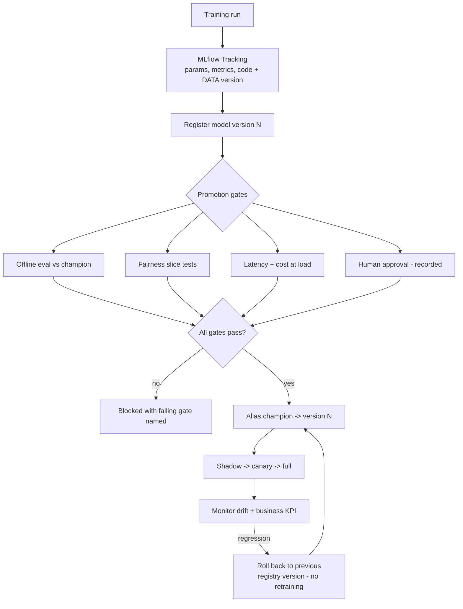

# MLOps with MLflow: Experiment Tracking, Model Registry and Promotion Gates

**Level:** Advanced
**Tree:** [AI Platform Engineering](../README.md)
**Branch:** [Model and Feature Lifecycle](README.md)
**Forest:** [AI & Intelligent Systems](../../../README.md)
**Readiness:** [Lab](../../../READINESS.md#lab) - checked offline, not yet run against a live service. A live run needs only a stock CI runner.

## Explanation

### Two systems that get confused for one

**Tracking** answers *how was this built* - parameters, metrics, code version, dataset
version, artifacts. It belongs to the data scientist and should capture every run,
including the failures, because the failures are what stop an experiment being
repeated.

**The registry** answers *what is allowed to run in production*. It is a release
control and belongs to whoever is accountable for production. Conflating the two is
the single most common reason an MLOps stack is installed and never adopted - if the
registry is just a label a data scientist sets, it controls nothing.

### Reproducibility requires the data version

A tracked run that records hyperparameters but not the dataset version is not
reproducible. The training data moves - rows are added, a upstream join changes, a
backfill rewrites history - and the run can never be re-created. **Log a dataset hash
or a table snapshot identifier alongside the parameters**, or the tracking record is
a description rather than a reproduction.

### Aliases, not stages

Older material promotes a model by moving it between the fixed stages `Staging`,
`Production` and `Archived`. **MLflow deprecated stages in 2.9.0 and will remove them
in a future major release**; `transition_model_version_stage`, `get_latest_versions`
and `models:/name/Production` URIs all belong to that model. Use **aliases**
instead: a named, movable pointer to one version, such as `champion` for what serves
and `challenger` for what is being evaluated. Serving loads `models:/fraud-model@champion`,
promotion moves the alias, and rollback moves it back. Aliases are free-form, so the
names are a convention the team agrees - pick them once and gate on them.

### Promotion gates make the registry real

Moving the `champion` alias should require: offline evaluation against the current champion on
a held-out set, fairness checks on the slices that matter, latency and cost at target
load, an explainability artefact where regulation demands one, and a recorded human
approval. Without gates the registry is a naming convention.

### Rollback is a model capability

Because every promoted version stays in the registry, rolling back is selecting a
previous version rather than retraining. Teams routinely discover during their first
bad deployment that they never wired this path - and retraining under incident
pressure is the worst possible time to find out.

## Architecture and flow



## Commands

### Command 1

Run tracking server with a real database and object store - the SQLite default does not survive concurrent use

```text
mlflow server --backend-store-uri postgresql://... --default-artifact-root s3://mlflow
```

### Command 2

Full run detail including parameters, metrics and tags - the reproducibility record

```text
mlflow runs describe --run-id <id>
```

### Command 3

Serve whichever version the `champion` alias points at, by registry reference rather than by file path. `--env-manager local` uses the current Python environment; production images are built with `mlflow models build-docker`

```text
mlflow models serve -m "models:/fraud-model@champion" -p 5000 --env-manager local
```

### Command 4

Retrieve the exact artifact a run produced, for audit or comparison

```text
mlflow artifacts download --artifact-uri runs:/<id>/model
```

### Command 5

Promote a version by pointing the `champion` alias at it - this call is what the promotion gates must wrap. The MLflow CLI has no alias command, so it is the registry REST API (or `MlflowClient.set_registered_model_alias` from Python)

```text
curl -s -X POST "$MLFLOW_TRACKING_URI/api/2.0/mlflow/registered-models/alias" -H "Content-Type: application/json" -d '{"name": "fraud-model", "alias": "champion", "version": "7"}'
```

### Command 6

Read which version the `champion` alias points at, to compare with the version actually serving - the reconciliation that catches registry drift

```text
curl -s "$MLFLOW_TRACKING_URI/api/2.0/mlflow/registered-models/alias?name=fraud-model&alias=champion" | jq -r ".model_version.version"
```

## Automation scripts

### mlflow-promotion-gate.py

Requires `pip install mlflow`.

```python
#!/usr/bin/env python3
"""Promotion gate for MLflow model registry.
Run in CI. Promotes the version the `challenger` alias points at to
`champion`, or exits non-zero naming every gate that failed.
"""
import os
import sys

from mlflow import MlflowClient
from mlflow.exceptions import MlflowException

MODEL = "fraud-model"
MIN_AUC_UPLIFT = 0.0      # must at least match champion
MAX_P99_MS = 250
MIN_SLICE_AUC = 0.70      # fairness floor on every slice

# Without a tracking URI the client silently uses a local store, and the
# gate would pass or fail against the wrong registry.
if not os.environ.get("MLFLOW_TRACKING_URI"):
    sys.exit("set MLFLOW_TRACKING_URI to the tracking server, e.g. https://mlflow.example.internal")

client = MlflowClient()
failures = []


def aliased(model, alias):
    """The version an alias points at, or None if the alias is not set."""
    try:
        return client.get_model_version_by_alias(model, alias)
    except MlflowException:
        return None


candidate = aliased(MODEL, "challenger")
champion = aliased(MODEL, "champion")

if candidate is None:
    print("no version has the challenger alias - set it on the version to evaluate")
    sys.exit(2)

cand_run = client.get_run(candidate.run_id)
m = cand_run.data.metrics

# Gate 1 - reproducibility. A run without a dataset version cannot be
# re-created, so it must not reach production regardless of its metrics.
if "dataset_hash" not in cand_run.data.tags:
    failures.append("reproducibility: no dataset_hash tag - run is not reproducible")

# Gate 2 - offline performance against the champion.
if champion is not None:
    champ_auc = client.get_run(champion.run_id).data.metrics.get("auc", 0.0)
    cand_auc = m.get("auc", 0.0)
    if cand_auc < champ_auc + MIN_AUC_UPLIFT:
        failures.append(
            "performance: candidate auc %.4f below champion %.4f" % (cand_auc, champ_auc)
        )

# Gate 3 - fairness across slices. A model can improve overall while
# degrading badly on a subgroup; the aggregate metric hides it.
for key, value in m.items():
    if key.startswith("auc_slice_") and value < MIN_SLICE_AUC:
        failures.append("fairness: %s = %.4f below floor %.2f" % (key, value, MIN_SLICE_AUC))

# Gate 4 - serving latency at target load.
p99 = m.get("p99_latency_ms")
if p99 is None:
    failures.append("latency: no p99_latency_ms metric logged - load test not run")
elif p99 > MAX_P99_MS:
    failures.append("latency: p99 %.0f ms exceeds %d ms" % (p99, MAX_P99_MS))

# Gate 5 - recorded human approval.
if cand_run.data.tags.get("approved_by") is None:
    failures.append("approval: no approved_by tag - human sign-off missing")

if failures:
    print("PROMOTION BLOCKED for %s version %s" % (MODEL, candidate.version))
    for f in failures:
        print("  FAIL " + f)
    sys.exit(1)

# Moving the alias is the promotion. The previous champion stays in the
# registry untouched, so rollback is pointing the alias back at it.
client.set_registered_model_alias(MODEL, "champion", candidate.version)
client.delete_registered_model_alias(MODEL, "challenger")
print("promoted %s version %s to champion" % (MODEL, candidate.version))
if champion is not None:
    print("rollback: point champion back at version %s" % champion.version)
sys.exit(0)
```

## Lab

**Objective:** Stand up MLflow with a real backend, train competing models, enforce automated promotion gates in CI, and prove rollback by promoting a deliberately degraded model and reverting it.

### Steps

1. Deploy the MLflow tracking server backed by PostgreSQL and object storage rather than the local SQLite default.
2. Train three model variants, logging parameters, metrics, artifacts and a dataset hash tag for each.
3. Confirm every run can be reproduced from its logged record, including the exact training data version.
4. Register the best variant, set the `challenger` alias on it, and promote it to `champion` through the gate script.
5. Train a variant with better overall AUC but deliberately degraded performance on one demographic slice.
6. Attempt promotion and confirm the fairness gate blocks it, naming the failing slice.
7. Remove the dataset hash tag from a run and confirm the reproducibility gate blocks it independently.
8. Promote a genuinely better model and deploy it shadow, then canary, then full.
9. Simulate a production regression and roll back by pointing the `champion` alias at the previous version. Measure how long the rollback takes.
10. Confirm no retraining was required to roll back.

### Validation

- Gate script blocks promotion for fairness, reproducibility and latency failures independently and names the cause.
- Rollback completes by selecting a prior registry version with no retraining.
- Every production model traces to a reproducible run with a dataset version.
- The tracking server runs on PostgreSQL with object storage, and artifacts survive a server restart.
- The fairness gate names the specific degraded slice rather than reporting an aggregate failure.
- Rollback duration is measured and recorded, demonstrating it is a selection rather than a retrain.

## Operational automation

### Automating the MLOps loop

- **Run the gate script in CI** on every promotion request so promotion is a
  pipeline outcome rather than a console click. A gate the model author can bypass by
  changing a dropdown is documentation, not a control, and reviewers will assume it is
  the latter unless the pipeline is the only path.
- **Log the dataset hash automatically** in the training wrapper rather than relying on
  discipline. Left to convention it is omitted exactly when it matters most - during a
  rushed retrain under incident pressure - which is also the run most likely to end up
  promoted to production.
- **Webhook the registry to deployment.** Moving the `champion` alias should trigger the
  shadow deployment automatically - MLflow 3 registry webhooks fire a
  `model_version_alias.created` event for exactly this - because a manual step here becomes drift between what
  the registry claims is running and what is actually serving, and incident response
  will trust the registry.
- **Reconcile serving version against the `champion` alias** on a schedule and alert on
  mismatch. This is the check that catches drift the webhook missed, and it is the
  difference between a registry that describes intent and one that describes reality.
- **Schedule drift detection** against the stored training distribution and open a
  retraining ticket automatically on breach, rather than waiting for a business KPI to
  decline far enough that somebody investigates and works backwards to the model.
- **Never automate the human approval gate.** Its entire value is that a named person is
  accountable for the decision; automating it removes the only property it provides
  while leaving the appearance of control intact, which is worse than having no gate.

## Troubleshooting

### Scenario 1: A production model cannot be reproduced from its tracked run.

**Likely cause:** The dataset version was never logged and the training data has since changed.

**Resolution:** Add dataset hash or snapshot identifier logging to the training wrapper so it is captured automatically, and make its presence a hard promotion gate. Existing production models lacking it should be retrained and re-registered with the tag before they are relied on for audit, since the current record cannot demonstrate how they were produced. Automating the capture matters more than documenting it, because the omission occurs during rushed retrains.

### Scenario 2: MLflow tracking server becomes slow or corrupts under team use.

**Likely cause:** Running with the default SQLite backend store and local filesystem artifact storage.

**Resolution:** Move the backend store to PostgreSQL and artifacts to object storage. SQLite does not support concurrent writers, so a shared tracking server accumulates lock contention and eventual corruption as the team grows, and artifacts on a local disk do not survive server replacement - which turns an infrastructure event into permanent loss of the evidence behind promoted models.

### Scenario 3: A model with better aggregate metrics performs worse for a customer segment in production.

**Likely cause:** Only aggregate metrics were gated, and slice performance was never evaluated.

**Resolution:** Compute per-slice metrics during training and add a fairness floor to the promotion gate so a model that improves overall while degrading a protected or business-critical segment cannot be promoted. Aggregate improvement masking subgroup degradation is the normal case rather than the exception, particularly when a segment is small enough that its regression is invisible in the headline number.

### Scenario 4: The registry's champion alias points at one version but a different model is serving.

**Likely cause:** The alias is moved by hand in the UI while deployment is a separate manual step, so the two drift apart. Serving from a pinned version or file path rather than `models:/fraud-model@champion` produces the same drift.

**Resolution:** Drive deployment from a registry webhook on the alias event so moving `champion` triggers the rollout automatically, and add a reconciliation check that compares the serving model's version against the alias (Command 6) and alerts on mismatch. A registry that describes intent rather than reality is worse than none, because incident response will trust it.

### Scenario 5: Model quality declines steadily in production with no deployment having occurred.

**Likely cause:** Data drift - the live input distribution has moved away from the training distribution, so the model is being asked about a population it was not fitted to.

**Resolution:** Schedule drift detection against the stored training distribution and open a retraining ticket automatically on breach, rather than waiting for a business KPI to decline far enough for someone to notice. Log the drift metric alongside model metrics so the distinction between "the model degraded" and "the world changed" is visible in one place, since the two have different responses.

## Interview questions

### 1. What is the difference between MLflow tracking and the model registry?

They answer different questions and have different owners, and conflating them is the most common reason an MLOps stack gets installed and never actually controls anything. Tracking answers "how was this built": parameters, metrics, code version, dataset version and artifacts, captured for every run including the failures - the failed runs matter because they are what stops an experiment being repeated needlessly. It belongs to the data scientist and should be permissive, since the cost of recording a run nobody needs is negligible next to the cost of losing one. The registry answers a governance question: "what is allowed to run in production". It is a release control, and it belongs to whoever is accountable for production - the same person or function that would sign off a service deployment. The distinction is not organisational tidiness. If the registry alias is simply a pointer a data scientist can move on their own model, then nothing is controlled and the registry is a naming convention with a database behind it. What makes it real is that transitions are gated and the gate is enforced by a pipeline the model author cannot bypass.

### 2. Why log a dataset version alongside hyperparameters?

Because without it the run is not reproducible, and reproducibility is the property the whole tracking system exists to provide. Training data is not static: rows are appended, an upstream join changes semantics, a backfill rewrites history that was already consumed. Re-running identical code with identical hyperparameters against a table that has moved produces a different model, so a tracking record that omits the data version is a description of a run rather than a means of re-creating it. That failure surfaces at the two worst moments - debugging a production regression, where you need to know whether the model or the data changed, and an audit, where you are asked to demonstrate how a decision-making model was produced and cannot. The practical form is a dataset hash, a table snapshot identifier, or a Delta or Iceberg version number logged automatically by the training wrapper rather than by convention. Automation matters here specifically because the omission happens under time pressure, during a rushed retrain, which is exactly the run most likely to end up in production.

### 3. How do you roll back a model?

By promoting the previous registry version, which makes rollback a selection rather than a rebuild. Every version that was ever promoted remains in the registry with its artifacts, so the prior known-good model is already sitting there ready to serve. That is the entire argument for routing serving through a registry alias rather than a file path: rollback is moving `champion` back one version. The failure mode is well worn: the serving layer points at a hard-coded artifact path or a container image baked at build time, nobody exercises the rollback path because deployments have been fine, and the gap is discovered during the first bad deployment - at which point rollback means an emergency retrain under incident conditions, with the on-call engineer trying to reconstruct which dataset version the previous model used. I test the rollback path deliberately as part of onboarding a model to production, in the same way one tests a database restore rather than assuming backups work, because an untested rollback is an assumption rather than a capability.

### 4. What gates would you require before a model reaches production?

Six, and each exists because of a specific failure I want to make impossible. Reproducibility: the dataset version must be logged, or the model cannot be re-created or audited. Offline performance against the current champion on a held-out set, because "better than nothing" is not the relevant comparison - the incumbent is. Fairness across the slices that matter, since aggregate improvement routinely masks degradation for a subgroup and the aggregate is what teams instinctively gate on. Latency and cost measured at target load rather than single-request latency on an idle machine, because a model that meets its accuracy bar and misses its latency budget is not deployable. An explainability artefact where regulation requires one, produced at promotion time rather than reconstructed later. And a recorded human approval naming an accountable person. That last gate is the one I would never automate: its entire value is that someone is accountable, and automating it removes the only thing it provides while leaving the appearance of control.

## Certification alignment

- **Microsoft Certified: Machine Learning Operations Engineer Associate (AI-300)** - Implement machine learning model lifecycle and operations: MLflow tracking with a logged dataset version, gated registry promotion against the champion, and rollback by re-promoting a prior registry version.
- **Microsoft Certified: Machine Learning Operations Engineer Associate (AI-300)** - Design and implement an MLOps infrastructure: running the MLflow tracking server on PostgreSQL and object storage instead of the SQLite default, with the promotion gate enforced in CI.
- **AWS Certified Machine Learning Engineer - Associate** - MLOps, model governance and deployment strategies.
- **Databricks Certified Machine Learning Professional** - MLflow tracking, registry and promotion workflows.
- **Vendor-neutral** - ISO/IEC 42001: AI management system requirements for model lifecycle governance and records.

## References

- [MLflow (Linux Foundation project): ML Experiment Tracking](https://mlflow.org/docs/latest/ml/tracking/) - MLflow experiment and run tracking.
- [MLflow (Linux Foundation project): ML Model Registry](https://mlflow.org/docs/latest/ml/model-registry/) - Model registry versioning, lineage and promotion (legacy stage transitions, now aliases).
- [MLflow (Linux Foundation project): Webhooks](https://mlflow.org/docs/latest/ml/webhooks/) - Model registry webhooks for event-driven promotion automation.
- [Microsoft Learn: Work with registered models in Azure Machine Learning](https://learn.microsoft.com/azure/machine-learning/how-to-manage-models?view=azureml-api-2) - Azure Machine Learning model registry.
- [Microsoft Learn: Perform safe rollout of new deployments for real-time inference](https://learn.microsoft.com/azure/machine-learning/how-to-safely-rollout-online-endpoints?view=azureml-api-2) - Online endpoints and controlled (blue-green) rollout.
- [Google for Developers: Rules of Machine Learning: Best Practices for ML Engineering](https://developers.google.com/machine-learning/guides/rules-of-ml) - Google Rules of Machine Learning engineering practices.
- [Google Cloud (Cloud Architecture Center): MLOps: Continuous delivery and automation pipelines in machine learning](https://docs.cloud.google.com/architecture/mlops-continuous-delivery-and-automation-pipelines-in-machine-learning) - MLOps maturity levels and pipeline automation guidance.
- [ISO/IEC 42001:2023 - AI management systems](https://www.iso.org/standard/42001) - AI management system requirements for lifecycle governance.
- [Delta Lake (Linux Foundation project): Table batch reads and writes](https://docs.delta.io/delta-batch/) - Delta Lake table versioning and time travel for dataset snapshots.
- [Apache Software Foundation (Apache Iceberg): Spark Queries](https://iceberg.apache.org/docs/latest/spark-queries/) - Apache Iceberg snapshots and time travel for dataset versioning.

## Suggested video search

MLflow model registry promotion gates experiment tracking data versioning rollback

---

> Validate commands, versions, permissions, licensing, and rollback procedures in an isolated lab before production use.
