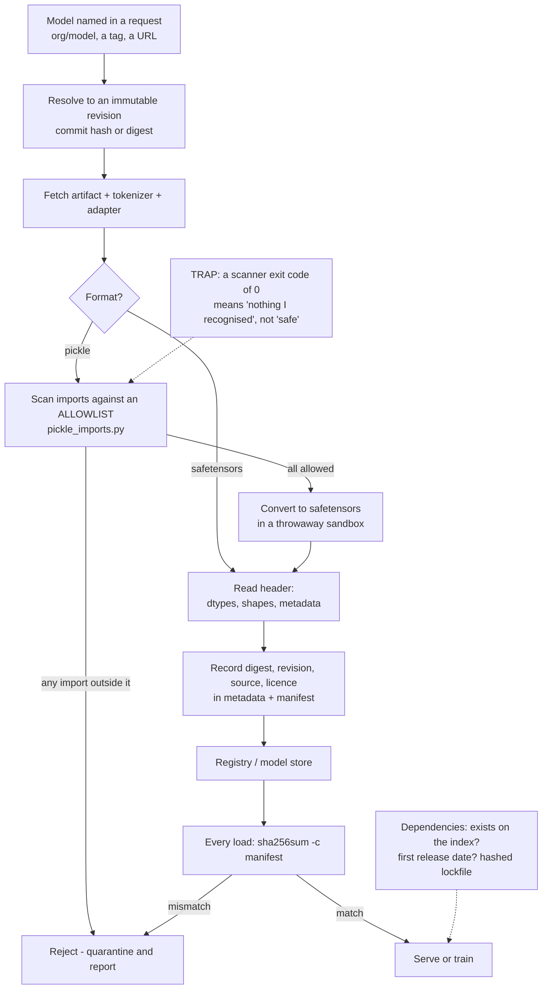

# Model Supply Chain Security: Pickle, Safetensors, Digests and Dependency Provenance

**Level:** Intermediate
**Tree:** [AI Platform Engineering](../README.md)
**Branch:** [Model and Feature Lifecycle](README.md)
**Forest:** [AI & Intelligent Systems](../../../README.md)
**Readiness:** [Validated](../../../READINESS.md#validated) - run live on 2026-09-30 ([evidence](https://github.com/mohamedmahersaid/Enterprise-AI-and-Intelligent-Systems/actions/runs/36703600504)).

## Explanation

### A model file is a program until proven otherwise

Most teams treat a downloaded model as data: weights, a tokenizer, a config. The most
common format for PyTorch and scikit-learn artifacts is not data, though. It is
**pickle**, and a pickle is a small program for a stack machine that rebuilds objects
by importing callables and calling them. The Python documentation says it directly:
the pickle module is not secure, and you should only unpickle data you trust. A
pickle can name any importable function - `builtins.exec`, `os.system`, or something
far less obvious - and the unpickler will call it with arguments the file supplies.
**Loading an untrusted pickle is running untrusted code**, with the permissions of
whatever process loaded it: the training job's cloud credentials, the inference
server's network access, the notebook's home directory.

The model supply chain is everything between "someone published this artifact" and
"our process loaded it": the model file, the adapter merged into it, the tokenizer
beside it, the Python packages that read them, and the name you typed to fetch each
one. This leaf covers the controls for each link, in the order an attacker would
exploit them.

### Scanners are filters, not verdicts

Pickle scanners read the opcode stream without executing it and report the imports
they find. That is genuinely useful, and it has a limit worth measuring rather than
assuming. The lab builds two inert malicious pickles. One calls `builtins.exec`,
which every scanner names; one calls `pathlib.Path.write_text`, which writes a file
just as effectively but appears on no list of dangerous functions. Checked with
picklescan 1.0.5 and fickling 0.1.12:

- **picklescan** flags the `exec` pickle as infected and exits 1, but reports the
  sneaky one as `Infected files: 0` with two "suspicious globals" - and **exits 0**.
  A CI gate that trusts the exit code lets it through.
- **fickling's** command-line check exits 1 for every file, including a clean pickle
  of numpy weights, and rates the sneaky file `LIKELY_UNSAFE` - the same verdict as
  the clean one. Only the `exec` file is `OVERTLY_MALICIOUS`.

Neither result is a bug. A **denylist** can only name what its authors anticipated,
and the space of Python callables that do something harmful is effectively
unbounded. What scales is the inverse: an **allowlist** of the handful of imports a
legitimate weights file needs, with everything else refused. The leaf's
`pickle_imports.py` does that at scan time using only the standard library's
`pickletools`, and fickling's documented runtime hook does it at load time, blocking
the import before the callable is ever reached.

### The better answer is a format that cannot execute

**safetensors** stores tensors as an 8-byte header length, a JSON header naming each
tensor's dtype, shape and byte offsets, and then raw bytes. There is no opcode
stream, no import, and nothing to call: loading one reads numbers. The header also
carries a free-form `__metadata__` string map, which is where provenance belongs -
the source repository, the exact revision and the licence - because metadata stored
inside the artifact cannot drift from the artifact the way a wiki page does. Convert
pickle checkpoints to safetensors at the point of intake, once, under controls, and
let every later consumer read the safe format. Where a framework still needs pickle,
PyTorch's `torch.load` accepts `weights_only=True`, which restricts unpickling to
tensors and primitive types; pass it explicitly rather than relying on whichever
default your pinned PyTorch version ships.

### Pin by content, not by name

A model name, a tag or a branch is a pointer the publisher can move. `main` on a model
hub, `latest` on a registry and an unpinned `from_pretrained("org/model")` all resolve
to whatever the pointer names today. Two controls close this:

- **Pin the revision** - a commit hash on a model hub, a digest on an OCI registry or
  Ollama - so the fetch is of one specific object.
- **Record and verify a content digest** of every artifact at approval, and check it
  at every load. `sha256sum -c` against a committed manifest turns "is this the file
  we reviewed?" into a yes or no answer. A digest mismatch is not a network glitch to
  retry through; it is the one signal that says the bytes changed.

Adapters and tokenizers are artifacts too. A LoRA adapter merged into a base model
changes its behaviour as surely as retraining would, and a tokenizer file decides what
text the model even sees; both are routinely fetched unpinned beside a carefully
pinned base model. OWASP's 2026 list files tampered models and adapters under
LLM04:2026 Supply Chain, and backdoored or poisoned weights under
LLM05:2026 Data and Model Poisoning - no scanner can see a poisoned weight, which is
why provenance and pinning carry the load.

### The package name you were given may not exist yet

Code assistants sometimes suggest a package that sounds right and has never been
published. Attackers watch for those names and register them - **slopsquatting** - so
the second developer to follow the suggestion installs malware. The defence is boring
and effective: before adding any dependency, confirm it exists, see when it was first
released and how many releases it has, and install only from a hashed lockfile. A
404 from the index means stop; a first release last week for a package that "every
tutorial uses" means stop and look.

### Licence is part of provenance

A model's licence decides whether you may use it commercially, fine-tune it, or
redistribute the result, and some licences add acceptable-use terms that travel with
derivatives. Record the licence identifier with the revision at intake, in the
artifact's metadata and your model inventory, and review it the same way a
dependency licence is reviewed. A model whose licence nobody recorded is a model
nobody can say you are allowed to ship.

## Architecture and flow



## Commands

### Command 1

Install the scanners and the safetensors reader into a throwaway environment, pinned to the versions this leaf was checked against. numpy 2.5 needs Python 3.12 or newer. The lab's fixtures (`make_models.py`, `allowlist.txt`) come from the leaf's fixtures directory; run `.venv/bin/python make_models.py` after this to write `models/` and `models.sha256`

```text
python3 -m venv .venv && .venv/bin/pip install picklescan==1.0.5 fickling==0.1.12 safetensors==0.8.0 numpy==2.5.3
```

### Command 2

Verify every approved artifact against the digests recorded when it was reviewed. Each line reads `OK` or `FAILED`, and any failure exits non-zero - the one signal that the bytes are not the ones someone approved

```text
sha256sum -c models.sha256
```

### Command 3

Scan the pickle that calls `builtins.exec`. picklescan reports `dangerous import 'builtins exec' FOUND`, counts one infected file and exits 1

```text
.venv/bin/picklescan -p models/exec.pkl
```

### Command 4

Scan the pickle that calls `pathlib.Path.write_text`, which writes a file just as surely but is on no denylist. picklescan counts two suspicious globals, reports `Infected files: 0` and exits 0 - which is why a gate must never read a denylist scanner's exit code as "safe"

```text
.venv/bin/picklescan -p models/sneaky.pkl
```

### Command 5

List every import each pickle would make, without unpickling any of them, and refuse anything outside the allowlist of three imports a numpy weights file needs. Both malicious files are caught, including the one Command 4 passed, and the command exits 1

```text
.venv/bin/python pickle_imports.py --allow allowlist.txt models/*.pkl
```

### Command 6

Enforce the same idea at load time with fickling's hook, which checks every import against its allowlist of ML-library imports before the unpickler reaches the callable. The clean file loads, both malicious files are blocked with `UnsafeFileError`, and no marker file exists afterwards - nothing ran

```text
.venv/bin/python - <<'EOF'
import fickling, pickle, pathlib
fickling.hook.activate_safe_ml_environment()
for name in ("clean", "exec", "sneaky"):
    try:
        pickle.load(open(f"models/{name}.pkl", "rb"))
        print(name, "loaded")
    except fickling.exception.UnsafeFileError as err:
        print(name, "BLOCKED:", str(err).split(";")[0])
print("marker files:", sorted(p.name for p in pathlib.Path(".").glob("PWNED-*")) or "none")
EOF
```

### Command 7

Read a safetensors file's header without loading a single tensor: an 8-byte little-endian length, then JSON naming each tensor's dtype, shape and byte offsets, plus the `__metadata__` map carrying the source, revision and licence recorded at intake

```text
.venv/bin/python -c "import json, struct; f = open('models/model.safetensors', 'rb'); n = struct.unpack('<Q', f.read(8))[0]; print(json.dumps(json.loads(f.read(n)), indent=1))"
```

### Command 8

Before adding a dependency, confirm it exists on PyPI and see how long it has: the name as the index spells it, the latest version, the first upload and the number of releases. A first release last week for a package every tutorial supposedly uses is a reason to stop

```text
curl -s https://pypi.org/pypi/safetensors/json | jq '{name: .info.name, latest: .info.version, first_release: ([.releases[][]?.upload_time] | min), releases: (.releases | length)}'
```

### Command 9

Check a name a code assistant suggested before anyone installs it. A 404 means the package does not exist - yet - and is exactly the name an attacker would register; replace it with the real package rather than creating a placeholder

```text
curl -s -o /dev/null -w '%{http_code}\n' https://pypi.org/pypi/safetensors-fast-loader-llm-suggested/json
```

## Automation scripts

### pickle_imports.py

Denylist scanners pass any callable their authors did not anticipate. This lists every
import a pickle file would perform - by walking its opcodes with the standard
library's `pickletools`, never unpickling it - and with `--allow` exits 1 when any
import is outside an allowlist. It has no third-party dependencies, so it can run in
the most locked-down intake step, before anything else touches the file.

```python
"""List every import a pickle file would perform, without unpickling it.

Unpickling runs code: each GLOBAL / STACK_GLOBAL opcode imports a callable
the stream can then call. This walks the opcodes with the standard
library's pickletools and prints each module.name the file would import.
With --allow, it exits 1 when any import is outside the allowlist - the
inverse of a scanner's denylist, which passes anything it has not heard of.

Usage:
    python pickle_imports.py FILE [FILE ...]
    python pickle_imports.py --allow allowlist.txt FILE [FILE ...]
"""
import argparse
import pickletools
import sys

STRING_OPS = {"SHORT_BINUNICODE", "BINUNICODE", "BINUNICODE8", "UNICODE",
              "SHORT_BINSTRING", "BINSTRING", "STRING"}
GET_OPS = {"GET", "BINGET", "LONG_BINGET"}
PUT_OPS = {"PUT", "BINPUT", "LONG_BINPUT"}


def imports_of(path):
    """Every "module.name" the pickle at path would import, in stream order."""
    found = []
    with open(path, "rb") as fh:
        data = fh.read()
    stack = []  # recent string values only; enough to resolve STACK_GLOBAL
    memo = {}
    for opcode, arg, _pos in pickletools.genops(data):
        name = opcode.name
        if name in STRING_OPS:
            stack.append(arg if isinstance(arg, str) else arg.decode("latin-1"))
        elif name == "MEMOIZE":
            memo[len(memo)] = stack[-1] if stack else None
        elif name in PUT_OPS:
            memo[arg] = stack[-1] if stack else None
        elif name in GET_OPS:
            stack.append(memo.get(arg))
        elif name in ("GLOBAL", "INST"):
            module, attr = arg.split(" ", 1)
            found.append(f"{module}.{attr}")
        elif name == "STACK_GLOBAL":
            attr, module = stack.pop(), stack.pop()
            found.append(f"{module}.{attr}")
    return found


def main(argv=None):
    parser = argparse.ArgumentParser(description=__doc__.splitlines()[0])
    parser.add_argument("files", nargs="+")
    parser.add_argument("--allow", help="file of allowed module.name imports, one per line")
    args = parser.parse_args(argv)

    allowed = None
    if args.allow:
        with open(args.allow) as fh:
            allowed = {line.strip() for line in fh if line.strip() and not line.startswith("#")}

    bad = 0
    for path in args.files:
        for imp in dict.fromkeys(imports_of(path)):
            verdict = ""
            if allowed is not None:
                verdict = "ok" if imp in allowed else "NOT ALLOWED"
                bad += verdict != "ok"
            print(f"{path}\t{imp}\t{verdict}".rstrip())
    if allowed is not None:
        print(f"{bad} import(s) outside the allowlist", file=sys.stderr)
    return 1 if bad else 0


if __name__ == "__main__":
    sys.exit(main())
```

## Lab

**Objective:** Measure what a denylist scanner misses, prove that an allowlist catches it at scan time and at load time, and build an intake step that records a digest, revision and licence for every artifact it admits.

### Steps

1. In an empty directory, copy `make_models.py` and `allowlist.txt` from the fixtures and `pickle_imports.py` from this leaf, then install the tools (Command 1) and run `.venv/bin/python make_models.py`.
2. Verify the approved artifacts against the manifest (Command 2), then append one byte to `models/clean.pkl` and run it again to see the failure it produces. Regenerate the fixtures afterwards.
3. Scan both malicious pickles with picklescan (Commands 3 and 4) and record each exit code.
4. In a throwaway directory, load `models/sneaky.pkl` with plain `pickle.load` and confirm that `PWNED-sneaky` now exists. Delete it. This is the one step that runs the payload, and the payload only writes that marker.
5. Run the allowlist check (Command 5) and confirm it rejects both malicious files and passes the clean one.
6. Run the load-time hook (Command 6) and confirm both malicious files are blocked and no marker file was written.
7. Read the safetensors header (Command 7) and confirm the revision and licence travel inside the artifact.
8. Pick one real model your team uses, find the exact revision it was fetched at, and record it with its digest and licence.
9. Check every package in one of your requirements files against the index (Command 8), and note any whose first release is recent.
10. Write the intake gate: allowlist scan, conversion to safetensors, digest into the manifest, metadata into the header - and make a failure at any step stop the pipeline.

### Validation

- The exit codes from step 3 are recorded, showing picklescan exits 0 on `sneaky.pkl`, and the gate design states why that exit code cannot be the pass condition.
- Step 4 produced the marker file, demonstrating that loading, not calling, the object ran the code.
- The allowlist check and the load-time hook each reject both malicious files and admit the clean one, with no marker file written in step 6.
- The tampered artifact in step 2 fails `sha256sum -c` by name, and the pipeline would stop on it rather than retry.
- The real model from step 8 is recorded by immutable revision and digest, not by name or tag, with its licence identifier.
- The intake gate fails closed: removing an allowed import from `allowlist.txt` makes the clean file fail too, proving the list is being enforced rather than ignored.

## Operational automation

### Making model intake a gate rather than a habit

- **One intake path, and nothing loads from anywhere else.** Artifacts enter through a
  single pipeline that scans, converts, digests and registers them; training and
  serving read only from the registry. A model loaded straight from a hub URL in a
  notebook has bypassed every control on this page.
- **Scan with an allowlist, and treat a denylist scanner as a second opinion.** Run
  `pickle_imports.py --allow` (or an equivalent allowlist mode) as the pass condition,
  and keep picklescan or fickling's report as evidence. The allowlist grows only by a
  reviewed change, because every entry is a callable an attacker may invoke.
- **Convert once, in a sandbox, and never ship pickle past intake.** The conversion
  step is the only place untrusted pickle is deserialised - with no credentials, no
  network and a disposable filesystem - and it writes safetensors for everything
  downstream.
- **Verify the digest at every load, not just at intake.** A manifest checked once
  proves the artifact was right on the day it arrived. Checking at load catches the
  replacement made later, in storage or in transit.
- **Pin revisions in code review.** Reject any change that fetches a model, adapter or
  tokenizer by name, tag or branch instead of an immutable revision, the same way an
  unpinned dependency is rejected.
- **Check new dependencies against the index in CI.** A job that looks up every newly
  added package - existence, first release, release count - and flags any first
  released recently turns slopsquatting from a judgement call into a review comment.
- **Keep the licence with the artifact.** The intake step writes the licence into the
  safetensors metadata and the inventory, and a missing licence fails intake.

## Troubleshooting

### Scenario 1: The scanner passes a model file that later turns out to run code on load.

**Likely cause:** The gate used a denylist scanner's exit code as the pass condition, and the payload called a function the denylist did not name - the pattern `sneaky.pkl` demonstrates.

**Resolution:** Make an allowlist the pass condition and keep the denylist scanner's report as supporting evidence. Confirm the gap closed by running `sneaky.pkl` through the new gate and seeing it rejected, then review which other artifacts passed under the old rule.

### Scenario 2: The allowlist rejects a legitimate checkpoint from a new framework version.

**Likely cause:** The framework changed how it pickles objects - a module was renamed or a new reconstructor is used - so a clean file now imports something the list has not seen.

**Resolution:** Read the rejected import names from `pickle_imports.py`, confirm each is a data reconstructor rather than a general-purpose callable, and add it through a reviewed change. Confirm the change is narrow by checking that the malicious fixtures are still rejected. Better still, convert the checkpoint to safetensors at intake so the list stops mattering downstream.

### Scenario 3: `sha256sum -c` fails for a model nobody changed.

**Likely cause:** Either the artifact was replaced - in storage, by a sync job, or by a re-download that resolved a moved tag - or the manifest was generated from a different file than the one deployed.

**Resolution:** Treat it as a security event first: do not load the file, and compare it with the copy in the registry. Confirm whether the fetch was pinned by revision; a fetch by name or tag that resolved to newer bytes explains the change and is the actual defect to fix.

### Scenario 4: A dependency suggested by a code assistant installs, but nobody on the team has heard of it.

**Likely cause:** A slopsquatted package: the name was once hallucinated, someone registered it, and it now installs whatever they uploaded.

**Resolution:** Check it against the index (Command 8): a first release that is recent, few releases and no linked source repository are the signs. Remove it, find the real package that does the job, and rotate any credentials present in the environment where it ran. Confirm by searching lockfiles across repositories for the same name.

### Scenario 5: The model behaves differently in production than in evaluation, with the same base model.

**Likely cause:** An adapter or tokenizer was fetched unpinned. The base model was pinned by revision but the LoRA adapter or tokenizer came from a branch that moved.

**Resolution:** Record the revision and digest of every artifact the model loads, not only the base weights. Confirm by comparing the adapter and tokenizer digests between the evaluation environment and production; a mismatch names the artifact that changed.

## Interview questions

### 1. Why is loading a pickle file dangerous, and why doesn't scanning it solve the problem?

A pickle is instructions for rebuilding objects, and the instructions can name any importable callable and call it with arguments the file supplies, so loading an untrusted pickle is running untrusted code with the loading process's permissions. Scanners help because they read the opcodes without executing them, but most work from a denylist of known-dangerous functions, and the set of Python callables that can do damage is effectively unbounded. I have seen a pickle that calls `pathlib.Path.write_text` pass picklescan with exit code 0 while still writing to disk on load. So I treat a denylist scanner as evidence, not a gate. The gate is an allowlist of the handful of imports a weights file legitimately needs, and the real fix is to stop shipping pickle past intake by converting to safetensors, which has no code path at all.

### 2. What does pinning a model by digest protect against that pinning by name does not?

A name, tag or branch is a pointer the publisher - or anyone who compromises the publisher - can move, so the same fetch can return different bytes next week. A commit hash or content digest names one specific object, so a replacement either fails to resolve or fails verification. The second half matters as much: record the digest at approval and check it at every load, because pinning the fetch does not stop a file being replaced later in storage. I apply this to every artifact a model loads - base weights, adapters and tokenizers - because an unpinned adapter changes behaviour as surely as swapping the base model.

### 3. How would you defend a team against slopsquatting?

Slopsquatting exploits package names that code assistants invent: attackers register the hallucinated name and wait. The defences are cheap. Before a dependency is added, confirm it exists on the index and look at its history - first release date, number of releases, a linked source repository. A 404 means the name is not real; a first release last week for something supposedly standard means stop. Then install only from a hashed lockfile, so a package cannot be swapped after review, and add a CI check that flags newly added dependencies with a short history so the question gets asked in review rather than after an incident.

### 4. Where does licence review fit into model security?

It is part of provenance. A model's licence decides whether you can use it commercially, fine-tune it, or redistribute derivatives, and some add acceptable-use terms that bind whatever you build on it. If nobody recorded the licence at intake, nobody can later say the organisation was allowed to ship the model. I record the licence identifier with the immutable revision and digest - in the artifact's metadata, where it cannot drift from the file, and in the model inventory - and I make a missing licence fail intake the same way a missing digest does.

## Certification alignment

- **Microsoft Certified: Machine Learning Operations Engineer Associate (AI-300)** - Implement machine learning model lifecycle and operations: verifying model artifacts by digest and recording source revision and licence before registering them, so the registry holds only artifacts with provenance.
- **Vendor-neutral** - OWASP GenAI LLM Top 10 2026: LLM04:2026 Supply Chain - pinning model, adapter and tokenizer revisions, allowlist scanning of pickle artifacts, and checking new dependencies against the index before install.
- **Vendor-neutral** - OWASP GenAI LLM Top 10 2026: LLM05:2026 Data and Model Poisoning - provenance and digest verification as the controls that remain when no scanner can see a poisoned weight.
- **CompTIA Security+** - supply-chain risk: verifying software provenance and integrity with hashes before deployment.

## References

- [Python Software Foundation: pickle - Python object serialization](https://docs.python.org/3/library/pickle.html) - The module's warning that it is not secure and that only trusted data should be unpickled, and how `__reduce__` makes unpickling call functions.
- [Python Software Foundation: pickletools - Tools for pickle developers](https://docs.python.org/3/library/pickletools.html) - `genops`, the opcode walker `pickle_imports.py` uses to list imports without unpickling.
- [PyPI: picklescan](https://pypi.org/project/picklescan/) - The denylist scanner used in Commands 3 and 4, version 1.0.5, and its infected and suspicious-global counts.
- [PyPI: fickling](https://pypi.org/project/fickling/) - Trail of Bits' pickle analyser: the `--check-safety` report and `fickling.hook.activate_safe_ml_environment()`, the load-time allowlist used in Command 6.
- [Hugging Face: Safetensors](https://huggingface.co/docs/safetensors/index) - The safetensors format: header layout, metadata and why loading cannot execute code.
- [PyTorch: torch.load](https://docs.pytorch.org/docs/stable/generated/torch.load.html) - The `weights_only` argument that restricts unpickling to tensors and primitive types.
- [PyPI: JSON API](https://docs.pypi.org/api/json/) - The project metadata endpoint Commands 8 and 9 query for existence, releases and upload times.
- [Python Packaging Authority (pip documentation): Secure installs](https://pip.pypa.io/en/stable/topics/secure-installs/) - Hash-checking installs, so a reviewed dependency cannot be swapped after review.
- [OWASP Gen AI Security Project: OWASP GenAI LLM Top 10 2026](https://genai.owasp.org/resource/owasp-genai-llm-top-10-2026/) - LLM04:2026 Supply Chain and LLM05:2026 Data and Model Poisoning.

## Suggested video search

machine learning model supply chain security pickle deserialization safetensors picklescan slopsquatting

---

> Validate commands, versions, permissions, licensing, and rollback procedures in an isolated lab before production use.
