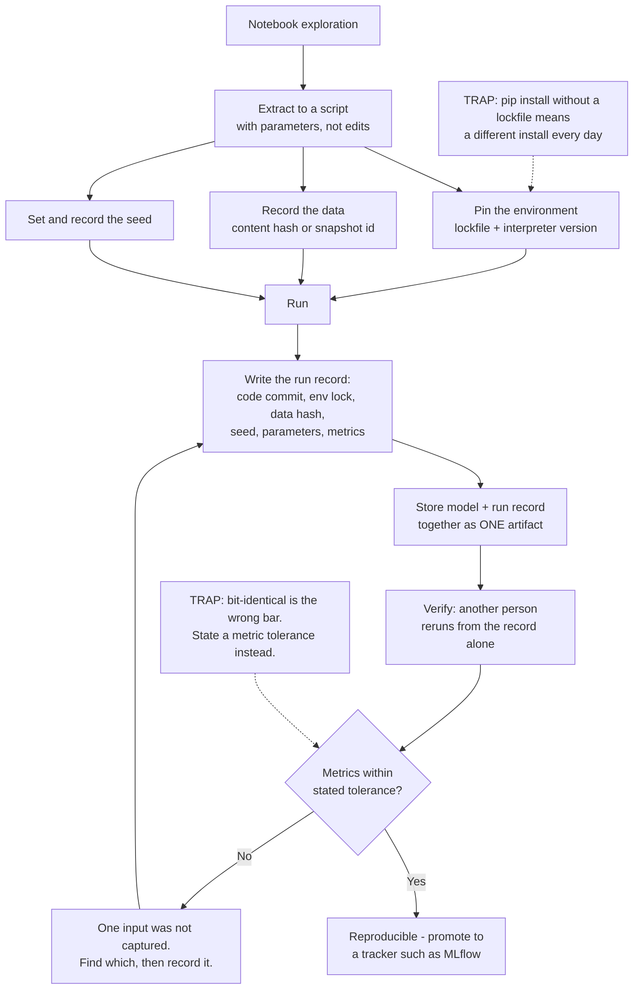

# From Notebook to a Reproducible Training Run: Environments, Seeds, Data Versions and Artifacts

**Level:** Beginner
**Tree:** [AI Platform Engineering](../README.md)
**Branch:** [Model and Feature Lifecycle](README.md)
**Forest:** [AI & Intelligent Systems](../../../README.md)

## Explanation

### The notebook is not the problem; the missing inputs are

Notebooks get blamed for irreproducibility, and that is the wrong diagnosis. A notebook
is a fine place to think. The failure is that a notebook records **one output of a
computation while quietly discarding the inputs that produced it** - which library
versions were installed, which rows of data were read, what the random seed was, and
which cells were run in what order. Rewriting the same code as a `.py` file changes
nothing if those four are still unrecorded. **A run is reproducible when someone else
can recreate its inputs**, not when it lives in a particular file format.

### "It works on my machine" is a version statement

The most common handoff failure is an environment difference nobody can see. A colleague
installs the same packages a month later, gets newer minor versions, and the model
trains to a different accuracy - or does not train at all. `pip install pandas` means
"whatever is newest today", so **two people running the same command on different days
install different software**. The fix is a lockfile that pins every package including
the ones you never named, and a recorded interpreter version to go with it.

### Randomness is not the enemy; unrecorded randomness is

Training is full of deliberate randomness: weight initialisation, data shuffling,
dropout, train/test splitting. That is fine and necessary. The problem is that the
specific random numbers used are usually thrown away, so **two runs of identical code
produce different models and you cannot tell whether a change helped**. Setting and
recording a seed makes a run repeatable. It does not make your result more true - a
result that only holds at one seed is a result about that seed - so the mature habit is
to pin the seed for reproducibility and then check across several before believing a
number.

### The data version is the input people forget

Code is in version control; data usually is not. A query against a live table returns
different rows tomorrow, so **"the same script" means something different** - which is
why a model that scored well last month cannot be recreated today. No heavyweight tool
is needed at the start: a content hash of the training file, or a snapshot identifier
and a timestamped query, is enough to tell whether two runs saw the same data. Without
it, every comparison between runs is uncontrolled.

### An artifact nobody can trace back is not a deliverable

A trained model file handed over on its own is unusable in any serious sense: nobody can
say what produced it, whether it can be rebuilt, or what to do when it misbehaves. The
minimum useful unit is **the model plus the record of what made it** - code commit,
environment lock, data hash, seed, parameters and resulting metrics, stored together.
This is the same reasoning behind an experiment tracker such as MLflow, and doing it by
hand first is worth the effort, because it shows you what the tool is actually solving.

### Reproducible does not mean bit-identical

Chasing byte-for-byte identical weights leads to frustration, because GPU
floating-point non-determinism legitimately varies between runs with identical inputs.
The practical standard is **the same conclusion, not the same bits** - metrics landing
within a tolerance you decided in advance and wrote down, since that tolerance is the
claim you are actually making when you say a run reproduced.

## Architecture and flow



## Commands

### Command 1

Record the exact interpreter and every installed package version, including the ones you never asked for

```text
python --version && pip freeze > requirements.lock.txt
```

### Command 2

Hash the training data so two runs can be compared on whether they saw the same rows

```text
sha256sum data/train.csv | tee data/train.csv.sha256
```

### Command 3

Capture the code version, and refuse to trust a run made from uncommitted edits

```text
git rev-parse HEAD && git status --porcelain
```

### Command 4

Make the seed an input to the run rather than a line buried in the script

```text
python train.py --seed 42 --data data/train.csv --out runs/
```

### Command 5

Check whether a rerun matched, by comparing the recorded inputs rather than the model file

```text
diff <(jq -S . runs/run-a/run.json) <(jq -S . runs/run-b/run.json)
```

### Command 6

Rebuild the environment exactly as it was, on the other person's machine

```text
python -m venv .venv && .venv/bin/pip install --require-hashes -r requirements.lock.txt
```

## Automation scripts

### run_record.py

Reproducibility fails because capturing the inputs is manual and therefore skipped under
deadline. This captures all of them in one call at the start of a run, refuses to
proceed from uncommitted code unless explicitly allowed, and writes a record another
person can rebuild from.

```python
#!/usr/bin/env python3
"""Capture everything needed to rerun a training run, before it starts.

Writes run.json next to the model artifact: interpreter, package lock,
code commit, data hash, seed and parameters. Call capture() at the top of
a training script and finish() at the end with the metrics.
"""
import hashlib
import json
import os
import platform
import random
import subprocess
import sys
from datetime import datetime, timezone
from pathlib import Path


def _git(*args):
    try:
        out = subprocess.run(
            ["git", *args], capture_output=True, text=True, check=True
        )
        return out.stdout.strip()
    except (subprocess.CalledProcessError, FileNotFoundError):
        return None


def file_digest(path):
    """Hash the data, not its filename - a renamed file is the same data."""
    digest = hashlib.sha256()
    with open(path, "rb") as handle:
        for block in iter(lambda: handle.read(1 << 20), b""):
            digest.update(block)
    return digest.hexdigest()


def capture(out_dir, data_path, seed, params, allow_dirty=False):
    out = Path(out_dir)
    out.mkdir(parents=True, exist_ok=True)

    dirty = _git("status", "--porcelain")
    if dirty and not allow_dirty:
        raise SystemExit(
            "refusing to run from uncommitted changes - the commit recorded below\n"
            "would not describe the code that actually ran. Commit, or pass\n"
            "allow_dirty=True and accept that this run is not reproducible.\n\n"
            + dirty
        )

    # Seed every source of randomness we know about, and say so in the record.
    random.seed(seed)
    seeded = ["random"]
    try:
        import numpy

        numpy.random.seed(seed)
        seeded.append("numpy")
    except ImportError:
        pass
    try:
        import torch

        torch.manual_seed(seed)
        seeded.append("torch")
    except ImportError:
        pass

    record = {
        "started_at": datetime.now(timezone.utc).isoformat(),
        "python": sys.version.split()[0],
        "platform": platform.platform(),
        "code_commit": _git("rev-parse", "HEAD"),
        "code_dirty": bool(dirty),
        "data_path": str(data_path),
        "data_sha256": file_digest(data_path),
        "seed": seed,
        "seeded_libraries": seeded,
        "params": params,
        "env_lock": subprocess.run(
            [sys.executable, "-m", "pip", "freeze"],
            capture_output=True, text=True,
        ).stdout.splitlines(),
    }
    (out / "run.json").write_text(json.dumps(record, indent=2, sort_keys=True))
    return record


def finish(out_dir, metrics):
    path = Path(out_dir) / "run.json"
    record = json.loads(path.read_text())
    record["finished_at"] = datetime.now(timezone.utc).isoformat()
    record["metrics"] = metrics
    path.write_text(json.dumps(record, indent=2, sort_keys=True))

    # The record is only useful if it travels with the model.
    model = Path(out_dir) / "model.pkl"
    if not model.exists():
        print(
            "WARNING: no model artifact in this directory. A run record stored "
            "apart from its model will be separated from it eventually.",
            file=sys.stderr,
        )
    return record


if __name__ == "__main__":
    if not os.environ.get("DATA_PATH"):
        sys.exit("set DATA_PATH to the training data file; its hash goes in the record")
    demo = capture(
        out_dir=os.environ.get("RUN_DIR", "runs/demo"),
        data_path=os.environ["DATA_PATH"],
        seed=int(os.environ.get("SEED", "42")),
        params={"note": "import this module instead of running it directly"},
    )
    print(json.dumps({k: demo[k] for k in ("code_commit", "data_sha256", "seed")}, indent=2))
```

## Lab

**Objective:** Take a notebook that trains a model, turn it into a run another person can reproduce from the record alone, and prove it by having the rerun land within a tolerance you stated in advance.

### Steps

1. Start from a working notebook that loads a dataset, trains a small model and prints an accuracy.
2. Run every cell top to bottom in a fresh kernel and note whether the printed figure changes from the value already in the notebook.
3. Extract the training code into `train.py`, taking the data path, seed and hyperparameters as arguments rather than edited lines.
4. Pin the environment with `pip freeze` into a lockfile and record the interpreter version alongside it.
5. Hash the training data and store the digest with the run rather than relying on the filename.
6. Call `run_record.py` at the start of the run and confirm it refuses to proceed while you have uncommitted changes.
7. State the tolerance you will accept before rerunning - for example, accuracy within 0.5 percentage points - and write it into the run record.
8. Have a second person, on a different machine, rebuild from the lockfile and rerun using only the run record.
9. Compare the two run records field by field, and compare the metrics against the stated tolerance.
10. Deliberately break one input - install an unpinned package version, or change one row of the data - and confirm which comparison catches it.

### Validation

- The fresh-kernel rerun in step 2 is recorded, showing whether the notebook's printed figure was reproducible before any changes were made.
- The run record contains the code commit, environment lock, data hash, seed and parameters, written before training began.
- The run refuses to start from uncommitted code, or records `code_dirty` as true, rather than silently attributing the run to the last commit.
- A second person reproduces the run on another machine from the run record alone, without asking the author a question.
- The metric comparison is judged against a tolerance written down before the rerun, not decided afterwards.
- The deliberately broken input is caught by a named field in the comparison, identifying which input changed rather than only that the result differed.

## Operational automation

### Making reproducibility the default rather than a discipline

- **Fail the run, not the review, on uncommitted code.** A run started from unsaved edits
  records a commit that does not describe what executed, which is worse than recording
  nothing because it looks trustworthy. Checking this at the start of the script costs
  one call and removes the most common false record.
- **Install from a lockfile with hashes in CI, never a bare requirements list.** An
  unpinned dependency means the build is a different build each day, and the resulting
  drift is discovered weeks later as an unexplained metric change. `--require-hashes`
  also makes a substituted package fail loudly instead of installing.
- **Record the data by content, not by path.** Filenames are reused, overwritten and
  renamed; a digest tells you whether two runs saw the same rows. For a live table,
  record a snapshot identifier and the query - "select from the table" describes no
  particular dataset.
- **Store the run record in the same directory as the model artifact.** Anything kept
  separately is eventually separated - a model in one bucket and its provenance in a
  wiki page becomes a model with no provenance within a quarter.
- **Run the seed sweep before believing a number.** Pin the seed so a run repeats, then
  check two or three others before reporting a result. A figure that holds at one seed
  and not the next is a fact about the seed - and pinning makes it look solid when it
  is not.
- **Graduate to a tracker once the fields are stable.** Doing this by hand first shows
  what MLflow actually solves. Move when you are comparing runs across people rather
  than across days - the fields you already capture map onto its parameters, metrics
  and tags.

## Troubleshooting

### Scenario 1: A colleague reruns the script and gets a noticeably different accuracy.

**Likely cause:** Either the environment differs, or the seed was never fixed. Both produce the same symptom, and guessing between them wastes the afternoon.

**Resolution:** Compare the two run records field by field before changing anything - the differing field names the cause directly. If package versions differ, rebuild from the lockfile; if the seed is absent from both records, the runs were never comparable and the figures should not be argued about. Confirm which by rerunning twice on one machine with the seed fixed: stable results put the cause in the environment rather than in randomness.

### Scenario 2: The notebook prints one accuracy, and running the same cells from the top prints another.

**Likely cause:** Hidden state. Cells were run out of order, so variables from earlier experiments were still in memory and the printed figure was produced by code that no longer exists in that order.

**Resolution:** Restart the kernel and run top to bottom as the only accepted result, and treat any figure that cannot survive this as not yet a result. Confirm it from the execution counts in the cell margins: numbering that is not ascending proves out-of-order execution. This is the failure that makes extraction to a script worthwhile.

### Scenario 3: The model file from three months ago cannot be rebuilt.

**Likely cause:** The data moved on. The script queried a live table, so the same code now reads different rows, and no snapshot or digest was recorded at the time.

**Resolution:** Record a data version from now on - a digest for files, a snapshot identifier and timestamped query for tables - and be honest that the old artifact is not reproducible rather than producing an approximation and calling it the original. Confirm the diagnosis by rerunning the old script against today's data: if the row count alone differs, the data is the variable and no amount of environment pinning will recover the old result.

### Scenario 4: Two runs have identical records but the model files differ byte for byte.

**Likely cause:** Nothing is wrong. GPU floating-point non-determinism, cuDNN algorithm selection and parallel reduction order legitimately vary between runs with identical inputs.

**Resolution:** Compare metrics against a stated tolerance instead of comparing files, and write the tolerance into the run record so the claim being made is explicit. Confirm equivalence by checking the recorded inputs match and the metrics land inside the tolerance. Bit-identical weights are achievable on CPU with deterministic flags, but that costs throughput and is rarely the question anyone needs answered.

### Scenario 5: The lockfile installs cleanly on one machine and fails on another.

**Likely cause:** The lockfile captured packages built for one platform - a different operating system, CPU architecture or CUDA version - and `pip freeze` records versions without recording what they were built against.

**Resolution:** Record the platform and interpreter version in the run record, as `run_record.py` does, so the mismatch is visible rather than mysterious. For teams crossing platforms, move to a container image built from the lockfile, which pins the system libraries the lockfile cannot describe. Confirm it by comparing the `platform` field between the two records before debugging any individual package.

## Interview questions

### 1. What makes a training run reproducible, and why is "use a script instead of a notebook" not the answer?

Reproducible means someone else can recreate the inputs and reach the same conclusion, so the question is which inputs were recorded. There are four that matter: the code version, the environment, the data, and the randomness. A notebook tends to lose all four - it records an output while discarding the ordering, the installed versions, the rows read and the seed - but rewriting it as a script fixes none of them by itself. A script with `pip install pandas` at the top and no seed is exactly as irreproducible; it just looks more professional. What actually fixes it is capturing a commit hash, a lockfile, a content digest of the data and a recorded seed, and storing them with the model. Extracting to a script is still worth doing, because a script cannot carry hidden state from out-of-order cells - but that specific failure is the reason, not the file extension. I would rather have a notebook with all four inputs recorded than a script with none.

### 2. Your colleague says their model gets 94 percent and yours gets 91 on the same code. How do you resolve it?

I would not start by arguing about the model, because the disagreement is almost certainly about inputs. I compare the run records field by field, and the field that differs names the cause. In practice it is usually one of three things: different package versions because neither environment was locked, different data because a live table moved between the two runs, or no seed at all, in which case the two numbers were never comparable and the gap may be ordinary variance. The quick test separating randomness from environment is to run twice on one machine with the seed fixed: stable results there put the difference in the environment or the data. If no run records exist, neither number can be defended, and the first task is to capture the inputs rather than relitigate the figures.

### 3. If you set a seed and the result is repeatable, is the result trustworthy?

No, and conflating the two is a common mistake. Seeding makes a run repeatable; it says nothing about whether the result generalises. A figure that holds at seed 42 and falls apart at seed 43 is a fact about seed 42 - the pinning has made a fragile result look solid, which is worse than not pinning at all. So I use the seed for reproducibility and then deliberately vary it: run three or five seeds, look at the spread, and report the range rather than the best number. If the spread is wide relative to the difference I am claiming, I do not have the result yet. Pinning explains where a number came from; it does not make the number right, and keeping those apart is what stops reproducibility tooling from laundering noise into confidence.

### 4. When would you move from doing this by hand to adopting an experiment tracker?

When comparison crosses people rather than days. By hand - a run record written next to the artifact - is genuinely sufficient while one person is comparing a handful of runs, and doing it manually first is valuable because it shows exactly which fields matter, so the tool arrives as a solution to a problem you have felt. The move is worth making when you are searching over many runs, when several people need to compare results without asking each other questions, or when a model needs a promotion path with a registry behind it. The transition is not disruptive if the manual fields were chosen well: commit, environment, data version, seed, parameters and metrics map directly onto what MLflow records. What I would avoid is adopting the tracker first and assuming it delivers reproducibility - it records what you pass it, so a team that never captured the data version gets a tidy interface onto runs that still cannot be rebuilt.

## Certification alignment

- **Microsoft Certified: Machine Learning Operations Engineer Associate (AI-300)** - Implement machine learning model lifecycle and operations: capturing the code commit, environment lock, data hash, seed and parameters as a run record stored with the model artifact, and graduating to a tracker such as MLflow.
- **AWS Certified Machine Learning Engineer - Associate** - experiment management, data versioning and training job configuration.
- **Google Cloud Professional Machine Learning Engineer** - ML workflow orchestration, experiment tracking and artifact management.
- **Vendor-neutral** - ACM Artifact Review and Badging: the repeatability, reproducibility and replicability distinctions used here.

## References

- MLflow documentation - tracking runs, parameters, metrics and artifacts, and the model registry
- Python packaging user guide - pinning dependencies, lockfiles and hash-checking installs
- PyTorch reproducibility notes - seeding, deterministic algorithms and the limits of both on GPU
- scikit-learn documentation - `random_state`, cross-validation and controlling randomness in estimators
- ACM Artifact Review and Badging policy - the vendor-neutral definitions of repeatable, reproducible and replicable

## Suggested video search

reproducible machine learning training runs seeds lockfile data versioning MLflow experiment tracking beginner

---

> Validate commands, versions, permissions, licensing, and rollback procedures in an isolated lab before production use.
