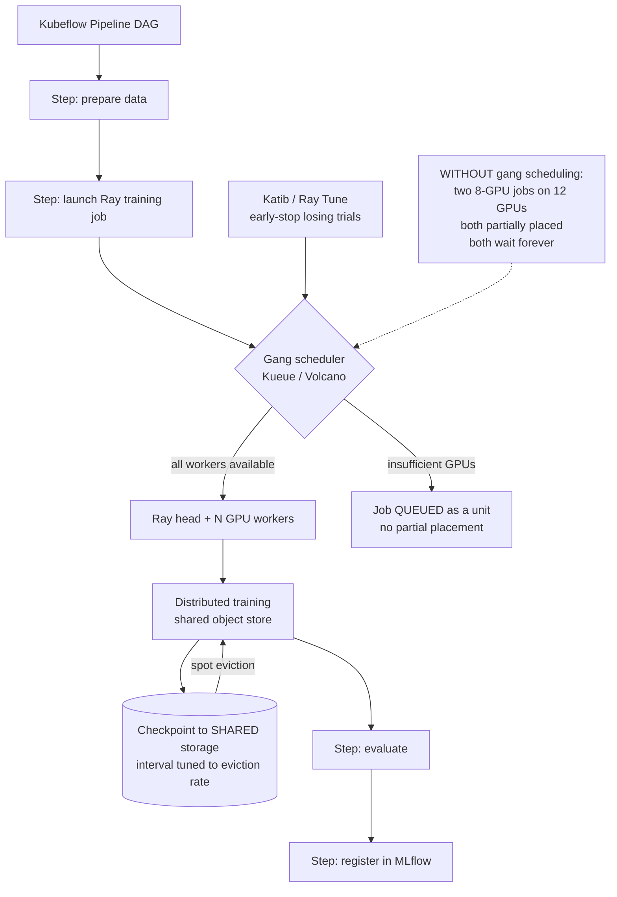

# Distributed Training on Kubernetes with Kubeflow Pipelines and Ray

**Level:** Advanced
**Tree:** [AI Platform Engineering](../README.md)
**Branch:** [AI Platform Engineering](README.md)
**Forest:** [AI & Intelligent Systems](../../../README.md)

## Explanation

### Why GPU clusters deadlock without gang scheduling

Distributed training needs **all** its workers running simultaneously. The default
Kubernetes scheduler places pods independently, so two eight-GPU jobs submitted to a
twelve-GPU cluster can each receive partial placement and wait forever for workers
that will never arrive. **The cluster reports 100 percent allocated at zero percent
utilisation.** Gang scheduling - Kueue, Volcano or the coscheduling plugin - places
all workers or none, which is what makes a shared GPU cluster usable at all.

### Kubeflow and Ray solve different problems

**Kubeflow Pipelines** orchestrates a DAG of containerised steps: prepare data, train,
evaluate, register. Each step is a pod, and the value is reproducible workflow
structure. **Ray** distributes computation *within* a step across workers with a
shared object store, which is what avoids serialising large tensors between tasks.
They compose: a pipeline step launches a Ray job.

### Checkpoint frequency is a cost decision

On spot or preemptible GPUs, an eviction at hour eleven of a twelve-hour run loses
everything unless checkpoints exist. Checkpoint too frequently and I/O dominates,
slowing training measurably. **Tune the interval against the measured eviction rate**,
not against a default, and always checkpoint to shared storage rather than to node
local disk - a checkpoint on an evicted node is not a checkpoint.

### Hyperparameter search needs early stopping

A grid search that runs every trial to completion wastes most of its GPU budget on
configurations that were clearly losing after ten percent of training. Katib and Ray
Tune both support early stopping, and enabling it typically reduces search cost by a
large multiple for the same result quality.

## Architecture and flow



## Commands

### Command 1

Training job custom resources across namespaces - the training-layer equivalent of listing deployments

```text
kubectl get pytorchjobs,rayjobs -A
```

### Command 2

Kueue workload queue state - shows jobs waiting as a unit rather than partially placed

```text
kubectl get workloads.kueue.x-k8s.io -A
```

### Command 3

GPU allocatable versus allocated on a node - the first check when jobs will not schedule

```text
kubectl describe node <gpu-node> | grep -A5 "nvidia.com/gpu"
```

### Command 4

Ray cluster resource view including GPU availability and pending tasks

```text
ray status --address <head>:6379
```

### Command 5

Worker logs across the Ray cluster - training failures usually surface here first

```text
kubectl logs -l ray.io/node-type=worker --tail=50 -n <ns>
```

### Command 6

Live GPU utilisation and memory during training - distinguishes a compute-bound job from a data-loading-bound one

```text
nvidia-smi --query-gpu=utilization.gpu,memory.used --format=csv -l 5
```

## Automation scripts

### gpu-cluster-scheduling-health.sh

```bash
#!/usr/bin/env bash
# Detects the GPU cluster deadlock: allocated but not utilised.
set -euo pipefail

RC=0
echo "GPU cluster scheduling health - $(date -u +%FT%TZ)"
echo

# Total GPU capacity vs requested.
TOTAL=$(kubectl get nodes -o jsonpath="{range .items[*]}{.status.allocatable.nvidia\.com/gpu}{\"\n\"}{end}" 2>/dev/null |
  grep -E "^[0-9]+$" | paste -sd+ | bc 2>/dev/null || echo 0)
echo "cluster GPUs allocatable: ${TOTAL}"

REQ=$(kubectl get pods -A -o jsonpath="{range .items[*]}{.spec.containers[*].resources.requests.nvidia\.com/gpu}{\"\n\"}{end}" 2>/dev/null |
  grep -E "^[0-9]+$" | paste -sd+ | bc 2>/dev/null || echo 0)
echo "GPUs requested by pods:  ${REQ}"
echo

# Pods pending on GPU - the deadlock signature.
echo "pods pending on GPU:"
PENDING=$(kubectl get pods -A --field-selector=status.phase=Pending -o json 2>/dev/null |
  jq -r ".items[] | select(.spec.containers[].resources.requests[\"nvidia.com/gpu\"]) | .metadata.namespace+\"/\"+.metadata.name" 2>/dev/null || echo "")
if [ -n "${PENDING}" ]; then
  echo "${PENDING}" | sed "s/^/  /"
  echo
  # If GPUs are allocated AND pods are pending, suspect partial placement.
  if [ "${REQ}" -ge "${TOTAL}" ] 2>/dev/null; then
    echo "  FINDING cluster fully requested WITH pods still pending."
    echo "          Suspect partial placement of distributed jobs."
    echo "          Check for a gang scheduler - without one, two jobs can each"
    echo "          hold some workers and wait forever for the rest."
    RC=1
  fi
else
  echo "  none"
fi
echo

# Is a gang scheduler present at all?
echo "gang scheduling:"
if kubectl get crd 2>/dev/null | grep -qE "workloads.kueue|podgroups.scheduling.volcano"; then
  echo "  present"
else
  echo "  FINDING no gang scheduler CRD found (Kueue or Volcano)."
  echo "          Distributed training on a shared cluster will deadlock."
  RC=1
fi
echo

# Allocated but idle - the expensive silent failure.
echo "GPU utilisation on allocated nodes:"
for node in $(kubectl get nodes -l nvidia.com/gpu.present=true -o name 2>/dev/null | cut -d/ -f2); do
  UTIL=$(kubectl debug node/"${node}" -it --image=nvidia/cuda:12.2.0-base-ubuntu22.04 -- \
    nvidia-smi --query-gpu=utilization.gpu --format=csv,noheader 2>/dev/null | head -1 || echo "n/a")
  printf "  %-30s %s\n" "${node}" "${UTIL}"
done

echo
echo "Allocated-but-idle GPUs are the most expensive failure in the cluster."
exit "${RC}"
```

## Lab

**Objective:** Reproduce the GPU deadlock on a shared cluster, fix it with gang scheduling, then demonstrate checkpoint-driven recovery from a simulated spot eviction.

### Steps

1. Build a Kubernetes cluster with 4 GPUs and no gang scheduler.
2. Submit two distributed training jobs each requesting 3 GPUs.
3. Observe both receive partial placement and neither progresses - the cluster is fully allocated at near-zero utilisation.
4. Confirm the signature with the health script: GPUs fully requested while pods remain pending.
5. Install Kueue or Volcano and configure a queue with the GPU quota.
6. Resubmit both jobs and confirm one runs to completion while the other queues as a unit, then runs.
7. Configure a Ray training job checkpointing to shared storage every N steps.
8. Kill a worker pod mid-training to simulate a spot eviction.
9. Confirm training resumes from the last checkpoint rather than restarting.
10. Reduce checkpoint frequency drastically, repeat the eviction, and measure the lost work to quantify the trade-off.

### Validation

Deadlock is reproduced and then eliminated by gang scheduling,Jobs queue as units rather than partially placing,Training resumes from checkpoint after worker loss,The cost of checkpoint interval is measured rather than assumed

## Operational automation

### Automating distributed training

- **Kueue or Volcano is not optional** on a shared GPU cluster. Configure quotas per
  team so GPU allocation is governed rather than first-come.
- **Kubeflow Pipelines as code**, compiled and version-controlled, so the training
  workflow is reviewable and reproducible rather than assembled in a UI.
- **Checkpoint to shared storage always**, with the interval derived from measured spot
  eviction rates. A checkpoint written to node-local disk on an evicted node is lost.
- **Enable early stopping in Katib or Ray Tune.** Running every hyperparameter trial to
  completion wastes most of the search budget on configurations that were losing early.
- **Alert on allocated-but-idle GPUs.** It is the most expensive silent failure in the
  cluster and appears healthy on every standard Kubernetes dashboard.

## Troubleshooting

### Scenario 1: Cluster shows all GPUs allocated but nvidia-smi reports near-zero utilisation and no job is progressing

**Likely cause:** Partial placement of distributed jobs without gang scheduling - each job holds some workers and waits for the rest

**Resolution:** Install Kueue or Volcano and resubmit. Gang scheduling places all workers or none, so jobs queue as units instead of deadlocking. Delete the stuck jobs first; they will not recover on their own.

### Scenario 2: Training restarts from zero after a spot instance eviction

**Likely cause:** Checkpoints were written to node-local storage, or not written at all

**Resolution:** Checkpoint to shared storage (object store or a shared volume) and verify resume actually works by killing a worker deliberately. A checkpoint that has never been restored from is an untested backup.

### Scenario 3: GPU utilisation stays low during training while data loading pegs the CPU

**Likely cause:** Input pipeline is the bottleneck - the GPU is waiting for batches

**Resolution:** Increase data loader workers, enable prefetch, and move preprocessing off the critical path. Buying more GPUs will not help a job that is data-loading bound, and the utilisation graph is what distinguishes the two cases.

## Interview questions

### 1. Why does a shared GPU cluster need gang scheduling?

Because distributed training needs all its workers at once. The default scheduler places pods independently, so two jobs can each get partial placement and wait indefinitely for workers that will never arrive. The cluster then reports fully allocated with almost no utilisation. Gang scheduling places all workers or none, which turns the failure into a queue rather than a deadlock.

### 2. How do Kubeflow Pipelines and Ray relate?

They operate at different levels and compose. Kubeflow Pipelines orchestrates a DAG of containerised steps - data preparation, training, evaluation, registration - where each step is a pod. Ray distributes computation within a step across workers sharing an object store. A pipeline step typically launches a Ray job.

### 3. How do you choose a checkpoint interval?

From the measured eviction rate, not a default. On spot capacity, the expected work lost per eviction is roughly half the checkpoint interval, so frequent checkpoints reduce lost work but add I/O that slows training. Measure both and pick the interval that minimises total expected time. And always write to shared storage - a checkpoint on an evicted node is not a checkpoint.

### 4. GPU utilisation is 20 percent during training. What do you check?

Whether the job is data-loading bound rather than compute bound. If CPU is saturated while GPU idles, the input pipeline is the constraint - increase loader workers, enable prefetching, move preprocessing off the critical path. Adding GPUs to a data-bound job increases cost without improving throughput.

## Certification alignment

- CKA / CKAD - the underlying Kubernetes scheduling and workload model
- NVIDIA Certified Associate: AI Infrastructure and Operations
- AWS Certified Machine Learning - Specialty: distributed training and spot strategy

## References

- Kubeflow documentation: Pipelines and training operators
- Ray documentation: Ray Train, Ray Tune and cluster architecture
- Kueue and Volcano documentation: gang scheduling and quota management

## Suggested video search

Kubeflow Pipelines Ray distributed training Kubernetes gang scheduling Volcano Kueue

---

> Validate commands, versions, permissions, licensing, and rollback procedures in an isolated lab before production use.
