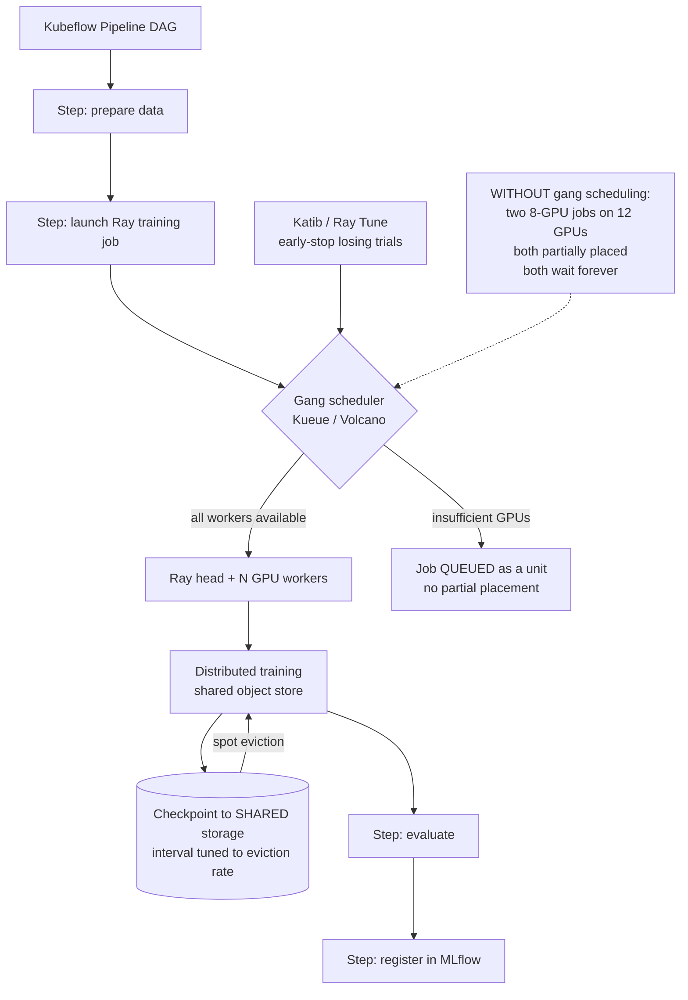

# Distributed Training on Kubernetes with Kubeflow Pipelines and Ray

**Level:** Advanced
**Tree:** [AI Platform Engineering](../README.md)
**Branch:** [AI Platform Engineering](README.md)
**Forest:** [AI & Intelligent Systems](../../../README.md)

## Explanation

### Why GPU clusters deadlock without gang scheduling

Distributed training needs **all** its workers running simultaneously. The default
Kubernetes scheduler places pods independently, so two eight-GPU jobs submitted to a
twelve-GPU cluster can each receive partial placement and wait forever for workers
that will never arrive. **The cluster reports 100 percent allocated at zero percent
utilisation.** Gang scheduling - Kueue, Volcano or the coscheduling plugin - places
all workers or none, which is what makes a shared GPU cluster usable at all.

### Kubeflow and Ray solve different problems

**Kubeflow Pipelines** orchestrates a DAG of containerised steps: prepare data, train,
evaluate, register. Each step is a pod, and the value is reproducible workflow
structure. **Ray** distributes computation *within* a step across workers with a
shared object store, which is what avoids serialising large tensors between tasks.
They compose: a pipeline step launches a Ray job.

### Checkpoint frequency is a cost decision

On spot or preemptible GPUs, an eviction at hour eleven of a twelve-hour run loses
everything unless checkpoints exist. Checkpoint too frequently and I/O dominates,
slowing training measurably. **Tune the interval against the measured eviction rate**,
not against a default, and always checkpoint to shared storage rather than to node
local disk - a checkpoint on an evicted node is not a checkpoint.

### Hyperparameter search needs early stopping

A grid search that runs every trial to completion wastes most of its GPU budget on
configurations that were clearly losing after ten percent of training. Katib and Ray
Tune both support early stopping, and enabling it typically reduces search cost by a
large multiple for the same result quality.

## Architecture and flow



## Commands

### Command 1

Training job custom resources across namespaces - the training-layer equivalent of listing deployments

```text
kubectl get pytorchjobs,rayjobs -A
```

### Command 2

Kueue workload queue state - shows jobs waiting as a unit rather than partially placed

```text
kubectl get workloads.kueue.x-k8s.io -A
```

### Command 3

GPU allocatable versus allocated on a node - the first check when jobs will not schedule

```text
kubectl describe node <gpu-node> | grep -A5 "nvidia.com/gpu"
```

### Command 4

Ray cluster resource view including GPU availability and pending tasks

```text
ray status --address <head>:6379
```

### Command 5

Worker logs across the Ray cluster - training failures usually surface here first

```text
kubectl logs -l ray.io/node-type=worker --tail=50 -n <ns>
```

### Command 6

Live GPU utilisation and memory during training - distinguishes a compute-bound job from a data-loading-bound one

```text
nvidia-smi --query-gpu=utilization.gpu,memory.used --format=csv -l 5
```

## Automation scripts

### gpu-cluster-scheduling-health.sh

```bash
#!/usr/bin/env bash
# Detects the GPU cluster deadlock: allocated but not utilised.
set -euo pipefail

RC=0
echo "GPU cluster scheduling health - $(date -u +%FT%TZ)"
echo

# Total GPU capacity vs requested.
TOTAL=$(kubectl get nodes -o jsonpath="{range .items[*]}{.status.allocatable.nvidia\.com/gpu}{\"\n\"}{end}" 2>/dev/null |
  grep -E "^[0-9]+$" | paste -sd+ | bc 2>/dev/null || echo 0)
echo "cluster GPUs allocatable: ${TOTAL}"

REQ=$(kubectl get pods -A -o jsonpath="{range .items[*]}{.spec.containers[*].resources.requests.nvidia\.com/gpu}{\"\n\"}{end}" 2>/dev/null |
  grep -E "^[0-9]+$" | paste -sd+ | bc 2>/dev/null || echo 0)
echo "GPUs requested by pods:  ${REQ}"
echo

# Pods pending on GPU - the deadlock signature.
echo "pods pending on GPU:"
PENDING=$(kubectl get pods -A --field-selector=status.phase=Pending -o json 2>/dev/null |
  jq -r ".items[] | select(.spec.containers[].resources.requests[\"nvidia.com/gpu\"]) | .metadata.namespace+\"/\"+.metadata.name" 2>/dev/null || echo "")
if [ -n "${PENDING}" ]; then
  echo "${PENDING}" | sed "s/^/  /"
  echo
  # If GPUs are allocated AND pods are pending, suspect partial placement.
  if [ "${REQ}" -ge "${TOTAL}" ] 2>/dev/null; then
    echo "  FINDING cluster fully requested WITH pods still pending."
    echo "          Suspect partial placement of distributed jobs."
    echo "          Check for a gang scheduler - without one, two jobs can each"
    echo "          hold some workers and wait forever for the rest."
    RC=1
  fi
else
  echo "  none"
fi
echo

# Is a gang scheduler present at all?
echo "gang scheduling:"
if kubectl get crd 2>/dev/null | grep -qE "workloads.kueue|podgroups.scheduling.volcano"; then
  echo "  present"
else
  echo "  FINDING no gang scheduler CRD found (Kueue or Volcano)."
  echo "          Distributed training on a shared cluster will deadlock."
  RC=1
fi
echo

# Allocated but idle - the expensive silent failure.
echo "GPU utilisation on allocated nodes:"
for node in $(kubectl get nodes -l nvidia.com/gpu.present=true -o name 2>/dev/null | cut -d/ -f2); do
  UTIL=$(kubectl debug node/"${node}" -it --image=nvidia/cuda:12.2.0-base-ubuntu22.04 -- \
    nvidia-smi --query-gpu=utilization.gpu --format=csv,noheader 2>/dev/null | head -1 || echo "n/a")
  printf "  %-30s %s\n" "${node}" "${UTIL}"
done

echo
echo "Allocated-but-idle GPUs are the most expensive failure in the cluster."
exit "${RC}"
```

## Lab

**Objective:** Reproduce the GPU deadlock on a shared cluster, fix it with gang scheduling, then demonstrate checkpoint-driven recovery from a simulated spot eviction.

### Steps

1. Build a Kubernetes cluster with 4 GPUs and no gang scheduler.
2. Submit two distributed training jobs each requesting 3 GPUs.
3. Observe both receive partial placement and neither progresses - the cluster is fully allocated at near-zero utilisation.
4. Confirm the signature with the health script: GPUs fully requested while pods remain pending.
5. Install Kueue or Volcano and configure a queue with the GPU quota.
6. Resubmit both jobs and confirm one runs to completion while the other queues as a unit, then runs.
7. Configure a Ray training job checkpointing to shared storage every N steps.
8. Kill a worker pod mid-training to simulate a spot eviction.
9. Confirm training resumes from the last checkpoint rather than restarting.
10. Reduce checkpoint frequency drastically, repeat the eviction, and measure the lost work to quantify the trade-off.

### Validation

- Deadlock is reproduced and then eliminated by gang scheduling.
- Jobs queue as units rather than partially placing.
- Training resumes from checkpoint after worker loss.
- The cost of checkpoint interval is measured rather than assumed.
- Resume from checkpoint is proven by deliberately killing a worker, not assumed from the checkpoint files existing.

## Operational automation

### Automating distributed training

- **Kueue or Volcano is not optional** on a shared GPU cluster. Configure per-team quotas
  so allocation is governed rather than first-come, and so a single large job cannot
  starve every other team by arriving first.
- **Kubeflow Pipelines as code**, compiled and version-controlled, so the training
  workflow is reviewable and reproducible rather than assembled by hand in a UI where
  the current state is the only record of what it does.
- **Checkpoint to shared storage always**, with the interval derived from the measured
  spot eviction rate for the instance type and region rather than a default. A checkpoint
  written to node-local disk on the node that gets evicted is not a checkpoint.
- **Exercise the resume path deliberately** by killing a worker on a schedule, in the way
  a database restore is tested. A checkpoint that has never been restored from is an
  untested backup, and eviction is the wrong time to discover that.
- **Enable early stopping in Katib or Ray Tune** and cap total trial budget. Running
  every hyperparameter trial to completion spends most of the search budget on
  configurations that were clearly losing after a tenth of training.
- **Alert on allocated-but-idle GPUs.** It is the most expensive silent failure in the
  cluster: it appears healthy on every standard Kubernetes dashboard, and it reads as a
  full cluster to capacity planning, which turns a deadlock into a hardware purchase.

## Troubleshooting

### Scenario 1: Cluster shows all GPUs allocated but nvidia-smi reports near-zero utilisation and no job is progressing.

**Likely cause:** Partial placement of distributed jobs without gang scheduling - each job holds some workers and waits indefinitely for the rest.

**Resolution:** Install Kueue or Volcano and resubmit so jobs are admitted as units. Delete the stuck jobs first, because they will not recover on their own and they are holding the GPUs the queue needs. Treat the allocated-but-idle signature as diagnostic: it looks like a full cluster to capacity planning, so the reflex is to buy hardware, which does not resolve a deadlock.

### Scenario 2: Training restarts from zero after a spot instance eviction.

**Likely cause:** Checkpoints were written to node-local storage, or were never written at all.

**Resolution:** Checkpoint to shared storage - an object store or shared volume - and verify resume works by deliberately killing a worker mid-run. A checkpoint that has never been restored from is an untested backup. Set the interval from the measured eviction rate for the instance type and region rather than a default, since expected lost work is roughly half the interval.

### Scenario 3: GPU utilisation stays low during training while data loading pegs the CPU.

**Likely cause:** The input pipeline is the bottleneck and the GPU is waiting for batches.

**Resolution:** Increase data loader workers, enable prefetch so the next batch is prepared during the current step, and move heavy preprocessing off the critical path into a precomputed dataset. Read CPU and GPU utilisation together to confirm before acting - adding GPUs to a data-bound job raises cost without raising throughput, and the two situations are indistinguishable from a cost dashboard alone.

### Scenario 4: A multi-node job runs far slower than the equivalent single-node job per GPU.

**Likely cause:** Gradient synchronisation is dominating - the interconnect cannot sustain all-reduce traffic at the model's gradient size each step.

**Resolution:** Check the network fabric actually in use and whether RDMA or GPUDirect is available and enabled, since scheduling can silently place workers across a slower path. Increase per-worker batch size to raise the compute-to-communication ratio, and consider gradient accumulation so synchronisation happens less often. Measure scaling efficiency explicitly against the single-node baseline rather than assuming more workers means faster.

### Scenario 5: Hyperparameter search consumes the whole GPU budget and returns little.

**Likely cause:** Every trial runs to completion, so most of the budget is spent on configurations that were clearly losing early.

**Resolution:** Enable early stopping in Katib or Ray Tune so unpromising trials are terminated on their intermediate metric, which typically reduces search cost by a large multiple for equivalent result quality. Set the search space from prior runs rather than a wide uniform grid, and cap total trial budget explicitly so an exploratory search cannot consume capacity that production retraining needs.

## Interview questions

### 1. Why does a shared GPU cluster need gang scheduling?

Because a distributed training job is an all-or-nothing unit and the default Kubernetes scheduler does not know that. It places pods independently, one at a time, as resources free up. So two eight-GPU jobs submitted to a twelve-GPU cluster can each be granted partial placement - one gets five workers, the other gets seven - and both then wait forever for workers that can never be scheduled, because the GPUs they need are held by the other job. Neither job makes progress and neither releases what it holds. The cluster reports one hundred percent allocated at close to zero percent utilisation, which is the worst possible state: it looks full to capacity planning and to every standard dashboard, so the instinctive response is to buy more GPUs, which does not fix a deadlock. Gang scheduling through Kueue, Volcano or the coscheduling plugin admits all workers of a job or none of them, so contention becomes a queue instead of a deadlock. On any cluster shared by more than one team I treat it as mandatory infrastructure rather than an optimisation, and I pair it with per-team quotas so GPU allocation is governed rather than first-come.

### 2. How do Kubeflow Pipelines and Ray relate?

They operate at different levels and compose rather than compete, which is worth being explicit about because teams often evaluate them as alternatives. Kubeflow Pipelines orchestrates a DAG of containerised steps - prepare data, train, evaluate, register - where each step is a pod with declared inputs and outputs. Its value is workflow structure: the pipeline is compiled from code, version-controlled, reviewable, and reproducible, and the lineage between steps is recorded. Ray works inside a single step, distributing computation across workers that share an object store, which is what avoids serialising large tensors through an external medium every time work moves between tasks. The natural composition is a pipeline step that launches a Ray job: Kubeflow owns the reproducible outer workflow and the handoffs between stages, Ray owns parallelism within the stage that needs it. Choosing only one usually means either hand-rolling orchestration around Ray or forcing intra-step parallelism into an awkward fan-out of pods that then have to exchange tensors through storage.

### 3. How do you choose a checkpoint interval?

From the measured eviction rate on the capacity you are actually using, not from a default. The trade-off is explicit and quantifiable. On spot or preemptible GPUs the expected work lost to an eviction is roughly half the checkpoint interval, so lengthening it increases expected lost work linearly. Shortening it adds I/O that competes with training and slows every run whether or not an eviction ever occurs, and for large models writing optimiser state as well as weights that cost is not marginal. The right interval minimises total expected time - lost work plus checkpoint overhead - which requires knowing how often eviction actually happens in your region and instance type, a number most teams have never measured despite it being available from the cloud provider's history. Two rules hold regardless of the arithmetic: always write to shared storage, because a checkpoint on the node that just got evicted is not a checkpoint, and verify resume by deliberately killing a worker, because a checkpoint that has never been restored from is an untested backup rather than a recovery capability.

### 4. GPU utilisation is 20 percent during training. What do you check?

First whether the job is data-loading bound rather than compute bound, because that is the common cause and it looks identical to "we need more GPUs" from a cost dashboard. The diagnostic is to read CPU and GPU together: if CPU is saturated while the GPU idles in a sawtooth pattern, the input pipeline is the constraint and the GPU is waiting for batches. The fixes are ordinary pipeline engineering - increase data loader worker count, enable prefetching so the next batch is prepared during the current step, and move heavy preprocessing off the critical path into a precomputed dataset. Adding GPUs to a data-bound job increases cost without improving throughput at all, and can make things worse by adding contention for the same storage. If the input pipeline is clearly not the bottleneck I would look next at small batch size leaving the device underfilled, at synchronisation overhead from gradient all-reduce on a slow interconnect, and at whether the job is actually running rather than partially placed and waiting, which presents as low utilisation on allocated hardware.

## Certification alignment

- CKA Certified Kubernetes Administrator - scheduling, resource management and cluster operations
- CKAD Certified Kubernetes Application Developer - workload definition, jobs and resource requests
- NVIDIA Certified Associate: AI Infrastructure and Operations - GPU cluster operations and monitoring
- AWS Certified Machine Learning - Specialty - distributed training strategy and spot capacity management
- Vendor-neutral - distributed systems fundamentals: gang scheduling, checkpoint-restart and collective communication

## References

- Kubeflow documentation - Pipelines, training operators and Katib hyperparameter tuning
- Ray documentation - Ray Train, Ray Tune, and cluster and object store architecture
- Kueue documentation - job queueing, quotas and gang admission on Kubernetes
- Volcano documentation - batch scheduling and gang scheduling for AI workloads
- NVIDIA documentation - NCCL collective communication, GPUDirect RDMA and multi-node topology

## Suggested video search

Kubeflow Pipelines Ray distributed training Kubernetes gang scheduling Volcano Kueue

---

> Validate commands, versions, permissions, licensing, and rollback procedures in an isolated lab before production use.
