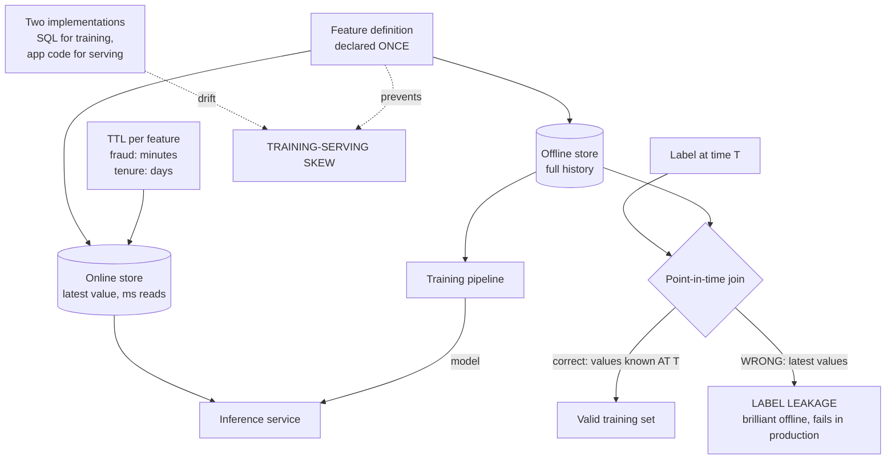

# Feature Stores and Training-Serving Skew: Point-in-Time Correctness with Feast

**Level:** Advanced
**Tree:** [AI Platform Engineering](../README.md)
**Branch:** [AI Platform Engineering](README.md)
**Forest:** [AI & Intelligent Systems](../../../README.md)

## Explanation

### The bug that makes a model look brilliant and perform badly

Two failures cause most of the gap between offline evaluation and production
behaviour, and a feature store exists to prevent both.

### Training-serving skew

A feature is computed one way for training - typically a SQL query over a warehouse -
and a different way at inference, in application code. The two implementations start
identical and drift. The model then receives inputs at serving time that differ subtly
from what it learned on, and performance degrades for reasons no metric explains.
**Declaring the transformation once and materialising it to both the offline and
online stores is the only structural fix**; code review is not sufficient because the
drift is usually a change on one side that nobody thought would matter.

### Point-in-time correctness and label leakage

A training row labelled at time T must use only feature values that were known at T.
Naively joining the latest feature value to a historical label leaks future
information into training. The model scores extraordinarily well offline, because it
is effectively being told the answer, and then fails in production where the future is
not available. **This is the most expensive bug in applied machine learning**, and it
is easy to introduce with an ordinary SQL join.

### Freshness is a per-feature decision

A fraud signal stale by an hour is useless. A customer-tenure feature stale by a day
is fine. Setting one TTL for the whole store either wastes compute refreshing stable
features or serves dangerously stale values for volatile ones. Set freshness per
feature against its business meaning.

## Architecture and flow



## Commands

### Command 1

Register feature definitions from the repository - this single declaration is what keeps both stores consistent

```text
feast apply
```

### Command 2

Push latest offline values into the online store; the incremental form is what runs on a schedule

```text
feast materialize-incremental $(date -u +%FT%T)
```

### Command 3

Point-in-time correct join for training - this is the command that prevents label leakage

```text
feast get-historical-features --entity-df entities.parquet
```

### Command 4

Fetch serving-time features by the same definitions used in training

```text
feast get-online-features --features "user:tenure_days,txn:count_1h"
```

### Command 5

Registered feature views with their sources and TTLs - the freshness contract per feature

```text
feast feature-views list
```

## Automation scripts

### detect_training_serving_skew.py

```python
#!/usr/bin/env python3
"""Compares feature values from the offline and online stores for the same
entities. Any material difference is training-serving skew.
Run on a schedule - skew appears gradually after a one-sided change.
"""
import sys
from datetime import datetime, timezone

import pandas as pd
from feast import FeatureStore

FEATURES = [
    "user_stats:tenure_days",
    "user_stats:txn_count_7d",
    "user_stats:avg_basket_value",
]
TOLERANCE = 0.01          # 1 percent relative difference
SAMPLE_SIZE = 500

store = FeatureStore(repo_path=".")

# Sample entities to compare.
entities = pd.read_parquet("sample_entities.parquet").head(SAMPLE_SIZE)
entities["event_timestamp"] = datetime.now(timezone.utc)

# Offline path - what training would see.
offline = store.get_historical_features(
    entity_df=entities,
    features=FEATURES,
).to_df()

# Online path - what inference actually sees.
rows = entities[["user_id"]].to_dict("records")
online = store.get_online_features(
    features=FEATURES,
    entity_rows=rows,
).to_df()

failures = []

for feature in FEATURES:
    col = feature.split(":")[1]
    if col not in offline or col not in online:
        failures.append("%s missing from one store" % feature)
        continue

    off = offline[col].astype(float).fillna(0)
    onl = online[col].astype(float).fillna(0)

    denom = off.abs().clip(lower=1e-9)
    rel_diff = ((off - onl).abs() / denom)
    skewed = (rel_diff > TOLERANCE).sum()
    pct = 100.0 * skewed / len(off)

    print("%-40s skewed rows: %4d / %4d (%.1f%%)" % (feature, skewed, len(off), pct))

    # Any sustained skew is a defect - the two stores derive from one
    # definition and should agree.
    if pct > 1.0:
        failures.append(
            "%s: %.1f%% of rows differ beyond tolerance" % (feature, pct)
        )

print("")
if failures:
    print("TRAINING-SERVING SKEW DETECTED")
    for f in failures:
        print("  " + f)
    print("")
    print("Likely causes: materialisation lagging, a transformation changed on")
    print("one side only, or a feature computed in application code rather")
    print("than read from the store.")
    sys.exit(1)

print("No skew detected above tolerance.")
sys.exit(0)
```

## Lab

**Objective:** Deliberately introduce both label leakage and training-serving skew, observe how each inflates offline metrics or degrades production behaviour, then eliminate both with a feature store.

### Steps

1. Build a dataset with historical labels and a feature that changes over time.
2. Train a model using a naive join of the latest feature value to each historical label.
3. Record the offline evaluation score - it will look excellent.
4. Evaluate the same model against a properly held-out future period and observe the collapse. This is label leakage.
5. Rebuild the training set with a point-in-time correct join using get-historical-features, retrain, and compare both scores.
6. Define features once in Feast and materialise to both offline and online stores.
7. Serve inference reading features from the online store and confirm parity with the training path.
8. Introduce skew deliberately: change the transformation for the online path only.
9. Run the skew detection script and confirm it identifies the affected feature and the percentage of rows differing.
10. Revert to the single declared transformation and confirm the detector returns clean.

### Validation

The leaky model scores far higher offline than on a future holdout while the point-in-time model scores consistently,The skew detector identifies a deliberately introduced one-sided change and returns clean after the fix

## Operational automation

### Automating feature store operations

- **Schedule incremental materialisation** and alert when it lags. A stale online store
  is skew that grows with time, and it is silent.
- **Run skew detection continuously**, not once at launch. Skew appears gradually after
  a change made on one side by someone who did not know about the other.
- **Fail CI on any feature computed outside the store.** A feature calculated in
  application code has, by definition, no offline counterpart and guarantees skew.
- **Version feature definitions with the models that consume them.** A model trained on
  version 3 of a feature must not silently receive version 4 at serving time.
- **Set TTL per feature** from its business meaning, and alert on values served beyond
  their freshness window rather than only on pipeline failure.

## Troubleshooting

### Scenario 1: Model performs far worse in production than offline evaluation predicted

**Likely cause:** Either label leakage in the training join or training-serving skew in feature computation

**Resolution:** Check for leakage first by evaluating on a strictly future holdout period - a large gap confirms it. If the model holds up on future data, run skew detection to compare offline and online feature values for the same entities.

### Scenario 2: Predictions degrade gradually over hours and recover after a pipeline run

**Likely cause:** Online store materialisation is lagging, so inference reads stale feature values

**Resolution:** Alert on materialisation lag rather than only on job failure, and reduce the interval for volatile features. A job that succeeds but runs too infrequently produces exactly this sawtooth pattern.

### Scenario 3: A model scores near-perfectly during development

**Likely cause:** Almost always label leakage - a feature encodes information only available after the label event

**Resolution:** Use point-in-time correct joins so each training row sees only values known at its label timestamp. Treat implausibly high offline scores as a defect signal rather than a success; genuine models rarely score near-perfectly.

## Interview questions

### 1. What is training-serving skew and why does a feature store prevent it?

It is when a feature is computed differently for training than for inference - typically SQL over a warehouse versus application code at serving time. The implementations drift, so the model sees inputs that differ from what it learned on. A feature store fixes it structurally by having the transformation declared once and materialised to both the offline and online stores, so there is only one implementation to drift.

### 2. What is point-in-time correctness?

A training row labelled at time T must use only feature values known at T. Joining the latest value to a historical label leaks future information, so the model appears to perform extraordinarily well offline and then fails in production where that information does not exist. It is easy to introduce with an ordinary SQL join, which is why the feature store provides a dedicated historical-features API.

### 3. Your model scores 0.99 AUC in development. What is your reaction?

Suspicion, not celebration. Scores that high almost always indicate label leakage - some feature encodes information only available after the labelled event. The check is to evaluate on a strictly future holdout period; a large drop confirms leakage. Treating an implausibly good result as a defect signal is the discipline that catches this before production does.

### 4. Why set TTL per feature rather than per store?

Because freshness requirements come from business meaning. A fraud velocity signal stale by an hour is worthless; a customer-tenure feature stale by a day is entirely fine. A single store-wide TTL either burns compute refreshing stable features or serves dangerously stale values for volatile ones. Per-feature TTL prices freshness where it matters.

## Certification alignment

- AWS Certified Machine Learning - Specialty: feature engineering and data pipelines
- Databricks Certified Machine Learning Professional - feature store workflows
- Google Professional Machine Learning Engineer - ML pipeline design and data validation

## References

- Feast documentation: point-in-time joins, materialisation and feature views
- Google: Rules of Machine Learning - training-serving skew guidance
- Uber Michelangelo and Airbnb Zipline - the origin case studies for feature stores

## Suggested video search

Feature store Feast point-in-time correctness training serving skew label leakage

---

> Validate commands, versions, permissions, licensing, and rollback procedures in an isolated lab before production use.
