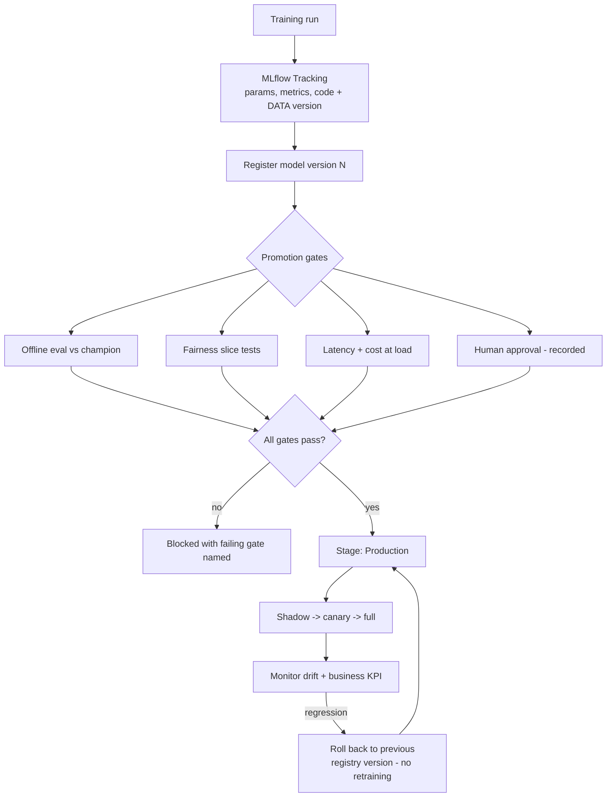

# MLOps with MLflow: Experiment Tracking, Model Registry and Promotion Gates

**Level:** Advanced
**Tree:** [AI Platform Engineering](../README.md)
**Branch:** [AI Platform Engineering](README.md)
**Forest:** [AI & Intelligent Systems](../../../README.md)

## Explanation

### Two systems that get confused for one

**Tracking** answers *how was this built* - parameters, metrics, code version, dataset
version, artifacts. It belongs to the data scientist and should capture every run,
including the failures, because the failures are what stop an experiment being
repeated.

**The registry** answers *what is allowed to run in production*. It is a release
control and belongs to whoever is accountable for production. Conflating the two is
the single most common reason an MLOps stack is installed and never adopted - if the
registry is just a label a data scientist sets, it controls nothing.

### Reproducibility requires the data version

A tracked run that records hyperparameters but not the dataset version is not
reproducible. The training data moves - rows are added, a upstream join changes, a
backfill rewrites history - and the run can never be re-created. **Log a dataset hash
or a table snapshot identifier alongside the parameters**, or the tracking record is
a description rather than a reproduction.

### Promotion gates make the registry real

A stage transition should require: offline evaluation against the current champion on
a held-out set, fairness checks on the slices that matter, latency and cost at target
load, an explainability artefact where regulation demands one, and a recorded human
approval. Without gates the registry is a naming convention.

### Rollback is a model capability

Because every promoted version stays in the registry, rolling back is selecting a
previous version rather than retraining. Teams routinely discover during their first
bad deployment that they never wired this path - and retraining under incident
pressure is the worst possible time to find out.

## Architecture and flow



## Commands

### Command 1

Run tracking server with a real database and object store - the SQLite default does not survive concurrent use

```text
mlflow server --backend-store-uri postgresql://... --default-artifact-root s3://mlflow
```

### Command 2

Full run detail including parameters, metrics and tags - the reproducibility record

```text
mlflow runs describe --run-id <id>
```

### Command 3

Serve the current Production-stage model by registry reference rather than by file path

```text
mlflow models serve -m models:/fraud-model/Production -p 5000
```

### Command 4

Retrieve the exact artifact a run produced, for audit or comparison

```text
mlflow artifacts download --artifact-uri runs:/<id>/model
```

### Command 5

Promote a version - this call is what the promotion gates must wrap

```text
mlflow model-registry transition-stage --name fraud-model --version 7 --stage Production
```

## Automation scripts

### mlflow-promotion-gate.py

```python
#!/usr/bin/env python3
"""Promotion gate for MLflow model registry.
Run in CI. Exits non-zero if any gate fails, naming the gate.
"""
import sys
import mlflow
from mlflow.tracking import MlflowClient

MODEL = "fraud-model"
MIN_AUC_UPLIFT = 0.0      # must at least match champion
MAX_P99_MS = 250
MIN_SLICE_AUC = 0.70      # fairness floor on every slice

client = MlflowClient()
failures = []


def stage_version(model, stage):
    versions = client.get_latest_versions(model, stages=[stage])
    return versions[0] if versions else None


candidate = stage_version(MODEL, "Staging")
champion = stage_version(MODEL, "Production")

if candidate is None:
    print("no candidate in Staging")
    sys.exit(2)

cand_run = client.get_run(candidate.run_id)
m = cand_run.data.metrics

# Gate 1 - reproducibility. A run without a dataset version cannot be
# re-created, so it must not reach production regardless of its metrics.
if "dataset_hash" not in cand_run.data.tags:
    failures.append("reproducibility: no dataset_hash tag - run is not reproducible")

# Gate 2 - offline performance against the champion.
if champion is not None:
    champ_auc = client.get_run(champion.run_id).data.metrics.get("auc", 0.0)
    cand_auc = m.get("auc", 0.0)
    if cand_auc < champ_auc + MIN_AUC_UPLIFT:
        failures.append(
            "performance: candidate auc %.4f below champion %.4f" % (cand_auc, champ_auc)
        )

# Gate 3 - fairness across slices. A model can improve overall while
# degrading badly on a subgroup; the aggregate metric hides it.
for key, value in m.items():
    if key.startswith("auc_slice_") and value < MIN_SLICE_AUC:
        failures.append("fairness: %s = %.4f below floor %.2f" % (key, value, MIN_SLICE_AUC))

# Gate 4 - serving latency at target load.
p99 = m.get("p99_latency_ms")
if p99 is None:
    failures.append("latency: no p99_latency_ms metric logged - load test not run")
elif p99 > MAX_P99_MS:
    failures.append("latency: p99 %.0f ms exceeds %d ms" % (p99, MAX_P99_MS))

# Gate 5 - recorded human approval.
if cand_run.data.tags.get("approved_by") is None:
    failures.append("approval: no approved_by tag - human sign-off missing")

if failures:
    print("PROMOTION BLOCKED for %s version %s" % (MODEL, candidate.version))
    for f in failures:
        print("  FAIL " + f)
    sys.exit(1)

client.transition_model_version_stage(
    name=MODEL,
    version=candidate.version,
    stage="Production",
    archive_existing_versions=False,   # keep champion for rollback
)
print("promoted %s version %s to Production" % (MODEL, candidate.version))
sys.exit(0)
```

## Lab

**Objective:** Stand up MLflow with a real backend, train competing models, enforce automated promotion gates in CI, and prove rollback by promoting a deliberately degraded model and reverting it.

### Steps

1. Deploy the MLflow tracking server backed by PostgreSQL and object storage rather than the local SQLite default.
2. Train three model variants, logging parameters, metrics, artifacts and a dataset hash tag for each.
3. Confirm every run can be reproduced from its logged record, including the exact training data version.
4. Register the best variant and transition it to Production through the gate script.
5. Train a variant with better overall AUC but deliberately degraded performance on one demographic slice.
6. Attempt promotion and confirm the fairness gate blocks it, naming the failing slice.
7. Remove the dataset hash tag from a run and confirm the reproducibility gate blocks it independently.
8. Promote a genuinely better model and deploy it shadow, then canary, then full.
9. Simulate a production regression and roll back by re-promoting the previous registry version. Measure how long the rollback takes.
10. Confirm no retraining was required to roll back.

### Validation

Gate script blocks promotion for fairness, reproducibility and latency failures independently and names the cause,Rollback completes by selecting a prior registry version with no retraining,Every production model traces to a reproducible run with a dataset version

## Operational automation

### Automating the MLOps loop

- **Run the gate script in CI** on every stage-transition request, so promotion is a
  pipeline outcome rather than a console click.
- **Log the dataset hash automatically** in the training wrapper. Left to discipline it
  is omitted exactly when it matters, which is during a rushed retrain.
- **Webhook the registry to deployment.** A stage transition to Production should
  trigger the shadow deployment automatically; a manual step here becomes a divergence
  between what the registry says and what is running.
- **Schedule drift detection** against the training distribution and open a retraining
  ticket automatically rather than relying on someone noticing a KPI decline.
- **Never automate the human approval gate.** Its value is that a named person is
  accountable; automating it removes the only thing it provides.

## Troubleshooting

### Scenario 1: A production model cannot be reproduced from its tracked run

**Likely cause:** Dataset version was not logged, and the training data has since changed

**Resolution:** Add dataset hash or snapshot identifier logging to the training wrapper and make it a hard promotion gate. Existing models without it should be re-trained and re-registered with the tag before they are trusted for audit purposes.

### Scenario 2: MLflow tracking server becomes slow or corrupts under team use

**Likely cause:** Running with the default SQLite backend and local artifact storage

**Resolution:** Move to PostgreSQL for the backend store and object storage for artifacts. SQLite does not handle concurrent writers, and local artifact storage does not survive server replacement.

### Scenario 3: Model with better aggregate metrics performs worse for a customer segment in production

**Likely cause:** Only aggregate metrics were gated; slice performance was never evaluated

**Resolution:** Add per-slice metrics to training and a fairness floor to the gate. Aggregate improvement routinely masks subgroup degradation, and the aggregate is what most teams gate on.

## Interview questions

### 1. What is the difference between MLflow tracking and the model registry?

Tracking records how a model was built - parameters, metrics, code and data versions - and belongs to the data scientist. The registry controls what is allowed to run in production and belongs to whoever is accountable for production. They are different systems with different owners, and treating the registry as just another label the data scientist sets is why many MLOps deployments never actually control anything.

### 2. Why log a dataset version alongside hyperparameters?

Because without it the run is not reproducible. Training data changes - new rows, changed upstream joins, backfills that rewrite history - so re-running the same code with the same parameters produces a different model. A tracking record without a data version describes a run rather than allowing it to be re-created, which fails both debugging and audit.

### 3. How do you roll back a model?

By promoting the previous registry version, not by retraining. Every promoted version remains in the registry, so rollback is a selection. The failure mode is discovering during your first bad deployment that the serving layer points at a file path rather than a registry stage, at which point rollback means an emergency retrain under incident conditions.

### 4. What gates would you require before a model reaches production?

Reproducibility (dataset version logged), offline performance against the current champion on a held-out set, fairness across the slices that matter, latency and cost measured at target load, an explainability artefact where regulation requires it, and a recorded human approval. Without enforced gates the stage field is a naming convention rather than a release control.

## Certification alignment

- Azure AI Engineer Associate (AI-102) - model deployment and lifecycle
- AWS Certified Machine Learning - Specialty: MLOps and model governance
- Databricks Certified Machine Learning Professional - MLflow and registry workflows

## References

- MLflow documentation: Model Registry and stage transitions
- Google: Rules of Machine Learning - practical MLOps guidance
- ISO/IEC 42001 - AI management system requirements for model lifecycle governance

## Suggested video search

MLflow model registry promotion gates experiment tracking data versioning rollback

---

> Validate commands, versions, permissions, licensing, and rollback procedures in an isolated lab before production use.
