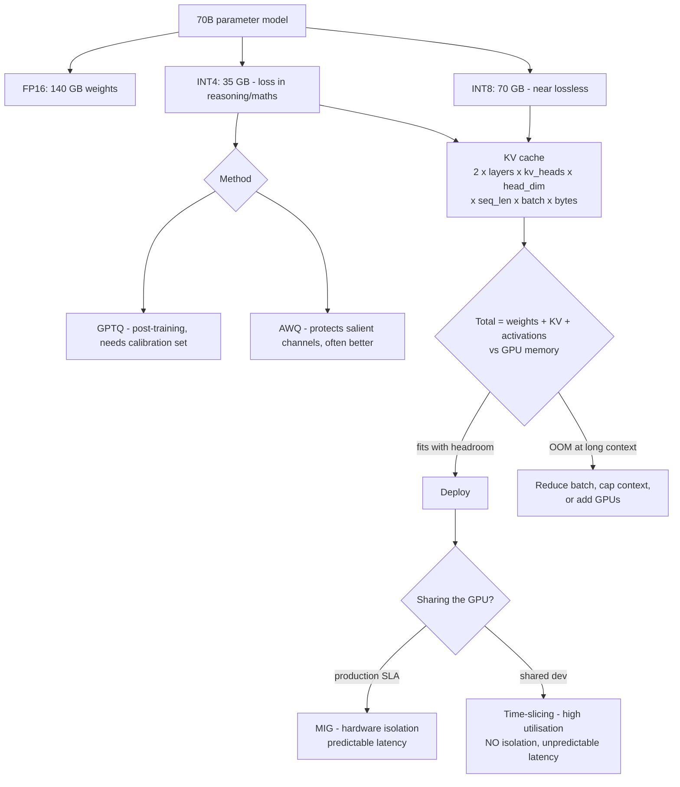

# Model Quantisation and GPU Sharing: Precision, MIG Partitioning and KV Cache Sizing

**Level:** Advanced
**Tree:** [AI Platform Engineering](../README.md)
**Branch:** [AI Platform Engineering](README.md)
**Forest:** [AI & Intelligent Systems](../../../README.md)

## Explanation

### The arithmetic that decides what fits

Weight memory is parameters multiplied by bytes per parameter. A 70B model needs
**140 GB at FP16, 70 GB at INT8, 35 GB at INT4**. That single calculation determines
how many GPUs a deployment requires and is the first thing to compute.

### The KV cache is what actually exhausts the GPU

Weights are static. The **KV cache grows with sequence length and batch size**, and at
long context with meaningful concurrency it can exceed the quantised weights. Teams
quantise a model until it fits, deploy it, and then hit out-of-memory errors at
production context lengths - because they sized for weights only. Size the KV cache
for the **worst-case** context and concurrency you will serve, not the average.

### Where quantisation accuracy loss appears

INT8 is near-lossless for most tasks. INT4 shows measurable degradation, and it is not
evenly distributed - it concentrates in **reasoning, arithmetic and long-context
recall**. A summarisation workload may be unaffected while a workload doing
multi-step reasoning degrades noticeably. Method matters too: AWQ protects salient
weight channels and often outperforms GPTQ at the same bit width.

### Sharing a GPU: isolation versus utilisation

**MIG** partitions the hardware into instances with separate memory and compute,
giving true isolation and predictable latency at the cost of fixed profile sizes and
stranded capacity. **Time-slicing** interleaves kernels, maximising utilisation while
providing no memory isolation - one tenant can OOM another - and destroying latency
predictability. In Kubernetes, time-slicing advertises the same GPU multiple times, so
scheduling succeeds while the hardware is oversubscribed. Production inference with an
SLA needs MIG; shared experimentation is where time-slicing belongs.

## Architecture and flow



## Commands

### Command 1

Baseline GPU memory and utilisation - the starting point for any sizing exercise

```text
nvidia-smi --query-gpu=memory.total,memory.used,utilization.gpu --format=csv
```

### Command 2

List available MIG profiles on the device, which are the fixed partition sizes you must design around

```text
nvidia-smi mig -lgip
```

### Command 3

Enable MIG mode on GPU 0 - requires no active workloads and drains the device

```text
nvidia-smi -i 0 -mig 1
```

### Command 4

Create three MIG instances from a profile and their compute instances

```text
nvidia-smi mig -cgi 9,9,9 -C
```

### Command 5

Serve a quantised model with an explicit memory fraction and context cap - both are KV cache controls

```text
vllm serve <model> --quantization awq --gpu-memory-utilization 0.90 --max-model-len 32768
```

### Command 6

Free and total device memory from inside the runtime, for verifying headroom after load

```text
python -c "import torch; print(torch.cuda.mem_get_info())"
```

## Automation scripts

### llm-memory-sizing.py

```python
#!/usr/bin/env python3
"""Sizes an LLM deployment: weights + KV cache + activation headroom.
Sizing on weights alone is the standard capacity-planning failure.
"""
import argparse

BYTES = {"fp16": 2.0, "bf16": 2.0, "int8": 1.0, "int4": 0.5}

p = argparse.ArgumentParser()
p.add_argument("--params-b", type=float, required=True, help="parameters in billions")
p.add_argument("--precision", choices=list(BYTES), default="fp16")
p.add_argument("--layers", type=int, required=True)
p.add_argument("--kv-heads", type=int, required=True, help="KV heads (GQA reduces this)")
p.add_argument("--head-dim", type=int, default=128)
p.add_argument("--seq-len", type=int, required=True, help="WORST-CASE context, not average")
p.add_argument("--batch", type=int, required=True, help="peak concurrent sequences")
p.add_argument("--gpu-gb", type=float, required=True)
p.add_argument("--gpus", type=int, default=1)
a = p.parse_args()

GB = 1024 ** 3

# Weights.
weights_gb = (a.params_b * 1e9 * BYTES[a.precision]) / GB

# KV cache: 2 (K and V) x layers x kv_heads x head_dim x seq x batch.
# KV cache is normally kept at fp16 even when weights are quantised.
kv_bytes = 2 * a.layers * a.kv_heads * a.head_dim * a.seq_len * a.batch * 2.0
kv_gb = kv_bytes / GB

# Activations and fragmentation - rule of thumb.
overhead_gb = 0.10 * (weights_gb + kv_gb)

total = weights_gb + kv_gb + overhead_gb
available = a.gpu_gb * a.gpus

print("Model: %.0fB params at %s" % (a.params_b, a.precision))
print("  weights        : %8.1f GB" % weights_gb)
print("  KV cache       : %8.1f GB  (seq=%d, batch=%d)" % (kv_gb, a.seq_len, a.batch))
print("  overhead ~10%%  : %8.1f GB" % overhead_gb)
print("  TOTAL          : %8.1f GB" % total)
print("  available      : %8.1f GB  (%d x %.0f GB)" % (available, a.gpus, a.gpu_gb))
print("")

if kv_gb > weights_gb:
    print("  NOTE KV cache EXCEEDS weights at this context and batch.")
    print("       This is normal at long context and is exactly why")
    print("       sizing on weights alone produces an OOM under load.")

if total <= available:
    print("  RESULT fits with %.1f GB headroom" % (available - total))
else:
    need = total / a.gpu_gb
    print("  RESULT DOES NOT FIT - needs %.1f GPUs of this size" % need)
    print("  Options: lower precision, cap max context, reduce batch, add GPUs")
```

## Lab

**Objective:** Quantise a model at three precisions, measure accuracy and throughput at each, then prove the KV cache sizing failure by deploying a model that fits on weights and fails at production context.

### Steps

1. Serve a model at FP16 and record memory used, tokens per second and accuracy on a fixed evaluation set.
2. Quantise to INT8 with AWQ, serve, and record the same three measurements.
3. Quantise to INT4 with both GPTQ and AWQ, and compare accuracy at identical bit width.
4. Identify which capabilities degrade at INT4 by scoring reasoning, arithmetic and summarisation tasks separately.
5. Use the sizing script to compute total memory for a short context, and deploy successfully.
6. Increase context length and concurrency to production worst case and observe the out-of-memory failure.
7. Recompute with the script at the worst-case values and confirm it predicted the failure.
8. Cap max-model-len and gpu-memory-utilisation to make the deployment stable, and record the throughput cost.
9. Enable MIG, create instances, and run two tenants with measured latency.
10. Switch to time-slicing with the same two tenants and compare p99 latency and isolation behaviour.

### Validation

Accuracy degradation at INT4 is measured per capability rather than as one number,The sizing script correctly predicts the OOM before it occurs,MIG shows stable p99 under a noisy neighbour where time-slicing does not

## Operational automation

### Automating model runtime operations

- **Run the sizing calculation in CI** before any model deployment, using worst-case
  context and concurrency. Sizing failures caught in a pipeline cost nothing.
- **Pin quantisation method and version** in the deployment manifest. GPTQ and AWQ at
  the same bit width produce measurably different accuracy, so the method is part of
  the model identity.
- **Automate MIG reconfiguration through the GPU operator** rather than by hand.
  Changing partitions drains the device, so it must be a scheduled, orchestrated
  operation.
- **Alert on KV cache pressure**, not just total GPU memory. Approaching the cache
  limit degrades throughput before it produces an error.
- **Re-run the evaluation suite after any quantisation change.** Precision changes are
  model changes and belong behind the same regression gate as a new model version.

## Troubleshooting

### Scenario 1: Model loads successfully but crashes with out-of-memory once real traffic arrives

**Likely cause:** Deployment was sized on weight memory only; the KV cache at production context and concurrency exceeded remaining capacity

**Resolution:** Recompute total memory including KV cache at worst-case sequence length and batch. Cap max-model-len and set an explicit gpu-memory-utilisation fraction so the runtime pre-allocates and fails fast at start rather than under load.

### Scenario 2: Quantised model gives noticeably worse answers on reasoning tasks while summarisation seems fine

**Likely cause:** INT4 accuracy loss is concentrated in reasoning, arithmetic and long-context recall rather than spread evenly

**Resolution:** Move to INT8 for reasoning-heavy workloads, or try AWQ instead of GPTQ at the same bit width. Evaluate per capability rather than with a single aggregate score, which hides exactly this pattern.

### Scenario 3: Inference latency is unpredictable on a shared GPU despite adequate capacity

**Likely cause:** Time-slicing provides no isolation, so a co-resident batch job is stealing GPU time from the latency-sensitive tenant

**Resolution:** Move production inference to MIG instances for hardware isolation, or give it a dedicated GPU. Time-slicing is appropriate for development, not for workloads with a latency SLA.

## Interview questions

### 1. How do you size an LLM deployment?

Weights are parameters multiplied by bytes per parameter, which is straightforward. The part that gets missed is the KV cache, which scales with sequence length and batch size and at long context can exceed the quantised weights. Size for worst-case context and concurrency, not average, then add roughly ten percent for activations and fragmentation. Sizing on weights alone is the standard failure.

### 2. Where does INT4 quantisation actually hurt?

Not uniformly. Degradation concentrates in reasoning, arithmetic and long-context recall, while tasks like summarisation or classification are often barely affected. That means a single aggregate benchmark score can look acceptable while the specific capability your application depends on has degraded badly, so evaluation must be per capability.

### 3. When would you use MIG rather than time-slicing?

For anything with a latency SLA. MIG partitions the hardware with separate memory and compute, giving true isolation and predictable latency, at the cost of fixed profile sizes and some stranded capacity. Time-slicing maximises utilisation but provides no memory isolation - one tenant can OOM another - and latency becomes unpredictable under contention. Time-slicing belongs on shared development capacity.

### 4. What is misleading about time-slicing in Kubernetes?

The device plugin advertises the same physical GPU multiple times, so pod scheduling succeeds while the hardware is oversubscribed. Everything looks correctly scheduled and within quota, and the only symptom is degraded and variable performance. It is a very easy way to build a cluster that appears healthy and misses its latency targets.

## Certification alignment

- NVIDIA Certified Associate: AI Infrastructure and Operations - MIG and GPU management
- NVIDIA Deep Learning Institute: model optimisation and deployment
- Azure AI Engineer Associate - model deployment sizing and endpoint configuration

## References

- vLLM documentation: quantisation support, KV cache and memory management
- NVIDIA MIG user guide: profiles, isolation properties and reconfiguration
- AWQ and GPTQ papers - activation-aware and post-training quantisation methods

## Suggested video search

LLM quantisation INT4 GPTQ AWQ KV cache sizing MIG partitioning GPU sharing vLLM

---

> Validate commands, versions, permissions, licensing, and rollback procedures in an isolated lab before production use.
