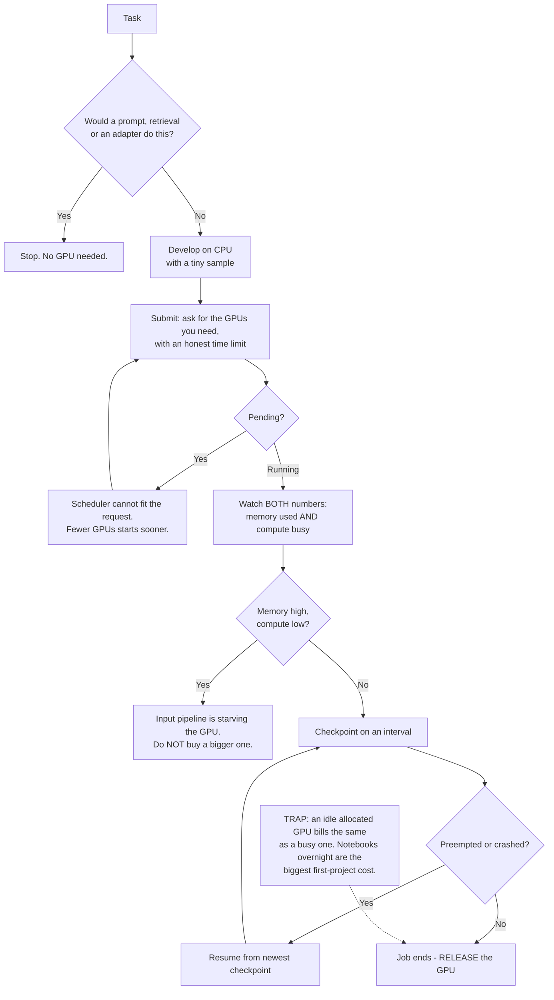

# Your First GPU Job: What You Are Renting, Why It Queues and How Not to Waste It

**Level:** Beginner
**Tree:** [AI Platform Engineering](../README.md)
**Branch:** [Training and GPU Infrastructure](README.md)
**Forest:** [AI & Intelligent Systems](../../../README.md)

## Explanation

### You are renting a whole machine by the second

A GPU is not allocated in slices by default. You request one, you get all of it, and you
are billed for wall-clock time from allocation to release - whether your code is
computing, waiting on a file, or sitting at a breakpoint while you read a stack trace.
**The dominant cost in most first projects is not training; it is allocated GPUs doing
nothing.** A notebook attached to an idle GPU overnight costs the same as a full training
run. That single fact should shape how you work: develop on CPU with a tiny sample,
attach the GPU only when the code already runs, and release it the moment the job ends.

### Utilisation is two numbers, and beginners watch the wrong one

"The GPU is being used" is ambiguous, and the ambiguity hides the most common beginner
failure. **Memory used and compute busy are independent.** A job can fill 70GB of VRAM
and keep the processing cores idle 90% of the time, which looks healthy on a memory graph
and is mostly paying a GPU to wait. The usual cause is the input pipeline: data is being
read, decoded or transformed on the CPU faster than it can be handed over, so the GPU
starves between batches. Before you buy a bigger GPU, look at whether the one you have is
actually computing.

### Out of memory is about what fits at once, not about model size

The error that stops most first jobs is memory, and the instinct is that the model is too
big. Usually the model is fine and the *batch* is not. GPU memory holds the model
weights, the optimiser state, and the activations for every example being processed
simultaneously - and **only the last of those scales with batch size**, which is why
halving the batch often fixes it outright. Knowing which of the three is dominant tells
you which lever to pull: a smaller batch, gradient accumulation to keep the effective
batch while halving the real one, or a genuinely smaller model.

### Your job queues because GPUs are allocated whole

A first cluster job often sits pending with no error, which reads as a broken submission.
It usually is not. The scheduler allocates whole GPUs, so it cannot start your job until
enough free GPUs exist simultaneously to satisfy the request. **A request for eight GPUs
waits for eight; a request for one frequently starts immediately.** Ask for what you need
rather than what you might want, and state a realistic time limit - schedulers backfill
short jobs into gaps, so an honest one-hour limit often starts sooner than an optimistic
open-ended one.

### Checkpointing is what makes cheap capacity usable

Preemptible or spot GPUs cost substantially less because the provider can reclaim them
with little notice. That is a bargain if your job can resume and a liability if it cannot:
without checkpoints, a reclaim at hour eleven of a twelve-hour run destroys the whole run
and you have paid for all of it. **Write a checkpoint at a fixed interval, and make
restart read the newest one automatically.** Then cheap capacity becomes genuinely cheap,
and the checkpoint doubles as insurance against every other failure - a crash, a bad node,
a mistake in your own code.

### Most teams do not need to train at all

Before renting anything, be honest about the task. Prompting, retrieval and adapter-based
fine-tuning cover the large majority of enterprise needs, and each requires far less
hardware than training a model from scratch. What many teams actually need is **inference
capacity, which is a different shape of problem** - steady, latency-sensitive and often
better served by a managed endpoint than by a GPU you operate. Renting a training cluster
for a job that a prompt would have done is the most expensive way to learn this.

## Architecture and flow



## Commands

### Command 1

See both numbers that matter - memory used and how busy the compute cores actually are

```text
nvidia-smi --query-gpu=name,memory.used,memory.total,utilization.gpu --format=csv
```

### Command 2

Watch utilisation over time rather than at one instant, since starvation shows as a sawtooth

```text
nvidia-smi --query-gpu=utilization.gpu,memory.used --format=csv -l 2
```

### Command 3

Find out who else is holding the GPU before concluding that yours is broken

```text
nvidia-smi --query-compute-apps=pid,process_name,used_memory --format=csv
```

### Command 4

Ask the scheduler why your job is pending instead of guessing at the submission

```text
squeue -u "$USER" -o "%.10i %.9P %.30j %.8T %.10M %R"
```

### Command 5

Submit with an honest time limit and the smallest workable allocation, so backfill can start you sooner

```text
sbatch --gres=gpu:1 --time=01:00:00 --job-name=first-run train.sbatch
```

### Command 6

Confirm a checkpoint was actually written before trusting a long run to cheap capacity

```text
ls -lt checkpoints/ | head -3
```

## Automation scripts

### gpu_waste_report.py

The expensive failure is invisible on a memory graph: a GPU that is allocated, full, and
barely computing. This samples both numbers over a window and reports which of the three
states a job is in - starved, genuinely busy, or idle and billing.

```python
#!/usr/bin/env python3
"""Report whether an allocated GPU is actually earning its cost.

Samples memory and compute utilisation, then classifies the window. High
memory with low compute is the common beginner failure - the input pipeline
is starving the GPU - and it looks fine on any memory-only dashboard.
"""
import argparse
import subprocess
import sys
import time

STARVED_COMPUTE = 40   # percent; below this with memory held is starvation
IDLE_MEMORY = 5        # percent; below this the GPU is allocated and unused

def sample():
    out = subprocess.run(
        ["nvidia-smi",
         "--query-gpu=index,utilization.gpu,memory.used,memory.total",
         "--format=csv,noheader,nounits"],
        capture_output=True, text=True, check=True,
    ).stdout.strip()
    rows = []
    for line in out.splitlines():
        index, compute, used, total = [p.strip() for p in line.split(",")]
        rows.append({
            "index": int(index),
            "compute": float(compute),
            "memory_pct": 100.0 * float(used) / float(total),
        })
    return rows

def main():
    parser = argparse.ArgumentParser()
    parser.add_argument("--seconds", type=int, default=120)
    parser.add_argument("--interval", type=int, default=2)
    parser.add_argument("--hourly-cost", type=float, default=3.0,
                        help="cost per GPU-hour, for the wasted-spend estimate")
    args = parser.parse_args()

    history = {}
    deadline = time.monotonic() + args.seconds
    while time.monotonic() < deadline:
        try:
            for row in sample():
                history.setdefault(row["index"], []).append(row)
        except (subprocess.CalledProcessError, FileNotFoundError):
            raise SystemExit("nvidia-smi unavailable - run this on the GPU host")
        time.sleep(args.interval)

    if not history:
        raise SystemExit("no samples collected")

    print(f"{'gpu':<5}{'compute avg':>13}{'memory avg':>12}  verdict")
    for index in sorted(history):
        rows = history[index]
        compute = sum(r["compute"] for r in rows) / len(rows)
        memory = sum(r["memory_pct"] for r in rows) / len(rows)

        if memory < IDLE_MEMORY:
            verdict = "IDLE - allocated and billing for nothing"
        elif compute < STARVED_COMPUTE:
            # The finding that matters: memory graphs show this as healthy.
            verdict = "STARVED - the input pipeline, not the GPU, is the limit"
        else:
            verdict = "busy - this GPU is earning its cost"
        print(f"{index:<5}{compute:>12.0f}%{memory:>11.0f}%  {verdict}")

    worst = min(history, key=lambda i: sum(r["compute"] for r in history[i]) / len(history[i]))
    idle_fraction = 1 - (sum(r["compute"] for r in history[worst]) / len(history[worst]) / 100)
    print(
        f"\nAt ${args.hourly_cost:.2f}/GPU-hour, GPU {worst} is paying roughly "
        f"${args.hourly_cost * idle_fraction:.2f} per hour to wait. "
        "Fix the data path before renting anything larger."
    )
    return 0

if __name__ == "__main__":
    sys.exit(main())
```

## Lab

**Objective:** Run one training job on a rented GPU, diagnose a starved GPU from a healthy one, and make the job survive being preempted.

### Steps

1. Write down the task and confirm honestly that a prompt, retrieval or an adapter would not do it.
2. Get the code running on CPU with a deliberately tiny sample, before any GPU is allocated.
3. Submit the job asking for one GPU with a one-hour limit, and record how long it waits before starting.
4. Resubmit asking for four GPUs and compare the wait, to see the scheduler's whole-GPU allocation in action.
5. While training, run `gpu_waste_report.py` for two minutes and record the compute and memory averages.
6. Deliberately starve the GPU by reducing data-loader workers to one, rerun the report, and observe which number moves.
7. Restore the loaders, confirm compute utilisation recovers, and record both figures side by side.
8. Trigger an out-of-memory error by raising the batch size, then fix it by halving the batch rather than by changing the model.
9. Add interval checkpointing, kill the job mid-run, and restart it - confirming it resumes from the newest checkpoint rather than from zero.
10. Release the allocation and confirm from the scheduler that nothing is still held in your name.

### Validation

- The decision to use a GPU at all is written down, with the reason a cheaper rung was insufficient.
- Wait times for the one-GPU and four-GPU requests are recorded, showing the queue is about fitting the request rather than about job validity.
- A starved GPU and a busy GPU are distinguished by measurement, with compute utilisation moving while memory stays flat.
- The out-of-memory error is fixed by changing the batch, demonstrating which term in the memory budget scales with it.
- A killed job resumes from its newest checkpoint and reaches the same end state, not from the beginning.
- No allocation remains held after the lab, confirmed from the scheduler rather than assumed.

## Operational automation

### Stopping the waste before it becomes a habit

- **Put an idle timeout on interactive sessions.** Notebooks attached to GPUs overnight
  are the largest avoidable line on most first invoices. Reclaim a session with no
  compute activity after a fixed period, and make that the platform default rather than a
  discipline each person has to remember.
- **Alert on compute utilisation, not memory.** A memory dashboard shows a starved job as
  healthy, so the failure that wastes the most money is the one nobody sees. Treat
  sustained high memory with low compute as an actionable signal.
- **Require a time limit on every submission.** Schedulers backfill short jobs into gaps,
  so honest limits shorten everyone's queue, and an open-ended job that hangs holds
  capacity until someone notices.
- **Make checkpointing a template, not a decision.** If the job skeleton every team starts
  from already writes and resumes checkpoints, preemptible capacity becomes usable by
  default and no long run is ever lost to a single reclaim.
- **Show cost per job in the same place as the logs.** Attribution that lives in a monthly
  finance report changes nobody's behaviour. A figure next to the run, while the choice is
  fresh, is what stops the next eight-GPU request that needed one.
- **Review allocations weekly for jobs nobody owns.** Long-running allocations outlive the
  project that created them, and a GPU held by someone who left is invisible until you go
  looking.

## Troubleshooting

### Scenario 1: The job has been pending for an hour with no error message.

**Likely cause:** The scheduler cannot assemble the requested GPUs simultaneously. This is a fitting problem, not a fault in the submission.

**Resolution:** Ask the scheduler directly for the pending reason rather than re-reading your script, then resubmit with fewer GPUs and a realistic time limit. Confirm the diagnosis by submitting a single-GPU job: if it starts immediately, the original request was simply too large to fit. Short, honest time limits also let the scheduler backfill your job into gaps that a long or open-ended request cannot use.

### Scenario 2: The GPU shows 90% memory used, and training is barely faster than CPU.

**Likely cause:** The input pipeline is starving the GPU. Data is being read or transformed more slowly than it is consumed, so the compute cores idle between batches while memory stays allocated.

**Resolution:** Look at compute utilisation over time rather than memory - a sawtooth between high and near-zero is the signature. Raise data-loader workers, prefetch, and move decoding off the critical path. Confirm the diagnosis by training on a small in-memory subset: if throughput jumps, the bottleneck was never the GPU, and a larger one would have cost more to wait just as long.

### Scenario 3: Out of memory on a model that should fit comfortably.

**Likely cause:** Batch size. GPU memory holds weights, optimiser state and the activations for everything being processed at once, and only the last term scales with the batch.

**Resolution:** Halve the batch first, since it is the one term you control instantly, and use gradient accumulation to keep the effective batch where you need it. Confirm the diagnosis by watching whether peak memory tracks the batch size proportionally. If memory is dominated by weights and optimiser state instead, the batch will not help and the answer is a smaller model or a parameter-efficient method.

### Scenario 4: The run died at hour eleven of twelve and nothing survived.

**Likely cause:** Preemptible capacity was reclaimed, and the job had no checkpoints, so the entire run was lost along with everything it cost.

**Resolution:** Checkpoint on a fixed interval and make restart load the newest checkpoint automatically, then test it by killing the job deliberately rather than waiting to find out during a reclaim. Confirm the setup by inspecting checkpoint timestamps mid-run. Untested resume logic is the common version of this failure: the checkpoints existed, and nothing read them.

### Scenario 5: The bill is far larger than the training time explains.

**Likely cause:** Allocated-but-idle time - interactive sessions left attached, jobs that finished without releasing, or allocations belonging to people who have moved on.

**Resolution:** Reconcile billed GPU-hours against the compute time your jobs actually recorded; the gap is the waste, and it is usually interactive. Add idle timeouts to sessions and audit long-running allocations for ownership. Confirm the diagnosis by checking who holds GPUs right now - on most first projects the answer includes at least one notebook nobody has looked at today.

## Interview questions

### 1. A team asks for an eight-GPU cluster for their first AI project. What do you ask?

What the task is, and what they have already tried. Most enterprise needs are met by prompting, retrieval or adapter-based tuning, and none of those requires a training cluster, so the first question is whether training is needed at all rather than how much hardware to buy. If training is genuinely needed, I would still start with one GPU, because a first job on eight GPUs hides every problem worth learning: whether the data path can feed the device, whether the code checkpoints, whether memory is dominated by weights or by batch. Eight GPUs also queue for far longer, since the scheduler allocates whole devices and has to fit them all simultaneously. And I would ask what they intend to do afterwards - teams frequently describe a training project when what they actually need is steady inference capacity, which is a different shape of problem and usually better served by a managed endpoint than by hardware they operate.

### 2. A job shows the GPU at 95% memory. Is it being used well?

Unknown from that number alone, and this is the most expensive confusion for beginners. Memory used and compute busy are independent: a job can hold nearly all the VRAM while the processing cores sit idle most of the time, which a memory dashboard reports as perfectly healthy. The usual cause is the input pipeline - data being read, decoded or transformed too slowly to keep the device fed - so the GPU starves between batches. I would sample compute utilisation over time rather than at an instant, because starvation shows as a sawtooth between high and near-zero rather than a steady low figure. The practical consequence is that the instinct to rent a bigger GPU makes it worse: you pay more for a device that waits just as long. Fix the data path first, then reassess whether more hardware is needed at all.

### 3. Why would you use preemptible GPUs, and what has to be true first?

Because they cost substantially less, and for training that is a large saving on the dominant line item. What has to be true is that losing the machine at any moment is survivable, which means checkpointing at a fixed interval and a restart path that automatically loads the newest checkpoint. Without that, preemptible capacity is a liability rather than a bargain: a reclaim at hour eleven of a twelve-hour run destroys the run and you have still paid for the eleven hours. The part teams get wrong is testing. Checkpoints often exist while the resume logic has never been exercised, so the first real preemption reveals that nothing reads them. I kill the job deliberately and confirm it resumes at the right step before trusting anything long to cheap capacity. The checkpoint then earns its keep twice, because it also covers crashes, bad nodes and my own mistakes.

### 4. Where does the money actually go on a first GPU project?

Not into training - into allocated GPUs doing nothing. You are billed for wall-clock time from allocation to release regardless of whether anything is computing, so a notebook left attached overnight costs the same as a full training run, and on most first projects that is the single largest line. The second source is starved jobs, which bill at full rate while computing a fraction of the time and look fine on any memory-only dashboard. Both are invisible unless someone reconciles billed GPU-hours against the compute time jobs actually recorded, and the gap is the waste. The fixes are unglamorous and effective: idle timeouts on interactive sessions as a platform default, alerting on compute utilisation rather than memory, mandatory time limits, and showing cost per job next to the logs where it can still change a decision rather than in a monthly report.

## Certification alignment

- **Microsoft Certified: Azure AI Fundamentals (AI-901)** - Identify AI concepts and capabilities: deciding whether a task needs training at all, or can be met by prompting, retrieval or adapter-based fine-tuning.
- **Microsoft Certified: Machine Learning Operations Engineer Associate (AI-300)** - Design and implement an MLOps infrastructure: sizing GPU requests and time limits for scheduled training jobs, interval checkpointing for preemptible capacity, and idle timeouts that stop allocated GPUs billing for nothing.
- **AWS Certified Machine Learning Engineer - Associate** - training instance selection, spot capacity and checkpointing.
- **Google Cloud Professional Machine Learning Engineer** - training infrastructure, resource selection and job orchestration.
- **Vendor-neutral** - FinOps Foundation practices: allocation, utilisation and showback for shared accelerated compute.

## References

- NVIDIA documentation - `nvidia-smi` query fields, and the distinction between memory and compute utilisation
- PyTorch documentation - DataLoader workers, prefetching and diagnosing input-bound training
- Slurm documentation - job submission, pending reasons, time limits and backfill scheduling
- PyTorch documentation - checkpointing and resuming training state
- FinOps Foundation - cloud cost allocation and utilisation practices applied to GPU capacity

## Suggested video search

first GPU training job utilisation versus memory data loader bottleneck spot preemption checkpointing beginner

---

> Validate commands, versions, permissions, licensing, and rollback procedures in an isolated lab before production use.
