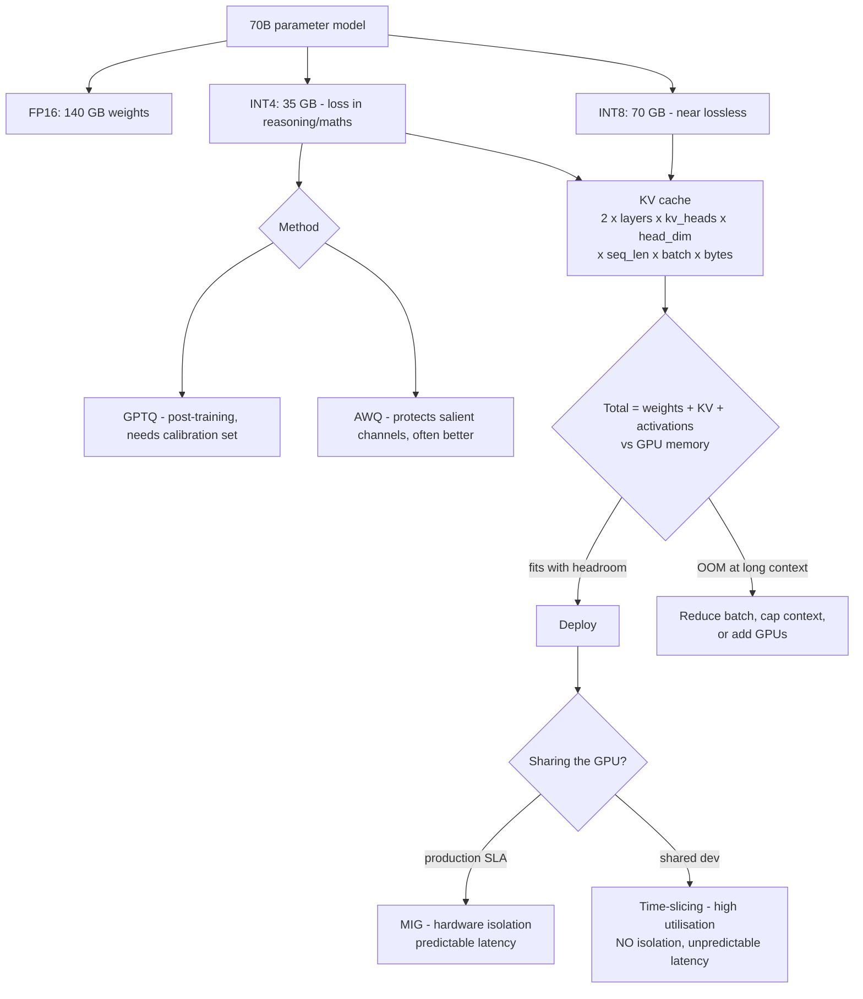

# Model Quantisation and GPU Sharing: Precision, MIG Partitioning and KV Cache Sizing

**Level:** Advanced
**Tree:** [AI Platform Engineering](../README.md)
**Branch:** [Training and GPU Infrastructure](README.md)
**Forest:** [AI & Intelligent Systems](../../../README.md)

## Explanation

### The arithmetic that decides what fits

Weight memory is parameters multiplied by bytes per parameter. A 70B model needs
**140 GB at FP16, 70 GB at INT8, 35 GB at INT4**. That single calculation determines
how many GPUs a deployment requires and is the first thing to compute.

### The KV cache is what actually exhausts the GPU

Weights are static. The **KV cache grows with sequence length and batch size**, and at
long context with meaningful concurrency it can exceed the quantised weights. Teams
quantise a model until it fits, deploy it, and then hit out-of-memory errors at
production context lengths - because they sized for weights only. Size the KV cache
for the **worst-case** context and concurrency you will serve, not the average.

### Where quantisation accuracy loss appears

INT8 is near-lossless for most tasks. INT4 shows measurable degradation, and it is not
evenly distributed - it concentrates in **reasoning, arithmetic and long-context
recall**. A summarisation workload may be unaffected while a workload doing
multi-step reasoning degrades noticeably. Method matters too: AWQ protects salient
weight channels and often outperforms GPTQ at the same bit width.

### Sharing a GPU: isolation versus utilisation

**MIG** partitions the hardware into instances with separate memory and compute,
giving true isolation and predictable latency at the cost of fixed profile sizes and
stranded capacity. **Time-slicing** interleaves kernels, maximising utilisation while
providing no memory isolation - one tenant can OOM another - and destroying latency
predictability. In Kubernetes, time-slicing advertises the same GPU multiple times, so
scheduling succeeds while the hardware is oversubscribed. Production inference with an
SLA needs MIG; shared experimentation is where time-slicing belongs.

## Architecture and flow



## Commands

### Command 1

Baseline GPU memory and utilisation - the starting point for any sizing exercise

```text
nvidia-smi --query-gpu=memory.total,memory.used,utilization.gpu --format=csv
```

### Command 2

List available MIG profiles on the device, which are the fixed partition sizes you must design around

```text
nvidia-smi mig -lgip
```

### Command 3

Enable MIG mode on GPU 0 - requires no active workloads and drains the device

```text
nvidia-smi -i 0 -mig 1
```

### Command 4

Create three MIG instances from a profile and their compute instances

```text
nvidia-smi mig -cgi 9,9,9 -C
```

### Command 5

Serve a quantised model with an explicit memory fraction and context cap - both are KV cache controls

```text
vllm serve <model> --quantization awq --gpu-memory-utilization 0.90 --max-model-len 32768
```

### Command 6

Free and total device memory from inside the runtime, for verifying headroom after load

```text
python -c "import torch; print(torch.cuda.mem_get_info())"
```

## Automation scripts

### llm-memory-sizing.py

```python
#!/usr/bin/env python3
"""Sizes an LLM deployment: weights + KV cache + activation headroom.
Sizing on weights alone is the standard capacity-planning failure.
"""
import argparse

BYTES = {"fp16": 2.0, "bf16": 2.0, "int8": 1.0, "int4": 0.5}

p = argparse.ArgumentParser()
p.add_argument("--params-b", type=float, required=True, help="parameters in billions")
p.add_argument("--precision", choices=list(BYTES), default="fp16")
p.add_argument("--layers", type=int, required=True)
p.add_argument("--kv-heads", type=int, required=True, help="KV heads (GQA reduces this)")
p.add_argument("--head-dim", type=int, default=128)
p.add_argument("--seq-len", type=int, required=True, help="WORST-CASE context, not average")
p.add_argument("--batch", type=int, required=True, help="peak concurrent sequences")
p.add_argument("--gpu-gb", type=float, required=True)
p.add_argument("--gpus", type=int, default=1)
a = p.parse_args()

GB = 1024 ** 3

# Weights.
weights_gb = (a.params_b * 1e9 * BYTES[a.precision]) / GB

# KV cache: 2 (K and V) x layers x kv_heads x head_dim x seq x batch.
# KV cache is normally kept at fp16 even when weights are quantised.
kv_bytes = 2 * a.layers * a.kv_heads * a.head_dim * a.seq_len * a.batch * 2.0
kv_gb = kv_bytes / GB

# Activations and fragmentation - rule of thumb.
overhead_gb = 0.10 * (weights_gb + kv_gb)

total = weights_gb + kv_gb + overhead_gb
available = a.gpu_gb * a.gpus

print("Model: %.0fB params at %s" % (a.params_b, a.precision))
print("  weights        : %8.1f GB" % weights_gb)
print("  KV cache       : %8.1f GB  (seq=%d, batch=%d)" % (kv_gb, a.seq_len, a.batch))
print("  overhead ~10%%  : %8.1f GB" % overhead_gb)
print("  TOTAL          : %8.1f GB" % total)
print("  available      : %8.1f GB  (%d x %.0f GB)" % (available, a.gpus, a.gpu_gb))
print("")

if kv_gb > weights_gb:
    print("  NOTE KV cache EXCEEDS weights at this context and batch.")
    print("       This is normal at long context and is exactly why")
    print("       sizing on weights alone produces an OOM under load.")

if total <= available:
    print("  RESULT fits with %.1f GB headroom" % (available - total))
else:
    need = total / a.gpu_gb
    print("  RESULT DOES NOT FIT - needs %.1f GPUs of this size" % need)
    print("  Options: lower precision, cap max context, reduce batch, add GPUs")
```

## Lab

**Objective:** Quantise a model at three precisions, measure accuracy and throughput at each, then prove the KV cache sizing failure by deploying a model that fits on weights and fails at production context.

### Steps

1. Serve a model at FP16 and record memory used, tokens per second and accuracy on a fixed evaluation set.
2. Quantise to INT8 with AWQ, serve, and record the same three measurements.
3. Quantise to INT4 with both GPTQ and AWQ, and compare accuracy at identical bit width.
4. Identify which capabilities degrade at INT4 by scoring reasoning, arithmetic and summarisation tasks separately.
5. Use the sizing script to compute total memory for a short context, and deploy successfully.
6. Increase context length and concurrency to production worst case and observe the out-of-memory failure.
7. Recompute with the script at the worst-case values and confirm it predicted the failure.
8. Cap max-model-len and gpu-memory-utilisation to make the deployment stable, and record the throughput cost.
9. Enable MIG, create instances, and run two tenants with measured latency.
10. Switch to time-slicing with the same two tenants and compare p99 latency and isolation behaviour.

### Validation

- Accuracy degradation at INT4 is measured per capability rather than as one number.
- The sizing script correctly predicts the OOM before it occurs.
- MIG shows stable p99 under a noisy neighbour where time-slicing does not.
- Weight memory and KV cache memory are reported as separate figures at worst-case context and concurrency.
- AWQ and GPTQ accuracy at identical bit width are compared directly, showing method matters independently of precision.

## Operational automation

### Automating model runtime operations

- **Run the sizing calculation in CI** before any model deployment, using worst-case
  context length and concurrency rather than average. A sizing failure caught in a
  pipeline costs nothing; the same failure caught by production traffic is an outage
  during the first busy period.
- **Pin quantisation method and version** in the deployment manifest. GPTQ and AWQ at
  the same nominal bit width produce measurably different accuracy, so the method is
  part of the model's identity rather than an implementation detail of the build.
- **Re-run the evaluation suite after any quantisation change**, per capability rather
  than as a single aggregate score. A precision change is a model change and belongs
  behind the same regression gate as a new model version.
- **Automate MIG reconfiguration through the GPU operator** rather than by hand.
  Changing partition geometry drains the device, so it must be an orchestrated operation
  that cordons and drains the node instead of a live edit that takes workloads with it.
- **Alert on KV cache utilisation**, not only total GPU memory. Cache pressure degrades
  throughput through preemption and queueing well before any allocation actually fails,
  so a memory-only alert fires after users have already felt it.
- **Keep latency-sensitive workloads off time-sliced nodes** by policy rather than by
  scheduling discipline. Time-slicing advertises one GPU as several, so pods schedule
  successfully onto oversubscribed hardware and the only symptom is variable latency.

## Troubleshooting

### Scenario 1: Model loads successfully but crashes with out-of-memory once real traffic arrives.

**Likely cause:** The deployment was sized on weight memory only, and the KV cache at production context and concurrency exceeded the remaining capacity.

**Resolution:** Recompute total memory including the KV cache at worst-case sequence length and batch size, then cap maximum model length and set an explicit GPU memory-utilisation fraction so the runtime pre-allocates and fails fast at startup. Converting this into a deployment-time error rather than a load-time incident is the point - the arithmetic is cheap and the outage is not.

### Scenario 2: Quantised model gives noticeably worse answers on reasoning tasks while summarisation seems fine.

**Likely cause:** INT4 accuracy loss concentrates in reasoning, arithmetic and long-context recall rather than spreading evenly.

**Resolution:** Move to INT8 for reasoning-heavy workloads, or try AWQ rather than GPTQ at the same bit width since activation-aware methods protect salient channels. Evaluate per capability against the workload's own golden set rather than by a single aggregate score, because the aggregate is dominated by task types that quantise well and will hide exactly this pattern.

### Scenario 3: Inference latency is unpredictable on a shared GPU despite adequate capacity.

**Likely cause:** Time-slicing provides no isolation, so a co-resident batch job is taking GPU time from the latency-sensitive tenant.

**Resolution:** Move production inference onto MIG instances for hardware isolation, or give it a dedicated GPU. Time-slicing is appropriate for development and batch work where variability costs nothing. Check the device plugin's replica setting as well, since it determines how far the GPU is oversubscribed while still appearing correctly scheduled.

### Scenario 4: Throughput degrades sharply under concurrency long before memory is exhausted.

**Likely cause:** KV cache pressure - the runtime is preempting or queueing requests as cache blocks run short, which reduces effective batch size well before an allocation actually fails.

**Resolution:** Monitor KV cache utilisation as its own metric rather than watching total GPU memory, and alert on it, because the throughput cliff arrives before any error does. Reduce maximum model length if the configured context greatly exceeds what requests actually use, since cache is reserved against the configured limit rather than the observed one.

### Scenario 5: MIG reconfiguration fails or takes the node out unexpectedly.

**Likely cause:** Changing MIG geometry requires draining the device, and it was attempted while workloads still held instances.

**Resolution:** Drive MIG reconfiguration through the GPU operator as a scheduled, orchestrated operation that cordons the node, drains the workloads and reconfigures, rather than changing profiles by hand on a live node. Plan geometry against the actual profile sizes workloads need, because mismatched profiles strand capacity permanently and reconfiguring to fix it is disruptive each time.

## Interview questions

### 1. How do you size an LLM deployment?

In two parts, and the second is the one that gets missed. Weight memory is parameters multiplied by bytes per parameter, so a 70B model needs about 140 GB at FP16, 70 GB at INT8 and 35 GB at INT4 - straightforward arithmetic that determines the minimum GPU count. The KV cache is what actually exhausts the device. It grows with sequence length and batch size, it is allocated per concurrent request, and at long context with real concurrency it can exceed the quantised weights entirely. So the sizing must be done at worst-case context length and worst-case concurrency, not at average, then padded by roughly ten percent for activations and allocator fragmentation. The classic failure sequence is quantising a model until the weights fit, deploying successfully, and then taking out-of-memory errors once production traffic arrives at real context lengths - because the deployment was sized for the static part and the dynamic part was never computed. I also set an explicit memory-utilisation fraction and a maximum model length in the serving runtime so it pre-allocates and fails fast at startup, which converts a production incident into a deployment error.

### 2. Where does INT4 quantisation actually hurt?

Not uniformly, which is the important part. INT8 is close to lossless for most workloads. INT4 shows measurable degradation, and it concentrates in reasoning, arithmetic and long-context recall rather than spreading evenly across capabilities. A summarisation or classification workload may be genuinely unaffected while a workload doing multi-step reasoning or numerical work degrades noticeably. The practical consequence is that a single aggregate benchmark number is actively misleading here: the average can look acceptable while the specific capability the application depends on has fallen off, because the aggregate is dominated by task types that quantise well. Evaluation therefore has to be per capability, against the workload's own golden set, not against a general benchmark. Method matters as well as bit width - AWQ protects the salient weight channels identified from activation statistics and often outperforms GPTQ at the same nominal precision - so the quantisation method and its version belong in the deployment manifest as part of the model's identity, and any change to either is a model change that goes back through the regression gate.

### 3. When would you use MIG rather than time-slicing?

For anything carrying a latency SLA. MIG partitions the physical GPU into instances with their own memory and their own compute slices, so tenants are genuinely isolated: one cannot exhaust another's memory and cannot steal its execution time, which makes tail latency predictable. The costs are real - profiles come in fixed sizes, so a workload that needs slightly more than one profile has to take the next one up and strand the remainder, and reconfiguration drains the device. Time-slicing interleaves kernels from different tenants on the whole GPU, which maximises utilisation and is genuinely useful, but it provides no memory isolation at all, so one tenant can OOM another, and latency becomes a function of what else happens to be resident. My rule is that isolation follows the SLA: production inference with a latency commitment gets MIG instances or a dedicated GPU, while shared development, experimentation and batch work runs on time-sliced capacity where the utilisation gain is worth the unpredictability and nobody is paged when it varies.

### 4. What is misleading about time-slicing in Kubernetes?

The device plugin advertises the same physical GPU as multiple allocatable resources, so the scheduler believes there is more capacity than exists. Pods schedule successfully, quota checks pass, every dashboard shows workloads placed and running within their requests, and the cluster looks entirely healthy. The hardware underneath is oversubscribed, and the only symptom is degraded, variable performance that gets attributed to the model, the framework, or the network before anyone suspects the scheduler's view of capacity. It is a very efficient way to build a cluster that appears correct and quietly misses its latency targets. What makes it worse is that the failure is gradual rather than binary - contention grows as more work lands, so performance degrades over weeks in a way that looks like organic load growth. I treat the replica count in the time-slicing configuration as a capacity decision requiring the same review as a hardware purchase, and I keep latency-sensitive workloads off time-sliced nodes entirely rather than relying on scheduling discipline to keep them apart.

## Certification alignment

- NVIDIA Certified Associate: AI Infrastructure and Operations - MIG, GPU management and telemetry
- NVIDIA Deep Learning Institute - model optimisation, quantisation and inference deployment
- AI-102 Azure AI Engineer Associate - deploy and configure model endpoints with appropriate sizing
- CKA Certified Kubernetes Administrator - device plugins, extended resources and node management
- Vendor-neutral - numerical precision fundamentals: post-training quantisation, calibration and accuracy evaluation

## References

- vLLM documentation - quantisation support, paged KV cache and GPU memory management
- NVIDIA MIG user guide - profiles, isolation properties and reconfiguration procedure
- NVIDIA GPU Operator documentation - MIG management and time-slicing configuration on Kubernetes
- AWQ - activation-aware weight quantisation method and published accuracy results
- GPTQ - post-training quantisation method and published accuracy results

## Suggested video search

LLM quantisation INT4 GPTQ AWQ KV cache sizing MIG partitioning GPU sharing vLLM

---

> Validate commands, versions, permissions, licensing, and rollback procedures in an isolated lab before production use.
