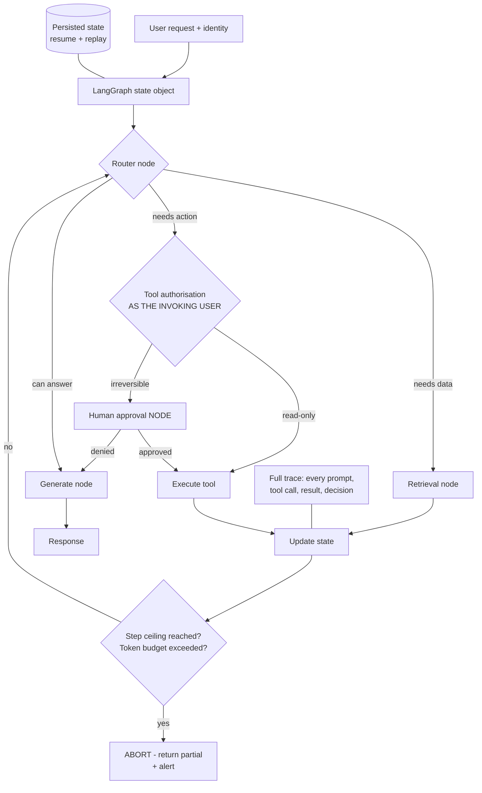

# Agent Orchestration with LangGraph: State, Guardrails and Tool Authorisation

**Level:** Advanced
**Tree:** [Production AI Systems](../README.md)
**Branch:** [Agent Runtime and Cost Control](README.md)
**Forest:** [AI & Intelligent Systems](../../../README.md)
**Readiness:** [Lab](../../../READINESS.md#lab) - checked offline, not yet run against a live service. A live run needs a local Ollama server, a Kubernetes cluster and a service you already operate.

## Explanation

### What separates a production agent from a demo

A demo agent calls a tool and returns an answer. A production agent needs **bounded
state, explicit termination, scoped authorisation and a full trace** - because an
unbounded loop is simultaneously a cost incident and an availability incident.

### Explicit state beats implicit conversation

**LangGraph** models the agent as a state graph: nodes perform work, conditional edges
decide transitions, and the state is an explicit object. That explicitness buys
properties that matter operationally - the run can be **persisted and resumed**,
a failed run can be **replayed**, human approval can be inserted as a **node**, and a
hard step ceiling is trivial to enforce. **CrewAI** expresses role-based crews quickly
and **AutoGen** suits exploratory multi-agent dialogue, but neither gives the same
control over the transition graph.

### The runaway loop

An agent that cannot achieve its goal will retry. Two agents that can delegate to each
other will ping-pong. Without a hard step ceiling and a per-run token budget this
consumes budget until someone notices - and the service is unavailable throughout.
**Both limits are non-negotiable regardless of framework.**

### Tool authorisation is the security boundary

An agent holding a service account that can do anything is a **confused deputy**:
prompt-inject the agent and you inherit its permissions. Tools must execute with the
authority of the **invoking user**, not a shared privileged identity, and any
irreversible action needs explicit confirmation. This is the first question a security
review will ask and the most common reason an agent project is blocked.

### Trace everything

Every prompt, tool call, tool result and routing decision. Without it, debugging a
wrong answer means guessing which of fifteen steps went wrong.

## Architecture and flow



## Commands

### Command 1

Install the graph orchestration layer

```text
pip install langgraph langchain-core
```

### Command 2

Verify the state graph primitive is available

```text
python -c "from langgraph.graph import StateGraph; print(StateGraph)"
```

### Command 3

Run the local development server with the graph inspector for visualising state transitions

```text
langgraph dev
```

### Command 4

Inspect guardrail enforcement in production logs - step and budget aborts should be visible and alerted

```text
kubectl logs -l app=agent --tail=200 | grep -E "step_count|token_budget|abort"
```

### Command 5

Retrieve a full run trace for debugging a wrong answer step by step

```text
curl -s localhost:8000/traces/<run_id> | jq ".steps[] | {node, tool, tokens}"
```

### Command 6

Retrieve the full step trace for a single agent run by run id - the primary debugging interface

```text
curl -s localhost:8000/runs/$RUN_ID/trace | jq ".steps[] | {node, tool, tokens}"
```

## Automation scripts

### guarded_agent.py

```python
#!/usr/bin/env python3
"""LangGraph agent with the guardrails a production deployment requires:
hard step ceiling, per-run token budget, user-scoped tool authorisation,
human approval for irreversible actions, and a full trace.
"""
from typing import TypedDict, List, Optional

from langgraph.graph import StateGraph, END

MAX_STEPS = 12
MAX_TOKENS = 40000
IRREVERSIBLE = {"delete_resource", "send_email", "restart_service", "issue_refund"}
# The most this AGENT may ever do, whoever invokes it. A tool outside the
# ceiling is denied even for a user who holds its scope, so an administrator's
# session does not widen what an injected instruction can reach.
AGENT_TOOL_CEILING = {"search_docs", "read_ticket", "send_email", "restart_service"}


class AgentState(TypedDict):
    request: str
    user_id: str            # the INVOKING user - tools run as this identity
    user_scopes: List[str]  # what THIS user may do, not what the agent may do
    steps: int
    tokens_used: int
    trace: List[dict]
    result: Optional[str]
    pending_action: Optional[dict]


def guard(state: AgentState) -> str:
    """Central guardrail. Checked on every transition, not just at entry."""
    if state["steps"] >= MAX_STEPS:
        state["result"] = "Aborted: step ceiling reached. Partial results returned."
        state["trace"].append({"event": "abort", "reason": "max_steps"})
        return "abort"

    if state["tokens_used"] >= MAX_TOKENS:
        state["result"] = "Aborted: token budget exhausted."
        state["trace"].append({"event": "abort", "reason": "max_tokens"})
        return "abort"

    return "continue"


def authorise(state: AgentState, tool: str) -> bool:
    """Tools execute with the INVOKING USER authority.

    An agent holding one privileged service account is a confused deputy:
    prompt-inject it and the attacker inherits everything it can reach.
    The effective scope is the agent ceiling intersected with the user's
    scopes: neither side alone can grant a tool.
    """
    user_tools = {s[len("tool:"):] for s in state["user_scopes"] if s.startswith("tool:")}
    return tool in AGENT_TOOL_CEILING & user_tools


def router(state: AgentState) -> AgentState:
    state["steps"] += 1
    state["trace"].append({"event": "route", "step": state["steps"]})
    return state


def call_tool(state: AgentState) -> AgentState:
    action = state.get("pending_action") or {}
    tool = action.get("tool", "")
    # Consume the action whatever the outcome, so a denial or an approval gate
    # ends the run instead of re-offering the same call until the step ceiling.
    state["pending_action"] = None

    if not authorise(state, tool):
        reason = "user_scope" if tool in AGENT_TOOL_CEILING else "agent_ceiling"
        state["trace"].append({"event": "denied", "tool": tool, "user": state["user_id"],
                               "reason": reason})
        state["result"] = "Not permitted: %s cannot use %s." % (
            "your account" if reason == "user_scope" else "this agent", tool)
        return state

    # Irreversible actions never execute without explicit human approval.
    if tool in IRREVERSIBLE and not action.get("approved"):
        state["trace"].append({"event": "approval_required", "tool": tool})
        state["result"] = "Approval required before %s can run." % tool
        return state

    state["trace"].append({"event": "tool_call", "tool": tool})
    # ... execute the tool as the invoking user ...
    return state


def generate(state: AgentState) -> AgentState:
    state["trace"].append({"event": "generate"})
    state["result"] = state.get("result") or "answer"
    return state


graph = StateGraph(AgentState)
graph.add_node("router", router)
graph.add_node("tool", call_tool)
graph.add_node("generate", generate)
graph.set_entry_point("router")

# The guard sits on the transition, so it cannot be bypassed by any path.
graph.add_conditional_edges(
    "router",
    lambda s: "abort" if guard(s) == "abort" else ("tool" if s.get("pending_action") else "generate"),
    {"tool": "tool", "generate": "generate", "abort": END},
)
graph.add_edge("tool", "router")
graph.add_edge("generate", END)

app = graph.compile()
```

## Lab

**Objective:** Build a guarded agent, then defeat an unguarded one - demonstrate a runaway loop, a confused-deputy privilege escalation via prompt injection, and prove the guardrails stop both.

### Steps

1. Build a simple LangGraph agent with a retrieval tool and an action tool, with no guardrails.
2. Give it a goal it cannot achieve and observe the retry loop. Measure tokens consumed before you stop it manually.
3. Add a hard step ceiling and a per-run token budget on the transition edge, and confirm the same request now aborts cleanly with partial results.
4. Give the agent a single privileged service account with broad permissions.
5. Craft a prompt injection in a retrieved document instructing the agent to call the restart action (`restart_service`, which is inside `AGENT_TOOL_CEILING`).
6. Observe the agent execute it - this is the confused deputy, and the agent behaved exactly as designed.
7. Change tool authorisation to use the invoking user scopes instead of the service account.
8. Repeat the injection with a user who lacks `tool:restart_service` and confirm the tool call is denied and traced with reason `user_scope`.
9. Change the injected instruction to call the delete action and run it as an administrator who holds `tool:delete_resource`, and confirm it is still denied with reason `agent_ceiling`, because delete_resource is outside `AGENT_TOOL_CEILING` whoever is signed in.
10. Add human approval as a node for irreversible actions, repeat the restart injection as a user who holds `tool:restart_service`, and confirm the agent halts awaiting approval (trace event `approval_required`) instead of restarting anything.
11. Persist state mid-run, kill the process, and resume from the persisted state.
12. Retrieve the full trace for a run and walk through every prompt, tool call and routing decision.

### Validation

- Unguarded agent demonstrably loops and burns budget.
- Guarded version aborts cleanly.
- Prompt injection succeeds against the service-account model and is denied under user-scoped authorisation, and the trace records reason `user_scope`.
- The delete injection run as an administrator is denied by the agent tool ceiling, and the trace records reason `agent_ceiling`.
- An in-ceiling irreversible action requested by a user who holds its scope halts for approval, and the trace records `approval_required` rather than `tool_call`.
- A killed run resumes from persisted state.

## Operational automation

### Automating agent operations

- **Enforce guardrails on the transition edge, not inside nodes.** A check inside one node
  is bypassed by any path that does not traverse it, silently, and the number of such
  paths grows as the graph does. On the edge it is an invariant a reviewer can verify by
  reading one piece of logic.
- **Emit step count and token usage as metrics** and alert on abort rate rather than
  treating aborts as routine. A rising rate means the agent is repeatedly being asked to
  do something it cannot, which is a design signal rather than a capacity one.
- **Derive tool scopes from the invoking user identity** at request time and never let the
  agent hold a static privileged credential. A successful prompt injection should be
  bounded by what that user could already have done themselves, and never more than the
  agent's own tool ceiling allows. When a user is present, call downstream services
  on-behalf-of that user with a delegated token; when the agent runs unattended, give it
  its own identity with roles assigned at resource scope (the one index, queue or account
  it touches) rather than resource group or subscription. Either way use short-lived
  tokens acquired per run, so a leaked or injected session loses its reach when the run ends.
- **Scope the human approval node to genuinely irreversible actions** - deleting data,
  spending money, external communication. An over-broad gate produces approval fatigue and
  converts the control into a rubber stamp, which is weaker than a narrow gate people read.
- **Persist state to a durable store** at each transition so long-running agents survive
  restarts and resume rather than restart, and record tool-call completion in that state so
  a resume cannot re-execute a side effect that already happened.
- **Ship traces to the observability stack** with the run id correlatable to the user
  request. Multi-step agents are frequently not reproducible, so the trace of the original
  run may be the only record that will ever exist.
- **Treat prompt injection tests as a permanent regression suite** and add every successful
  injection to it. Injection resistance degrades with each new tool and retrieved content
  source, so it needs continuous re-testing rather than a single review at launch.

## Troubleshooting

### Scenario 1: Agent token spend spikes unpredictably and some requests never return.

**Likely cause:** An unbounded retry loop, or two agents delegating to each other in a cycle.

**Resolution:** Add a hard step ceiling and a per-run token budget enforced on the transition edge, not inside a node that some paths can route around. Return partial results on abort rather than failing silently, so the caller gets something useful and the abort is visible. Alert on abort rate rather than treating aborts as routine - a rising rate means the agent is repeatedly being asked to do something it cannot, which is a design signal, not a capacity one.

### Scenario 2: Agent performed an action the requesting user is not authorised to perform.

**Likely cause:** Confused deputy - the agent used its own privileged service account rather than the invoking user's identity.

**Resolution:** Derive tool scopes from the invoking user at request time and require explicit confirmation for irreversible actions. Treat prompt injection in retrieved content as the expected delivery mechanism rather than an edge case, which means the authorisation boundary cannot depend on the agent behaving well or on instructions telling it to refuse. Audit what the service account can reach in the interim, since the exposure is its full permission set, not the single observed action. Platform guardrails at the tool call and tool response points (preview) are a complementary layer rather than a replacement: they scan content for risks rather than checking the user's authority, and they apply only to Foundry Agent Service agents, so this LangGraph agent keeps `authorise()` - see [Content Safety and Guardrails](../../ai-tree-applied-systems/ai-branch-agents-integration/ai-content-safety-guardrails.md#guardrails-are-layers-not-a-switch).

### Scenario 3: A wrong answer cannot be diagnosed because the reasoning path is opaque.

**Likely cause:** No trace of prompts, tool calls, results and routing decisions.

**Resolution:** Log every step with a correlatable run id and expose a trace view. Add this before the next incident rather than after, because multi-step agents are frequently not reproducible - nondeterministic generation means the same request can take a different path on replay, so the trace of the original run may be the only record that will ever exist.

### Scenario 4: The agent halts for approval so often that operators approve without reading.

**Likely cause:** The approval node is triggered by a category that is too broad, so routine reversible actions are queued alongside genuinely irreversible ones.

**Resolution:** Scope the human-in-the-loop node to actions that are actually irreversible or high-value - deleting data, spending money, sending external communication - and let reversible actions proceed under ordinary authorisation. Approval fatigue converts a control into a rubber stamp, so an over-broad gate is not a conservative choice; it is a weaker one than a narrow gate that operators still read.

### Scenario 5: A restarted agent repeats work it had already completed.

**Likely cause:** State held in process memory rather than persisted, so a restart loses the checkpoint and the run begins again from the start.

**Resolution:** Persist state to a durable store at each transition and resume from the last checkpoint rather than restarting. Make tool calls idempotent, or record their completion in the persisted state, so that resuming cannot re-execute a side effect that already happened - repeated work is wasteful, but a repeated irreversible action is an incident.

## Interview questions

### 1. Why choose LangGraph over a conversational agent framework for production?

Explicit state, and everything operational that follows from it. Modelling the agent as a state graph - nodes that perform work, conditional edges that decide transitions, and state as a first-class object - buys four properties that production depends on and that implicit conversation loops do not provide. The run can be persisted and resumed, so a long-running agent survives a pod restart instead of starting over. A failed run can be replayed from its recorded state, which is the difference between diagnosing an incident and speculating about it. Human approval becomes a node in the graph rather than a special case bolted onto the loop, so an irreversible action can halt cleanly and resume after sign-off. And a hard step ceiling is trivial to enforce on the transition, because there is a single place where every transition passes. CrewAI expresses role-based crews quickly and AutoGen suits exploratory multi-agent dialogue, and both are good at what they are for - but neither gives the same control over the transition graph, and that control is exactly what a production review asks about. I would prototype in whatever is fastest and rebuild on an explicit graph before anything is exposed to real users or real credentials.

### 2. What is the confused deputy problem in agent systems?

It is the situation where a privileged component acts on instructions from a less privileged source, and the classic AI instance is an agent holding a broad service account while acting on behalf of individual users. The agent can do everything the service account can do, so anyone who can influence its instructions inherits that authority. The realistic delivery mechanism is not a user typing something malicious - it is prompt injection arriving inside content the agent retrieves, a document, a ticket, a web page, which the agent reads as instruction rather than data. Once that happens the blast radius is the service account's permissions, not the requesting user's. The fix is architectural rather than behavioural: tools execute with the authority of the invoking user, derived from their identity at request time, so a successful injection is bounded by what that user could already have done themselves. Irreversible actions additionally require explicit confirmation. This is the first question a security review asks about an agent, and failing to have an answer is the most common reason such projects stall.

### 3. Why must guardrails sit on the transition rather than inside a node?

Because a check placed inside a node only runs when that node executes, and any path through the graph that routes around it bypasses the check entirely - silently, since nothing reports that a guardrail was skipped. As a graph grows and conditional edges multiply, the number of paths that avoid any particular node grows with it, so a guard that was effective when the graph had four nodes quietly stops being effective at fifteen. Enforcing the step ceiling and the per-run token budget on the conditional edge instead means every transition passes through the check by construction, regardless of which path the agent takes, which is what makes the bound an actual invariant rather than a convention. It also makes the guarantee reviewable: someone auditing the system can read the edge logic and know the ceiling holds, instead of tracing every possible route to confirm the checking node is unavoidable. The same reasoning applies to authorisation checks - anything that must always happen belongs where everything always passes.

### 4. How do you debug an agent that gave a wrong answer?

From the trace, which has to exist before the incident. I want every prompt, every tool call with its arguments, every tool result, and every routing decision for that run, all correlatable by a run id that also appears in the user-facing request. Without it, debugging a fifteen-step agent means guessing which step went wrong, and the guess is rarely recoverable because multi-step agents are often not reliably reproducible - nondeterministic generation means re-running the same request can take a different path entirely. That non-reproducibility is precisely why the trace is the primary debugging interface rather than optional instrumentation: it is frequently the only record of what actually happened, and there may be no way to obtain another one. In practice the trace also answers the attribution question quickly, because a wrong answer usually resolves to one of a few causes - a tool returned bad data, a routing decision took the wrong branch, or the model misread a correct tool result - and those look completely different in a trace while looking identical from the outside.

## Certification alignment

- **Microsoft Certified: Azure AI Apps and Agents Developer Associate (AI-103)** - Implement generative AI and agentic solutions: building a LangGraph state graph with router, tool and generate nodes, persisted state for resume and replay, and a hard step ceiling and per-run token budget on the transition edge.
- **Microsoft Certified: Multi-Agent AI Solutions Expert (AI-500, beta)** - Secure, govern, and deploy multi-agent solutions: tools that execute with the invoking user's authority rather than a shared service account, and a human approval node scoped to irreversible actions.
- **Vendor-neutral** - OWASP GenAI LLM Top 10 2026: LLM01:2026 Prompt Injection and LLM03:2026 Excessive Agency.
- **ISC2 Certified Information Systems Security Professional (CISSP)** - Domain 3 Security Architecture and Engineering: authorisation models and the confused deputy problem.
- **Vendor-neutral** - NIST AI RMF MANAGE function: bounding autonomy and documenting human oversight points.

## References

- [LangChain (LangGraph documentation): Persistence](https://docs.langchain.com/oss/python/langgraph/persistence) - LangGraph state graphs, checkpointing and persistence for resume and replay.
- [LangChain (LangGraph documentation): Interrupts](https://docs.langchain.com/oss/python/langgraph/interrupts) - Human-in-the-loop approval patterns in LangGraph.
- [OWASP Gen AI Security Project: OWASP GenAI LLM Top 10 2026](https://genai.owasp.org/resource/owasp-genai-llm-top-10-2026/) - LLM01:2026 Prompt Injection and Excessive Agency risks for tool-using agents.
- [Model Context Protocol: Authorization - Model Context Protocol](https://modelcontextprotocol.io/specification/2026-07-28/basic/authorization) - MCP authorisation boundaries for tools exposed to agents.
- [Microsoft Learn: How toolbox authentication works in Microsoft Foundry](https://learn.microsoft.com/azure/foundry/agents/how-to/tools/tool-authentication) - Agent tool calling with identity-scoped (per-user) access instead of a shared service account.
- [Microsoft Learn: Agent identity concepts in Microsoft Foundry](https://learn.microsoft.com/azure/foundry/agents/concepts/agent-identity) - Identity-scoped access for agents via the on-behalf-of flow, and resource-scoped roles for an agent's own identity instead of subscription-wide access.
- [Microsoft Learn: Guardrails and controls overview in Microsoft Foundry](https://learn.microsoft.com/azure/foundry/guardrails/guardrails-overview) - Tool call and tool response intervention points (preview) that apply only to Foundry Agent Service agents, as a layer beside edge authorisation.
- [Microsoft Learn: Defend against indirect prompt injection attacks](https://learn.microsoft.com/security/zero-trust/sfi/defend-indirect-prompt-injection) - Least privilege with short-lived privileges and human approval as layered defences against injected instructions.
- [National Institute of Standards and Technology (NIST AI 100-1): Artificial Intelligence Risk Management Framework (AI RMF 1.0)](https://doi.org/10.6028/NIST.AI.100-1) - MANAGE function guidance on bounding autonomy and human oversight.

## Suggested video search

LangGraph state machine agent guardrails tool authorisation confused deputy human in the loop

---

> Validate commands, versions, permissions, licensing, and rollback procedures in an isolated lab before production use.
