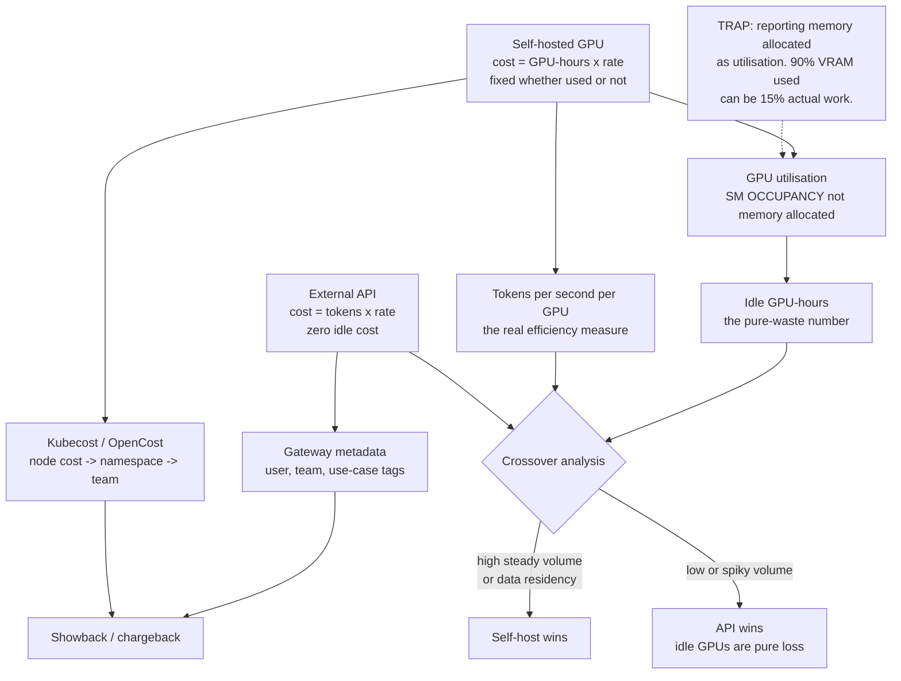

# AI FinOps: Token Cost Attribution, GPU Utilisation and Build-versus-Buy Crossover

**Level:** Advanced
**Tree:** [Production AI Systems](../README.md)
**Branch:** [Agent Runtime and Cost Control](README.md)
**Forest:** [AI & Intelligent Systems](../../../README.md)

## Explanation

### Two cost models that must not be blended

External API models cost **per token** and scale with use - zero traffic costs nothing.
Self-hosted models cost **per GPU-hour** and are fixed whether used or not. Reporting
them as one number produces an AI budget nobody can explain or act on.

### Attribution requires identity at the gateway

Cost can only be attributed if the gateway records **who** made each request. That means
the portal must forward end-user identity rather than calling with one shared service
token. Without it every request looks like the same caller and showback is impossible.
On the self-hosted side, Kubecost or OpenCost maps GPU node cost to namespace to team.

### The measurement trap

Teams report **GPU memory allocated** as utilisation. A model can occupy ninety percent
of VRAM while computing almost nothing. Memory allocated is not work done. Measure **SM
occupancy and tokens per second**, or you will conclude that a cluster running at
fifteen percent is full and buy more.

### Idle GPU-hours is the number that matters

An H100 sitting idle overnight costs exactly what one at full utilisation costs. Idle
GPU-hours is usually the largest available saving and is almost never on a dashboard.
Batch overnight work, consolidate with MIG, or scale to zero - but **measure it first**,
because most teams have never quantified it.

### The crossover

Self-hosting wins on high, steady volume and when data must not leave the boundary. APIs
win on low or spiky volume, because idle GPUs are pure loss. Compute the crossover from
measured tokens per second and actual utilisation rather than from list prices - the
honest calculation frequently shows a self-hosted deployment losing money.

## Architecture and flow



## Commands

### Command 1

Sample real SM utilisation alongside memory - the two diverge, and the divergence is the point

```text
nvidia-smi --query-gpu=index,utilization.gpu,memory.used,memory.total --format=csv -l 10
```

### Command 2

Kubecost namespace cost breakdown including GPU allocation over a window

```text
kubectl cost namespace --window 7d --show-gpu
```

### Command 3

Query DCGM GPU utilisation from Prometheus for time-series analysis rather than point sampling

```text
curl -s localhost:9090/api/v1/query --data-urlencode "query=DCGM_FI_DEV_GPU_UTIL" | jq ".data.result[]"
```

### Command 4

LiteLLM per-user spend aggregation - requires the gateway to receive end-user identity

```text
curl -s localhost:4000/spend/logs | jq "group_by(.user) | map({user: .[0].user, spend: map(.spend) | add})"
```

### Command 5

Count pods holding GPU requests, to compare allocation against measured utilisation

```text
kubectl get pods -A -o json | jq "[.items[] | select(.spec.containers[].resources.requests[\"nvidia.com/gpu\"])] | length"
```

### Command 6

Accumulate idle GPU-hours over a week - the pure-waste figure that utilisation dashboards never surface

```text
curl -s localhost:9090/api/v1/query --data-urlencode "query=sum(count_over_time((DCGM_FI_DEV_GPU_UTIL < 5)[7d:1m])) / 60" | jq ".data.result[].value[1]"
```

## Automation scripts

### ai_cost_crossover.py

```python
#!/usr/bin/env python3
"""Build-versus-buy crossover for LLM serving.
Uses MEASURED throughput and utilisation, not list prices and peak specs.
"""
import argparse

p = argparse.ArgumentParser()
p.add_argument("--gpu-hourly", type=float, required=True, help="cost per GPU-hour")
p.add_argument("--gpus", type=int, default=1)
p.add_argument("--measured-tps", type=float, required=True,
               help="MEASURED output tokens/sec at production batch, not peak")
p.add_argument("--utilisation", type=float, required=True,
               help="fraction of hours the GPU is actually serving (0-1)")
p.add_argument("--api-per-mtok", type=float, required=True,
               help="API cost per million output tokens")
p.add_argument("--monthly-tokens-m", type=float, required=True,
               help="monthly output tokens in millions")
a = p.parse_args()

HOURS = 730.0

# Self-hosted cost is fixed: you pay for every hour, used or not.
self_cost = a.gpu_hourly * a.gpus * HOURS

# Capacity at measured throughput, derated by actual utilisation.
capacity_m = (a.measured_tps * 3600 * HOURS * a.gpus * a.utilisation) / 1e6

api_cost = a.monthly_tokens_m * a.api_per_mtok

print("Monthly comparison")
print("  self-hosted fixed cost : %10.2f" % self_cost)
print("  self-hosted capacity   : %10.1f M tokens (at %.0f%% utilisation)"
      % (capacity_m, a.utilisation * 100))
print("  actual demand          : %10.1f M tokens" % a.monthly_tokens_m)
print("  API cost for demand    : %10.2f" % api_cost)
print("")

if a.monthly_tokens_m > capacity_m:
    print("  WARNING demand EXCEEDS self-hosted capacity at measured throughput.")
    print("          You would need more GPUs, or overflow to an API.")
    print("")

# Effective unit cost is what makes the comparison honest.
served = min(a.monthly_tokens_m, capacity_m)
if served > 0:
    eff = self_cost / served
    print("  effective self-hosted cost: %.2f per M tokens" % eff)
    print("  API cost                  : %.2f per M tokens" % a.api_per_mtok)
    print("")
    if eff < a.api_per_mtok:
        print("  RESULT self-hosting is cheaper at this volume and utilisation.")
    else:
        print("  RESULT API is cheaper. Self-hosting loses money here -")
        print("         you are paying for idle capacity.")

# Idle cost, stated plainly. This is usually the largest saving available.
idle_cost = self_cost * (1.0 - a.utilisation)
print("")
print("  idle GPU cost/month    : %10.2f  (%.0f%% of spend buys nothing)"
      % (idle_cost, (1.0 - a.utilisation) * 100))
print("  Address it by batching, MIG consolidation, or scale-to-zero -")
print("  but only after measuring it.")
```

## Lab

**Objective:** Instrument a self-hosted model for true cost, expose the memory-versus-occupancy trap with measurement, and compute an honest build-versus-buy crossover.

### Steps

1. Deploy a model on a GPU node and drive it with representative production traffic.
2. Record GPU memory used and SM utilisation simultaneously over an hour.
3. Confirm the divergence: memory can sit near ninety percent while SM occupancy is far lower.
4. Measure sustained output tokens per second at production batch size, not at peak benchmark settings.
5. Deploy Kubecost or OpenCost and attribute GPU node cost to the serving namespace.
6. Configure the AI gateway to record end-user identity and produce per-user token spend.
7. Compute utilisation as the fraction of hours the GPU is actually serving.
8. Run the crossover script with measured throughput and utilisation, and compare against API pricing for the same volume.
9. Repeat the calculation with peak benchmark throughput and one hundred percent utilisation, and compare the two conclusions.
10. Quantify idle GPU cost per month and identify which of batching, MIG consolidation or scale-to-zero applies.

### Validation

- Memory-versus-occupancy divergence is demonstrated with data.
- Per-user token spend is attributable.
- The crossover computed from measured values differs materially from the one computed from peak specs.
- Idle GPU cost is quantified in currency.
- Idle GPU-hours are reported in currency per month rather than as a utilisation percentage.

## Operational automation

### Automating AI cost management

- **Tag every gateway request** with user, team and use-case at call time. Attribution
  cannot be reconstructed retrospectively because the identity was never recorded, so a
  gateway that accepts one shared service token has already lost the data permanently.
- **Export DCGM GPU metrics to Prometheus** and dashboard SM occupancy as a separate
  series from memory allocated. Presenting them together, or averaging them into one
  "GPU utilisation" figure, is exactly how the measurement trap persists through
  successive capacity reviews.
- **Alert on idle GPU-hours crossing a threshold**, not merely on high utilisation.
  Standard monitoring answers "is this busy now" and therefore never accumulates the cost
  of hours when nothing ran, which is the expensive failure mode and usually the largest
  single saving in the estate.
- **Re-run the crossover calculation quarterly** as a scheduled job rather than a
  one-off business case. API pricing falls regularly and utilisation drifts as workloads
  move, so a self-hosting decision that was correct two years ago may now be losing
  money every month it goes unreviewed.
- **Enforce per-team token budgets at the gateway** with alerting well before hard
  limits, so a runaway agent or retry loop surfaces as a notification rather than an
  invoice. Pair the budget with per-request step and cost caps for agent workloads,
  which are the usual source of unbounded spend.
- **Publish showback monthly to the teams themselves**, not only to finance. Cost that
  is visible to the engineers who generate it drives prompt and routing changes that no
  central optimisation effort will find, and it converts cost control from a policing
  exercise into ordinary engineering feedback.

## Troubleshooting

### Scenario 1: GPU dashboard shows 90 percent utilisation but throughput is far below expectation.

**Likely cause:** The dashboard reports memory allocated rather than SM occupancy.

**Resolution:** Instrument SM occupancy via DCGM and display it as a separate series from memory, never averaged with it. A served model reserves VRAM for weights and KV cache at load time and holds it regardless of traffic, so memory allocated says nothing about work done. Confirm the divergence by sampling both under real traffic for an hour before acting, then decide on consolidation from the occupancy line rather than approving a purchase from the memory line.

### Scenario 2: AI spend cannot be attributed to any team.

**Likely cause:** The portal calls the gateway with one shared service token, so every request appears to come from the same caller.

**Resolution:** Forward end-user identity from the portal to the gateway and tag every request with user, team and use-case at call time. Attribution cannot be reconstructed after the fact - the information simply was not recorded - so this must be in place before the spend occurs, not added once finance asks. On the self-hosted side, map GPU node cost to namespace to team with Kubecost or OpenCost so both halves of the estate resolve to the same team names.

### Scenario 3: Self-hosted deployment was justified on cost but spend is higher than the API alternative.

**Likely cause:** The business case used peak benchmark throughput and assumed full utilisation.

**Resolution:** Recompute with sustained throughput at production batch size and measured utilisation over a period that includes nights and weekends. Effective cost per million tokens at forty percent utilisation is roughly two and a half times the full-utilisation figure, which is usually what reverses the conclusion. Present both calculations side by side so the review can see which assumption did the work, then decide between raising utilisation and returning the workload to an API.

### Scenario 4: Token spend triples overnight with no increase in users.

**Likely cause:** An agent or retry loop is calling the model repeatedly without a budget ceiling, often after a downstream failure turns into an unbounded retry.

**Resolution:** Enforce per-team and per-key token budgets at the gateway with alerting thresholds well below the hard limit, so a runaway workload is a notification rather than an invoice. Add per-request step and cost caps for agent workloads specifically, since a looping agent is the common cause. Investigate using the gateway spend log grouped by user and time bucket, which localises the offending caller in one query when identity is being recorded.

### Scenario 5: Team chargeback figures do not reconcile with the cloud invoice.

**Likely cause:** Shared and idle costs are unallocated - gateway infrastructure, storage, and the idle fraction of GPU nodes belong to no team, so the sum of team charges is systematically below the invoice.

**Resolution:** Decide and document an allocation policy for unattributed cost rather than leaving it to reconcile by accident: either distribute it proportionally to measured usage or hold it in a named platform cost centre. Publish idle GPU cost as its own line in that cost centre rather than spreading it silently, because visible idle cost is what motivates the consolidation work that removes it.

## Interview questions

### 1. Why must API and self-hosted costs be reported separately?

Because they are different cost functions and the levers that reduce them do not overlap. API spend is variable: it is tokens multiplied by a rate, it scales with use, and zero traffic genuinely costs zero. Self-hosted spend is fixed: it is GPU-hours multiplied by a rate, and the meter runs identically whether the cluster is saturated or idle overnight. Blending them into a single "AI spend" line produces a number that no one can act on, because reducing API cost means prompt and routing work - shorter system prompts, caching, routing simple classification to a small model - while reducing self-hosted cost means utilisation work: batching, consolidating with MIG, or scaling to zero. A finance stakeholder looking at one blended figure cannot tell which lever applies, and the usual outcome is that someone proposes the wrong one. I report them as two lines with two different units, per-million-tokens for API and per-GPU-hour for self-hosted, and only convert to a common effective cost per million tokens at the very end, for the crossover comparison, where I state the utilisation assumption explicitly alongside the number.

### 2. What is wrong with reporting GPU memory as utilisation?

Memory allocated is not work done, and conflating them is the most expensive measurement error in AI infrastructure. A served model reserves VRAM for its weights and its KV cache at load time and holds that reservation for as long as the process lives, whether requests are arriving or not. So memory can read ninety percent while SM occupancy - the fraction of streaming multiprocessors actually executing - sits at fifteen percent. The standard failure is a capacity review where the dashboard shows a nearly full cluster, the team concludes it is out of headroom, and the organisation buys GPUs it does not need while the existing fleet is mostly idle. The fix is to instrument SM occupancy through DCGM and put it on the dashboard as a separate series from memory, never averaged together, plus tokens per second as the throughput measure that finance can actually reason about. When I inherit a GPU estate the first thing I do is sample both for an hour under real traffic and show the divergence, because the gap between the two lines is usually the entire business case for consolidation.

### 3. How do you compute an honest build-versus-buy crossover?

From measured values, not from vendor benchmarks. Two inputs are almost always inflated in a business case: throughput and utilisation. Throughput must be sustained output tokens per second at the batch size and sequence length the workload actually produces, not a peak figure from a benchmark run with an ideal batch and short outputs. Utilisation must be the fraction of hours the GPU is genuinely serving, measured over a representative period including nights and weekends, not an assumption of full usage. The effective cost per million tokens is the fixed GPU cost divided by the tokens actually served in that period, so utilisation enters as a divisor: at forty percent utilisation the effective cost is roughly two and a half times the full-utilisation figure. That correction frequently reverses the decision on its own. I compute it both ways deliberately - once with peak specs and full utilisation, once with measured values - and present the two side by side, because showing that the optimistic version is the one that justified the purchase is far more persuasive in a review than presenting only the corrected number.

### 4. What is the single most valuable AI cost metric?

Idle GPU-hours, expressed in currency rather than percent. An idle H100 costs exactly what a saturated one costs, so idle time is pure waste with no offsetting output, and in most estates it is the largest single saving available. It is also almost never on a dashboard, because conventional monitoring is built to answer "is this busy right now" and therefore reports utilisation while work is happening rather than accumulating the cost of hours when nothing was. Converting it to money is what makes it actionable: "the cluster averages thirty-eight percent utilisation" produces a shrug, while "we spend roughly eleven thousand a month on GPUs that serve no requests" produces a decision. Once it is quantified the remedies are ordinary capacity engineering - shift batch and evaluation work onto the idle window, consolidate several small models onto one GPU with MIG, or scale the deployment to zero outside business hours where cold-start latency is acceptable. The measurement has to come first, though, because which remedy applies depends entirely on the shape of the idle time.

## Certification alignment

- FinOps Certified Practitioner - cloud cost allocation, showback and chargeback models
- FinOps Certified Practitioner - the Inform, Optimize and Operate phases applied to variable AI spend
- NVIDIA Certified Associate: AI Infrastructure and Operations - GPU telemetry, monitoring and utilisation measurement
- AZ-305 Designing Microsoft Azure Infrastructure Solutions - design for cost optimisation and capacity planning
- Vendor-neutral - FinOps Foundation Cloud Cost Allocation and unit-economics practice applied to tokens and GPU-hours

## References

- FinOps Foundation - cloud cost allocation, showback and chargeback practices
- FinOps Foundation - unit economics and the Inform/Optimize/Operate lifecycle
- NVIDIA DCGM documentation - GPU telemetry, SM occupancy and utilisation metrics
- Kubecost and OpenCost documentation - GPU cost allocation and namespace attribution in Kubernetes
- Microsoft Learn - Azure OpenAI provisioned throughput units versus pay-as-you-go token billing

## Suggested video search

AI FinOps GPU utilisation Kubecost token cost attribution build versus buy LLM

---

> Validate commands, versions, permissions, licensing, and rollback procedures in an isolated lab before production use.
