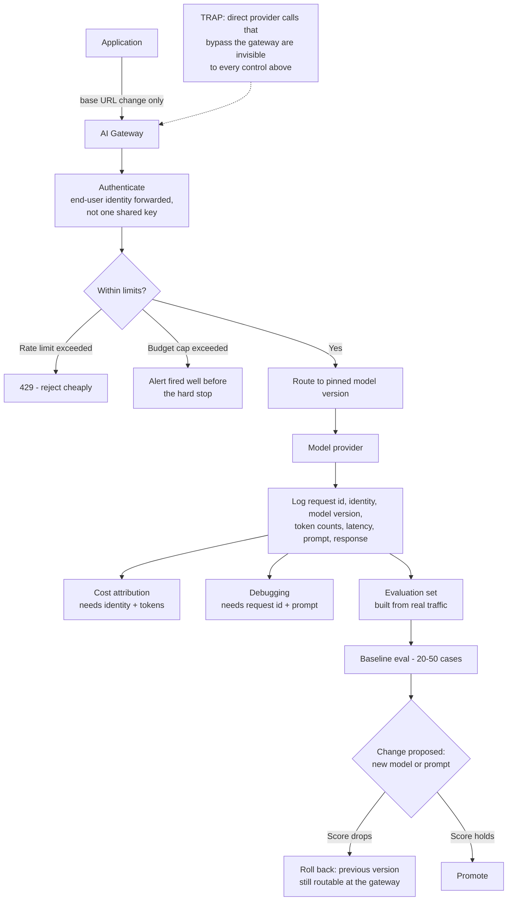

# From Prototype to Production: Gateway, Limits, Logging and Rollback

**Level:** Beginner
**Tree:** [Production AI Systems](../README.md)
**Branch:** [Agent Runtime and Cost Control](README.md)
**Forest:** [AI & Intelligent Systems](../../../README.md)

## Explanation

### Production is a set of boundaries, not a bigger model

The prototype that impressed everyone almost certainly calls the model provider directly
from application code using a shared API key held in an environment variable. Nothing
about that is wrong for a demo, and nothing about it survives contact with real users.
What changes on the way to production is not the model - it is that six boundaries get
drawn around it. Every advanced topic in this tree plugs into those boundaries, so
getting them in place first is what makes the rest possible rather than theoretical.

### The gateway is the control point

Put an **AI gateway** between your application and the model provider: LiteLLM, Azure API
Management, or the provider's own gateway product. This single change is what turns a
scattering of direct calls into something governable, because the gateway is where
authentication, rate limits, budget caps, logging and model routing all live. Without
it, each of those has to be implemented in every application separately - and in
practice that means implemented in none of them. The application's only change is a base
URL, since gateways expose an OpenAI-compatible route.

### Log the six fields that make everything else possible

For every request record the **request id, end-user identity, model name and version,
input and output token counts, latency, and the prompt and response**. This is not
optional instrumentation, it is the substrate: cost attribution needs identity and
tokens, debugging needs the request id and the prompt, and evaluation needs real
production examples to build a test set from. None of it can be reconstructed later,
because the data was simply never recorded.

### Limits before launch, not after the first invoice

Three caps belong in place before the first real user arrives: a **per-user rate limit**,
a **per-team budget cap** with an alerting threshold well below the hard stop, and a
**per-request token and timeout cap**. The classic first incident is not a security
breach - it is a retry loop or an enthusiastic script running overnight and producing an
invoice nobody can explain.

### Pin the version, keep a way back

Model versions change behaviour, and a provider updating a model underneath you is a
change you did not make and cannot review. Pin the exact version, keep the previous one
routable at the gateway, and decide in advance what triggers a rollback. Then write a
small evaluation set - **twenty to fifty real cases is enough** - because without it,
"the new model seems worse" is an argument rather than a measurement.

## Architecture and flow



## Commands

### Command 1

Call the model through the gateway, forwarding end-user identity rather than a shared service token

```text
curl -s localhost:4000/v1/chat/completions -H "Authorization: Bearer $KEY" -H "x-end-user: alice@example.com" -d "{\"model\":\"gpt-4o\",\"messages\":[{\"role\":\"user\",\"content\":\"ping\"}]}"
```

### Command 2

Read the rate-limit headers the gateway returns, which is how the application learns it is being throttled

```text
curl -si localhost:4000/v1/chat/completions -H "Authorization: Bearer $KEY" -d "$BODY" | grep -i "x-ratelimit"
```

### Command 3

Aggregate spend per end user - the query that is impossible without identity at the gateway

```text
curl -s localhost:4000/spend/logs | jq "group_by(.user) | map({user: .[0].user, spend: (map(.spend) | add)})"
```

### Command 4

Confirm which model version is actually being served, rather than which one you believe is configured

```text
curl -s localhost:4000/model/info | jq ".data[] | {model_name, litellm_params: .litellm_params.model}"
```

### Command 5

Retrieve one request end to end by its id, which is the whole point of recording it

```text
curl -s "localhost:4000/spend/logs?request_id=$REQUEST_ID" | jq ".[0] | {user, model, total_tokens, response_time}"
```

### Command 6

Prove the provider is unreachable except through the gateway - the control that makes all the others real

```text
curl -s -o /dev/null -w "%{http_code}\n" --max-time 5 https://api.openai.com/v1/models -H "Authorization: Bearer $DIRECT_KEY"
```

## Automation scripts

### readiness_check.py

The six boundaries are easy to agree with and easy to skip, and the usual discovery is
an incident. This probes a deployed endpoint for each one and prints a verdict, so
"is this ready for users?" has an answer that is not an opinion.

```python
#!/usr/bin/env python3
"""Probe a deployed AI endpoint for the boundaries production requires.

Each check answers one question a reviewer would otherwise have to ask, and
answers it against the running service rather than the intended design.
"""
import os
import sys
import time

import requests

GATEWAY = os.environ["GATEWAY_URL"]
KEY = os.environ["GATEWAY_KEY"]
BODY = {"model": "gpt-4o", "messages": [{"role": "user", "content": "ping"}], "max_tokens": 8}


def call(headers=None, body=None):
    return requests.post(
        f"{GATEWAY}/v1/chat/completions",
        headers={"Authorization": f"Bearer {KEY}", **(headers or {})},
        json=body or BODY,
        timeout=30,
    )


def check_auth_required():
    r = requests.post(f"{GATEWAY}/v1/chat/completions", json=BODY, timeout=30)
    return r.status_code in (401, 403), f"unauthenticated request returned {r.status_code}, expected 401/403"


def check_identity_recorded():
    marker = f"readiness-{int(time.time())}"
    r = call(headers={"x-end-user": marker})
    if r.status_code != 200:
        return False, f"identity-tagged request failed: {r.status_code}"
    logs = requests.get(f"{GATEWAY}/spend/logs", headers={"Authorization": f"Bearer {KEY}"}, timeout=30)
    found = marker in logs.text
    return found, "end-user identity is not present in the spend log; cost cannot be attributed"


def check_rate_limit_advertised():
    r = call()
    headers = {k.lower() for k in r.headers}
    present = any(h.startswith("x-ratelimit") for h in headers)
    return present, "no x-ratelimit headers; callers cannot tell they are being throttled"


def check_request_id():
    r = call()
    present = any(k.lower() in ("x-request-id", "x-litellm-call-id") for k in r.headers)
    return present, "no request id returned; a report of a bad answer cannot be traced to a request"


def check_token_cap_enforced():
    """A request asking for far more than the cap should be rejected or truncated."""
    r = call(body={**BODY, "max_tokens": 1_000_000})
    return r.status_code != 200 or r.json().get("usage", {}).get("completion_tokens", 0) < 10_000, (
        "an unbounded max_tokens request was served in full; per-request cost is uncapped"
    )


def check_model_version_pinned():
    r = requests.get(f"{GATEWAY}/model/info", headers={"Authorization": f"Bearer {KEY}"}, timeout=30)
    models = [m.get("litellm_params", {}).get("model", "") for m in r.json().get("data", [])]
    floating = [m for m in models if m and not any(c.isdigit() for c in m.split("/")[-1])]
    return not floating, f"model(s) configured without a pinned version: {floating}"


CHECKS = [
    ("authentication required", check_auth_required),
    ("end-user identity recorded", check_identity_recorded),
    ("rate limit advertised", check_rate_limit_advertised),
    ("request id returned", check_request_id),
    ("per-request token cap", check_token_cap_enforced),
    ("model version pinned", check_model_version_pinned),
]


def main():
    failures = 0
    for name, check in CHECKS:
        try:
            ok, detail = check()
        except Exception as error:  # a check that cannot run is not a pass
            ok, detail = False, f"check errored: {error}"
        print(f"{'PASS' if ok else 'FAIL'}  {name}" + ("" if ok else f"\n      {detail}"))
        failures += 0 if ok else 1
    print(f"\n{len(CHECKS) - failures}/{len(CHECKS)} boundaries in place")
    return 1 if failures else 0


if __name__ == "__main__":
    sys.exit(main())
```

## Lab

**Objective:** Take a working prototype that calls a model provider directly and put the six production boundaries around it, proving each one by observing it hold rather than by configuring it and assuming.

### Steps

1. Start from a prototype that calls the provider directly with a shared key held in an environment variable, and confirm it works.
2. Deploy an AI gateway - LiteLLM is sufficient for the lab - configured with one pinned model version.
3. Repoint the application at the gateway by changing only the base URL, and confirm behaviour is unchanged.
4. Revoke the application's direct provider key and confirm the direct call now fails while the gateway call still succeeds.
5. Configure the gateway to require authentication and to forward end-user identity from the application rather than calling with one shared token.
6. Set a per-user rate limit low enough to trigger deliberately, drive it, and observe the 429 and the rate-limit headers.
7. Set a per-team budget cap with an alert threshold below it, drive spend past the alert, and confirm the alert fires before the hard stop.
8. Send a request with a deliberately unbounded max_tokens and confirm the per-request cap rejects or truncates it.
9. Build a 20 to 50 case evaluation set from real logged requests and record the baseline score.
10. Switch the gateway to a different model version, re-run the evaluation, observe the score change, and roll back by routing to the previous pinned version.

### Validation

- The direct provider call fails and the gateway call succeeds, proving the gateway is not merely preferred but the only path.
- Per-user spend is attributable from the logs, which requires identity to have been forwarded at call time.
- The rate limit, budget alert and per-request token cap are each demonstrated by triggering them, not by reading the configuration.
- A request is retrieved end to end from its request id, including prompt, response, model version and token counts.
- Rollback to the previous model version is completed by routing change alone, with the evaluation score recorded before and after.
- `readiness_check.py` reports six of six boundaries in place against the finished deployment.

## Operational automation

### Automating the production boundaries

- **Make the gateway the only route by revoking direct provider keys**, not by asking
  teams to use it. A boundary that depends on everyone remembering is not a boundary,
  and one application calling the provider directly is invisible to every control you
  have built.
- **Run the readiness check in the deployment pipeline**, so a service cannot reach real
  users with a boundary missing. Each check probes the running deployment rather than
  the intended configuration, which is the difference between believing a limit exists
  and knowing it does.
- **Alert on the budget threshold, not only the hard cap.** A hard stop that fires with
  no warning is an outage; a threshold alert at seventy or eighty percent is a
  conversation. Both should exist, and the alert is the one that prevents incidents.
- **Pin model versions in configuration and treat a version change as a deployment**,
  with the same review and rollback expectations as a code change. A provider updating a
  model underneath you is a behaviour change nobody reviewed.
- **Grow the evaluation set from production logs automatically.** Every reported bad
  answer becomes a case, which is what keeps the set representative of what users
  actually ask rather than what the team imagined at launch.
- **Set log retention deliberately**, because these logs contain user prompts. Decide the
  period, apply redaction where the data class requires it, and record that decision -
  the same logging that makes debugging and cost attribution possible also creates a
  data-protection obligation.

## Troubleshooting

### Scenario 1: Spend appears on the invoice that no team recognises.

**Likely cause:** An application is calling the model provider directly rather than through the gateway, so its usage is billed but never attributed.

**Resolution:** Revoke direct provider keys so the gateway is the only route, and reconcile gateway-recorded spend against the provider invoice on a schedule - a persistent gap is the signature of a bypass. Attribution cannot be reconstructed for spend already incurred, because the identity was never recorded, so the fix prevents recurrence rather than explaining the current bill.

### Scenario 2: A user reports a bad answer and nobody can find the request.

**Likely cause:** No request id was recorded or returned, so a user report cannot be connected to what the system actually did.

**Resolution:** Return a request id to the application on every call and surface it in the interface, so a report arrives with the id attached. Log the prompt, response, model version and token counts against it. Without this, debugging consists of trying to guess the prompt from a paraphrased complaint, and the model may not reproduce the answer even given the same input.

### Scenario 3: Answers got noticeably worse and no deployment happened.

**Likely cause:** The model version was not pinned, and the provider updated the model underneath the service.

**Resolution:** Pin the exact version in the gateway configuration and treat version changes as reviewed deployments. Re-run the evaluation baseline to quantify the change rather than debating it, and roll back by routing to the previous pinned version. If no baseline exists this is unresolvable by measurement, which is the argument for building one before it is needed.

### Scenario 4: Cost tripled overnight with no new users.

**Likely cause:** A retry loop or an unattended script, with no per-request or per-team cap to bound it.

**Resolution:** Set a per-request token and timeout cap, a per-user rate limit, and a per-team budget cap with an alert threshold well below the hard stop. Group the spend log by user and hour to localise the source, which takes one query when identity is being recorded. Treat the absence of a cap as the root cause rather than the loop itself - loops are inevitable, unbounded loops are a configuration choice.

### Scenario 5: The team wants to change the prompt but cannot say whether it is an improvement.

**Likely cause:** No evaluation baseline, so quality is whatever the last person to test it thought.

**Resolution:** Build a set of twenty to fifty real cases from production logs with expected outcomes, and record a baseline score before the change. This is small enough to assemble in an afternoon and is the difference between a reviewable change and an argument. Grow it from reported failures thereafter, so it tracks what users actually ask rather than what the team imagined at launch.

## Interview questions

### 1. A prototype works and the team wants to ship it next week. What do you require first?

Six boundaries, and none of them involve changing the model. An AI gateway between the application and the provider, so there is one place where controls exist rather than a control implemented separately in every application - which in practice means implemented in none. End-user identity forwarded to that gateway rather than one shared service token, because attribution cannot be reconstructed afterwards; the information was simply never recorded. Structured logging of request id, identity, model version, token counts, latency, prompt and response, which is the substrate that debugging, cost attribution and evaluation all draw on. Three caps - per-user rate limit, per-team budget with an alert well below the hard stop, and a per-request token and timeout limit. A pinned model version with the previous one still routable. And a small evaluation baseline, twenty to fifty real cases, because otherwise every future change is an argument. I would rather ship a week later with these than ship on time and spend that week reconstructing what happened during the first incident.

### 2. Why does the gateway matter more than any individual control it enforces?

Because it changes where controls can exist at all. Without it, a rate limit or a budget cap or a logging standard has to be implemented in every application that calls a model, by every team, consistently, forever - and the first team that skips it is invisible to all of them. The gateway collapses that into one enforcement point that every request passes through, so adding a control later is a configuration change rather than a coordinated engineering effort across services. It also makes the model provider replaceable, since applications address the gateway rather than a vendor endpoint. The critical detail is that the gateway must be the *only* route: if direct provider keys still work, teams will use them, usually for a good reason under deadline, and that traffic is then invisible to every control you built. So revoking direct keys is not bureaucratic tidiness - it is what converts the gateway from a recommendation into a boundary.

### 3. What is the minimum useful evaluation set, and why build one before you need it?

Twenty to fifty real cases with expected outcomes, drawn from production logs rather than invented. That is small enough to assemble in an afternoon and large enough to catch the regressions that matter, and its value is not the absolute score but the comparison it makes possible. Build it before you need it because the moment you need it is the moment you cannot: a provider has changed a model, or someone edited the system prompt, answers seem worse, and without a baseline the conversation is entirely subjective - one person's impression against another's. With a baseline the same question takes an hour and produces a number. It also changes what a bug report is worth: every reported bad answer becomes a permanent case, so the set tracks what users actually ask rather than what the team imagined at launch. The common objection is that a small set is unrigorous, but the alternative in practice is not a rigorous large set - it is nothing.

### 4. What is the first production incident you expect, and how do you prevent it?

Unbounded spend, and it is almost never malicious. The usual shape is a retry loop that treats a timeout as a reason to call again, or an unattended script left running over a weekend, and it is discovered on an invoice rather than a dashboard. Prevention is three caps that cost nothing to set: a per-request token and timeout limit so no single call can be arbitrarily expensive, a per-user rate limit so no single caller can drive unlimited volume, and a per-team budget cap with an alert threshold well below the hard stop. The threshold alert matters more than the cap: a hard stop with no warning is an outage, while an alert at seventy percent is a conversation. I would also make identity mandatory at the gateway from day one, because when this does happen, the difference between a five-minute investigation and a five-day one is whether the spend log can be grouped by user.

## Certification alignment

- AI-102 Azure AI Engineer Associate - secure and monitor generative AI solutions, including managing access to endpoints
- AZ-104 Microsoft Azure Administrator - API Management, authentication and monitoring fundamentals
- AWS Certified AI Practitioner - responsible deployment, guardrails and operational controls for AI services
- FinOps Certified Practitioner - showback, budget alerting and per-team cost attribution
- Vendor-neutral - NIST AI RMF GOVERN and MANAGE functions: documented controls and oversight before deployment

## References

- LiteLLM documentation - proxy configuration, virtual keys, budgets and rate limits
- Microsoft Learn - Azure API Management as a gateway for Azure OpenAI, including token limit policies
- OpenTelemetry documentation - trace and span conventions for correlating requests across services
- OWASP Top 10 for LLM Applications - LLM10 unbounded consumption and LLM02 sensitive information disclosure
- NIST AI Risk Management Framework - GOVERN and MANAGE function guidance on pre-deployment controls

## Suggested video search

AI gateway LiteLLM production checklist rate limit budget cap model version pinning rollback

---

> Validate commands, versions, permissions, licensing, and rollback procedures in an isolated lab before production use.
