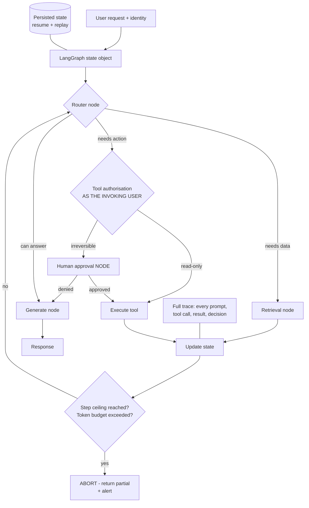

# Agent Orchestration with LangGraph: State, Guardrails and Tool Authorisation

**Level:** Advanced
**Tree:** [Production AI Systems](../README.md)
**Branch:** [Production AI Systems](README.md)
**Forest:** [AI & Intelligent Systems](../../../README.md)

## Explanation

### What separates a production agent from a demo

A demo agent calls a tool and returns an answer. A production agent needs **bounded
state, explicit termination, scoped authorisation and a full trace** - because an
unbounded loop is simultaneously a cost incident and an availability incident.

### Explicit state beats implicit conversation

**LangGraph** models the agent as a state graph: nodes perform work, conditional edges
decide transitions, and the state is an explicit object. That explicitness buys
properties that matter operationally - the run can be **persisted and resumed**,
a failed run can be **replayed**, human approval can be inserted as a **node**, and a
hard step ceiling is trivial to enforce. **CrewAI** expresses role-based crews quickly
and **AutoGen** suits exploratory multi-agent dialogue, but neither gives the same
control over the transition graph.

### The runaway loop

An agent that cannot achieve its goal will retry. Two agents that can delegate to each
other will ping-pong. Without a hard step ceiling and a per-run token budget this
consumes budget until someone notices - and the service is unavailable throughout.
**Both limits are non-negotiable regardless of framework.**

### Tool authorisation is the security boundary

An agent holding a service account that can do anything is a **confused deputy**:
prompt-inject the agent and you inherit its permissions. Tools must execute with the
authority of the **invoking user**, not a shared privileged identity, and any
irreversible action needs explicit confirmation. This is the first question a security
review will ask and the most common reason an agent project is blocked.

### Trace everything

Every prompt, tool call, tool result and routing decision. Without it, debugging a
wrong answer means guessing which of fifteen steps went wrong.

## Architecture and flow



## Commands

### Command 1

Install the graph orchestration layer

```text
pip install langgraph langchain-core
```

### Command 2

Verify the state graph primitive is available

```text
python -c "from langgraph.graph import StateGraph; print(StateGraph)"
```

### Command 3

Run the local development server with the graph inspector for visualising state transitions

```text
langgraph dev
```

### Command 4

Inspect guardrail enforcement in production logs - step and budget aborts should be visible and alerted

```text
kubectl logs -l app=agent --tail=200 | grep -E "step_count|token_budget|abort"
```

### Command 5

Retrieve a full run trace for debugging a wrong answer step by step

```text
curl -s localhost:8000/traces/<run_id> | jq ".steps[] | {node, tool, tokens}"
```

## Automation scripts

### guarded_agent.py

```python
#!/usr/bin/env python3
"""LangGraph agent with the guardrails a production deployment requires:
hard step ceiling, per-run token budget, user-scoped tool authorisation,
human approval for irreversible actions, and a full trace.
"""
from typing import TypedDict, List, Optional

from langgraph.graph import StateGraph, END

MAX_STEPS = 12
MAX_TOKENS = 40000
IRREVERSIBLE = {"delete_resource", "send_email", "restart_service", "issue_refund"}


class AgentState(TypedDict):
    request: str
    user_id: str            # the INVOKING user - tools run as this identity
    user_scopes: List[str]  # what THIS user may do, not what the agent may do
    steps: int
    tokens_used: int
    trace: List[dict]
    result: Optional[str]
    pending_action: Optional[dict]


def guard(state: AgentState) -> str:
    """Central guardrail. Checked on every transition, not just at entry."""
    if state["steps"] >= MAX_STEPS:
        state["result"] = "Aborted: step ceiling reached. Partial results returned."
        state["trace"].append({"event": "abort", "reason": "max_steps"})
        return "abort"

    if state["tokens_used"] >= MAX_TOKENS:
        state["result"] = "Aborted: token budget exhausted."
        state["trace"].append({"event": "abort", "reason": "max_tokens"})
        return "abort"

    return "continue"


def authorise(state: AgentState, tool: str) -> bool:
    """Tools execute with the INVOKING USER authority.

    An agent holding one privileged service account is a confused deputy:
    prompt-inject it and the attacker inherits everything it can reach.
    """
    required = "tool:" + tool
    return required in state["user_scopes"]


def router(state: AgentState) -> AgentState:
    state["steps"] += 1
    state["trace"].append({"event": "route", "step": state["steps"]})
    return state


def call_tool(state: AgentState) -> AgentState:
    action = state.get("pending_action") or {}
    tool = action.get("tool", "")

    if not authorise(state, tool):
        state["trace"].append({"event": "denied", "tool": tool, "user": state["user_id"]})
        state["result"] = "Not permitted: your account cannot use %s." % tool
        return state

    # Irreversible actions never execute without explicit human approval.
    if tool in IRREVERSIBLE and not action.get("approved"):
        state["trace"].append({"event": "approval_required", "tool": tool})
        state["result"] = "Approval required before %s can run." % tool
        return state

    state["trace"].append({"event": "tool_call", "tool": tool})
    # ... execute the tool as the invoking user ...
    return state


def generate(state: AgentState) -> AgentState:
    state["trace"].append({"event": "generate"})
    state["result"] = state.get("result") or "answer"
    return state


graph = StateGraph(AgentState)
graph.add_node("router", router)
graph.add_node("tool", call_tool)
graph.add_node("generate", generate)
graph.set_entry_point("router")

# The guard sits on the transition, so it cannot be bypassed by any path.
graph.add_conditional_edges(
    "router",
    lambda s: "abort" if guard(s) == "abort" else ("tool" if s.get("pending_action") else "generate"),
    {"tool": "tool", "generate": "generate", "abort": END},
)
graph.add_edge("tool", "router")
graph.add_edge("generate", END)

app = graph.compile()
```

## Lab

**Objective:** Build a guarded agent, then defeat an unguarded one - demonstrate a runaway loop, a confused-deputy privilege escalation via prompt injection, and prove the guardrails stop both.

### Steps

1. Build a simple LangGraph agent with a retrieval tool and an action tool, with no guardrails.
2. Give it a goal it cannot achieve and observe the retry loop. Measure tokens consumed before you stop it manually.
3. Add a hard step ceiling and a per-run token budget on the transition edge, and confirm the same request now aborts cleanly with partial results.
4. Give the agent a single privileged service account with broad permissions.
5. Craft a prompt injection in a retrieved document instructing the agent to call the delete action.
6. Observe the agent execute it - this is the confused deputy, and the agent behaved exactly as designed.
7. Change tool authorisation to use the invoking user scopes instead of the service account.
8. Repeat the injection with a user lacking that scope and confirm the tool call is denied and traced.
9. Add human approval as a node for irreversible actions and confirm the agent halts awaiting approval.
10. Persist state mid-run, kill the process, and resume from the persisted state.
11. Retrieve the full trace for a run and walk through every prompt, tool call and routing decision.

### Validation

Unguarded agent demonstrably loops and burns budget,Guarded version aborts cleanly,Prompt injection succeeds against the service-account model and is denied under user-scoped authorisation,Irreversible actions halt for approval,A killed run resumes from persisted state

## Operational automation

### Automating agent operations

- **Enforce guardrails on the transition edge, not inside nodes.** A check inside one
  node is bypassed by any path that does not traverse it; a check on the edge cannot be.
- **Emit step count and token usage as metrics** and alert on aborts. A rising abort rate
  means the agent is being asked to do something it cannot, which is a design signal.
- **Derive tool scopes from the invoking user identity** at request time. Never let the
  agent hold a static privileged credential.
- **Persist state to a durable store** so long-running agents survive restarts and can
  be resumed rather than restarted.
- **Ship traces to the observability stack** with the run id correlatable to the user
  request. Debugging a fifteen-step agent without a trace is guesswork.
- **Treat prompt injection tests as a regression suite** - add every successful injection
  to it permanently.

## Troubleshooting

### Scenario 1: Agent token spend spikes unpredictably and some requests never return

**Likely cause:** Unbounded retry loop, or two agents delegating to each other in a cycle

**Resolution:** Add a hard step ceiling and a per-run token budget enforced on the transition edge. Return partial results on abort rather than failing silently, and alert on the abort rate so the underlying design problem is visible.

### Scenario 2: Agent performed an action the requesting user is not authorised to perform

**Likely cause:** Confused deputy - the agent used its own privileged service account rather than the invoking user identity

**Resolution:** Scope every tool call to the invoking user permissions and require explicit confirmation for irreversible actions. Prompt injection in retrieved content is a realistic delivery mechanism, so the authorisation boundary cannot rely on the agent behaving well.

### Scenario 3: A wrong answer cannot be diagnosed because the reasoning path is opaque

**Likely cause:** No trace of prompts, tool calls, results and routing decisions

**Resolution:** Log every step with a correlatable run id and expose a trace endpoint. Without it, debugging a multi-step agent is guesswork, and the number of steps makes reproduction unreliable.

## Interview questions

### 1. Why choose LangGraph over a conversational agent framework for production?

Explicit state. Modelling the agent as a state graph with defined nodes and conditional edges means the run can be persisted and resumed, a failure can be replayed, human approval can be inserted as a node, and a hard step ceiling is trivial to enforce on the transition. Conversational frameworks are faster to prototype but give much less control over the transition graph, which is exactly what production operability depends on.

### 2. What is the confused deputy problem in agent systems?

The agent holds a privileged service account and acts on behalf of users. Anyone who can influence its instructions - through prompt injection in a retrieved document, for example - inherits those permissions. The fix is that tools execute with the authority of the invoking user, not a shared identity, so a successful injection is bounded by what that user could already do.

### 3. Why must guardrails sit on the transition rather than inside a node?

Because a check inside a node only runs when that node executes. Any path that routes around it bypasses the check entirely. Enforcing the step ceiling and token budget on the conditional edge means every transition is checked regardless of path, which is what makes the bound actually hold.

### 4. How do you debug an agent that gave a wrong answer?

From the trace: every prompt, tool call, tool result and routing decision for that run, correlatable by run id. Without it you are guessing which of many steps went wrong, and multi-step agents are often not reliably reproducible. The trace is not optional instrumentation - it is the primary debugging interface.

## Certification alignment

- Azure AI Engineer Associate (AI-102) - agent and orchestration patterns
- OWASP Top 10 for LLM Applications - prompt injection and excessive agency
- CISSP Domain 3 - authorisation models and the confused deputy problem

## References

- LangGraph documentation: state graphs, checkpointing and human-in-the-loop patterns
- OWASP Top 10 for LLM Applications: LLM01 prompt injection, LLM08 excessive agency
- Model Context Protocol specification: tool exposure and authorisation boundaries

## Suggested video search

LangGraph state machine agent guardrails tool authorisation confused deputy human in the loop

---

> Validate commands, versions, permissions, licensing, and rollback procedures in an isolated lab before production use.
