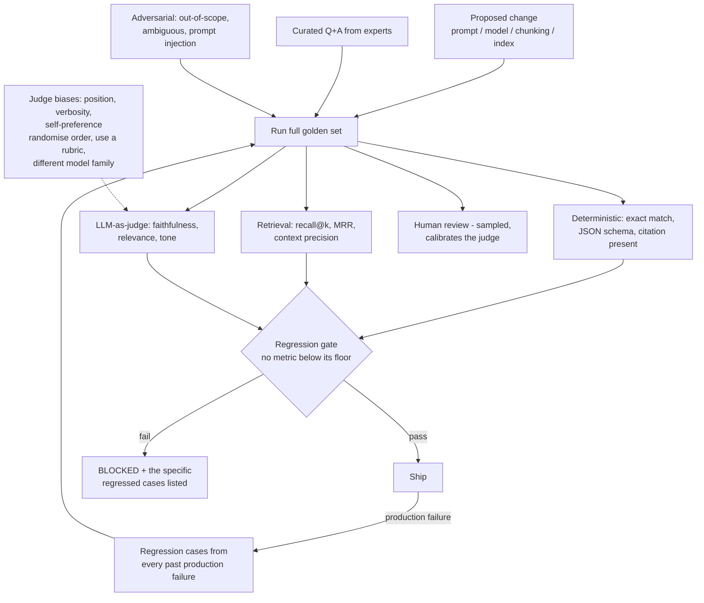

# LLM Evaluation Harnesses and Regression Gates for Production AI

**Level:** Advanced
**Tree:** [Production AI Systems](../README.md)
**Branch:** [Production AI Systems](README.md)
**Forest:** [AI & Intelligent Systems](../../../README.md)

## Explanation

### Prompt changes are not local

Changing a prompt to fix one behaviour routinely breaks another, with no warning and no
error. The same is true of changing the model, the chunking strategy or the index.
**Without a fixed evaluation set measured on every change, AI system quality is
anecdote** - whoever tested last and liked the result.

### What the golden set contains

Curated questions with expected answers from domain experts. **Adversarial cases** -
out-of-scope questions the system should decline, ambiguous phrasing, prompt injection
attempts. And **regression cases**: every production failure becomes a permanent test,
so the harness grows from real incidents rather than staying a fixed benchmark.

### Scoring in layers

Deterministic checks first - exact match, valid JSON against a schema, a citation
present. Retrieval metrics separately, because a wrong answer caused by bad retrieval
needs a different fix from one caused by bad generation. Then **LLM-as-judge** for
faithfulness, relevance and tone, with a sampled subset reviewed by humans to calibrate
the judge.

### LLM-as-judge has known biases

It favours the answer shown first (**position bias**), favours longer answers
(**verbosity bias**), and favours outputs from its own model family
(**self-preference**). Mitigate by randomising order, scoring against an explicit rubric
rather than pairwise, using a different model family as judge, and periodically
calibrating against human labels. Used without these corrections it produces confident,
systematically skewed numbers.

### The gate is what makes it engineering

No metric may fall below its floor. A failing gate must emit the specific regressed
cases, not a pass/fail flag - the failing case list is what makes the result actionable.

## Architecture and flow



## Commands

### Command 1

Run a declarative prompt evaluation across variants and assertions, emitting machine-readable results for a gate

```text
promptfoo eval -c promptfooconfig.yaml --output results.json
```

### Command 2

Disable caching and repeat runs to measure output variance - a single run hides nondeterminism

```text
promptfoo eval --no-cache --repeat 3
```

### Command 3

Score a RAG system on faithfulness and retrieval-specific metrics, separating generation from retrieval failure

```text
python -m ragas evaluate --dataset eval.jsonl --metrics faithfulness,answer_relevancy,context_precision
```

### Command 4

Run evaluation as unit tests so failures surface in CI like any other test failure

```text
deepeval test run test_rag.py
```

### Command 5

Any change under the prompt directory must trigger the full evaluation - prompts are code

```text
git diff --stat prompts/
```

## Automation scripts

### eval_regression_gate.py

```python
#!/usr/bin/env python3
"""Regression gate for an LLM system. Compares a candidate run against the
stored baseline and blocks on any metric falling below its floor.
Emits the SPECIFIC regressed cases so the result is actionable.
"""
import json
import sys

FLOORS = {
    "exact_match": 0.85,
    "citation_present": 0.95,
    "faithfulness": 0.90,
    "context_recall": 0.80,
    "refusal_on_out_of_scope": 0.95,
    "injection_resisted": 1.00,      # zero tolerance
}
MAX_DROP = 0.02   # allowed regression vs baseline, for judge noise

baseline = json.load(open("eval_baseline.json"))
candidate = json.load(open("eval_candidate.json"))

failures = []

for metric, floor in FLOORS.items():
    cand = candidate["metrics"].get(metric)
    base = baseline["metrics"].get(metric)

    if cand is None:
        failures.append("%s: not measured - the harness did not run this metric" % metric)
        continue

    if cand < floor:
        failures.append("%s: %.3f below floor %.3f" % (metric, cand, floor))

    # A metric can sit above its floor and still have regressed materially.
    if base is not None and cand < base - MAX_DROP:
        failures.append(
            "%s: regressed %.3f -> %.3f (drop %.3f exceeds %.3f)"
            % (metric, base, cand, base - cand, MAX_DROP)
        )

# The failing case list is what makes the gate actionable.
regressed_cases = []
base_cases = {c["id"]: c for c in baseline.get("cases", [])}
for case in candidate.get("cases", []):
    b = base_cases.get(case["id"])
    if b and b.get("passed") and not case.get("passed"):
        regressed_cases.append(case)

print("Evaluation: %d cases" % len(candidate.get("cases", [])))
for metric in sorted(FLOORS):
    c = candidate["metrics"].get(metric)
    b = baseline["metrics"].get(metric)
    if c is not None:
        arrow = ""
        if b is not None:
            arrow = " (was %.3f)" % b
        print("  %-26s %.3f%s" % (metric, c, arrow))
print("")

if regressed_cases:
    print("CASES THAT PASSED BEFORE AND FAIL NOW:")
    for c in regressed_cases[:20]:
        print("  [%s] %s" % (c["id"], c.get("query", "")[:70]))
    print("")

if failures:
    print("GATE FAILED")
    for f in failures:
        print("  " + f)
    sys.exit(1)

print("GATE PASSED")
sys.exit(0)
```

## Lab

**Objective:** Build an evaluation harness with a golden set, wire it into CI as a blocking gate, and prove that a plausible prompt improvement causes a measurable regression elsewhere.

### Steps

1. Assemble 50 golden questions with expert answers covering the system in-scope behaviour.
2. Add 15 adversarial cases: out-of-scope questions that must be declined, ambiguous phrasing, and prompt injection attempts.
3. Implement deterministic scoring for citation presence and JSON schema validity.
4. Add retrieval metrics separately from generation metrics so failures can be attributed.
5. Add an LLM-as-judge scorer using a different model family from the one under test.
6. Calibrate the judge against 20 human-labelled examples and record the agreement rate.
7. Establish a baseline run and store it.
8. Make a plausible prompt improvement - for example instructing the model to be more concise.
9. Run the gate and observe the effect: conciseness typically improves while citation presence or faithfulness degrades.
10. Confirm the gate blocks and lists the specific regressed cases.
11. Take one regressed case, add it permanently to the regression set, then fix the prompt and confirm the gate passes.

### Validation

A plausible prompt improvement is caught degrading a different metric,The gate blocks and names the failing cases,Judge agreement with human labels is measured rather than assumed,The regression set grows from a real failure

## Operational automation

### Automating evaluation

- **Gate on every change to prompts, models, chunking or index parameters.** Prompts are
  code and belong under the same CI discipline.
- **Store the baseline in version control** so regressions are diffable and the history
  of quality is visible over time.
- **Feed production failures back into the regression set automatically.** A harness
  that does not grow from incidents becomes a fixed benchmark nobody trusts.
- **Run with repeats and no caching** to measure output variance. A metric reported from
  a single run hides nondeterminism and will produce flaky gate results.
- **Recalibrate the judge periodically** against fresh human labels. Judge drift is real
  when the judge model itself is updated, and it silently shifts every score.
- **Zero tolerance on injection resistance.** Unlike quality metrics, that floor is 1.0.

## Troubleshooting

### Scenario 1: Evaluation scores swing between runs with no change to the system

**Likely cause:** Nondeterministic generation combined with single-run measurement

**Resolution:** Set temperature to zero where the use case allows, run each case multiple times and aggregate, and set the gate tolerance above measured variance. A gate tighter than the noise floor produces flaky failures and gets disabled.

### Scenario 2: LLM-as-judge consistently rates one variant higher, but humans disagree

**Likely cause:** Judge bias - position, verbosity or self-preference

**Resolution:** Randomise presentation order, score against an explicit rubric rather than pairwise comparison, use a judge from a different model family, and calibrate against human labels. Verbosity bias in particular rewards longer answers that users find worse.

### Scenario 3: Answers are wrong but the generation model is clearly capable

**Likely cause:** Retrieval failure, not generation failure - the right context never reached the model

**Resolution:** Separate retrieval metrics from generation metrics in the harness. If context recall is low, no amount of prompt or model work will fix it; the problem is upstream in chunking, embedding or filtering.

## Interview questions

### 1. Why does an LLM system need a fixed evaluation set?

Because changes are not local. Adjusting a prompt to fix one behaviour routinely breaks another with no error, and the same applies to changing the model, chunking or index. Without a fixed set measured on every change, quality assessment is whoever tested last and liked what they saw. The set is what turns AI work into engineering.

### 2. What biases does LLM-as-judge introduce?

Position bias - it favours whichever answer is shown first. Verbosity bias - it favours longer answers regardless of quality. Self-preference - it favours outputs from its own model family. Mitigations are randomising order, scoring against a rubric rather than pairwise, using a different model family as judge, and calibrating against human labels periodically.

### 3. Why separate retrieval metrics from generation metrics?

Because they have different fixes. If the right context never reached the model, no prompt or model change will help - the problem is chunking, embedding or filtering. If retrieval was good and the answer was still wrong, the problem is generation. Measuring only end-to-end answer quality tells you something is broken without telling you where.

### 4. How should the golden set evolve?

Every production failure becomes a permanent regression case. A harness assembled once and never grown becomes a fixed benchmark that the system is implicitly overfitted to, and it stops catching the failures that actually occur. Feeding real incidents back in is what keeps it representative.

## Certification alignment

- Azure AI Engineer Associate (AI-102) - evaluating and monitoring generative AI solutions
- ISO/IEC 42001 - AI management system requirements including performance evaluation
- Google Professional Machine Learning Engineer - model evaluation and monitoring

## References

- RAGAS documentation: faithfulness, answer relevancy and context precision metrics
- Promptfoo and DeepEval documentation: declarative evaluation and CI integration
- Research on LLM-as-judge position and verbosity bias, and mitigation strategies

## Suggested video search

LLM evaluation harness golden dataset LLM as judge bias regression gate RAGAS faithfulness

---

> Validate commands, versions, permissions, licensing, and rollback procedures in an isolated lab before production use.
