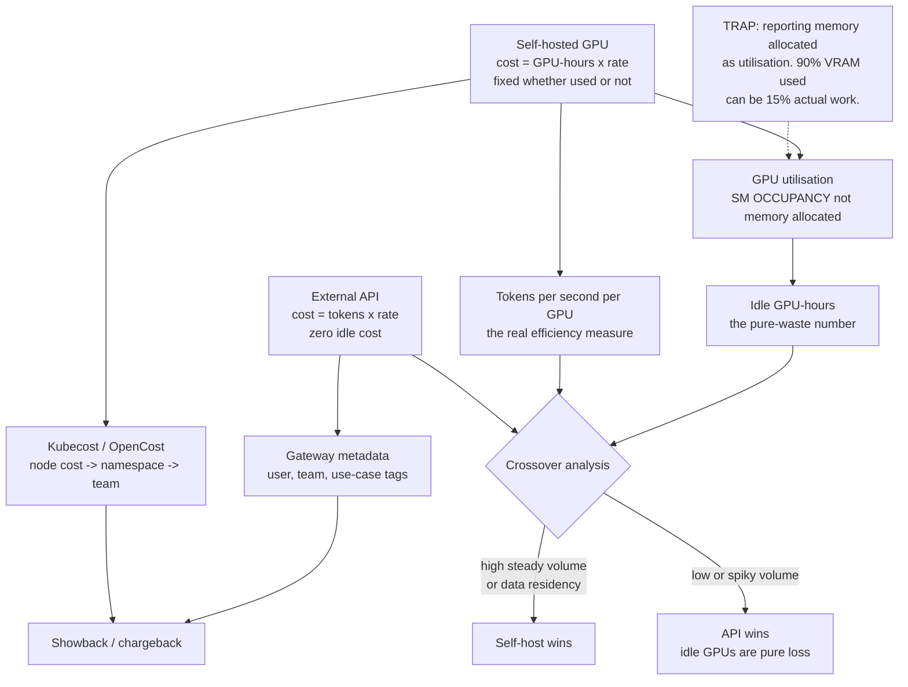

# AI FinOps: Token Cost Attribution, GPU Utilisation and Build-versus-Buy Crossover

**Level:** Advanced
**Tree:** [Production AI Systems](../README.md)
**Branch:** [Production AI Systems](README.md)
**Forest:** [AI & Intelligent Systems](../../../README.md)

## Explanation

## Two cost models that must not be blended

External API models cost **per token** and scale with use - zero traffic costs nothing.
Self-hosted models cost **per GPU-hour** and are fixed whether used or not. Reporting
them as one number produces an AI budget nobody can explain or act on.

### Attribution requires identity at the gateway

Cost can only be attributed if the gateway records **who** made each request. That means
the portal must forward end-user identity rather than calling with one shared service
token. Without it every request looks like the same caller and showback is impossible.
On the self-hosted side, Kubecost or OpenCost maps GPU node cost to namespace to team.

### The measurement trap

Teams report **GPU memory allocated** as utilisation. A model can occupy ninety percent
of VRAM while computing almost nothing. Memory allocated is not work done. Measure **SM
occupancy and tokens per second**, or you will conclude that a cluster running at
fifteen percent is full and buy more.

### Idle GPU-hours is the number that matters

An H100 sitting idle overnight costs exactly what one at full utilisation costs. Idle
GPU-hours is usually the largest available saving and is almost never on a dashboard.
Batch overnight work, consolidate with MIG, or scale to zero - but **measure it first**,
because most teams have never quantified it.

### The crossover

Self-hosting wins on high, steady volume and when data must not leave the boundary. APIs
win on low or spiky volume, because idle GPUs are pure loss. Compute the crossover from
measured tokens per second and actual utilisation rather than from list prices - the
honest calculation frequently shows a self-hosted deployment losing money.

## Architecture and flow



## Commands

### Command 1

Sample real SM utilisation alongside memory - the two diverge, and the divergence is the point

```text
nvidia-smi --query-gpu=index,utilization.gpu,memory.used,memory.total --format=csv -l 10
```

### Command 2

Kubecost namespace cost breakdown including GPU allocation over a window

```text
kubectl cost namespace --window 7d --show-gpu
```

### Command 3

Query DCGM GPU utilisation from Prometheus for time-series analysis rather than point sampling

```text
curl -s localhost:9090/api/v1/query --data-urlencode "query=DCGM_FI_DEV_GPU_UTIL" | jq ".data.result[]"
```

### Command 4

LiteLLM per-user spend aggregation - requires the gateway to receive end-user identity

```text
curl -s localhost:4000/spend/logs | jq "group_by(.user) | map({user: .[0].user, spend: map(.spend) | add})"
```

### Command 5

Count pods holding GPU requests, to compare allocation against measured utilisation

```text
kubectl get pods -A -o json | jq "[.items[] | select(.spec.containers[].resources.requests[\"nvidia.com/gpu\"])] | length"
```

## Automation scripts

### ai_cost_crossover.py

```python
#!/usr/bin/env python3
"""Build-versus-buy crossover for LLM serving.
Uses MEASURED throughput and utilisation, not list prices and peak specs.
"""
import argparse

p = argparse.ArgumentParser()
p.add_argument("--gpu-hourly", type=float, required=True, help="cost per GPU-hour")
p.add_argument("--gpus", type=int, default=1)
p.add_argument("--measured-tps", type=float, required=True,
               help="MEASURED output tokens/sec at production batch, not peak")
p.add_argument("--utilisation", type=float, required=True,
               help="fraction of hours the GPU is actually serving (0-1)")
p.add_argument("--api-per-mtok", type=float, required=True,
               help="API cost per million output tokens")
p.add_argument("--monthly-tokens-m", type=float, required=True,
               help="monthly output tokens in millions")
a = p.parse_args()

HOURS = 730.0

# Self-hosted cost is fixed: you pay for every hour, used or not.
self_cost = a.gpu_hourly * a.gpus * HOURS

# Capacity at measured throughput, derated by actual utilisation.
capacity_m = (a.measured_tps * 3600 * HOURS * a.gpus * a.utilisation) / 1e6

api_cost = a.monthly_tokens_m * a.api_per_mtok

print("Monthly comparison")
print("  self-hosted fixed cost : %10.2f" % self_cost)
print("  self-hosted capacity   : %10.1f M tokens (at %.0f%% utilisation)"
      % (capacity_m, a.utilisation * 100))
print("  actual demand          : %10.1f M tokens" % a.monthly_tokens_m)
print("  API cost for demand    : %10.2f" % api_cost)
print("")

if a.monthly_tokens_m > capacity_m:
    print("  WARNING demand EXCEEDS self-hosted capacity at measured throughput.")
    print("          You would need more GPUs, or overflow to an API.")
    print("")

# Effective unit cost is what makes the comparison honest.
served = min(a.monthly_tokens_m, capacity_m)
if served > 0:
    eff = self_cost / served
    print("  effective self-hosted cost: %.2f per M tokens" % eff)
    print("  API cost                  : %.2f per M tokens" % a.api_per_mtok)
    print("")
    if eff < a.api_per_mtok:
        print("  RESULT self-hosting is cheaper at this volume and utilisation.")
    else:
        print("  RESULT API is cheaper. Self-hosting loses money here -")
        print("         you are paying for idle capacity.")

# Idle cost, stated plainly. This is usually the largest saving available.
idle_cost = self_cost * (1.0 - a.utilisation)
print("")
print("  idle GPU cost/month    : %10.2f  (%.0f%% of spend buys nothing)"
      % (idle_cost, (1.0 - a.utilisation) * 100))
print("  Address it by batching, MIG consolidation, or scale-to-zero -")
print("  but only after measuring it.")
```

## Lab

**Objective:** Instrument a self-hosted model for true cost, expose the memory-versus-occupancy trap with measurement, and compute an honest build-versus-buy crossover.

### Steps

1. Deploy a model on a GPU node and drive it with representative production traffic.
2. Record GPU memory used and SM utilisation simultaneously over an hour.
3. Confirm the divergence: memory can sit near ninety percent while SM occupancy is far lower.
4. Measure sustained output tokens per second at production batch size, not at peak benchmark settings.
5. Deploy Kubecost or OpenCost and attribute GPU node cost to the serving namespace.
6. Configure the AI gateway to record end-user identity and produce per-user token spend.
7. Compute utilisation as the fraction of hours the GPU is actually serving.
8. Run the crossover script with measured throughput and utilisation, and compare against API pricing for the same volume.
9. Repeat the calculation with peak benchmark throughput and one hundred percent utilisation, and compare the two conclusions.
10. Quantify idle GPU cost per month and identify which of batching, MIG consolidation or scale-to-zero applies.

### Validation

Memory-versus-occupancy divergence is demonstrated with data,Per-user token spend is attributable,The crossover computed from measured values differs materially from the one computed from peak specs,Idle GPU cost is quantified in currency

## Operational automation

### Automating AI cost management

- **Tag every gateway request** with user, team and use-case. Attribution is impossible
  to reconstruct retrospectively, so it must be captured at the time of the call.
- **Export DCGM GPU metrics to Prometheus** and dashboard SM occupancy separately from
  memory. Presenting them together is how the trap persists.
- **Alert on idle GPU-hours crossing a threshold**, not merely on high utilisation. Idle
  capacity is the expensive failure and no standard dashboard surfaces it.
- **Re-run the crossover calculation quarterly.** API pricing falls regularly and
  utilisation changes, so a build decision made two years ago may now be losing money.
- **Enforce per-team token budgets at the gateway** with alerting before hard limits, so
  a runaway agent is a notification rather than an invoice.

## Troubleshooting

### Scenario 1: GPU dashboard shows 90 percent utilisation but throughput is far below expectation

**Likely cause:** The dashboard reports memory allocated rather than SM occupancy

**Resolution:** Instrument SM occupancy via DCGM and display it separately from memory. A model can reserve most of VRAM while computing very little; memory allocated says nothing about work done and drives incorrect capacity purchases.

### Scenario 2: AI spend cannot be attributed to any team

**Likely cause:** The portal calls the gateway with one shared service token, so every request appears identical

**Resolution:** Forward end-user identity from the portal to the gateway and tag requests with user and team. Attribution cannot be reconstructed after the fact, so this must be in place before the spend occurs.

### Scenario 3: Self-hosted deployment was justified on cost but spend is higher than the API alternative

**Likely cause:** The business case used peak benchmark throughput and assumed full utilisation

**Resolution:** Recompute with measured sustained throughput at production batch size and actual utilisation. The effective cost per million tokens at forty percent utilisation is roughly double the figure at full utilisation, which is usually what reverses the conclusion.

## Interview questions

### 1. Why must API and self-hosted costs be reported separately?

They behave differently. API cost is variable and scales with use, so zero traffic costs nothing. Self-hosted cost is fixed per GPU-hour whether the hardware is busy or idle. Blending them into a single AI spend figure produces a number that cannot be acted on, because the levers for reducing each are completely different.

### 2. What is wrong with reporting GPU memory as utilisation?

Memory allocated is not work done. A served model reserves VRAM for weights and KV cache and holds it whether or not requests are arriving, so memory can read ninety percent while SM occupancy is fifteen percent. Teams conclude the cluster is full and buy more GPUs when the existing ones are mostly idle. Measure SM occupancy and tokens per second.

### 3. How do you compute an honest build-versus-buy crossover?

From measured sustained throughput at production batch size and actual utilisation, not from peak benchmarks and an assumption of full usage. Effective cost per million tokens is fixed GPU cost divided by tokens actually served. At forty percent utilisation that is roughly double the full-utilisation figure, and that correction frequently reverses the decision.

### 4. What is the single most valuable AI cost metric?

Idle GPU-hours. An idle H100 costs the same as a fully loaded one, so idle time is pure waste and it is usually the largest available saving. It also almost never appears on a dashboard, because standard monitoring reports utilisation when busy rather than accumulating the cost of not being busy.

## Certification alignment

- FinOps Certified Practitioner - cloud cost allocation, showback and chargeback
- NVIDIA Certified Associate: AI Infrastructure and Operations - GPU monitoring
- AWS/Azure cost optimisation specialty content - reserved versus on-demand economics

## References

- FinOps Foundation: cloud cost allocation and showback practices
- NVIDIA DCGM documentation: GPU telemetry and SM occupancy metrics
- Kubecost and OpenCost documentation: GPU cost allocation in Kubernetes

## Suggested video search

AI FinOps GPU utilisation Kubecost token cost attribution build versus buy LLM

---

> Validate commands, versions, permissions, licensing, and rollback procedures in an isolated lab before production use.
