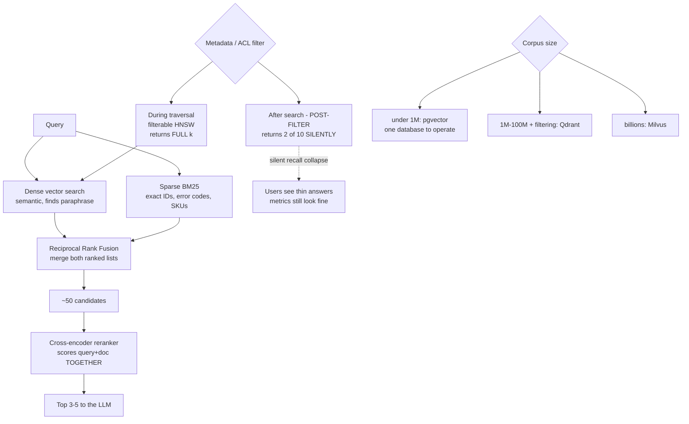

# Vector Database Selection and Hybrid Retrieval: pgvector, Qdrant, Milvus and Reranking

**Level:** Advanced
**Tree:** [Production AI Systems](../README.md)
**Branch:** [Production AI Systems](README.md)
**Forest:** [AI & Intelligent Systems](../../../README.md)

## Explanation

### Start with the database you already run

For corpora up to roughly a million vectors, **pgvector** is usually the right answer
and is routinely skipped in favour of something more specialised. Vectors sit beside
the relational data, ACL filters are ordinary SQL joins, and there is one database to
operate, back up, patch and secure. **One fewer datastore is worth more than benchmark
latency** at the corpus sizes most enterprises actually have.

Dedicated stores earn their operational cost at scale, or when filtered search is
central: **Qdrant** for heavy metadata and per-tenant filtering, **Milvus** for
distributed billion-scale deployments, **Weaviate** where built-in hybrid search and
the module ecosystem are wanted.

### The filtering trap

Post-filtering retrieves the top k by vector similarity and *then* applies the metadata
filter. If few of those k satisfy the filter, the caller receives two results instead
of ten - **silently, with no error**. In a multi-tenant or ACL-filtered system this is
catastrophic and invisible: users see thin or missing answers and the retrieval metrics
still look fine. Filterable HNSW evaluates the predicate during graph traversal and
returns a full result set.

### Hybrid retrieval is not optional in enterprise corpora

Dense vector search finds paraphrase and concept. It reliably **fails on exact
identifiers** - error codes, SKUs, ticket numbers, config keys - which enterprise
documents are full of. BM25 finds those trivially. Run both and fuse the ranked lists
with reciprocal rank fusion.

### Reranking usually beats a bigger model

Retrieve roughly fifty candidates cheaply with a bi-encoder, then rerank to five with a
cross-encoder that scores query and document *together*. Adding this stage typically
improves answer quality more than upgrading the generation model, at a fraction of the
cost.

## Architecture and flow



## Commands

### Command 1

Create an HNSW index in pgvector - m and ef_construction set the recall/memory/build-time trade-off

```text
CREATE INDEX ON docs USING hnsw (embedding vector_cosine_ops) WITH (m=16, ef_construction=64);
```

### Command 2

Tune candidate list size per session - the one HNSW parameter adjustable at query time to trade latency for recall

```text
SET hnsw.ef_search = 100;
```

### Command 3

Confirm the planner uses the index and applies the tenant filter efficiently rather than after the scan

```text
EXPLAIN ANALYZE SELECT id FROM docs WHERE tenant_id = 42 ORDER BY embedding <=> $1 LIMIT 10;
```

### Command 4

Qdrant search with a filter clause in the request body - filtering happens inside traversal

```text
curl -X POST localhost:6333/collections/docs/points/search -d @search.json
```

### Command 5

Find rows that were never embedded - a silent retrieval gap after a failed backfill

```text
SELECT count(*) FROM docs WHERE embedding IS NULL;
```

### Command 6

Count rows present in the table but absent from the vector index - the silent backfill failure

```text
psql -c "SELECT count(*) FROM documents WHERE embedding IS NULL;"
```

## Automation scripts

### retrieval_quality_eval.py

```python
#!/usr/bin/env python3
"""Measures retrieval quality: recall@k and MRR for dense, sparse and hybrid.
Also detects post-filter recall collapse, which is silent in production.
"""
import sys
import json

K = 10
MIN_RECALL = 0.80


def recall_at_k(retrieved, relevant, k):
    if not relevant:
        return 1.0
    hits = len(set(retrieved[:k]) & set(relevant))
    return hits / float(len(relevant))


def mrr(retrieved, relevant):
    for i, doc in enumerate(retrieved, start=1):
        if doc in relevant:
            return 1.0 / i
    return 0.0


def evaluate(name, search_fn, golden):
    recalls, mrrs, short = [], [], 0
    for case in golden:
        got = search_fn(case["query"], K, case.get("filter"))

        # Post-filter collapse: fewer than k results returned even though
        # the corpus contains far more matching documents. No error is
        # raised - the caller simply gets a short list.
        if case.get("filter") and len(got) < K:
            short += 1

        recalls.append(recall_at_k(got, case["relevant"], K))
        mrrs.append(mrr(got, case["relevant"]))

    avg_r = sum(recalls) / len(recalls)
    avg_m = sum(mrrs) / len(mrrs)
    print("%-10s recall@%d=%.3f  MRR=%.3f  short-result cases=%d/%d"
          % (name, K, avg_r, avg_m, short, len(golden)))
    return avg_r, short


golden = json.load(open("golden_queries.json"))

# Replace these with real clients.
def dense(q, k, f):   return []
def sparse(q, k, f):  return []
def hybrid(q, k, f):  return []
def reranked(q, k, f): return []

results = {}
for name, fn in [("dense", dense), ("sparse", sparse),
                 ("hybrid", hybrid), ("reranked", reranked)]:
    results[name] = evaluate(name, fn, golden)

print("")

# Hybrid should beat dense alone on any corpus containing exact identifiers.
if results["hybrid"][0] <= results["dense"][0]:
    print("NOTE hybrid did not beat dense - check BM25 indexing and fusion weights.")

# Short results on filtered queries mean post-filtering.
if results["hybrid"][1] > 0:
    print("FINDING %d filtered queries returned fewer than %d results."
          % (results["hybrid"][1], K))
    print("        This is POST-FILTER recall collapse. Move filtering into")
    print("        the index traversal - a WHERE clause with a supporting")
    print("        index in pgvector, or a filter clause in Qdrant.")
    sys.exit(1)

if results["reranked"][0] < MIN_RECALL:
    print("FINDING reranked recall below floor %.2f" % MIN_RECALL)
    sys.exit(1)

print("Retrieval quality within thresholds.")
sys.exit(0)
```

## Lab

**Objective:** Build the same RAG corpus on pgvector and Qdrant, measure dense versus hybrid versus reranked retrieval on a golden set, and reproduce post-filter recall collapse deliberately.

### Steps

1. Load a corpus containing both prose and exact identifiers (error codes, part numbers) into pgvector with an HNSW index.
2. Build a golden query set with known relevant documents, including queries that search for exact identifiers.
3. Measure recall@10 and MRR for dense-only retrieval and record which query type fails.
4. Add a BM25 index and implement reciprocal rank fusion. Re-measure and confirm identifier queries improve sharply.
5. Add a cross-encoder reranking stage over the top 50 candidates and measure the improvement.
6. Compare the reranking gain against the gain from switching to a larger generation model, at equal cost.
7. Implement multi-tenant filtering with post-filtering (filter applied after the vector search) and measure results returned per query.
8. Confirm filtered queries silently return fewer than k results with no error raised.
9. Move filtering into the query (pgvector WHERE clause with an appropriate index, or Qdrant filter clause) and confirm full result sets return.
10. Tune ef_search across a range and plot recall against latency to find the operating point.

### Validation

- Hybrid measurably beats dense on identifier queries.
- Reranking improves MRR more than a larger generation model at equal cost.
- Post-filter collapse is reproduced and then eliminated.
- An ef_search operating point is chosen from measured data rather than a default.
- Identifier-style queries are represented in the evaluation set and measurably improve under hybrid retrieval.

## Operational automation

### Automating retrieval quality

- **Run the retrieval evaluation in CI** on every change to chunking, embedding model,
  index parameters or filter logic. Retrieval quality regresses silently otherwise -
  there is no error, only worse answers, and nobody attributes those to a config change
  made three weeks earlier.
- **Alert on short result sets for filtered queries.** It is the signature of post-filter
  collapse, it produces no error of its own, and it worsens as tenants are added because
  each tenant owns a smaller share of any global top-k.
- **Treat embedding model version as part of index identity** and re-embed the whole
  corpus on change, swapping indexes atomically. Vectors from two model versions in one
  index produce quietly meaningless similarity scores rather than a visible failure.
- **Monitor for unembedded rows** against the source of truth rather than trusting the
  ingestion job's exit status. A partially failed backfill leaves documents unreachable
  through retrieval while every application health check reports normal.
- **Track ef_search against p95 latency** so the recall/latency trade-off stays a tuned
  parameter with a recorded measurement, rather than a default set once on a small
  evaluation corpus and never revisited as the corpus grew.
- **Keep the sparse path in the evaluation set explicitly**, with identifier-style
  queries represented. Hybrid retrieval is easy to disable during a refactor, and the
  regression only shows on the exact-match queries a conceptual test set does not contain.

## Troubleshooting

### Scenario 1: Users report the assistant cannot find documents they know exist, but only for some queries.

**Likely cause:** Dense-only retrieval failing on exact identifiers - error codes, SKUs and ticket numbers are not semantically distinctive.

**Resolution:** Add BM25 sparse retrieval and fuse the ranked lists with reciprocal rank fusion. Dense embeddings represent meaning, and an identifier carries almost none to embed, so unrelated codes in similar boilerplate cluster together. Confirm the diagnosis first by checking whether the failing queries contain literal identifiers while the working ones are conceptual - that split is the signature, and it prevents a retrieval problem being misdiagnosed as a generation problem.

### Scenario 2: Filtered searches return fewer results than requested with no error.

**Likely cause:** Post-filtering - the metadata filter is applied after the top-k vector search rather than during index traversal.

**Resolution:** Move the filter into the query so it is evaluated during graph traversal: a WHERE clause with a supporting index in pgvector, the filter clause in Qdrant. This is the most common silent defect in multi-tenant RAG, and it worsens as tenants are added because each tenant owns a smaller share of any global top-k. Add an alert on filtered queries returning short result sets, since the failure produces no error of its own.

### Scenario 3: Similarity scores became meaningless after a model upgrade.

**Likely cause:** The index contains embeddings produced by two different models, and vectors from different models occupy different spaces and are not comparable.

**Resolution:** Re-embed the entire corpus with the new model and swap indexes atomically rather than migrating in place. Treat embedding model version as part of index identity so a partially migrated index cannot be queried at all - a hard failure here is greatly preferable to quietly meaningless scores, which degrade answers without any signal.

### Scenario 4: Recall is good in evaluation but p95 latency is unacceptable in production.

**Likely cause:** HNSW search parameters tuned for recall on a small evaluation set, with ef_search left high as the corpus grew.

**Resolution:** Treat ef_search as an explicit trade-off rather than a default: sweep it against both recall@k and p95 latency on the production-sized corpus and pick the smallest value that clears the recall bar. Check index build parameters too, since an under-built graph forces a larger ef_search to reach the same recall. Record the chosen value and the measurement, because this parameter is routinely set once and never revisited.

### Scenario 5: Some documents are never returned even though ingestion reported success.

**Likely cause:** A partially failed embedding backfill left rows present in the database with a null or zero vector, which is invisible to the application.

**Resolution:** Add a monitored count of unembedded rows and alert when it is non-zero, rather than trusting the ingestion job's exit status. A failed backfill makes documents unreachable through retrieval while every application health check reports normal, so the gap has to be measured directly against the source of truth for what should be indexed.

## Interview questions

### 1. When would you choose pgvector over a dedicated vector database?

For most enterprise corpora, which in my experience means up to roughly a million vectors. The decisive argument is not latency, it is operational surface. With pgvector the vectors live in the database the team already runs, so ACL filters and joins against business data are ordinary SQL rather than an application-layer merge between two systems, and there is one thing to back up, patch, secure, monitor and staff on call. A dedicated store adds a second consistency boundary: documents can exist in Postgres and not in the vector index, and reconciling that drift becomes someone's ongoing job. Dedicated stores earn their operational cost genuinely - Qdrant when per-tenant metadata filtering is central, Milvus at distributed billion-scale, Weaviate when the built-in hybrid and module ecosystem is wanted - but the common failure is adopting one before having the problem it solves, on the strength of a benchmark measured at a corpus size the organisation does not have. I would rather start on pgvector, measure recall and p95 latency against the real corpus, and migrate on evidence than inherit a second datastore by default.

### 2. What is post-filter recall collapse?

It is what happens when a metadata filter is applied after the top-k vector search instead of during index traversal. The engine retrieves k candidates ranked by similarity, then the filter removes the ones the caller is not entitled to see or did not ask for, and the caller receives two results where ten were requested - silently, with no error and no warning. It is severe specifically in multi-tenant and ACL-filtered systems, because there the filter is highly selective by design: the more tenants you have, the smaller the fraction of any global top-k that belongs to the requesting tenant, so recall degrades as the system grows. What makes it dangerous is that it is invisible from the outside. Users see thin or missing answers and describe the assistant as unreliable, while retrieval dashboards show normal latency and no error rate. The fix is filtering evaluated inside the traversal - a WHERE clause with a supporting index in pgvector, the filter clause in Qdrant - and the detection is an alert on filtered queries returning fewer results than requested, because nothing else will surface it.

### 3. Why is hybrid retrieval necessary in enterprise corpora?

Because dense embeddings encode meaning and enterprise documents are full of tokens that carry almost none. An error code, a SKU, a ticket number, a configuration key or a part number is semantically nearly empty - two unrelated codes surrounded by similar boilerplate embed close together, so the correct match is buried under near-identical neighbours. Those strings are also precisely what people type into an internal assistant, because they are searching from a support ticket or a log line. BM25 finds them trivially, since it matches the literal token. The two methods fail in complementary directions: dense search handles paraphrase and concept where keyword search misses synonyms entirely, sparse search handles exact tokens where dense search dissolves them. Running both and fusing the ranked lists with reciprocal rank fusion covers both query shapes without having to classify the query in advance, which is the part teams usually get wrong when they try to route between the two. I treat hybrid as the enterprise default and would only drop the sparse path for a purely conversational corpus with no identifiers in it, verified against the evaluation set rather than assumed.

### 4. You can either add reranking or upgrade to a larger generation model. Which first?

Reranking, in almost every case, and the reasoning is about where the error actually is. A bi-encoder embeds the query and each document independently and compares the resulting vectors, so the two never interact and the similarity score is an approximation of relevance. A cross-encoder takes the query and a candidate together as a single input and scores them jointly, which is markedly more accurate but far too slow to run across a whole corpus. The workable pattern is to over-fetch cheaply - retrieve around fifty candidates with the bi-encoder - and rerank only those down to the five that enter the prompt. If the right passage was never retrieved, a larger generation model cannot recover it; it will simply produce a more fluent answer from the wrong context, which is worse because it is more convincing. Fixing the context is therefore strictly upstream of fixing the generator, and it costs a fraction of a model upgrade. I would spend on the bigger model only after the evaluation set shows retrieval is already returning the right passages and the remaining errors are in reasoning over them.

## Certification alignment

- AI-102 Azure AI Engineer Associate - implement knowledge mining with Azure AI Search, vector and hybrid retrieval
- AI-102 Azure AI Engineer Associate - implement generative AI solutions using retrieval-augmented generation
- AWS Certified Machine Learning - Specialty - retrieval, embedding architectures and semantic search design
- Google Professional Machine Learning Engineer - Vertex AI Search and vector store design
- Vendor-neutral - information retrieval fundamentals: BM25, rank fusion and cross-encoder reranking

## References

- pgvector documentation - HNSW and IVFFlat indexing, distance operators and filtered queries
- Qdrant documentation - filterable HNSW, payload indexing and multi-tenant collections
- Milvus documentation - distributed architecture and index selection at billion scale
- Reciprocal Rank Fusion (Cormack et al.) - the standard fusion method for hybrid retrieval
- Hugging Face - sentence-transformers bi-encoder and cross-encoder reranking models

## Suggested video search

pgvector Qdrant Milvus hybrid search BM25 reciprocal rank fusion cross-encoder reranking

---

> Validate commands, versions, permissions, licensing, and rollback procedures in an isolated lab before production use.
