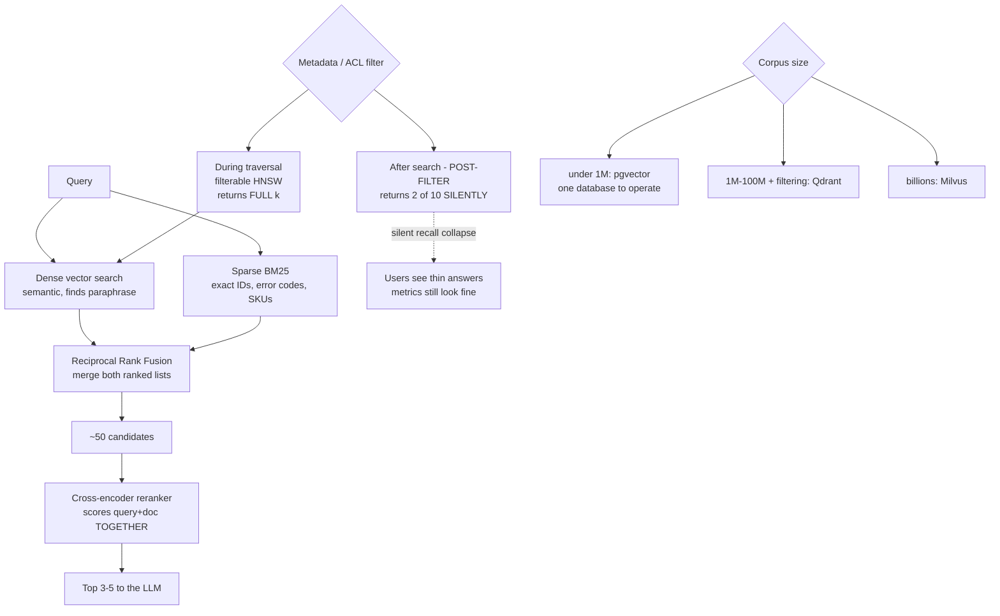

# Vector Database Selection and Hybrid Retrieval: pgvector, Qdrant, Milvus and Reranking

**Level:** Advanced
**Tree:** [Production AI Systems](../README.md)
**Branch:** [Production AI Systems](README.md)
**Forest:** [AI & Intelligent Systems](../../../README.md)

## Explanation

## Start with the database you already run

For corpora up to roughly a million vectors, **pgvector** is usually the right answer
and is routinely skipped in favour of something more specialised. Vectors sit beside
the relational data, ACL filters are ordinary SQL joins, and there is one database to
operate, back up, patch and secure. **One fewer datastore is worth more than benchmark
latency** at the corpus sizes most enterprises actually have.

Dedicated stores earn their operational cost at scale, or when filtered search is
central: **Qdrant** for heavy metadata and per-tenant filtering, **Milvus** for
distributed billion-scale deployments, **Weaviate** where built-in hybrid search and
the module ecosystem are wanted.

### The filtering trap

Post-filtering retrieves the top k by vector similarity and *then* applies the metadata
filter. If few of those k satisfy the filter, the caller receives two results instead
of ten - **silently, with no error**. In a multi-tenant or ACL-filtered system this is
catastrophic and invisible: users see thin or missing answers and the retrieval metrics
still look fine. Filterable HNSW evaluates the predicate during graph traversal and
returns a full result set.

### Hybrid retrieval is not optional in enterprise corpora

Dense vector search finds paraphrase and concept. It reliably **fails on exact
identifiers** - error codes, SKUs, ticket numbers, config keys - which enterprise
documents are full of. BM25 finds those trivially. Run both and fuse the ranked lists
with reciprocal rank fusion.

### Reranking usually beats a bigger model

Retrieve roughly fifty candidates cheaply with a bi-encoder, then rerank to five with a
cross-encoder that scores query and document *together*. Adding this stage typically
improves answer quality more than upgrading the generation model, at a fraction of the
cost.

## Architecture and flow



## Commands

### Command 1

Create an HNSW index in pgvector - m and ef_construction set the recall/memory/build-time trade-off

```text
CREATE INDEX ON docs USING hnsw (embedding vector_cosine_ops) WITH (m=16, ef_construction=64);
```

### Command 2

Tune candidate list size per session - the one HNSW parameter adjustable at query time to trade latency for recall

```text
SET hnsw.ef_search = 100;
```

### Command 3

Confirm the planner uses the index and applies the tenant filter efficiently rather than after the scan

```text
EXPLAIN ANALYZE SELECT id FROM docs WHERE tenant_id = 42 ORDER BY embedding <=> $1 LIMIT 10;
```

### Command 4

Qdrant search with a filter clause in the request body - filtering happens inside traversal

```text
curl -X POST localhost:6333/collections/docs/points/search -d @search.json
```

### Command 5

Find rows that were never embedded - a silent retrieval gap after a failed backfill

```text
SELECT count(*) FROM docs WHERE embedding IS NULL;
```

## Automation scripts

### retrieval_quality_eval.py

```python
#!/usr/bin/env python3
"""Measures retrieval quality: recall@k and MRR for dense, sparse and hybrid.
Also detects post-filter recall collapse, which is silent in production.
"""
import sys
import json

K = 10
MIN_RECALL = 0.80


def recall_at_k(retrieved, relevant, k):
    if not relevant:
        return 1.0
    hits = len(set(retrieved[:k]) & set(relevant))
    return hits / float(len(relevant))


def mrr(retrieved, relevant):
    for i, doc in enumerate(retrieved, start=1):
        if doc in relevant:
            return 1.0 / i
    return 0.0


def evaluate(name, search_fn, golden):
    recalls, mrrs, short = [], [], 0
    for case in golden:
        got = search_fn(case["query"], K, case.get("filter"))

        # Post-filter collapse: fewer than k results returned even though
        # the corpus contains far more matching documents. No error is
        # raised - the caller simply gets a short list.
        if case.get("filter") and len(got) < K:
            short += 1

        recalls.append(recall_at_k(got, case["relevant"], K))
        mrrs.append(mrr(got, case["relevant"]))

    avg_r = sum(recalls) / len(recalls)
    avg_m = sum(mrrs) / len(mrrs)
    print("%-10s recall@%d=%.3f  MRR=%.3f  short-result cases=%d/%d"
          % (name, K, avg_r, avg_m, short, len(golden)))
    return avg_r, short


golden = json.load(open("golden_queries.json"))

# Replace these with real clients.
def dense(q, k, f):   return []
def sparse(q, k, f):  return []
def hybrid(q, k, f):  return []
def reranked(q, k, f): return []

results = {}
for name, fn in [("dense", dense), ("sparse", sparse),
                 ("hybrid", hybrid), ("reranked", reranked)]:
    results[name] = evaluate(name, fn, golden)

print("")

# Hybrid should beat dense alone on any corpus containing exact identifiers.
if results["hybrid"][0] <= results["dense"][0]:
    print("NOTE hybrid did not beat dense - check BM25 indexing and fusion weights.")

# Short results on filtered queries mean post-filtering.
if results["hybrid"][1] > 0:
    print("FINDING %d filtered queries returned fewer than %d results."
          % (results["hybrid"][1], K))
    print("        This is POST-FILTER recall collapse. Move filtering into")
    print("        the index traversal - a WHERE clause with a supporting")
    print("        index in pgvector, or a filter clause in Qdrant.")
    sys.exit(1)

if results["reranked"][0] < MIN_RECALL:
    print("FINDING reranked recall below floor %.2f" % MIN_RECALL)
    sys.exit(1)

print("Retrieval quality within thresholds.")
sys.exit(0)
```

## Lab

**Objective:** Build the same RAG corpus on pgvector and Qdrant, measure dense versus hybrid versus reranked retrieval on a golden set, and reproduce post-filter recall collapse deliberately.

### Steps

1. Load a corpus containing both prose and exact identifiers (error codes, part numbers) into pgvector with an HNSW index.
2. Build a golden query set with known relevant documents, including queries that search for exact identifiers.
3. Measure recall@10 and MRR for dense-only retrieval and record which query type fails.
4. Add a BM25 index and implement reciprocal rank fusion. Re-measure and confirm identifier queries improve sharply.
5. Add a cross-encoder reranking stage over the top 50 candidates and measure the improvement.
6. Compare the reranking gain against the gain from switching to a larger generation model, at equal cost.
7. Implement multi-tenant filtering with post-filtering (filter applied after the vector search) and measure results returned per query.
8. Confirm filtered queries silently return fewer than k results with no error raised.
9. Move filtering into the query (pgvector WHERE clause with an appropriate index, or Qdrant filter clause) and confirm full result sets return.
10. Tune ef_search across a range and plot recall against latency to find the operating point.

### Validation

Hybrid measurably beats dense on identifier queries,Reranking improves MRR more than a larger generation model at equal cost,Post-filter collapse is reproduced and then eliminated,An ef_search operating point is chosen from measured data rather than a default

## Operational automation

### Automating retrieval quality

- **Run the retrieval evaluation in CI** on every change to chunking, embedding model,
  index parameters or filter logic. Retrieval quality regresses silently otherwise.
- **Alert on short result sets for filtered queries.** It is the signature of post-filter
  collapse and produces no errors, so nothing else will surface it.
- **Re-embed on a schedule when the embedding model changes**, and treat model version as
  part of the index identity. Mixing embeddings from two model versions in one index
  produces quietly meaningless similarity scores.
- **Monitor for unembedded rows.** A failed backfill leaves documents invisible to
  retrieval while the application reports healthy.
- **Track ef_search against p95 latency** so the recall/latency trade-off is a tuned
  parameter rather than a default nobody revisits.

## Troubleshooting

### Scenario 1: Users report the assistant cannot find documents they know exist, but only for some queries

**Likely cause:** Dense-only retrieval failing on exact identifiers - error codes, SKUs and ticket numbers are not semantically distinctive

**Resolution:** Add BM25 sparse retrieval and fuse with reciprocal rank fusion. Dense embeddings represent meaning, and an error code carries almost no meaning to embed - keyword search finds it immediately.

### Scenario 2: Filtered searches return fewer results than requested with no error

**Likely cause:** Post-filtering - the metadata filter is applied after the top-k vector search rather than during traversal

**Resolution:** Move the filter into the query so it is evaluated during graph traversal. In pgvector use a WHERE clause with a supporting index; in Qdrant use the filter clause. Post-filtering is the most common silent RAG defect in multi-tenant systems.

### Scenario 3: Similarity scores became meaningless after a model upgrade

**Likely cause:** The index contains embeddings from two different models; vectors from different models are not comparable

**Resolution:** Re-embed the entire corpus with the new model and swap indexes atomically. Treat embedding model version as part of index identity so a partial migration cannot occur.

## Interview questions

### 1. When would you choose pgvector over a dedicated vector database?

For most enterprise corpora - up to roughly a million vectors. Vectors live beside the relational data so ACL filters and joins are ordinary SQL, and there is one database to operate, secure, back up and staff. Dedicated stores earn their operational cost at much larger scale or when filtered search is central, but teams routinely adopt one before they have the problem it solves.

### 2. What is post-filter recall collapse?

When a metadata filter is applied after the top-k vector search instead of during it. The search returns k candidates by similarity, the filter removes most of them, and the caller receives two results instead of ten - with no error. It is severe in multi-tenant or ACL-filtered systems because users see thin answers while retrieval metrics look normal. The fix is filtering evaluated inside the index traversal.

### 3. Why is hybrid retrieval necessary in enterprise corpora?

Because dense embeddings encode meaning, and exact identifiers carry almost none. Error codes, SKUs, ticket numbers and configuration keys are semantically empty but are exactly what people search for in enterprise documents. BM25 finds them trivially. Running both and fusing the ranked lists covers both query types.

### 4. You can either add reranking or upgrade to a larger generation model. Which first?

Reranking, in almost every case. A cross-encoder scores query and document together rather than embedding them separately, so it judges actual relevance far more accurately. Feeding better context to the existing model typically improves answers more than feeding the same mediocre context to a bigger one, and it costs far less.

## Certification alignment

- Azure AI Engineer Associate (AI-102) - Azure AI Search, vector and hybrid retrieval
- AWS Certified Machine Learning - Specialty: retrieval and embedding architectures
- Google Professional Machine Learning Engineer - Vertex AI Search and vector store design

## References

- pgvector documentation: HNSW indexing, distance operators and filtered queries
- Qdrant documentation: filterable HNSW and payload indexing
- Reciprocal Rank Fusion (Cormack et al.) - the standard fusion method for hybrid search

## Suggested video search

pgvector Qdrant Milvus hybrid search BM25 reciprocal rank fusion cross-encoder reranking

---

> Validate commands, versions, permissions, licensing, and rollback procedures in an isolated lab before production use.
