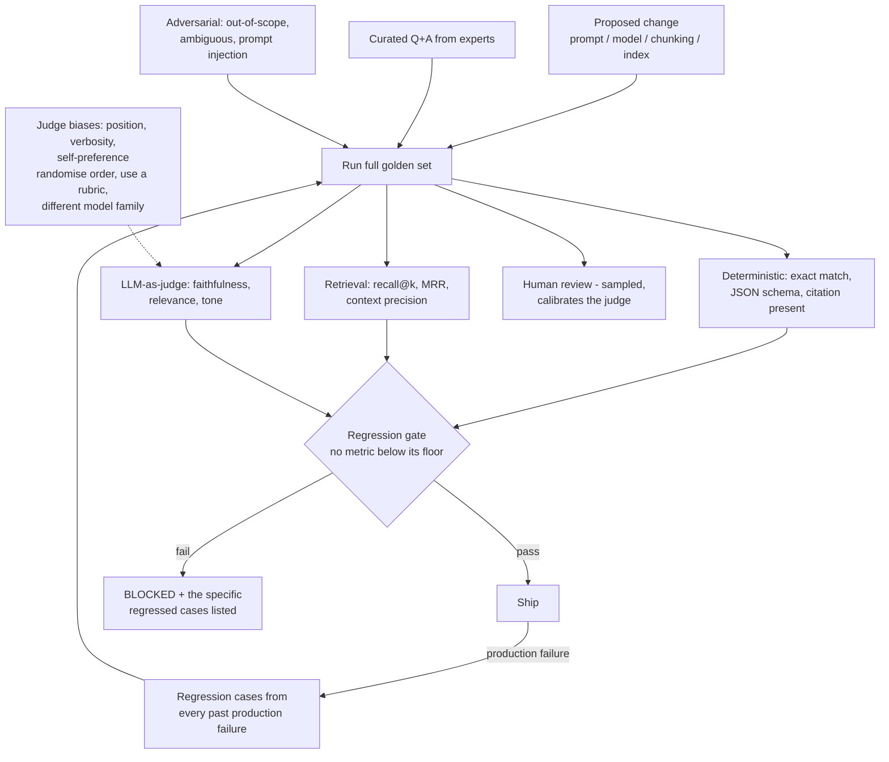

# LLM Evaluation Harnesses and Regression Gates for Production AI

**Level:** Advanced
**Tree:** [Production AI Systems](../README.md)
**Branch:** [Retrieval and Evaluation](README.md)
**Forest:** [AI & Intelligent Systems](../../../README.md)

## Explanation

### Prompt changes are not local

Changing a prompt to fix one behaviour routinely breaks another, with no warning and no
error. The same is true of changing the model, the chunking strategy or the index.
**Without a fixed evaluation set measured on every change, AI system quality is
anecdote** - whoever tested last and liked the result.

### What the golden set contains

Curated questions with expected answers from domain experts. **Adversarial cases** -
out-of-scope questions the system should decline, ambiguous phrasing, prompt injection
attempts. And **regression cases**: every production failure becomes a permanent test,
so the harness grows from real incidents rather than staying a fixed benchmark.

### Scoring in layers

Deterministic checks first - exact match, valid JSON against a schema, a citation
present. Retrieval metrics separately, because a wrong answer caused by bad retrieval
needs a different fix from one caused by bad generation. Then **LLM-as-judge** for
faithfulness, relevance and tone, with a sampled subset reviewed by humans to calibrate
the judge.

### LLM-as-judge has known biases

It favours the answer shown first (**position bias**), favours longer answers
(**verbosity bias**), and favours outputs from its own model family
(**self-preference**). Mitigate by randomising order, scoring against an explicit rubric
rather than pairwise, using a different model family as judge, and periodically
calibrating against human labels. Used without these corrections it produces confident,
systematically skewed numbers.

### The gate is what makes it engineering

No metric may fall below its floor. A failing gate must emit the specific regressed
cases, not a pass/fail flag - the failing case list is what makes the result actionable.

## Architecture and flow



## Commands

### Command 1

Run a declarative prompt evaluation across variants and assertions, emitting machine-readable results for a gate

```text
promptfoo eval -c promptfooconfig.yaml --output results.json
```

### Command 2

Disable caching and repeat runs to measure output variance - a single run hides nondeterminism

```text
promptfoo eval --no-cache --repeat 3
```

### Command 3

Score a RAG system on faithfulness and retrieval-specific metrics, separating generation from retrieval failure

```text
python -m ragas evaluate --dataset eval.jsonl --metrics faithfulness,answer_relevancy,context_precision
```

### Command 4

Run evaluation as unit tests so failures surface in CI like any other test failure

```text
deepeval test run test_rag.py
```

### Command 5

Any change under the prompt directory must trigger the full evaluation - prompts are code

```text
git diff --stat prompts/
```

### Command 6

Run the suite with repeats and caching disabled to measure output variance before setting a gate tolerance

```text
promptfoo eval --no-cache --repeat 5 --output variance-report.json
```

## Automation scripts

### eval_regression_gate.py

```python
#!/usr/bin/env python3
"""Regression gate for an LLM system. Compares a candidate run against the
stored baseline and blocks on any metric falling below its floor.
Emits the SPECIFIC regressed cases so the result is actionable.
"""
import json
import sys

FLOORS = {
    "exact_match": 0.85,
    "citation_present": 0.95,
    "faithfulness": 0.90,
    "context_recall": 0.80,
    "refusal_on_out_of_scope": 0.95,
    "injection_resisted": 1.00,      # zero tolerance
}
MAX_DROP = 0.02   # allowed regression vs baseline, for judge noise

baseline = json.load(open("eval_baseline.json"))
candidate = json.load(open("eval_candidate.json"))

failures = []

for metric, floor in FLOORS.items():
    cand = candidate["metrics"].get(metric)
    base = baseline["metrics"].get(metric)

    if cand is None:
        failures.append("%s: not measured - the harness did not run this metric" % metric)
        continue

    if cand < floor:
        failures.append("%s: %.3f below floor %.3f" % (metric, cand, floor))

    # A metric can sit above its floor and still have regressed materially.
    if base is not None and cand < base - MAX_DROP:
        failures.append(
            "%s: regressed %.3f -> %.3f (drop %.3f exceeds %.3f)"
            % (metric, base, cand, base - cand, MAX_DROP)
        )

# The failing case list is what makes the gate actionable.
regressed_cases = []
base_cases = {c["id"]: c for c in baseline.get("cases", [])}
for case in candidate.get("cases", []):
    b = base_cases.get(case["id"])
    if b and b.get("passed") and not case.get("passed"):
        regressed_cases.append(case)

print("Evaluation: %d cases" % len(candidate.get("cases", [])))
for metric in sorted(FLOORS):
    c = candidate["metrics"].get(metric)
    b = baseline["metrics"].get(metric)
    if c is not None:
        arrow = ""
        if b is not None:
            arrow = " (was %.3f)" % b
        print("  %-26s %.3f%s" % (metric, c, arrow))
print("")

if regressed_cases:
    print("CASES THAT PASSED BEFORE AND FAIL NOW:")
    for c in regressed_cases[:20]:
        print("  [%s] %s" % (c["id"], c.get("query", "")[:70]))
    print("")

if failures:
    print("GATE FAILED")
    for f in failures:
        print("  " + f)
    sys.exit(1)

print("GATE PASSED")
sys.exit(0)
```

## Lab

**Objective:** Build an evaluation harness with a golden set, wire it into CI as a blocking gate, and prove that a plausible prompt improvement causes a measurable regression elsewhere.

### Steps

1. Assemble 50 golden questions with expert answers covering the system in-scope behaviour.
2. Add 15 adversarial cases: out-of-scope questions that must be declined, ambiguous phrasing, and prompt injection attempts.
3. Implement deterministic scoring for citation presence and JSON schema validity.
4. Add retrieval metrics separately from generation metrics so failures can be attributed.
5. Add an LLM-as-judge scorer using a different model family from the one under test.
6. Calibrate the judge against 20 human-labelled examples and record the agreement rate.
7. Establish a baseline run and store it.
8. Make a plausible prompt improvement - for example instructing the model to be more concise.
9. Run the gate and observe the effect: conciseness typically improves while citation presence or faithfulness degrades.
10. Confirm the gate blocks and lists the specific regressed cases.
11. Take one regressed case, add it permanently to the regression set, then fix the prompt and confirm the gate passes.

### Validation

- A plausible prompt improvement is caught degrading a different metric.
- The gate blocks and names the failing cases.
- Judge agreement with human labels is measured rather than assumed.
- The regression set grows from a real failure.
- Output variance is measured across repeated runs and the gate tolerance is set above the observed noise floor.

## Operational automation

### Automating evaluation

- **Gate on every change to prompts, models, chunking or index parameters.** Prompts are
  code: they change behaviour, they regress, and they belong under the same CI discipline
  as anything else that can break production.
- **Store the baseline in version control** so regressions are diffable and the history of
  quality is visible over time. A baseline held only in a dashboard cannot be reviewed
  alongside the change that moved it.
- **Feed production failures back into the regression set automatically**, and make
  adding a case the standard closing action for an incident. A harness that does not grow
  from real failures becomes a fixed benchmark the system is quietly overfitted to.
- **Run with repeats and caching disabled** to measure output variance, then set gate
  tolerances above the measured noise floor. A gate tighter than the system's own
  nondeterminism produces flaky failures, and a flaky gate gets disabled within weeks.
- **Pin the judge model version** as part of the harness configuration and re-score the
  stored baseline when it must be upgraded. Judge drift shifts every score at once, which
  looks exactly like a system-wide quality change that never happened.
- **Emit the failing case list, not a pass/fail flag.** A gate that reports only that
  something regressed sends the engineer back to reproduce it by hand, which is where the
  time actually goes.
- **Hold injection resistance at a floor of 1.0.** Unlike quality metrics it is not a
  trade-off to be tuned against latency or cost, and a single regression there is a
  security finding rather than a score movement.

## Troubleshooting

### Scenario 1: Evaluation scores swing between runs with no change to the system.

**Likely cause:** Nondeterministic generation combined with single-run measurement.

**Resolution:** Set temperature to zero where the use case allows, run each case several times and aggregate, and set the gate tolerance above the measured variance. Measure the noise floor explicitly before choosing the tolerance - a gate tighter than the system's own nondeterminism produces flaky failures, and a flaky gate is disabled within weeks, which costs more than having no gate at all.

### Scenario 2: LLM-as-judge consistently rates one variant higher, but humans disagree.

**Likely cause:** Judge bias - position, verbosity or self-preference.

**Resolution:** Randomise presentation order, score against an explicit rubric rather than pairwise comparison, and use a judge from a different model family than the generator. Verbosity bias is the one to check first, since it rewards exactly the longer answers users tend to rate worse. Calibrate against a sample of human labels on a schedule, because the disagreement is evidence the judge needs recalibration rather than evidence the humans are wrong.

### Scenario 3: Answers are wrong but the generation model is clearly capable.

**Likely cause:** Retrieval failure rather than generation failure - the correct context never reached the model.

**Resolution:** Separate retrieval metrics from generation metrics in the harness and read context recall first. If recall is low the fix is upstream in chunking, embedding or filtering, and further prompt work will not help - it will usually produce a more fluent wrong answer. Only once retrieval is demonstrably returning the right passages is a generation or prompt change the correct response.

### Scenario 4: The gate passes but users report quality has fallen.

**Likely cause:** The golden set no longer represents production traffic, and the system has been implicitly overfitted to a set that has not changed in months.

**Resolution:** Sample recent production queries, compare their distribution against the golden set, and add the query shapes that are missing. Treat a passing gate alongside falling user satisfaction as evidence about the set rather than about the users. Make regression-case capture a standard closing action for incidents so the set keeps pace with real usage instead of drifting.

### Scenario 5: A judge model upgrade shifted every score at once.

**Likely cause:** Judge drift - the scoring model was updated, so scores before and after the change are not comparable.

**Resolution:** Pin the judge model version and treat it as part of the harness configuration under version control, exactly like the prompt. When the judge must be upgraded, re-score the stored baseline with the new judge and re-establish the floors from that rescored baseline, rather than comparing new scores against numbers produced by the old one. Record the judge version alongside every stored result so this is detectable at all.

## Interview questions

### 1. Why does an LLM system need a fixed evaluation set?

Because changes to an LLM system are not local, and nothing in the stack tells you when one has done damage. Adjusting a system prompt to fix one behaviour routinely breaks another - a clarifying instruction that improves refusal on out-of-scope questions can suppress legitimate answers at the boundary - and the same is true of swapping the model, changing the chunking strategy, or retuning index parameters. None of that raises an error. The regression is a behaviour change, and behaviour changes are only visible against a fixed reference. Without one, quality assessment reduces to whoever tested last and liked what they saw, which means the system's quality history is anecdote and no change can be defended in a review. The fixed set is what converts the work into engineering: it makes quality a measured property with a baseline, a diff and a trend, so a proposed prompt change arrives with evidence rather than an opinion. I would rather ship with a small, honest golden set measured on every change than a large one assembled once and never run.

### 2. What biases does LLM-as-judge introduce?

Three that matter operationally, and all of them produce confident numbers rather than obvious errors, which is what makes them dangerous. Position bias: the judge favours whichever answer is presented first, so a pairwise comparison run in a fixed order systematically advantages one variant. Verbosity bias: it favours longer answers largely independent of quality, which is actively harmful because verbosity is usually what users complain about. Self-preference: it rates outputs from its own model family higher, so using the same model as both generator and judge quietly grades its own work. The mitigations are cheap and should be default: randomise presentation order, score each answer against an explicit rubric with defined criteria rather than asking for a pairwise preference, use a judge from a different model family than the generator, and periodically calibrate the judge against a sample of human labels. Without those corrections the harness still produces a number every run - it is simply skewed in a consistent direction, which is worse than no number because it is trusted.

### 3. Why separate retrieval metrics from generation metrics?

Because they point at different fixes, and an end-to-end score cannot distinguish them. If context recall is low, the right passage never reached the model, and no amount of prompt engineering or model upgrading will recover it - the work is upstream in chunking, embedding, filtering or index parameters. If retrieval demonstrably returned the correct context and the answer is still wrong, the failure is in generation or in the prompt's grounding instructions. Measuring only final answer quality tells you something is broken while giving you no way to attribute it, which in practice means the team re-prompts blindly because prompts are the cheapest thing to change, and often makes retrieval-caused failures worse by adding instructions that paper over missing context. I instrument each stage with its own metric - context recall and precision for retrieval, faithfulness and relevance for generation - so a failing gate names the stage as well as the case. That attribution is what makes a failure actionable within one debugging session rather than several.

### 4. How should the golden set evolve?

It has to grow from production, not stay as assembled. Every real failure - a wrong answer, a hallucinated citation, a successful prompt injection, an inappropriate refusal - becomes a permanent regression case with the expected behaviour recorded. A harness built once and frozen degrades in two ways: it stops representing what users actually ask as usage shifts, and the system becomes implicitly overfitted to it, so the score stays high while real quality falls. Feeding incidents back in is what keeps the set adversarial and current, and it changes the incident response conversation, because "add a regression case" becomes the standard closing action rather than an optional one. I keep three parts in the set deliberately: curated expert cases for core quality, adversarial cases for scope and injection resistance, and the accumulated regression cases from incidents. The last group is the one that grows, and it is the group that catches the failures that actually recur.

## Certification alignment

- AI-102 Azure AI Engineer Associate - evaluate and monitor generative AI solutions
- AI-102 Azure AI Engineer Associate - implement responsible AI practices including content safety evaluation
- Google Professional Machine Learning Engineer - model evaluation, monitoring and continuous improvement
- ISO/IEC 42001 - AI management system requirements: performance evaluation and continual improvement
- Vendor-neutral - NIST AI RMF MEASURE function: documented, repeatable evaluation of AI system behaviour

## References

- RAGAS documentation - faithfulness, answer relevancy and context precision metrics
- Promptfoo documentation - declarative evaluation configuration and CI integration
- DeepEval documentation - unit-test style assertions for LLM outputs
- Research literature on LLM-as-judge position, verbosity and self-preference bias and mitigations
- NIST AI Risk Management Framework - MEASURE function guidance on evaluation practice

## Suggested video search

LLM evaluation harness golden dataset LLM as judge bias regression gate RAGAS faithfulness

---

> Validate commands, versions, permissions, licensing, and rollback procedures in an isolated lab before production use.
