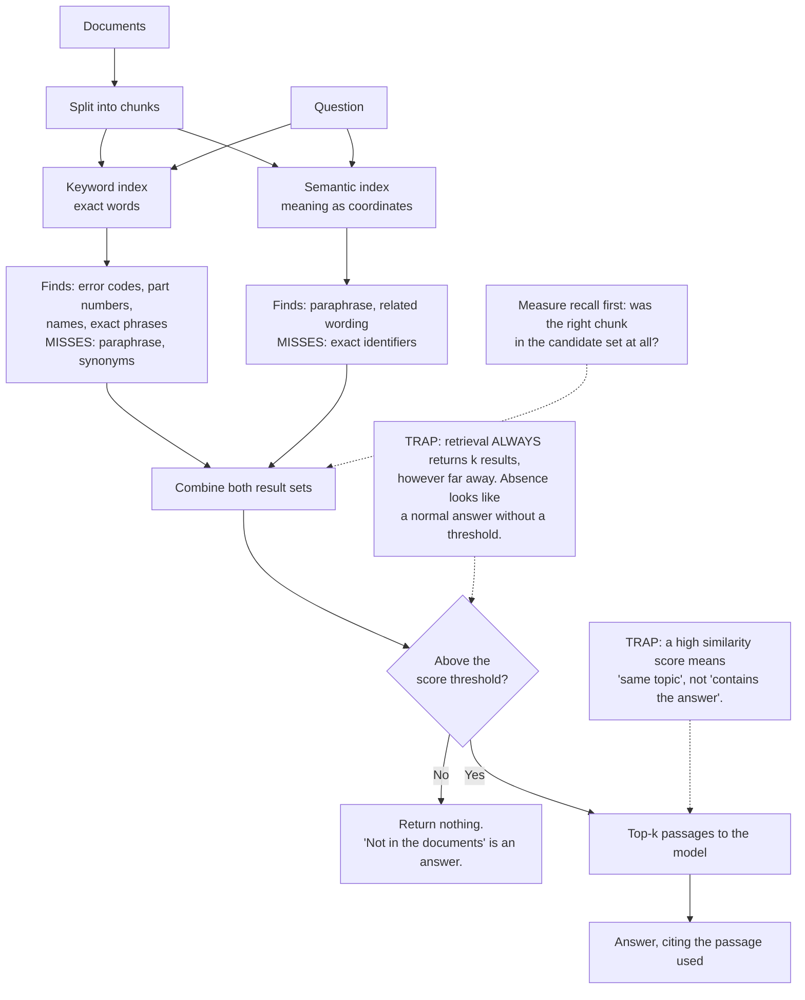

# How Retrieval Finds Things: Keywords, Meaning and Why Each One Misses

**Level:** Beginner
**Tree:** [Production AI Systems](../README.md)
**Branch:** [Retrieval and Evaluation](README.md)
**Forest:** [AI & Intelligent Systems](../../../README.md)

## Explanation

### Two ways to find a document, and they fail differently

Retrieval has two families, and the entire subject follows from how each one breaks.
**Keyword search matches the words that are actually present** - fast, exact, and blind to
paraphrase, so a query for "cannot sign in" misses a document that says "authentication
failure". **Semantic search matches meaning** by comparing numeric representations of
text, so it handles paraphrase and synonyms well, and is correspondingly weak wherever the
exact characters matter. Neither is the better one. Knowing which failure you are looking
at is the difference between fixing retrieval in an afternoon and rewriting prompts for a
week.

### An embedding turns text into coordinates, and near is not the same as relevant

A semantic index converts each chunk into a list of numbers positioned so that
similar-meaning text lands close together, and a query is converted the same way and
matched to its nearest neighbours. That is all it is. **Nothing in this process knows
whether the answer is in the chunk** - it knows the chunk is on a similar subject. A
passage that discusses your question at length without answering it scores beautifully, so
a high similarity score is a statement about topic, not about usefulness, and treating it
as a confidence score is a mistake teams make early and pay for later.

### Retrieval always returns something

There is no "not found". Asking for the top five results returns the five nearest chunks
however far away they are, so a query about something entirely absent from your corpus
still comes back full, with plausible-looking passages attached. **The system cannot tell
you it has nothing** unless you make it: set a similarity threshold below which results
are discarded, and instruct the model to say when the supplied passages do not contain the
answer. Without both, the failure mode is a confident answer assembled from the least
irrelevant material available.

### Exact identifiers are where semantic search embarrasses itself

The most reliable way to see the weakness is an error code, a part number or a ticket
reference. Ask for `0x80070005` and a semantic index returns documents about errors in
general, because the representation captures meaning and an identifier carries almost
none of it: the string simply has to match. Keyword search finds it instantly.
Enterprise corpora are full of exactly this kind of token, which is **why production systems run both and
combine the results** rather than choosing a side, and why a demo that worked on prose
falls over on a real support corpus.

### Recall first, precision second

Two questions sound similar and are not. Did the answer-bearing passage make it into the
candidate set at all - and was the set free of junk. **Recall comes first, because nothing
downstream can recover a passage that was never retrieved.** Reranking, prompt changes and
bigger models all operate on what retrieval handed over. Measure "is the right chunk in the
top twenty" before tuning anything else; if that number is poor, everything you do further
along is decoration.

### Test retrieval without the model

Retrieval can be evaluated entirely on its own, and doing so is faster, cheaper and far
easier to interpret than judging final answers. Write down real queries with the documents
that should be found, then measure how often each is retrieved. **This separates a
retrieval problem from a generation problem before either is guessed at** - the single most
useful habit in this branch, and the foundation the evaluation harness and reranking work
is built on.

## Architecture and flow



## Commands

### Command 1

Prove the keyword weakness to yourself - an exact-term search that misses the paraphrase

```text
grep -ril "authentication failure" corpus/ | head; grep -ril "cannot sign in" corpus/ | head
```

### Command 2

Run the same question through the semantic index and read the scores, not just the order

```text
curl -s "$SEARCH/indexes/docs/docs/search?api-version=2024-07-01" -H "api-key: $KEY" -d "{\"vectorQueries\":[{\"kind\":\"text\",\"text\":\"$Q\",\"fields\":\"embedding\",\"k\":5}]}" | jq -r ".value[] | [.\"@search.score\", .id] | @tsv"
```

### Command 3

Ask for an identifier that is not in the corpus, and watch five confident results come back anyway

```text
curl -s "$SEARCH/indexes/docs/docs/search?api-version=2024-07-01" -H "api-key: $KEY" -d "{\"vectorQueries\":[{\"kind\":\"text\",\"text\":\"ZZ-99999\",\"fields\":\"embedding\",\"k\":5}]}" | jq -r ".value[].\"@search.score\""
```

### Command 4

Compare the two modes on the same identifier, which is the clearest demonstration of why both are needed

```text
curl -s "$SEARCH/indexes/docs/docs/search?api-version=2024-07-01&search=0x80070005" -H "api-key: $KEY" | jq -r ".value[].id"
```

### Command 5

Check what actually reached the model, before forming any opinion about the answer

```text
jq -r ".retrieved[] | [.score, .doc_id] | @tsv" query-trace.json
```

### Command 6

Measure recall directly - how often the expected document appears anywhere in the candidate set

```text
jq -r "select(.expected_doc as $e | .retrieved | map(.doc_id) | index($e)) | .query" eval-trace.jsonl | wc -l
```

## Automation scripts

### retrieval_recall.py

Teams debug retrieval by reading answers, which confuses two separate problems. This
measures retrieval alone against known query-to-document pairs, reports recall for each
mode, and names which queries each mode misses - the evidence that decides whether you
need keywords, meaning, or both.

Requires `pip install requests`. The query key is read from `SEARCH_API_KEY` rather than
the command line, where it would be kept in shell history.

```python
#!/usr/bin/env python3
"""Measure retrieval recall per mode, with no model involved.

Takes pairs of {query, expected_doc_id} and reports how often each search
mode puts the expected document anywhere in the top k. Recall comes first:
nothing downstream can recover a passage that was never retrieved.
"""
import argparse
import json
import os
import sys
from collections import defaultdict

import requests

def search(endpoint, key, index, mode, query, k):
    """mode: 'keyword' | 'semantic' | 'hybrid'."""
    body = {"top": k}
    if mode in ("keyword", "hybrid"):
        body["search"] = query
    if mode in ("semantic", "hybrid"):
        body["vectorQueries"] = [
            {"kind": "text", "text": query, "fields": "embedding", "k": k}
        ]
    response = requests.post(
        f"{endpoint}/indexes/{index}/docs/search?api-version=2024-07-01",
        headers={"api-key": key, "content-type": "application/json"},
        json=body, timeout=30,
    )
    response.raise_for_status()
    return [hit["id"] for hit in response.json().get("value", [])]

def main():
    parser = argparse.ArgumentParser()
    parser.add_argument("pairs", help='JSONL of {"query": ..., "expected_doc": ...}')
    parser.add_argument("--endpoint", required=True)
    parser.add_argument("--index", required=True)
    parser.add_argument("-k", type=int, default=20)
    args = parser.parse_args()
    key = os.environ.get("SEARCH_API_KEY") or parser.error("set SEARCH_API_KEY first")

    with open(args.pairs) as handle:
        cases = [json.loads(line) for line in handle if line.strip()]

    misses = defaultdict(list)
    hits = defaultdict(int)
    for mode in ("keyword", "semantic", "hybrid"):
        for case in cases:
            found = search(args.endpoint, key, args.index, mode,
                           case["query"], args.k)
            if case["expected_doc"] in found:
                hits[mode] += 1
            else:
                misses[mode].append(case["query"])

    total = len(cases)
    print(f"{'mode':<12}{f'recall@{args.k}':>12}{'missed':>9}")
    for mode in ("keyword", "semantic", "hybrid"):
        print(f"{mode:<12}{hits[mode] / total:>11.0%}{total - hits[mode]:>9}")

    # The useful part is not the score - it is which queries each mode loses.
    only_keyword = set(misses["semantic"]) - set(misses["keyword"])
    only_semantic = set(misses["keyword"]) - set(misses["semantic"])
    if only_keyword:
        print("\nSemantic missed, keyword found (usually exact identifiers):")
        for query in sorted(only_keyword)[:5]:
            print(f"  {query}")
    if only_semantic:
        print("\nKeyword missed, semantic found (usually paraphrase):")
        for query in sorted(only_semantic)[:5]:
            print(f"  {query}")
    if only_keyword and only_semantic:
        print(
            "\nBoth lists are non-empty, which is the argument for running both "
            "and combining the results rather than picking a side."
        )
    return 0

if __name__ == "__main__":
    sys.exit(main())
```

## Lab

**Objective:** Show by measurement that keyword and semantic retrieval miss different things, and that a system with no threshold cannot tell you when the answer is absent.

### Steps

1. Index a small real corpus that contains both prose and exact identifiers such as error codes or part numbers.
2. Write twenty query-to-document pairs from questions you already know the answers to, including at least five identifier lookups.
3. Run `retrieval_recall.py` for keyword, semantic and hybrid, and record recall for each.
4. Read the two miss lists and confirm each mode loses a different class of query.
5. Query a paraphrase of a document that shares none of its words, and observe what keyword search returns.
6. Query an identifier that exists in the corpus, and observe where semantic search ranks it.
7. Query an identifier that does not exist anywhere, and count how many results come back.
8. Add a similarity threshold, repeat step 7, and confirm the system now returns nothing.
9. Instruct the model to answer only from the supplied passages and to say when they do not contain the answer, then repeat step 7 end to end.
10. Take one wrong answer from the whole run and classify it as a retrieval failure or a generation failure using the retrieved passages alone.

### Validation

- Recall is recorded for all three modes on the same pairs, so the comparison is like for like.
- The two miss lists are non-empty and disjoint in class, demonstrating the failures differ rather than merely differing in degree.
- An identifier present in the corpus is found by keyword search and ranked poorly or missed by semantic search.
- A query for an absent identifier returns a full result set before the threshold and nothing after it.
- The end-to-end system says it does not know, rather than assembling an answer from the least irrelevant passages.
- One wrong answer is classified as retrieval or generation using only the retrieved passages, with the reasoning written down.

## Operational automation

### Keeping retrieval honest as the corpus grows

- **Keep a query-to-document set and run it on every index change.** Chunking, embedding
  model and analyser changes all move recall, usually without anyone noticing until
  answers degrade. This set is cheap to run because no model is involved, which is exactly
  why it should gate the change.
- **Enforce a similarity threshold, and return nothing below it.** Without one, a query
  about something absent from the corpus still returns a full result set, and the system
  has no way to say so. "Not in the documents" has to be a possible outcome before it can
  ever be the right one.
- **Log the retrieved passage ids and scores with every answer.** This one field decides
  whether a complaint takes ten minutes or two days, because it separates a retrieval
  failure from a generation failure immediately.
- **Re-embed the whole corpus when the embedding model changes.** Vectors from two
  different models are not comparable, and a partially re-embedded index degrades quietly
  rather than failing, which is far harder to notice.
- **Track recall separately from answer quality.** They move independently, and a dashboard
  that only shows answer scores hides the case where retrieval got worse and the model
  compensated - until the day it cannot.
- **Reconcile the index against the source of truth on a schedule.** Deleting a document
  does not remove its vectors, and an index that answers from withdrawn material is a
  governance finding rather than a quality one.

## Troubleshooting

### Scenario 1: Searching for an error code returns documents about errors in general.

**Likely cause:** Only semantic search is running. An identifier carries almost no meaning to embed - it is a string that has to match - so the nearest neighbours are documents on the same topic rather than the one containing the code.

**Resolution:** Run keyword search alongside the semantic index and combine the result sets. Confirm the diagnosis by searching the same identifier lexically: an instant exact hit where the semantic index ranked it poorly is the whole argument for hybrid retrieval. Enterprise corpora are full of codes, part numbers and ticket references, so this is a routine requirement rather than an edge case.

### Scenario 2: A question phrased differently from the document finds nothing.

**Likely cause:** Only keyword search is running. The query and the document share no words, and lexical matching has no notion that "cannot sign in" and "authentication failure" describe the same thing.

**Resolution:** Add a semantic index so paraphrase is matched on meaning. Confirm the diagnosis by rewording the query using the document's own vocabulary: an immediate hit proves the content was always there and the matching mode was the limit. This is the mirror image of the identifier problem, which is why systems run both rather than choosing.

### Scenario 3: The assistant answers confidently about something absent from the corpus.

**Likely cause:** No score threshold. Retrieval returned its k nearest chunks regardless of distance, and the model treated plausible-looking but irrelevant passages as the source material.

**Resolution:** Set a similarity floor below which results are discarded, and instruct the model to say when the supplied passages do not answer the question - then verify it actually refuses when given irrelevant context. Confirm the diagnosis by querying a deliberately absent identifier and counting the results: a full set proves the system cannot express absence.

### Scenario 4: A passage scores very highly and does not contain the answer.

**Likely cause:** The score is a measure of topical similarity, not of whether the answer is present. A passage that discusses the question at length without answering it is genuinely near in meaning.

**Resolution:** Stop treating the score as a confidence signal, and evaluate whether the answer is present rather than whether the topic matches - which is what reranking exists to improve. Confirm the diagnosis by reading the top passage as the model receives it: if a careful human could not answer from it either, retrieval did its job as specified and the specification was the problem.

### Scenario 5: Recall dropped after a routine change and nobody noticed for weeks.

**Likely cause:** A chunking, analyser or embedding-model change shifted what gets retrieved, and only answer quality was being watched - which the model masked until it could not.

**Resolution:** Run the query-to-document set as a gate on every index change and track recall as its own metric alongside answer quality. Confirm the diagnosis by replaying the set against the previous index configuration. If the embedding model changed, check the whole corpus was re-embedded: vectors from two models are not comparable, and a partial migration degrades quietly rather than failing.

## Interview questions

### 1. Why do production systems run both keyword and semantic search?

Because they fail on different things, and enterprise corpora contain both kinds of content. Keyword search matches words that are literally present, so it is excellent for error codes, part numbers, names and exact phrases, and blind to paraphrase - a query for "cannot sign in" will not find a document that says "authentication failure". Semantic search compares meaning, so it handles paraphrase well and is weak exactly where the characters matter, because an identifier carries almost nothing to embed and its nearest neighbours end up being documents on the same general topic. Neither is better; they lose different queries. The way I would demonstrate it rather than assert it is to take twenty real query-to-document pairs, measure recall for each mode, and read the two miss lists. If both are non-empty and they contain different classes of query, that is the argument for running both and combining the results, made from evidence rather than from a diagram.

### 2. What does a similarity score actually tell you?

That the passage is near the query in meaning - which is a statement about topic, not about whether the answer is in it. A passage that discusses your question at length without answering it scores very well, and that is correct behaviour rather than a bug. So I would not treat the score as a confidence signal about the answer, which is a mistake teams make early and pay for later when they build thresholds and UI on top of it. What the score is genuinely useful for is distance: below some floor, results are far enough away that returning them is worse than returning nothing. That matters because retrieval always returns something - ask for five results and you get the five nearest however far they are - so without a threshold a query about content that is entirely absent still comes back full, and the model assembles a confident answer from the least irrelevant material available.

### 3. A user says the assistant gave a wrong answer. What do you look at first?

The retrieved passages, before the prompt and before the model. The model can only answer from what reached it, so if the answer-bearing passage was never retrieved, no prompt change and no better model will fix it - and most reports of this kind are retrieval failures wearing a generation failure's clothes. The fast test is to paste the correct passage in by hand and ask again: if the answer is now right, the fault is in chunking, the query or how many results are fetched. This is also why I insist on logging retrieved passage ids and scores alongside every answer, because without that field the investigation starts with guesswork and usually ends with someone rewriting a prompt that was never the problem. Underneath it is the general rule: recall first. Nothing downstream can recover a passage that retrieval did not hand over.

### 4. How would you test retrieval without judging any answers?

By writing down real queries paired with the documents that should be found, then measuring how often each expected document appears anywhere in the top k. That is recall, it needs no model, and it is cheap enough to run as a gate on every index change - which matters because chunking, analyser and embedding-model changes all move it silently. I keep it separate from answer quality deliberately, since the two move independently and a dashboard showing only answer scores will hide a retrieval regression for as long as the model manages to compensate. The other thing this buys is diagnosis: when recall per mode is measured, the miss lists tell you which class of query each mode loses, so the decision about keywords, meaning or both is made from evidence. If the embedding model ever changes, I would also confirm the entire corpus was re-embedded, because vectors from two models are not comparable and a partial migration degrades quietly.

## Certification alignment

- AI-900 Azure AI Fundamentals - core search and language concepts underpinning retrieval
- AI-102 Azure AI Engineer Associate - implementing search solutions, indexing and retrieval-augmented generation
- AWS Certified AI Practitioner - retrieval basics, embeddings and grounding generative applications
- Google Professional Machine Learning Engineer - vector search, embeddings and retrieval evaluation
- Vendor-neutral - classical information retrieval: precision, recall and relevance judgements

## References

- Azure AI Search documentation - full-text search, vector search and how hybrid queries combine them
- OpenAI documentation - embeddings, similarity and their appropriate uses
- Okapi BM25 - the ranking function behind most lexical search implementations
- TREC evaluation methodology - relevance judgements, recall and precision as an evaluation discipline
- Elasticsearch documentation - analysers, tokenisation and why exact-term matching behaves as it does

## Suggested video search

keyword versus semantic search embeddings recall at k hybrid retrieval why vector search misses error codes beginner

---

> Validate commands, versions, permissions, licensing, and rollback procedures in an isolated lab before production use.
