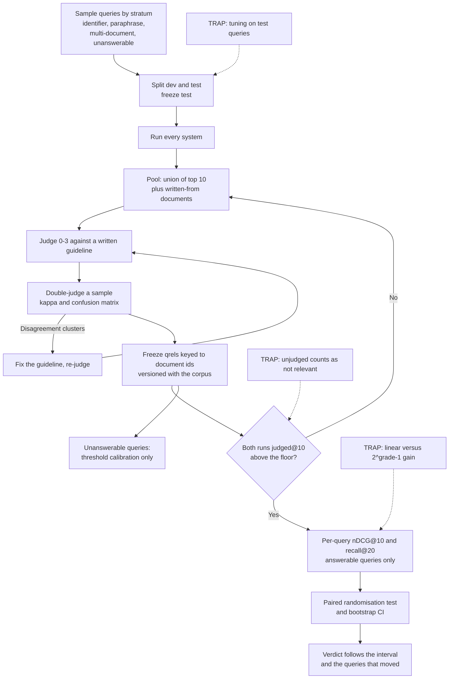

# Retrieval Test Collections: Graded Judgements, Pooling and Telling a Real Improvement from Noise

**Level:** Intermediate
**Tree:** [Production AI Systems](../README.md)
**Branch:** [Retrieval and Evaluation](README.md)
**Forest:** [AI & Intelligent Systems](../../../README.md)
**Readiness:** [Lab](../../../READINESS.md#lab) - checked offline, not yet run against a live service. A live run needs only a stock CI runner.

## Explanation

### One expected document is an answer key, not a test collection

[How Retrieval Finds Things](ai-how-retrieval-finds-things.md) scores recall against one
expected document per query. Real queries have several relevant documents of different
usefulness, so judge each (query, document) pair from 0 (not relevant) to 3 (highly
relevant). Azure Databricks AI Search (Beta) has an LLM judge apply that scale and counts
"score >= 2" as relevant for Precision and MRR. Here humans apply it with a written
guideline, and this leaf extends the same cutoff to recall, which that page defines only as
the fraction of "known relevant documents" retrieved.

### Judge the pool, and check coverage before comparing

Judging every document for every query is unaffordable, so this leaf's method judges the
**pool**: the union of each system's top 10, plus the documents each query was written
from. The pool is a sample. For T31, "admin rights and disabling accounts of leavers", no
pooled run ranks ACC-03 (the leaver process) in its top 10, so it is judged only because
the query was written from it. Default nDCG, recall and MRR score an unjudged document as
not relevant, so a system added later is penalised for finding documents nobody labelled.
ir_measures' `judged_only=True` and `Bpref` skip unjudged documents instead, which
diagnoses holes but does not fill them. Microsoft Foundry's `document_retrieval` evaluator
reports these as **Holes**: "Number of documents with missing query relevance judgments,
or ground truth". Check **judged@10** for both runs first.

### Key labels to documents, and measure the judges

Key the judgements (**qrels**) to document ids and score a chunked retriever by each
document's best chunk, so a chunk-size sweep reuses the labels. The lab in
[RAG Architecture](../../ai-tree-applied-systems/ai-branch-rag-knowledge/ai-rag-architecture.md)
labels 15-20 queries with one `expected_source` each; on 15 queries one query flipping
moves recall@5 by about 0.07, so replace them with a collection like this one before
trusting its chunk-size winner. Double-judge a sample and compute Cohen's kappa, which
corrects agreement for chance; scikit-learn's `cohen_kappa_score` computes it, with
`weights="linear"` for the weighted form. Unlike the raw model-to-human agreement rate on
answers in [Evaluation Harnesses](ai-evaluation-harness-gates.md), this is agreement between
assessors on documents, and its confusion matrix shows which guideline boundary to rewrite.

### Name the metric and its formula

Recall@20 asks whether the passage reached the model, MRR whether the first hit is good,
nDCG@10 how well graded results are ordered. nDCG has two gains: ranx `ndcg` is linear and
`ndcg_burges` is 2^grade - 1. ir_measures' `nDCG` defaults to `dcg='log2'`, the linear form
(the other choice is `'exp-log2'`), and takes a `gains` mapping. Databricks states 2^relevance - 1, as do its 31.80 maximum
and 13.63 example, but its A/B table (4.26, 8.02) is linear. ranx binary metrics also
count grade 1 as relevant unless you write `recall@20-l2`.

### A difference is a claim about queries you did not sample

On 15 queries one query flipping moves recall by 0.07, so report a paired per-query test
with an interval; Databricks puts 95% intervals on every metric and reads wide ones as "not
enough queries for reliable comparison". The script runs a sign-flip randomisation test
(ranx calls it Fisher's randomization test and cites Smucker et al., CIKM '07) and a
percentile bootstrap interval. When only m queries moved, an exact test cannot return less
than 2/2^m. Unanswerable queries have no relevant document, so exclude them from ranking
metrics and print the effective n.

### A "no answer" floor needs a score comparable across queries

Azure AI Search vector queries "always return `k` results", and a minimum threshold suits
"only ... a pure single vector query. Hybrid queries aren't conducive to minimum thresholds
because the RRF ranges are much smaller and more volatile." BM25 is unbounded too. The lab's
`cosine` run is a TF-IDF cosine: a bounded, lexical stand-in for a vector similarity. A dense
or hybrid run from [Vector Databases and Hybrid Retrieval](ai-vector-db-hybrid-retrieval.md),
written in the same ranx JSON shape, drops in unchanged. Calibrate a floor against judged
unanswerable dev queries, then report both error rates on test.

## Architecture and flow



## Commands

Each command runs in its own shell from the lab directory, so Commands 4-6 call the
environment's interpreter directly rather than relying on an activated venv.

### Command 1

Install the evaluation tools in their own environment; ranx pulls in numba.

```text
python3 -m venv .venv-eval && .venv-eval/bin/pip install ranx==0.3.21 ir-measures==0.4.3 rank_bm25==0.2.2
```

### Command 2

Build the pool: the union of each run's top 10.

```text
jq -r 'to_entries[] | .key as $q | .value | to_entries | sort_by(-.value) | .[:10][] | [$q, .key] | @tsv' runs/bm25_raw.json runs/bm25.json runs/cosine.json | sort -u > pool.tsv && wc -l < pool.tsv
```

### Command 3

Measure a run's judged@10 over all 60 queries.

```text
jq -r --slurpfile qrels fixtures/qrels.json '[to_entries[] | .key as $q | .value | to_entries | sort_by(-.value) | .[:10][] | ($qrels[0][$q][.key] != null)] | "judged@10: \(map(select(.)) | length) of \(length)"' runs/expand.json
```

### Command 4

Compare on answerable dev and then test queries with an explicit Fisher test; unset, ranx 0.3.21 runs a paired t-test at `max_p=0.01`. Each run holds both splits, hence `make_comparable`. `NUMBA_NUM_THREADS=1` is explained in Lab step 9.

```text
jq 'with_entries(select((.key | startswith("D")) and any(.value[]; . >= 2)))' qrels-v2.json > qrels-dev.json && jq 'with_entries(select((.key | startswith("T")) and any(.value[]; . >= 2)))' qrels-v2.json > qrels-test.json && NUMBA_NUM_THREADS=1 .venv-eval/bin/python -c "from ranx import Qrels, Run, compare; [print(s, compare(Qrels.from_file(f'qrels-{s}.json'), [Run.from_file(f'{p}.json', name=p) for p in ('runs/bm25_raw', 'runs/bm25', 'runs/expand', 'runs-leaky/expand')], metrics=['ndcg@10', 'recall@20-l2', 'mrr-l2'], stat_test='fisher', n_permutations=10000, max_p=0.05, make_comparable=True), sep='\n') for s in ('dev', 'test')]"
```

### Command 5

Show both traps on one run: grade 1 counted as relevant, and the other gain.

```text
.venv-eval/bin/python -c "from ranx import Qrels, Run, evaluate; print(evaluate(Qrels.from_file('qrels-test.json'), Run.from_file('runs/bm25.json'), ['recall@20', 'recall@20-l2', 'ndcg@10', 'ndcg_burges@10'], make_comparable=True))"
```

### Command 6

Export to TREC format and cross-check with ir_measures, once with its default gain and once, in a separate call, with the 2^grade - 1 mapping. In one call, ir_measures 0.4.3 can compute the plain `nDCG@10` inside the `gains=` invocation, and which one it does depended on `PYTHONHASHSEED`: with only those two measures in the call, 3 of 10 seeds printed 0.8119 and 0.0000.

```text
.venv-eval/bin/python -c "from ranx import Qrels, Run; Qrels.from_file('qrels-test.json').save('qrels-test.trec'); Run.from_file('runs/bm25.json').save('runs/bm25.trec')" && .venv-eval/bin/ir_measures qrels-test.trec runs/bm25.trec 'nDCG@10' 'Judged@10' 'R(rel=2)@20' && .venv-eval/bin/ir_measures qrels-test.trec runs/bm25.trec 'nDCG(gains={0:0,1:1,2:3,3:7})@10'
```

## Automation scripts

### test_collection.py

`runs` builds BM25 and cosine runs scored per document; `compare` refuses a verdict when
either run's judged@10 is below a floor (0.95 by default, this leaf's choice) and exits 0
with a verdict, 2 on holes and 3 when the whole ndcg@10 interval is below zero; `kappa`
measures assessors; `threshold` refuses unbounded scores. Exit 1 is a usage error or a
crash, never a verdict. Every file uses the ranx JSON
shape `{qid: {doc_id: grade}}` for qrels and `{qid: {doc_id: score}}` for runs.
Requires `pip install rank_bm25==0.2.2` for `runs`; the rest is standard library.

```python
#!/usr/bin/env python3
"""Graded test collection tools. Files use the ranx JSON shape {qid: {doc_id: grade or score}}.

Relevant means grade >= 2; a query with none is unanswerable and is used only by threshold.
compare exits 0 with a verdict, 2 on holes, 3 when the whole ndcg@10 interval is below zero;
threshold exits 2 when it refuses. Exit 1 is never a verdict: it is a usage error or a crash.
"""
import json, math, os, random, re, sys

USAGE = """usage: test_collection.py runs <corpus.jsonl> <queries.jsonl> <outdir> [--synonyms F] [--chunk N]
       test_collection.py compare <qrels.json> <base.json> <cand.json> [--split T] [--limit N] [--min-judged 0.95]
       test_collection.py kappa <judge_a.json> <judge_b.json>
       test_collection.py threshold <run.json> <qrels.json> [--split D] [--floor F]"""
STOP = set("a an and are at be by do for from how i in is it my of on or the to what when with".split())


def load(path):
    with open(path) as f:
        return [json.loads(l) for l in f if l.strip()] if path.endswith(".jsonl") else json.load(f)


def opt(args, name, default, cast=str):
    return cast(args[args.index(name) + 1]) if name in args else default


def words(text):
    return [t for t in re.findall(r"[a-z0-9]+(?:[-_./][a-z0-9]+)*", text.lower()) if t not in STOP]


def runs(args):
    try:
        from rank_bm25 import BM25Okapi
    except ImportError:
        sys.exit("runs needs rank_bm25: pip install rank_bm25==0.2.2")
    corpus, queries, out = load(args[0]), load(args[1]), args[2]
    chunk, syn = opt(args, "--chunk", 0, int), load(opt(args, "--synonyms", "")) if "--synonyms" in args else {}
    units, owner = [], []
    for doc in corpus:
        sents = re.split(r"(?<=[.!?])\s+", doc["title"] + ". " + doc["text"])
        for i in range(0, len(sents), chunk or len(sents)):
            units.append(" ".join(sents[i:i + (chunk or len(sents))]))
            owner.append(doc["id"])  # judgements stay keyed to the document
    toks = [words(u) for u in units]
    raw, bm25 = BM25Okapi([u.lower().split() for u in units]), BM25Okapi(toks)
    df = {t: sum(t in set(x) for x in toks) for t in {t for x in toks for t in x}}

    def vec(ts):
        v = {}
        for t in ts:
            v[t] = v.get(t, 0) + math.log(len(toks) / df[t]) + 1 if t in df else v.get(t, 0)
        n = math.sqrt(sum(x * x for x in v.values())) or 1
        return {t: x / n for t, x in v.items()}

    vecs = [vec(t) for t in toks]

    def to_docs(scores):  # a document scores its best chunk; ties broken by id
        best = {}
        for d, s in zip(owner, scores):
            best[d] = max(best.get(d, 0.0), float(s))
        order = sorted((d for d in best if best[d] > 0), key=lambda d: (-best[d], d))[:20]
        # 1e-5 apart: pytrec_eval (under ir_measures) treats scores 1e-7 apart as a tie
        return {d: round(best[d], 6) - i * 1e-5 for i, d in enumerate(order)}

    out_runs = {"bm25_raw": {}, "bm25": {}, "cosine": {}, "expand": {}}
    for q in queries:
        qid, qt = q["qid"], words(q["query"])
        out_runs["bm25_raw"][qid] = to_docs(raw.get_scores(q["query"].lower().split()))
        out_runs["bm25"][qid] = to_docs(bm25.get_scores(qt))
        qv = vec(qt)
        out_runs["cosine"][qid] = to_docs([sum(w * u.get(t, 0) for t, w in qv.items()) for u in vecs])
        out_runs["expand"][qid] = to_docs(bm25.get_scores(qt + [s for t in qt for s in syn.get(t, [])]))
    os.makedirs(out, exist_ok=True)
    for name, run in out_runs.items():
        if name != "expand" or syn:
            json.dump(run, open(f"{out}/{name}.json", "w"), indent=1)
            print(f"wrote {out}/{name}.json, chunk={chunk or 'whole document'}")


def per_query(qrels, run, qids):
    rows = {}
    for q in qids:
        rank = sorted(run.get(q, {}), key=lambda d: -run[q][d])
        grades = qrels[q]
        ideal = sorted(grades.values(), reverse=True)[:10]
        dcg = lambda gs: sum(g / math.log2(i + 2) for i, g in enumerate(gs))  # linear gain
        rel = {d for d, g in grades.items() if g >= 2}
        rows[q] = {"ndcg@10": dcg([grades.get(d, 0) for d in rank[:10]]) / dcg(ideal),
                   "recall@20": len(rel & set(rank[:20])) / len(rel),
                   "holes": [d for d in rank[:10] if d not in grades], "n10": min(len(rank), 10)}
    return rows


def paired(deltas, rng, n=10000):
    """Sign-flip randomisation p-value and percentile bootstrap 95% CI of the mean delta."""
    obs = abs(sum(deltas))
    hits = sum(abs(sum(d if rng.random() < 0.5 else -d for d in deltas)) >= obs - 1e-12 for _ in range(n))
    means = sorted(sum(rng.choice(deltas) for _ in deltas) / len(deltas) for _ in range(n))
    return (hits + 1) / (n + 1), means[int(0.025 * n)], means[int(0.975 * n) - 1]


def chosen(qrels, args, answerable_only=True):
    qids = sorted(q for q in qrels if q.startswith(opt(args, "--split", "T")))
    qids = qids[:opt(args, "--limit", 0, int)] if "--limit" in args else qids
    return [q for q in qids if any(g >= 2 for g in qrels[q].values())] if answerable_only else qids


def compare(args):
    qrels, base, cand = load(args[0]), load(args[1]), load(args[2])
    qids = chosen(qrels, args)
    print(f"selected {len(chosen(qrels, args, False))}, unanswerable excluded, effective n = {len(qids)}")
    print("ndcg@10 uses linear gain (ranx 'ndcg'); relevant = grade >= 2 (ranx '-l2')")
    b, c = per_query(qrels, base, qids), per_query(qrels, cand, qids)
    floor, judged, holes = opt(args, "--min-judged", 0.95, float), [], set()
    for name, x in (("base", b), ("cand", c)):
        n = sum(r["n10"] for r in x.values())
        hit = n - sum(len(r["holes"]) for r in x.values())
        judged.append(hit / max(1, n))
        print(f"{name} judged@10 = {judged[-1]:.3f} ({hit} of {n})")
        holes |= {(q, d) for q, r in x.items() for d in r["holes"]}
    if min(judged) < floor:
        print(f"NO VERDICT: judged@10 below {floor}. Judge these pairs, then re-run:")
        print("\n".join(f"  {q}\t{d}" for q, d in sorted(holes)))
        return 2
    rng, worse = random.Random(7), False
    for m in ("ndcg@10", "recall@20"):
        deltas = [c[q][m] - b[q][m] for q in qids]
        p, lo, hi = paired(deltas, rng)
        mb, mc = (sum(r[m] for r in x.values()) / len(qids) for x in (b, c))
        print(f"{m:<10} base {mb:.3f} cand {mc:.3f} delta {mc - mb:+.3f} 95% CI [{lo:+.3f}, {hi:+.3f}] p = {p:.4f}")
        worse = worse or (m == "ndcg@10" and hi < 0)
    delta = {q: c[q]["ndcg@10"] - b[q]["ndcg@10"] for q in qids}
    moved = [f"{q} {delta[q]:+.3f}" for q in sorted(qids, key=lambda q: -abs(delta[q])) if abs(delta[q]) > 1e-9]
    print(f"ndcg@10 moved on {len(moved)} of {len(qids)} queries: {', '.join(moved[:5]) or 'none'}")
    return 3 if worse else 0


def kappa(args):
    a, b = load(args[0]), load(args[1])
    pairs = [(a[q][d], g) for q in b for d, g in b[q].items() if d in a.get(q, {})]
    if not pairs:
        sys.exit("no pair is labelled in both files")
    m = [[sum(p == (i, j) for p in pairs) for j in range(4)] for i in range(4)]
    rows, cols = [sum(r) for r in m], [sum(r[j] for r in m) for j in range(4)]
    for name, w in (("unweighted", lambda i, j: i != j), ("linear-weighted", lambda i, j: abs(i - j) / 3)):
        obs = sum(w(i, j) * m[i][j] for i in range(4) for j in range(4))
        exp = sum(w(i, j) * rows[i] * cols[j] for i in range(4) for j in range(4)) / len(pairs)
        print(f"{name:<16} kappa = {1 - obs / exp:.3f}" if exp else f"{name}: undefined")
    print(f"{len(pairs)} pairs; rows judge A 0-3, columns judge B 0-3")
    print("\n".join(f"  A={i} " + " ".join(f"{v:>4}" for v in m[i]) for i in range(4)))


def threshold(args):
    run, qrels = load(args[0]), load(args[1])
    scores = [s for q in run.values() for s in q.values()]
    if scores and (max(scores) > 1.0001 or min(scores) < 0):
        print("REFUSED: unbounded scores (BM25 or fused?) cannot share one floor across queries")
        return 2
    qids, ans = chosen(qrels, args, False), set(chosen(qrels, args))
    top = {q: max(run.get(q, {}).values(), default=0.0) for q in qids}
    print(f"{len(ans)} answerable, {len(qids) - len(ans)} unanswerable")
    for f in [opt(args, "--floor", 0, float)] if "--floor" in args else [i / 20 for i in range(1, 12)]:
        refused = sum(top[q] < f for q in ans)
        answered = sum(top[q] >= f for q in qids if q not in ans)
        print(f"floor {f:.2f}: false refusals {refused}/{len(ans)}, false answers {answered}/{len(qids) - len(ans)}")


if __name__ == "__main__":
    cmds = {"runs": (runs, 3), "compare": (compare, 3), "kappa": (kappa, 2), "threshold": (threshold, 2)}
    if len(sys.argv) < 2 or sys.argv[1] not in cmds or len(sys.argv) - 2 < cmds[sys.argv[1]][1]:
        sys.exit(USAGE)
    sys.exit(cmds[sys.argv[1]][0](sys.argv[2:]))
```

## Lab

**Objective:** Show, with evidence, which comparisons a small graded collection can decide and which it cannot.

### Steps

1. Run Command 1. Copy the files linked from [fixtures/ai-retrieval-test-collections/](fixtures/ai-retrieval-test-collections/README.md) into `fixtures/` in an empty lab directory, and save the script there as `test_collection.py`; run it as `.venv-eval/bin/python test_collection.py <subcommand>`. The fixtures are fictional and constructed: a 48-document runbook corpus and 60 queries, 15 per stratum (identifier, paraphrase, multi-document, unanswerable), with D01-D20 dev and T01-T40 test; the first 20 test queries hold five per stratum. Judge A's grades come from a rule, and judge B is a scripted variation of judge A, so the kappa below teaches the method rather than measuring real assessors.
2. Run `runs fixtures/corpus.jsonl fixtures/queries.jsonl runs --synonyms fixtures/synonyms.json`. The synonym table keeps only the nine entries written for a dev query. A key that merely occurs in one is not enough: `app` occurs in D02 but was written for T26, so it sits only in the leaky table. Entries are kept for where they came from, not for what they do on dev: `login` lowers its own query D10 by 0.024, and `code` moves nothing. `runs/expand.json` is the system that arrives later.
3. Pool the other three runs with Command 2 (511 pairs). `fixtures/qrels.json` labels these plus each query's written-from documents; where one of those fell outside the pool (12 documents on 11 queries, listed in the fixtures README; T31's ACC-03, ranked 18th by `bm25_raw`, is one), the rest of its topic was judged too, 548 labels in all. Before opening it, judge the pooled D01-D05 pairs with `fixtures/guideline.md` into `mine.json` in the same shape, and run `kappa fixtures/qrels.json mine.json`.
4. Run `kappa fixtures/qrels.json fixtures/judge-b.json` (a second judge on 12 queries, so a solo reader still gets two-assessor agreement) and match each off-diagonal cell to one of the guideline's two added rules. Note which unanswerable queries judge B's grades would make answerable. Re-judging your own labels is intra-assessor agreement.
5. Run `compare fixtures/qrels.json runs/bm25_raw.json runs/bm25.json --limit 20`, then without `--limit`.
6. Run Command 3, then `compare fixtures/qrels.json runs/bm25.json runs/expand.json --split D`. Merge the extra labels for the pairs only the `expand` runs surface with `jq -s '.[0] * .[1]' fixtures/qrels.json fixtures/qrels-repool.json > qrels-v2.json`, compare again on dev, then on test (drop `--split D`).
7. A deliberate leak, to see what tuning on test and holes look like: rebuild with `--synonyms fixtures/synonyms-leaky.json` into `runs-leaky`. That table adds 16 entries written for test queries to the nine. Run `compare fixtures/qrels.json runs/bm25.json runs-leaky/expand.json`, which exits 2 listing holes, then `compare qrels-v2.json runs/bm25.json runs-leaky/expand.json`.
8. Rebuild with `--chunk 1` into `runs-c1`, run Command 3 with `qrels-v2.json` and `runs-c1/bm25.json`, and `compare qrels-v2.json runs/bm25.json runs-c1/bm25.json`.
9. Run `compare qrels-v2.json runs/bm25_raw.json runs/bm25.json` so the script's means use the same qrels as ranx, then Command 4, and check the two agree. Then run Command 4 without `NUMBA_NUM_THREADS=1`: on the 4-core machine used here, ranx marked dev `runs/expand` better than `runs-leaky/expand` (ᵈ), though only D02 differs, so every sign flip ties and the exact p is 1. One thread gives no marker. ranx 0.3.21 runs the test under numba's `parallel=True`, and its p-value depended on the thread count; the cause was not isolated.
10. Run Commands 5 and 6, noting which ranx metric each ir_measures `nDCG` line matches.
11. Confirm `threshold runs/bm25.json qrels-v2.json --split D` refuses, sweep `runs/cosine.json` on dev, choose a floor, and apply it with `--split T --floor <floor>`.

### Validation

- Kappa is recorded both ways (0.743 unweighted, 0.855 linear, 112 pairs, matching scikit-learn's `cohen_kappa_score`). All 11 A=1/B=2 cells are policy or overview documents, and all 3 A=3/B=2 cells are one half of a multi-part query (D03 CERT-03, D19 DISK-01, T15 DNS-01). Under judge B, D08 and T32 would become answerable.
- Step 5 records n=15, +0.048 [+0.008, +0.100], p = 0.0313, and n=30, +0.021 [-0.034, +0.068], p = 0.4404. The verdict follows n=30: not shown.
- Command 3 counts 319 of 322 judged over all 60 queries. `compare` on the 15 answerable dev queries reports the candidate at 0.978 (88 of 90), above the floor, and +0.226 [+0.074, +0.399], p = 0.0615; qrels-v2 grades both holes 0 and gives the same. Five queries moved, so an exact test cannot go below 2/2^5 = 0.0625, and 10,000 random flips estimate it just under. On test, ndcg@10 moves on 0 of 30 queries: +0.000, p = 1.0000. Expansion built from dev is not shown to help.
- The leaked table exits 2 at judged@10 0.886 (163 of 184, 21 pairs), then reports +0.102 [+0.036, +0.182], p = 0.0047, a "win" built from the queries meant to judge it.
- The re-chunked run reads 307 of 308 judged on unchanged qrels. The one hole, D03 AUTH-02, is a document no whole-document run placed in D03's top 10, not a lost label; with chunk-keyed labels all 308 would be unjudged. Its delta, -0.024 [-0.060, +0.007], exits 0.
- ranx and the script agree on the qrels-v2 nDCG@10 means (test 0.768, 0.791, 0.791 and 0.893; dev `bm25` 0.680 and `expand` 0.906, as in step 6). Pinned to one thread, Command 4 marks only `runs-leaky/expand` as significantly better on test nDCG@10; on dev it is 0.006 below `runs/expand`, the cost of `app` on D02. Command 5 shows `recall@20` 0.768 against `recall@20-l2` 0.900, and `ndcg@10` 0.791 against `ndcg_burges@10` 0.812. In Command 6, ir_measures `nDCG@10` 0.7909 matches ranx `ndcg@10`, and the `gains=` line (0.8119) matches `ndcg_burges@10`.
- The dev sweep is recorded: at 0.25, 6/15 false refusals and 2/5 false answers. On test at 0.25 they are 13/30 and 8/10, and no test floor keeps both rates under half (at 0.30, 16/30 and 5/10). Two lessons: five unanswerable dev queries, 0.2 each, are too few to calibrate on, and this lexical score does not separate answerable from unanswerable queries at any floor.

## Operational automation

### Keeping the collection trustworthy

- **Version qrels with the corpus snapshot**, and retire labels for withdrawn documents in
  the same change. A label for a document that no longer exists raises the ideal DCG
  and lowers every run's nDCG, and nobody can then say which corpus a score came from.
- **Refuse verdicts on holes.** Run `compare` in CI, and on exit 2 queue the listed pairs
  for judging instead of overriding the floor; treat exit 1 as a broken gate. A forced
  verdict scores a new system on the old systems' view of relevance, which is the bias
  the change under test suffers most.
- **Freeze the test split and keep every tuning artefact dev-only.** Synonym tables,
  prompts and thresholds are built from dev. Count the comparisons made against test and
  tighten `max_p` when there are many, because each look is another chance of a false win.
- **Report the interval and the queries that moved beside every metric**, and alert when
  the interval is wider than the change you need to detect. A mean moved by one query
  looks the same as a broad gain until you read the per-query list.
- **Add production misses as judged dev queries in their stratum**, including unanswerable
  ones. Five unanswerable dev queries give a false-answer rate in steps of 0.2, too coarse
  to set a floor on.
- **Re-measure agreement when judges, the guideline or an LLM pre-labeller change**, and
  re-judge the pairs in the clustered cells, not a fresh random sample.
- **Give gates a measured noise floor.** A `MAX_DROP` in
  [Evaluation Harnesses](ai-evaluation-harness-gates.md) means little if it is narrower
  than this collection's interval, so derive it from the observed CI width.

## Troubleshooting

### Scenario 1: A new retriever scores worse, yet its results look reasonable.

**Likely cause:** Holes: its results fall outside the pool and count as not relevant.

**Resolution:** Check judged@10 for both runs (Command 3, or the two lines `compare` prints) before reading any score. Judge the listed pairs against the same guideline, merge them into a new qrels version and compare again. A verdict below the floor is void, however large the delta: the pool was built from the old systems, so the error runs against exactly the change you are testing.

### Scenario 2: Two tools report different nDCG for one run.

**Likely cause:** A different gain formula, relevance level or cutoff, or near-tied scores that one tool reads as ties.

**Resolution:** Name the metric string exactly (`ndcg@10` or `ndcg_burges@10`, `recall@20-l2`) and state the formula in the report. Cross-check by giving the second tool the same gain explicitly, as Command 6 does with `gains=`. If the numbers still differ on a few queries, look for near-equal scores: at the magnitude of these BM25 scores, pytrec_eval (under ir_measures) treats scores 1e-7 apart as a tie and reorders them, which is why the script spaces its tie-breaks 1e-5 apart.

### Scenario 3: Every chunking change breaks the labels.

**Likely cause:** Qrels are keyed to chunk ids, so each re-chunk creates ids nobody has judged.

**Resolution:** Re-key the labels to document ids and score each document by its best chunk, as `runs` does. If answers depend on one passage within a long document, key span judgements to stable document offsets instead. Either way a chunk-size sweep then reuses the same qrels, and the only new holes are documents the new chunking genuinely retrieves for the first time.

### Scenario 4: A significant win disappears next month.

**Likely cause:** Tuning on test queries, a small effective n, many comparisons each at p < 0.05, or a significance marker driven by one query.

**Resolution:** Build every tuning artefact from dev, then report the effective n, the interval and the per-query list on test. In the lab a synonym table read off test queries produces p = 0.0047, and the dev-only table moves no test query. Use a stricter `max_p` when many runs are compared, and distrust a marker when only a few queries moved: an exact randomisation test over m moved queries cannot go below 2/2^m.

### Scenario 5: A similarity floor works on vector search but misbehaves on hybrid or BM25.

**Likely cause:** The scores are not comparable across queries: RRF ranges are "much smaller and more volatile", and BM25 is unbounded.

**Resolution:** Set floors only on pure single vector queries, calibrated on judged unanswerable dev queries, and report false refusals and false answers on test. For hybrid, rely on the grounding instruction to refuse when the passages do not contain the answer. If the dev set has few unanswerable queries, add more before trusting any floor: with five, one query moves the false-answer rate by 0.2. If no floor on test keeps both rates acceptable, the score does not separate the two groups.

## Interview questions

### 1. Why graded, multi-document judgements instead of one expected document?

Because one expected document rewards the wrong thing. Real queries, especially multi-step
ones, have several documents that help to different degrees, and with a single label a
system that returns a better document than the one you wrote down scores zero. Graded
labels let nDCG reward putting the directly useful document first, which matters when the
model reads only the top few passages. I use 0-3 with a written guideline that says what a
3 means for a two-part query, and count grade 2 and above as relevant for recall and MRR,
so the binary metrics mean something checkable. And I measure agreement with kappa on a
double-judged sample. The number matters less than the confusion matrix. If disagreements
cluster on policy documents, the guideline needs a rule for policy documents, and that
rule can change which queries count as unanswerable at all. Without that step, the metric
measures the guideline's ambiguity rather than the retriever.

### 2. What is pooling, and what goes wrong without it?

You judge the union of every compared system's top-k, plus the documents each query was
written from, rather than the corpus, because judging everything is unaffordable. The
catch is that default nDCG, recall and MRR treat unjudged documents as not relevant. A
system added after the pool was built is scored only on what the old systems found, so if
it retrieves good documents nobody labelled it looks worse than it is, and the bias runs
against exactly the change you are testing. Foundry's evaluator calls these Holes. I
compute judged@10 for both runs before reading any score, refuse a verdict below a floor,
send the unjudged pairs to judging and compare again. In the lab the leaky run's refusal
lists 21 test pairs, and its +0.102 is readable only once they are judged. The pool also
misses documents no system finds: T31's leaver document is judged only because the query
was written from it. So I always judge each query's written-from documents, and when one
falls outside the pool I judge the rest of its topic, because that miss says the pool is
shallow there.

### 3. Hybrid beats dense by 0.03 nDCG@10 on 25 queries. Do you ship?

Not on that sentence. I want the effective n, because unanswerable queries have no nDCG.
I want judged@10 for both runs, to rule out holes, and a paired test with an interval on
the per-query deltas. On 25 queries, one query moving 0.75 produces a 0.03 mean by
itself. So I read which queries moved before the p-value. In the lab collection, ranx unpinned on a
4-core machine marked a one-query difference significant although the exact p is 1, and
a dev-built synonym table worth +0.226 on dev moved no test query. If the interval runs
from -0.02 to +0.08, the honest statement is that hybrid is not shown to be better, and
the fix is more queries. In the same collection a +0.048 win with an interval clear of
zero at n=15 becomes [-0.034, +0.068] at n=30. Shipping can still be right for cost or
robustness, but the retrieval claim is "no measurable difference".

### 4. How do you choose and defend a similarity threshold?

From data, on a score where a floor makes sense. Vector search always returns k results,
so without a floor an absent answer looks normal. Microsoft is explicit that a minimum
threshold suits only a pure single vector query, because hybrid RRF ranges are small and
volatile, and BM25 scores are not comparable across queries either. So I take a bounded
similarity from a single vector query and a dev set with enough judged unanswerable
queries, sweep the floor, and plot false refusals on answerable queries against false
answers on unanswerable ones. I pick the point the product can live with and report both
rates on the frozen test split. The lab's stand-in is a bounded TF-IDF cosine. At 0.25 it
gives 2/5 false answers on dev and 8/10 on test, and no test floor keeps both error rates
under half. So the score does not separate the groups, and five unanswerable dev queries,
20 points each, were too few to show it. Until the set is large enough, I rely on the grounding instruction.

## Certification alignment

- **Microsoft Certified: Machine Learning Operations Engineer Associate (AI-300)** - Optimize generative AI systems and model performance: evaluating RAG retrieval with graded relevance metrics and paired tests for A/B comparisons, and tuning a similarity threshold from measured error rates.
- **Microsoft Certified: Machine Learning Operations Engineer Associate (AI-300)** - Implement generative AI quality assurance and observability: creating a pooled, graded retrieval test dataset that maps onto `document_retrieval`'s `retrieval_ground_truth` with `ground_truth_label_min` 0 and `ground_truth_label_max` 3 (SDK defaults 0 and 4).
- **Vendor-neutral** - Information retrieval test-collection method: pooled judging, graded gain, chance-corrected assessor agreement and paired significance testing.

## References

- [Microsoft Learn: Retrieval-Augmented Generation (RAG) evaluators](https://learn.microsoft.com/azure/foundry/concepts/evaluation-evaluators/rag-evaluators) - `document_retrieval` Holes, `retrieval_ground_truth` and label-range defaults.
- [Microsoft Learn: Evaluate AI Search retrieval quality](https://learn.microsoft.com/azure/databricks/ai-search/retrieval-quality-eval) - Azure Databricks (Beta) 0-3 LLM-judge scale, the score >= 2 cutoff for Precision and MRR, 95% intervals and DCG gain definitions.
- [Microsoft Learn: Create a vector query in Azure AI Search](https://learn.microsoft.com/azure/search/vector-search-how-to-query) - Vector queries return k results, the preview `threshold`, and why hybrid queries do not suit minimum thresholds.
- [AmenRa (GitHub): ranx](https://github.com/AmenRa/ranx) - `compare`, `evaluate` and its tests; the 0.3.21 source confirmed defaults, `-lN` levels and both nDCG gains.
- [AmenRa (GitHub): ranx/statistical_tests/fisher_randomization_test.py](https://github.com/AmenRa/ranx/blob/master/ranx/statistical_tests/fisher_randomization_test.py) - The test's `parallel=True` numba loop, and its pointer to Smucker et al. (CIKM '07).
- [Terrier Team (GitHub): ir_measures](https://github.com/terrierteam/ir_measures) - The command-line cross-check and `Judged@10`.
- [Terrier Team (GitHub): ir_measures/measures/ndcg.py](https://github.com/terrierteam/ir_measures/blob/main/ir_measures/measures/ndcg.py) - `nDCG`'s `dcg` default of `log2`, its `gains` mapping and `judged_only`.
- [Terrier Team (GitHub): ir_measures/measures/bpref.py](https://github.com/terrierteam/ir_measures/blob/main/ir_measures/measures/bpref.py) - `Bpref`: "Non-judged documents are not considered."
- [Terrier Team (GitHub): ir_measures/providers/pytrec_eval_provider.py](https://github.com/terrierteam/ir_measures/blob/main/ir_measures/providers/pytrec_eval_provider.py) - A plain `nDCG` joins whichever pytrec_eval invocation exists first, behind Command 6's separate calls.
- [Terrier Team (GitHub): ir_measures/measures/r.py](https://github.com/terrierteam/ir_measures/blob/main/ir_measures/measures/r.py) - `R@k` and its `rel` parameter, behind `R(rel=2)@20`.
- [scikit-learn (GitHub): sklearn/metrics/_classification.py](https://github.com/scikit-learn/scikit-learn/blob/main/sklearn/metrics/_classification.py) - `cohen_kappa_score` and its `weights="linear"` option, used to check the script's kappa.
- [dorianbrown (GitHub): rank_bm25](https://github.com/dorianbrown/rank_bm25) - `BM25Okapi.get_scores` and its note that the package does no text preprocessing.

## Suggested video search

IR test collection pooling nDCG relevance judgements significance testing

---

> Validate commands, versions, permissions, licensing, and rollback procedures in an isolated lab before production use.
